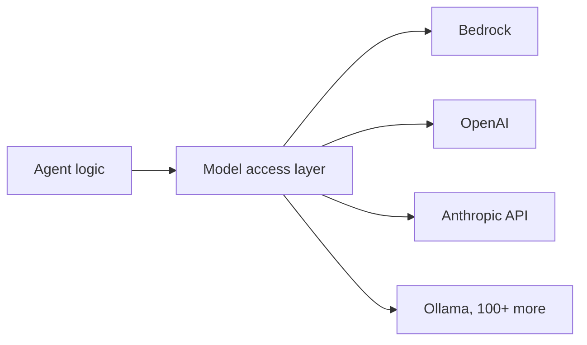
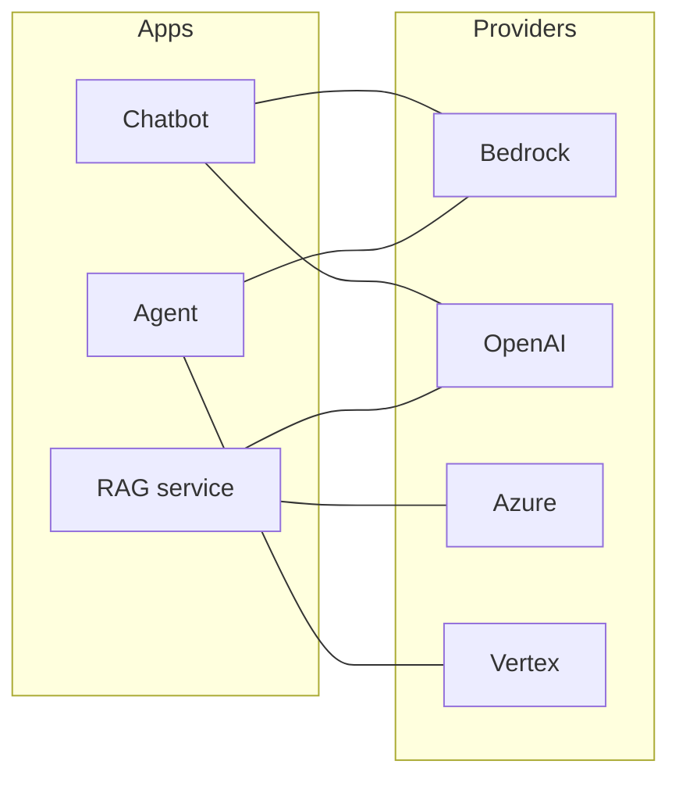
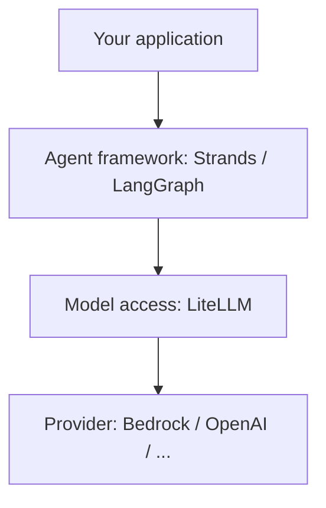
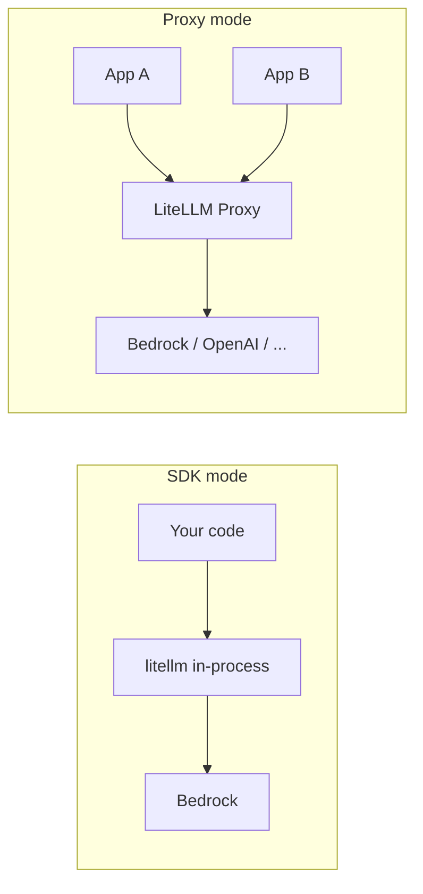
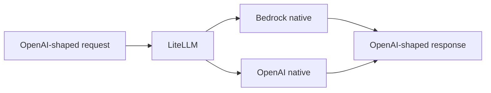
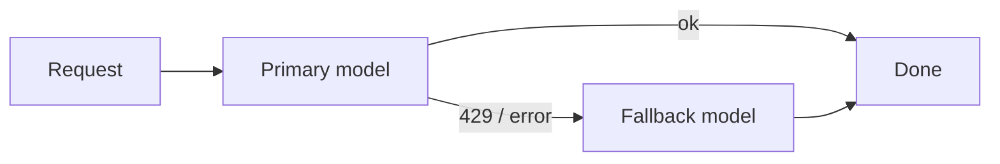
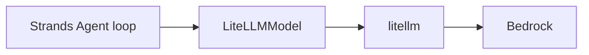
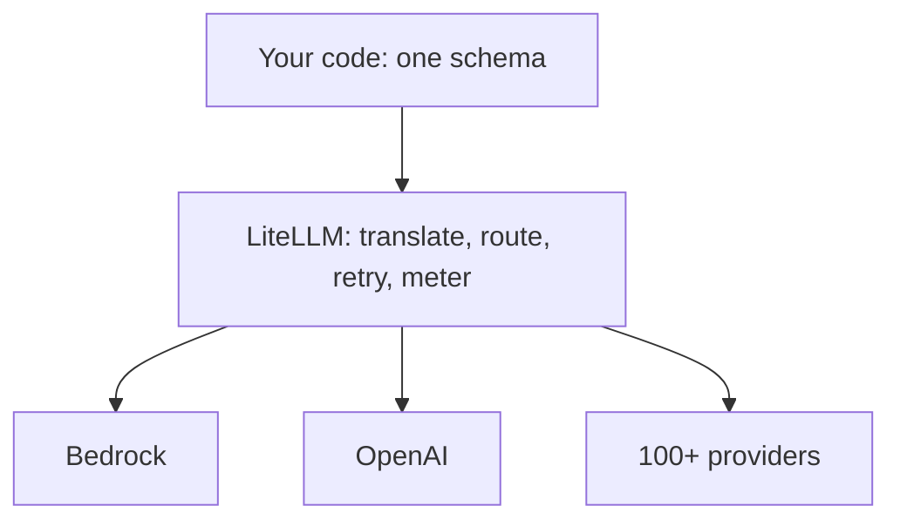

# LiteLLM

**Day 9 · Agentic AI Bootcamp · One wire to every brain**

Language: Python · Level: Beginner to Applied · Runtime target: Amazon Bedrock

---

## Where we are in the story

Days 1 to 8 you built agents: Strands loops, LangGraph state machines, A2A, A2UI, AgentCore runtime.

Every one of those needed a model behind it. Every time, you wrote provider-specific code.

Today we pull the model access out into its own layer so the agent never cares which provider is behind the curtain.



That middle box is LiteLLM. Everything today builds on that one idea.

---

## The problem it solves: N times M

You have N apps. You want to reach M providers.

Without an adapter, that is N times M integrations, each with its own SDK, auth, request shape, and response shape.



Every line is bespoke glue. Change a provider and you rewrite code in three places.

**Skeptic check:** you only use one provider today, so why care? Because the day procurement, latency, or a price cut forces a switch, "one line" beats "one sprint."

---

## What LiteLLM is

A translation layer that speaks one language (the OpenAI schema) to your code, and each provider's native dialect underneath.

Mental model: **USB-C for LLMs**. Your code has one plug. The adapter fits every socket.

| You write once | LiteLLM handles per provider |
|---|---|
| `messages=[...]` | Bedrock Converse blocks, OpenAI chat, Anthropic content |
| `model="bedrock/..."` | routing, auth, endpoint selection |
| one response object | parsing each provider's payload back into one shape |

One function is the whole surface for most work: `completion()`. Same call, any model, by changing one string.

---

## Where it sits: it is a layer, not a framework

This is the single most common confusion, so pin it now.



- Agent framework decides **what to do** (plan, call tools, loop).
- LiteLLM decides **how to reach the model** (translate, route, retry).
- Provider **runs the model**.

LiteLLM does not plan, does not hold tools, does not manage graphs. It moves one request to one model and one response back. That narrow job is why it composes with everything above it.

---

## Why it evolved

Providers refused to standardise. Each shipped its own SDK, its own message format, its own error types.

Teams kept writing the same adapter. LiteLLM turned that adapter into a library, then into a gateway.

| Era | Pain | LiteLLM answer |
|---|---|---|
| Single provider | vendor lock-in | swap model by string |
| Many providers | N times M glue | one schema for all |
| Team scale | who spent what, rate limits, keys | proxy with budgets, keys, logging |
| Agent era | frameworks need pluggable models | model-provider adapters (Strands, LangChain) |

---

## Two form factors: SDK vs Proxy

LiteLLM ships as both. Pick by where the translation should run.

| | SDK (library) | Proxy (AI gateway) |
|---|---|---|
| Runs | in your Python process | as a network service |
| Import | `from litellm import completion` | any OpenAI client points at it |
| Best for | one app, notebooks, prototypes | many teams, central control |
| Gives you | unified calls, fallbacks, retries | + virtual keys, budgets, org logging, rate limits |
| Auth to provider | your process holds creds | gateway holds creds, apps hold gateway keys |



**Decision:** notebook or single service, use the SDK. Multiple teams sharing spend, keys, and limits, stand up the proxy.

---

## The core call, on Bedrock

```python
import litellm

resp = litellm.completion(
    model="bedrock/us.anthropic.claude-haiku-4-5-20251001-v1:0",
    messages=[{"role": "user", "content": "One sentence: what is Bedrock?"}],
    max_tokens=200,
)
print(resp.choices[0].message.content)
```

Three Bedrock rules baked into that string and call:

1. **Prefix `bedrock/`** tells LiteLLM the provider.
2. **`us.` inference-profile id** is mandatory for on-demand Claude on Bedrock. Naked `anthropic.claude-...` fails.
3. **No `api_key`.** Bedrock authenticates with AWS credentials (env vars, profile, or IAM role), not a key. Passing `api_key` breaks the AWS credential chain.

---

## The one gotcha that bites everyone

Bedrock's Anthropic models reject a request that sends **both** `temperature` and `top_p`.

Many frameworks default `top_p=1.0`, so a request you never touched fails validation.

```python
# Safe: let LiteLLM drop params the provider will not accept
resp = litellm.completion(
    model="bedrock/us.anthropic.claude-haiku-4-5-20251001-v1:0",
    messages=[{"role": "user", "content": "Hi"}],
    temperature=0.3,
    drop_params=True,   # or set litellm.drop_params = True globally
)
```

`drop_params=True` silently removes unsupported params instead of erroring. Turn it on for Bedrock work.

Route note: LiteLLM defaults to Converse for models that support it, else Invoke. Force it with `bedrock/converse/<model>` or `bedrock/invoke/<model>`.

---

## Feature tour: unified input and output

Whatever the provider, you send OpenAI-style messages and read `choices[0].message.content`.



Value: your parsing code never changes when the model behind it changes. Swap `bedrock/...` for `openai/gpt-...` and nothing downstream breaks.

---

## Feature: fallbacks

Primary model throttled or down, LiteLLM retries the next model in a list automatically.

```python
resp = litellm.completion(
    model="bedrock/us.anthropic.claude-haiku-4-5-20251001-v1:0",
    messages=msgs,
    fallbacks=["bedrock/us.anthropic.claude-sonnet-4-20250514-v1:0"],
)
```



This is uptime insurance. One caller change buys graceful degradation across a whole fleet.

---

## Feature: retries and timeouts

Transient errors (throttling, network) get retried with backoff before they ever reach your code.

```python
litellm.completion(
    model="bedrock/us.anthropic.claude-haiku-4-5-20251001-v1:0",
    messages=msgs,
    num_retries=3,
    timeout=30,
)
```

Recall Day 6: a 424 ORCHESTRATION error was throttling at concurrent load. `num_retries` plus fallbacks is the standard cushion for exactly that.

---

## Feature: routing and load balancing

Define several deployments under one name. The Router spreads traffic and reroutes on failure.

```python
from litellm import Router

router = Router(model_list=[
    {"model_name": "claude", "litellm_params": {
        "model": "bedrock/us.anthropic.claude-haiku-4-5-20251001-v1:0",
        "aws_region_name": "us-east-1"}},
    {"model_name": "claude", "litellm_params": {
        "model": "bedrock/us.anthropic.claude-haiku-4-5-20251001-v1:0",
        "aws_region_name": "us-west-2"}},
])
resp = router.completion(model="claude", messages=msgs)
```

Callers say `"claude"`. The Router picks a region, balances quota, and fails over. Multi-region resilience with zero caller awareness.

---

## Feature: cost tracking

Token usage priced per model, no manual math.

```python
resp = litellm.completion(model=MODEL, messages=msgs)
cost = litellm.completion_cost(completion_response=resp)
print(f"${cost:.6f}")
```

For per-project attribution on Bedrock, pair this with an Application Inference Profile (an ARN passed via `bedrock/converse/<arn>`), tag it, and read spend in Cost Explorer.

**PM lens:** this is how "which feature burns our token budget" gets answered without a spreadsheet.

---

## Feature: structured output

Force machine-readable output for pipelines.

```python
resp = litellm.completion(
    model=MODEL,
    messages=[{"role": "user",
               "content": "Return JSON: {city, country} for the Eiffel Tower."}],
    response_format={"type": "json_object"},
)
```

`response_format` maps to each provider's native mechanism (tool use on Bedrock Claude). When a provider lacks native support, LiteLLM falls back to prompting plus validation. Either way you get parseable output.

---

## Feature: streaming

Token-by-token responses for snappy UIs.

```python
for chunk in litellm.completion(model=MODEL, messages=msgs, stream=True):
    piece = chunk.choices[0].delta.content or ""
    print(piece, end="", flush=True)
```

Same delta shape across providers. The UI code that renders a stream does not change when the model does.

---

## Feature: caching

Two different caches, do not confuse them.

| Cache | Lives where | Saves |
|---|---|---|
| Response cache | LiteLLM side (in-memory / Redis) | repeat identical calls skip the provider |
| Prompt caching | provider side (Bedrock) | reuses a long shared prefix, cuts input tokens |

Prompt caching matters for RAG and agents that resend a big system prompt every turn. LiteLLM surfaces cache tokens in usage so you can see the savings.

---

## Feature: observability and control (proxy)

Turn on callbacks (Langfuse, MLflow) to trace every call. Run as proxy to add governance.

| Capability | Where | Why it matters |
|---|---|---|
| Tracing / logging | SDK callback or proxy | debug, audit, replay |
| Virtual keys | proxy | give each team a scoped key |
| Budgets | proxy | hard-stop runaway spend |
| Rate limits | proxy | protect shared quota |
| Guardrails | proxy | screen inputs and outputs |

The SDK gives you the calls. The proxy gives you the guardrails around a shared account.

---

## Feature: embeddings and rerank

Same unified interface for non-chat models. This is the bridge into today's second topic, RAG.

```python
emb = litellm.embedding(
    model="bedrock/amazon.titan-embed-text-v2:0",
    input=["good morning from litellm"],
)
vector = emb.data[0]["embedding"]
```

One call gives you vectors from Titan, Cohere, OpenAI, by swapping the model string. Rerank has the same treatment. Hold this thought: RAG needs exactly this.

---

## When to use LiteLLM: SWAP

Reach for it when any letter is true.

| Letter | Trigger | Example |
|---|---|---|
| **S** Switch | you may change providers | pilot on Bedrock, keep OpenAI open |
| **W** Withstand | you need failover and retries | throttling under load |
| **A** Account | you must track cost per team or feature | chargeback, budgets |
| **P** Proxy | many teams share one account | central keys, limits, logging |

**Engineer signal:** you are writing `if provider == ...` branches. Delete them, use LiteLLM.

**PM signal:** the roadmap says "multi-model," "cost controls," or "vendor flexibility." That is a LiteLLM line item.

---

## When NOT to use it

Honesty first. It is not free complexity.

| Skip it when | Because |
|---|---|
| One provider, forever, one app | the native SDK is one less dependency |
| You need a provider-only feature at the bleeding edge | the adapter may lag the native SDK by days |
| Ultra-low-latency, single model | one less hop is one less millisecond |
| You want an agent framework | wrong layer, that is Strands / LangGraph |

**Skeptic check:** "abstraction always wins" is a myth. If you will never swap and never scale teams, the abstraction is pure overhead.

---

## LiteLLM with Strands

Strands ships a LiteLLM model provider, so any LiteLLM-supported model becomes a Strands model.

```python
from strands import Agent
from strands.models.litellm import LiteLLMModel
from strands_tools import calculator

model = LiteLLMModel(
    model_id="bedrock/us.anthropic.claude-haiku-4-5-20251001-v1:0",
    params={"max_tokens": 1000, "temperature": 0.7},
)
agent = Agent(model=model, tools=[calculator])
print(agent("What is 15 percent of 240?"))
```



Install: `pip install 'strands-agents[litellm]'`. Now the same agent runs on OpenAI or Ollama by changing `model_id`. The loop code never moves.

---

## LiteLLM with LangChain

The modern package is `langchain-litellm`, exposing `ChatLiteLLM` as a standard LangChain chat model.

```python
from langchain_litellm import ChatLiteLLM

llm = ChatLiteLLM(
    model="bedrock/us.anthropic.claude-haiku-4-5-20251001-v1:0",
    temperature=0.3,
)
print(llm.invoke("Name three uses of embeddings.").content)
```

Tool calling works with `bind_tools`, and it slots into any LCEL chain.

**Real bug to know (Jan 2026):** `bind_tools().astream()` on Bedrock models can misroute to an OpenAI endpoint and fail. Non-streaming `invoke` is fine. For tool-using Bedrock agents, prefer `invoke`, or use `langchain-aws` `ChatBedrockConverse` for native streaming with tools.

---

## LiteLLM with LangGraph

LangGraph is a graph of nodes. A node that calls a model is just `ChatLiteLLM` inside a function. LiteLLM is the model; LangGraph is the wiring.

```python
from typing import TypedDict
from langgraph.graph import StateGraph, START, END
from langchain_litellm import ChatLiteLLM

llm = ChatLiteLLM(model="bedrock/us.anthropic.claude-haiku-4-5-20251001-v1:0")

class S(TypedDict):
    question: str
    answer: str

def answer_node(state: S) -> S:
    out = llm.invoke(state["question"])
    return {"answer": out.content}

g = StateGraph(S)
g.add_node("answer", answer_node)
g.add_edge(START, "answer")
g.add_edge("answer", END)
app = g.compile()
print(app.invoke({"question": "What is a vector database?"})["answer"])
```

Swap the model provider inside the node and the entire graph retargets. This is the exact pattern we reuse for CRAG and Self-RAG later today.

---

## LiteLLM with AgentCore

AgentCore runs your agent as a managed service. LiteLLM is the model inside the agent you deploy.

Two paths:

| Path | How | When |
|---|---|---|
| Bring your own | put `LiteLLMModel` (Strands) or `ChatLiteLLM` (LangGraph) inside the `@app.entrypoint`, deploy | you control the agent code |
| Managed harness | AgentCore harness (GA) routes models through LiteLLM and Bedrock Mantle, no orchestration code | you want AWS to run the loop |

```python
from bedrock_agentcore.runtime import BedrockAgentCoreApp
from strands import Agent
from strands.models.litellm import LiteLLMModel

model = LiteLLMModel(model_id="bedrock/us.anthropic.claude-haiku-4-5-20251001-v1:0")
agent = Agent(model=model, system_prompt="You are a support agent.")

app = BedrockAgentCoreApp()

@app.entrypoint
def invoke(payload):
    return {"result": str(agent(payload.get("prompt", "Hello")))}

if __name__ == "__main__":
    app.run()   # serves /invocations and /ping; deploy with: agentcore configure && agentcore launch
```

The entrypoint code is identical local and in production. LiteLLM keeps the model swappable even after deploy.

---

## What LiteLLM is confused with, but is NOT

| People think it is | It is actually | The real thing is |
|---|---|---|
| An agent framework | a model access layer | Strands, LangGraph |
| LangChain | a translation library | LangChain orchestrates chains, LiteLLM moves one call |
| OpenRouter | self-hosted, provider-agnostic, your creds | OpenRouter is a hosted paid router |
| A vector database | not storage at all | FAISS, OpenSearch, Pinecone |
| A caching layer | caching is one feature, not the point | Redis |
| A fine-tuning tool | inference-time only | SageMaker, Bedrock Custom Model Import |
| A prompt manager | it sends prompts, does not manage them | prompt registries |

One sentence to remember: **LiteLLM is the universal plug between your code and any model. Nothing more, and that is the strength.**

---

## What changes in production

Prototype code and production code differ in the boring, critical parts.

| Prototype | Production |
|---|---|
| access keys in env | IAM roles, no long-lived keys |
| hardcoded region | region from config |
| no retries | `num_retries` + `fallbacks` |
| ignore cost | `completion_cost` logged per call |
| SDK per app | proxy with keys, budgets, limits |
| no tracing | Langfuse / MLflow callbacks on |
| `drop_params` forgotten | set globally for Bedrock |

---

## Recap: the whole idea on one slide



- One call, `completion()`, reaches any model by string.
- SDK for one app, proxy for many teams.
- On Bedrock: `bedrock/us....`, AWS auth not keys, `drop_params=True`.
- It is the model layer, sitting under Strands, LangChain, LangGraph, AgentCore, never replacing them.

**Carry-forward question into RAG:** if LiteLLM can fetch both chat completions and embeddings through one interface, what is the smallest possible RAG system you could build on top of it? We answer that next.
