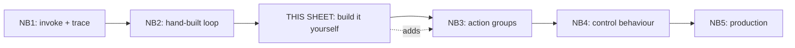
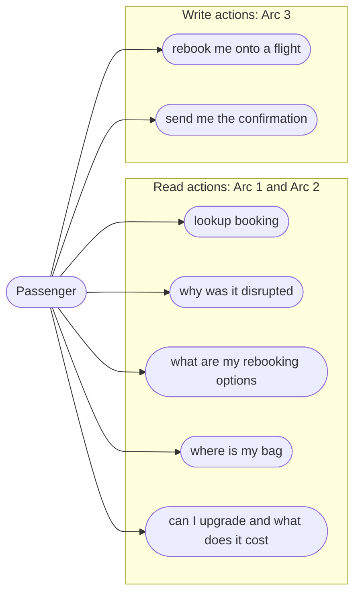
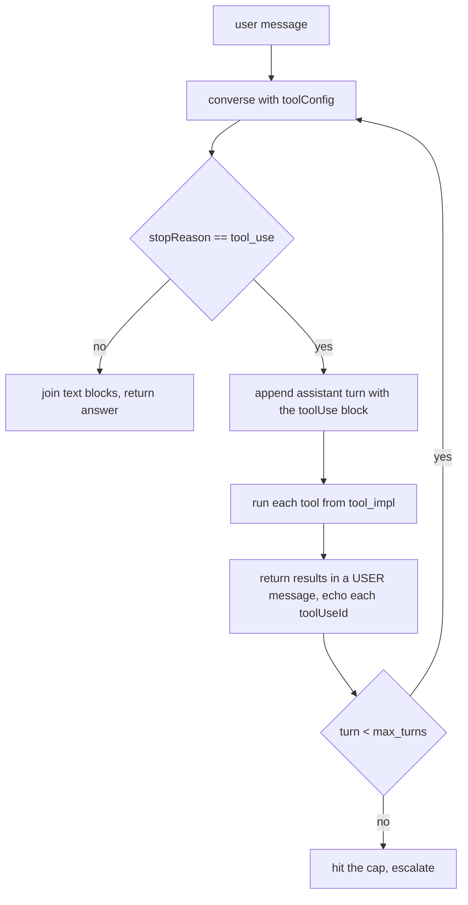
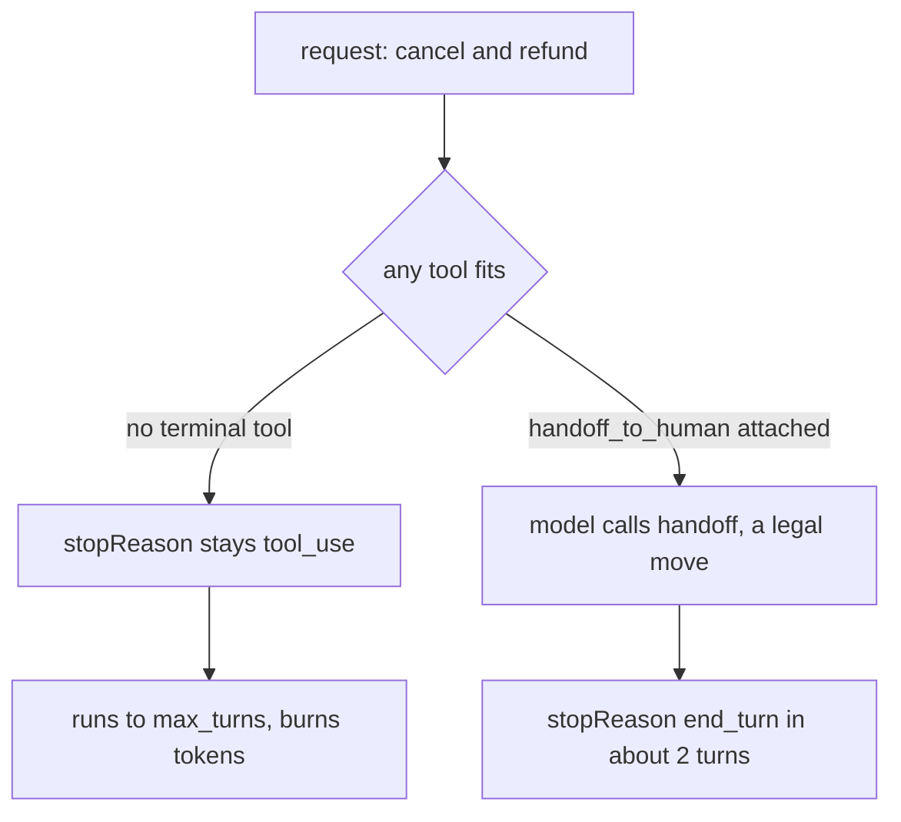
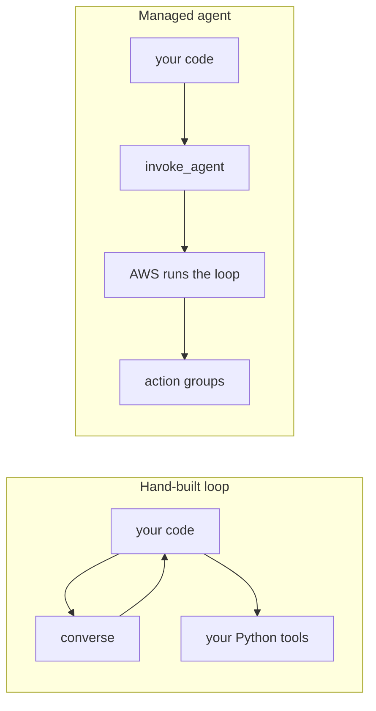
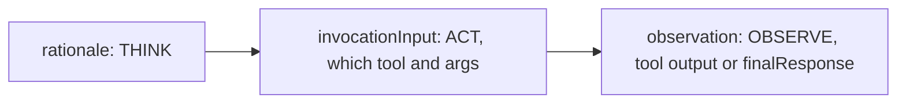
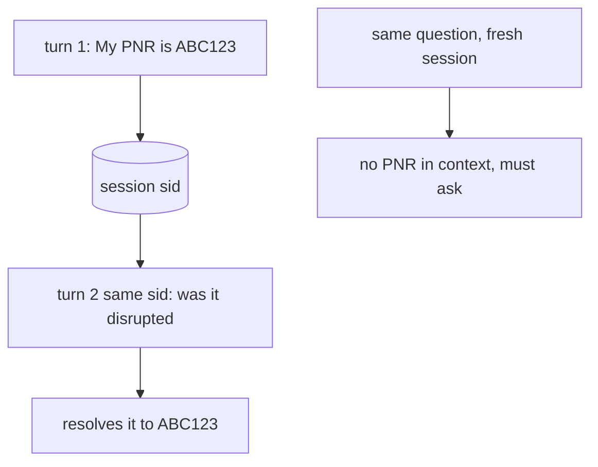
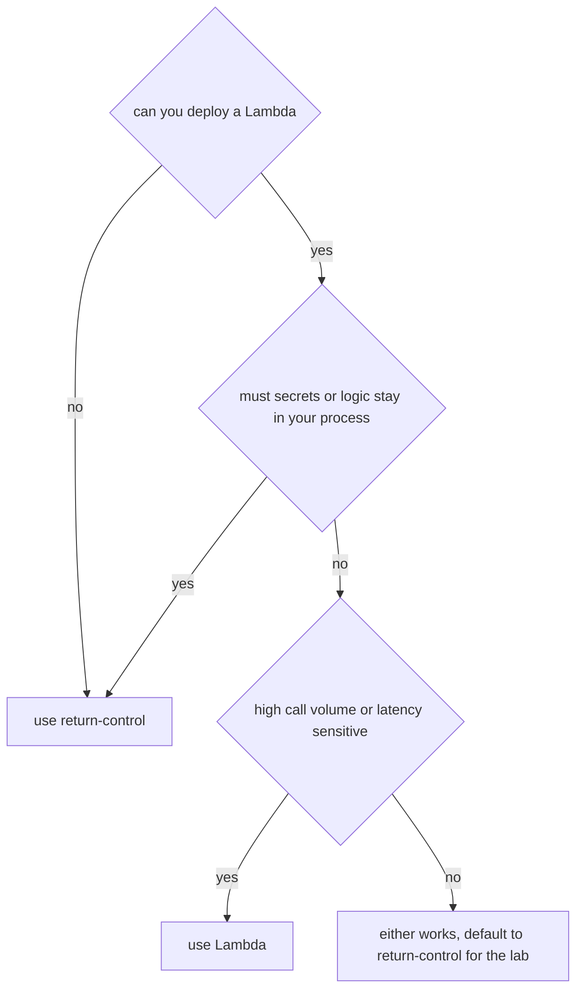
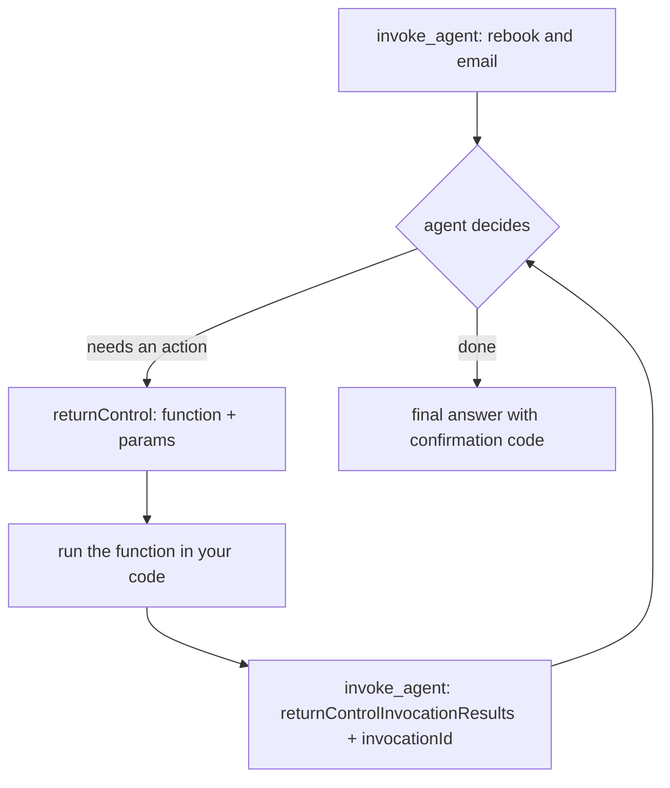
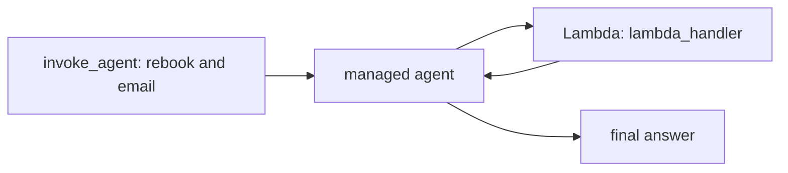

# Day-8 Guided Practice · Agent Loops, Invocation, and Action Groups

TravelMind, an airline support agent on Amazon Bedrock. You have seen the pieces in Notebook 1 (invoke and read the trace) and Notebook 2 (the hand-built loop). Now you build them yourself against use cases the lecture notebooks did not cover, then you give the managed agent the ability to act.

Everything runs in `us-east-1`. Tool functions run locally. The `converse` and `invoke_agent` calls need AWS credentials and model access from Notebook 1.

---

## How to use this sheet

Each exercise has the same shape:

- **Goal** in one line
- **Scenario** so the task is concrete, not abstract
- **Task** as a short checklist
- **Use-case query** you will send the agent
- **Done when** a single bounded definition of finished

Try every task before you open the appendix. Solutions live in **Appendix S** at the end, keyed by exercise number. Code blocks in the body are starter scaffolds with `# TODO` markers.

---

## Where this sits in the series



Three arcs in this sheet:

| Arc | You practise | Maps to |
|---|---|---|
| Arc 1 | Rebuild the ReAct loop, add your own tools, force a refusal, stop a runaway | NB2 |
| Arc 2 | Invoke the managed agent, read its trace, use session memory | NB1 |
| Arc 3 | Give the agent write actions with return-control, then Lambda | NB3 |

---

## TravelMind at a glance

The actor is a passenger. The agent reads booking facts and, by the end of this sheet, performs actions.



The read actions are safe to retry and exist already. The write actions are new, and they are why Notebook 2 produced a runaway: the agent wanted to act and had no tool for it.

### The data layer you build against

A small in-memory store so the loop runs end to end. In production these functions hit your reservation system.

| PNR | Passenger | Flight | Route | Status | Tier | Fare | Miles | Bag status |
|---|---|---|---|---|---|---|---|---|
| ABC123 | R. Mehta | 6E-203 | BLR to DEL | DISRUPTED (fog at DEL) | GOLD | M | 82000 | DELAYED |
| ZZ999 | S. Iyer | 6E-512 | BOM to GOI | ON_TIME | SILVER | V | 12000 | AT_CAROUSEL |
| PQR456 | A. Khan | 6E-118 | DEL to BLR | DISRUPTED (crew shortage) | BLUE | Y | 3000 | IN_TRANSIT |

```python
# Shared setup. Run once before any exercise.
import boto3, json, uuid, time, zlib

REGION       = "us-east-1"
CLAUDE_MODEL = "us.anthropic.claude-haiku-4-5-20251001-v1:0"   # 'us.' profile required in us-east-1
AGENT_ID     = "3KCNKSOI8U"          # your Day 3 TravelMind agent
ALIAS_ID     = "TSTALIASID"          # test alias serves the DRAFT version

bedrock_runtime = boto3.client("bedrock-runtime",       region_name=REGION)
agent_runtime   = boto3.client("bedrock-agent-runtime", region_name=REGION)

BOOKINGS = {
    "ABC123": {"pnr": "ABC123", "passenger": "R. Mehta", "flight": "6E-203",
               "origin": "BLR", "dest": "DEL", "status": "DISRUPTED", "disruption": "fog at DEL",
               "tier": "GOLD", "fare_class": "M", "miles": 82000,
               "bag": {"tag": "BLR-DEL-7781", "last_seen": "BLR sortation", "status": "DELAYED"}},
    "ZZ999":  {"pnr": "ZZ999", "passenger": "S. Iyer", "flight": "6E-512",
               "origin": "BOM", "dest": "GOI", "status": "ON_TIME", "disruption": None,
               "tier": "SILVER", "fare_class": "V", "miles": 12000,
               "bag": {"tag": "BOM-GOI-3320", "last_seen": "GOI carousel 2", "status": "AT_CAROUSEL"}},
    "PQR456": {"pnr": "PQR456", "passenger": "A. Khan", "flight": "6E-118",
               "origin": "DEL", "dest": "BLR", "status": "DISRUPTED", "disruption": "crew shortage",
               "tier": "BLUE", "fare_class": "Y", "miles": 3000,
               "bag": {"tag": "DEL-BLR-9006", "last_seen": "DEL belt", "status": "IN_TRANSIT"}},
}

def lookup_booking(pnr):
    b = BOOKINGS.get(pnr.upper())
    if not b: return {"found": False, "pnr": pnr}
    return {"found": True, **{k: b[k] for k in ("pnr","passenger","flight","origin","dest","status")}}

def get_disruption_reason(pnr):
    b = BOOKINGS.get(pnr.upper())
    if not b: return {"found": False, "pnr": pnr}
    return {"pnr": b["pnr"], "status": b["status"], "reason": b["disruption"] or "none"}

def get_rebooking_options(pnr):
    return {"pnr": pnr.upper(), "options": [
        {"flight": "6E-415", "dep": "18:40", "seats": 12},
        {"flight": "6E-422", "dep": "21:10", "seats": 5},
    ]}

def tool_spec(name, description, properties, required):
    return {"toolSpec": {"name": name, "description": description,
            "inputSchema": {"json": {"type": "object", "properties": properties, "required": required}}}}

SPEC_LOOKUP     = tool_spec("lookup_booking",
    "Look up a booking by its PNR. Returns passenger, flight, route, and status.",
    {"pnr": {"type": "string", "description": "6-character PNR"}}, ["pnr"])
SPEC_DISRUPTION = tool_spec("get_disruption_reason",
    "Given a PNR, return why the flight was disrupted (or 'none').",
    {"pnr": {"type": "string"}}, ["pnr"])
SPEC_REBOOK     = tool_spec("get_rebooking_options",
    "Given a PNR, return alternative flights the passenger can be moved to.",
    {"pnr": {"type": "string"}}, ["pnr"])

BASE = [(lookup_booking, SPEC_LOOKUP), (get_disruption_reason, SPEC_DISRUPTION), (get_rebooking_options, SPEC_REBOOK)]

def make_toolset(*entries):
    """(impl_fn, toolSpec) pairs -> (tool_config, tool_impl)."""
    cfg  = {"tools": [spec for _, spec in entries]}
    impl = {spec["toolSpec"]["name"]: fn for fn, spec in entries}
    return cfg, impl

SYSTEM = [{"text": (
    "You are TravelMind, an airline support assistant. "
    "Use ONLY facts returned by the tools. Never invent a PNR, flight number, time, seat count, or tier. "
    "If you cannot fulfil a request with the available tools, say so plainly. "
    "Keep answers under 80 words."
)}]
```

---

# Arc 1 · Build the loop by hand

The model is a stateless text function. The loop is yours: call `converse`, and if the model asks for a tool, run it, hand back the result, and call again. Five rules carry the loop.



The five rules, in order of how often they are missed:

1. `max_turns` is a hard ceiling. Never run an agent loop without one.
2. Append the assistant message every turn. It carries the `toolUse` block the next call needs.
3. On `stopReason == "tool_use"`, run the requested tools.
4. Return tool outputs in a **user** message. That is the Converse convention, not a `tool` role.
5. Echo each `toolUseId` back unchanged, or the API rejects the turn.

---

## Exercise 1.0 · Implement the loop body

**Goal:** turn the five rules into a working function.

**Task:**
- complete `run_agent` so it caps turns, appends the assistant turn, runs tools, returns results in a user message, echoes `toolUseId`, and exits on a non-`tool_use` stop
- keep it parameterised by `tool_config` and `tool_impl` so you can hand it new tools

**Done when:** Exercise 1.1 runs a clean baggage lookup on your loop with no KeyError and no API rejection.

```python
def run_agent(user_text, tool_config, tool_impl, max_turns=6, temperature=0.0, verbose=True):
    """Hand-built ReAct loop over Converse. Returns (answer, turns_used, messages)."""
    messages = [{"role": "user", "content": [{"text": user_text}]}]
    for turn in range(1, max_turns + 1):
        resp = bedrock_runtime.converse(
            modelId=CLAUDE_MODEL, messages=messages, system=SYSTEM,
            toolConfig=tool_config,
            inferenceConfig={"temperature": temperature, "maxTokens": 512},
        )
        out, stop = resp["output"]["message"], resp["stopReason"]
        # TODO 2: append the assistant turn
        # TODO 6: if stop != "tool_use", join text blocks and return (text, turn, messages)
        tool_results = []
        for block in out["content"]:
            if "toolUse" in block:
                tu = block["toolUse"]
                name, tid, args = tu["name"], tu["toolUseId"], tu["input"]
                # TODO 3: call tool_impl[name](**args); on exception capture {"error": str(e)}
                # TODO 5: append a toolResult echoing tid, result under {"json": result}
                pass
        # TODO 4: append tool_results as a USER message
    return "I can't complete that. Escalating to a human agent.", max_turns, messages
```

---

## Exercise 1.1 · Add a read tool of your own, baggage status

**Goal:** wire a brand new tool into the loop end to end.

**Scenario:** a passenger lands and the checked bag is not on the belt. TravelMind reads baggage status by PNR.

**Task:**
- write `get_baggage_status(pnr)` returning `{found, pnr, tag, last_seen, status}` from the booking record, handling an unknown PNR
- write its `toolSpec`. The description is the only thing the model reads to decide to call it, so be specific
- build the toolset with `make_toolset(*BASE, (get_baggage_status, SPEC_BAGGAGE))` and run the query

**Use-case query:** `Where is my checked bag? My PNR is ABC123.`

**Done when:** the trace shows one `get_baggage_status` call and the answer states DELAYED and the last-seen location, with nothing invented.

```python
def get_baggage_status(pnr):
    ...  # TODO

SPEC_BAGGAGE = ...  # TODO, name must match the function

# cfg, impl = make_toolset(*BASE, (get_baggage_status, SPEC_BAGGAGE))
# print(run_agent("Where is my checked bag? My PNR is ABC123.", cfg, impl)[0])
```

---

## Exercise 1.2 · Two tools, one question, an upgrade quote

**Goal:** make the model chain two reads in order.

**Scenario:** a frequent flyer wants to move to business and know the miles cost. That needs the loyalty record, then an eligibility check that depends on tier and fare class.

**Task:**
- write `get_loyalty_status(pnr)` returning `{found, pnr, tier, miles}`
- write `check_upgrade_eligibility(pnr)` using tier and fare class:
  - GOLD on a flexible fare (Y, B, M): eligible, 15000 miles
  - SILVER on a flexible fare: eligible, 25000 miles
  - anything else: not eligible, with a one-line reason
- attach both and run the query

**Use-case query:** `I'm on PNR ABC123. Can I upgrade to business, and what would it cost in miles?`

**Done when:** the trace shows `get_loyalty_status` then `check_upgrade_eligibility`, and the answer states GOLD, eligible, 15000 miles, and that the 82000 balance covers it.

Skeptic check: run the same query on PQR456 (BLUE) and confirm it returns a clean not-eligible answer rather than inventing a price.

```python
def get_loyalty_status(pnr):
    ...  # TODO

def check_upgrade_eligibility(pnr):
    ...  # TODO

SPEC_LOYALTY = ...  # TODO
SPEC_UPGRADE = ...  # TODO

# cfg, impl = make_toolset(*BASE, (get_loyalty_status, SPEC_LOYALTY), (check_upgrade_eligibility, SPEC_UPGRADE))
# print(run_agent("I'm on PNR ABC123. Can I upgrade to business, and what would it cost in miles?", cfg, impl)[0])
```

---

## Exercise 1.3 · The honest-refusal path

**Goal:** see the difference between "no tool fits, so refuse" and the runaway you build next.

**Scenario:** a passenger asks something no tool can answer. A grounded agent says so in one turn, does not invent, and does not loop.

**Task:**
- with only the base tools attached, predict the stopReason and turn count, then run the query
- confirm no `toolUse` block appears anywhere in `messages`

**Use-case query:** `What is the WiFi password for the airport lounge?`

**Done when:** the loop ends in 1 turn with `stopReason = end_turn`, the answer admits it cannot help, and no tool was called.

Skeptic check: the refusal works because the system prompt forbids invention and no tool loosely matches. A vague tool description can pull the model into calling the wrong tool instead of refusing. That is the wrong-tool loop from class.

```python
cfg, impl = make_toolset(*BASE)
answer, turns, msgs = run_agent("What is the WiFi password for the airport lounge?", cfg, impl)
# TODO: assert turns == 1 and no toolUse block in msgs
print(turns, answer)
```

---

## Exercise 1.4 · Reproduce a runaway, then stop it with a terminal tool

**Goal:** reproduce the 50-loop on purpose, cut it with a terminal tool, and read the cost difference.

**Scenario:** the passenger asks for an action the agent has no tool for. Watch the loop spin, then give it a legal exit.



**Task, part A, reproduce:**
- with only the base tools, run the action query with `max_turns=6`
- confirm `stopReason` stays `tool_use` to the cap

**Task, part B, fix:**
- write `handoff_to_human(pnr, reason)` returning an escalation ticket
- its description must tell the model to use it for cancellations, refunds, payments, or anything outside the read tools
- attach it, re-run the same query

**Use-case query:** `Cancel my ticket on PNR ABC123 and refund me now.`

**Done when:** part A hits the cap at 6 turns. Part B ends in about 2 turns because the model succeeds at handing off, not because a timer fired.

**Why the terminal tool pays for itself.** Each turn is one Converse call. A rough token cost:

$$\text{cost} = \frac{\text{turns} \times \text{tokens\_per\_turn} \times \text{price\_per\_1k}}{1000}$$

At an estimated 1500 tokens per turn, the runaway burns 6 turns to the cap and the handoff version ends in about 2. Same request, roughly a third of the tokens, and a useful answer instead of a timeout. This is the lesson behind the Loop Cost Sim sheet: a terminal or fallback tool is not optional in production. Arc 3 goes further and gives the agent a real action that performs the cancel and rebook, so it succeeds instead of escalating.

```python
cfg, impl = make_toolset(*BASE)
print(run_agent("Cancel my ticket on PNR ABC123 and refund me now.", cfg, impl, max_turns=6))

def handoff_to_human(pnr, reason):
    ...  # TODO
SPEC_HANDOFF = ...  # TODO
# attach SPEC_HANDOFF and re-run the same query, compare turns
```

---

# Arc 2 · Invoke the managed agent

The managed agent runs the same kind of loop, server-side. You talk to it through `bedrock-agent-runtime`. Who owns the loop is the whole point.



| | Hand-built loop | Managed agent |
|---|---|---|
| Who runs the loop | your code | AWS, server-side |
| Memory and timeout | you implement it | managed by sessionId |
| Visibility | every variable | trace events |
| Tools | Python functions in toolConfig | action groups |
| Best for | control and debugging | fast, standard tasks |

```python
def ask_agent(prompt, session_id=None, trace=False):
    """Invoke the managed agent. Returns (answer, traces, session_id)."""
    session_id = session_id or str(uuid.uuid4())
    resp = agent_runtime.invoke_agent(
        agentId=AGENT_ID, agentAliasId=ALIAS_ID, sessionId=session_id,
        inputText=prompt, enableTrace=trace,
    )
    answer, traces = "", []
    for event in resp["completion"]:          # completion is a STREAM you iterate
        if "chunk" in event:
            answer += event["chunk"]["bytes"].decode("utf-8")
        elif "trace" in event:
            traces.append(event["trace"]["trace"])
    return answer, traces, session_id
```

---

## Exercise 2.1 · First managed invoke, and who ran the loop

**Goal:** get an answer from the managed agent and connect it back to Arc 1.

**Task:** invoke the agent with the disruption query and print the answer.

**Use-case query:** `My flight on PNR ABC123 was disrupted. What are my options?`

**Done when:** you get a coherent answer naming the disruption and rebooking options.

**Reflect:** in Arc 1 you wrote the loop, the tool calls, and the message bookkeeping. Here you wrote one function call. Who appended the assistant turns, echoed the tool ids, and decided when to stop?

```python
answer, _, sid = ask_agent("My flight on PNR ABC123 was disrupted. What are my options?")
print(sid, "\n", answer)
```

---

## Exercise 2.2 · Read the trace, which tool with what input

`enableTrace=True` returns the console Show trace panel as data. The orchestration trace has three pieces you care about.



**Goal:** pull THINK, ACT, and FINAL out of the trace stream.

**Task:** invoke with `trace=True`, then for each orchestration trace print `rationale` as THINK, the tool name and parameters from `invocationInput` as ACT, and `observation.finalResponse` as FINAL when present. Use `.get(...)` chains so it does not crash if your agent uses an OpenAPI action group (`apiPath`) instead of function details (`function`).

**Done when:** you can read the sequence of tool calls the managed agent made.

```python
answer, traces, _ = ask_agent("My flight on PNR ABC123 was disrupted. What are my options?", trace=True)
for t in traces:
    ot = t.get("orchestrationTrace")
    if not ot:
        continue
    # TODO: print THINK from ot["rationale"]["text"]
    # TODO: print ACT from ot["invocationInput"]["actionGroupInvocationInput"] (actionGroupName, function or apiPath, parameters)
    # TODO: print FINAL from ot["observation"]["finalResponse"]["text"] when present
```

---

## Exercise 2.3 · Session memory, the same id continues the conversation

**Goal:** see what the managed agent gives you that the hand-built loop does not, memory keyed by `sessionId`.



**Task:**
- turn 1: tell the agent the PNR, no question yet
- turn 2 with the same `session_id`: ask a follow-up that says "it"
- then ask the same follow-up in a fresh session and watch it lose the reference

**Use-case queries:** `My PNR is ABC123.` then `Was it disrupted, and what are my options then?`

**Done when:** the same-session follow-up resolves "it" to the PNR. The fresh session has to ask which PNR.

```python
ans1, _, sid = ask_agent("My PNR is ABC123.")
ans2, _, _   = ask_agent("Was it disrupted, and what are my options then?", session_id=sid)   # same session
ans3, _, _   = ask_agent("Was it disrupted, and what are my options then?")                    # fresh session
print(ans2[:300], "\n---\n", ans3[:300])
```

---

## Exercise 2.4 · Push the managed agent to a wall

**Goal:** see the managed agent when a request needs a capability it does not have, and set up Arc 3.

**Scenario:** the same action that ran away in Arc 1. Your Day 3 agent reads bookings, disruptions, and options. It has no action that cancels or rebooks. Ask it to act anyway.

**Task:** invoke with `trace=True`, scan traces for a `failureTrace`, print its `failureReason` if present, and read how the answer handles the missing capability.

**Use-case query:** `Rebook PNR ABC123 onto flight 6E-415 and email me the confirmation.`

**Done when:** you can state in one line why the agent cannot complete this today. The fix is the whole of Arc 3.

```python
answer, traces, _ = ask_agent("Rebook PNR ABC123 onto flight 6E-415 and email me the confirmation.", trace=True)
print(answer)
for t in traces:
    ft = t.get("failureTrace")
    if ft:
        print("FAILURE:", ft.get("failureReason"))
```

---

# Arc 3 · Action groups, return-control and Lambda

You give the agent write actions two ways. Both attach the same function schema. Only the executor changes.

An action group is a named set of functions you attach to an agent. You describe each function with a function schema (name, description, parameters). The model reads the descriptions to pick what to call. The executor decides what happens when it calls one.

| Executor | Who runs the function | You provide | Best for |
|---|---|---|---|
| Lambda | Bedrock, server-side | a Lambda ARN | standard tools, high volume, no extra round trip in your code |
| Return-control | your own code | nothing extra at create time | sensitive logic, secrets kept local, classroom with no deploy rights |



One gotcha trips everyone: Bedrock hands parameters back as a **list** of `{name, type, value}`, not a dict. Convert before calling your function.

```python
def params_to_dict(params):
    return {p["name"]: p["value"] for p in params}

HOLDS = {}   # a write action must be idempotent: a retried turn must not double-book

def confirm_rebooking(pnr, flight):
    pnr, key = pnr.upper(), f"{pnr.upper()}:{flight}"
    if key in HOLDS:
        return {"pnr": pnr, "flight": flight, "confirmation": HOLDS[key], "status": "ALREADY_HELD"}
    conf = "TM" + str(zlib.crc32(key.encode()) % 900000 + 100000)   # deterministic demo code
    HOLDS[key] = conf
    return {"pnr": pnr, "flight": flight, "confirmation": conf, "status": "HELD"}

def notify_passenger(pnr, channel, message):
    if channel not in {"sms", "email"}:
        return {"sent": False, "reason": f"unsupported channel {channel}"}
    return {"sent": True, "pnr": pnr.upper(), "channel": channel, "delivery_id": "DLV-" + pnr.upper()}

WRITE_IMPL = {"confirm_rebooking": confirm_rebooking, "notify_passenger": notify_passenger}
AG_NAME    = "TravelMindWriteActions"
```

---

## Exercise 3.1 · Write the two write functions

**Goal:** be able to call both and explain why `confirm_rebooking` is idempotent.

**Task:** call `confirm_rebooking("ZZ999", "6E-415")` twice and `notify_passenger("ZZ999", "email", "You are confirmed")`. Note the status on the second confirm.

**Done when:** the second confirm returns ALREADY_HELD with the same confirmation code.

---

## Exercise 3.2 · Add the action group with return-control, then prepare

The flow you are wiring:



**Goal:** describe the two functions to the agent and attach them as a return-control action group on the DRAFT version.

**Task:**
- build a `functionSchema` for both functions, each parameter with type, description, required
- create or update an action group named `TravelMindWriteActions` with executor `{"customControl": "RETURN_CONTROL"}`
- call `prepare_agent` and wait until the agent status is PREPARED. The test alias serves DRAFT, so it picks up the change once prepared

**Done when:** `prepare_and_wait()` prints PREPARED.

```python
agent_build = boto3.client("bedrock-agent", region_name=REGION)

WRITE_FUNCTIONS = [
    {"name": "confirm_rebooking",
     "description": "Hold a rebooking for a PNR onto a chosen replacement flight. Returns a confirmation code. "
                    "Use only after the passenger has picked a flight from the rebooking options.",
     "parameters": { ... }},   # TODO: pnr, flight
    {"name": "notify_passenger",
     "description": "Send the passenger a confirmation message by sms or email.",
     "parameters": { ... }},   # TODO: pnr, channel, message
]

def upsert_return_control_action_group():
    existing = agent_build.list_agent_action_groups(agentId=AGENT_ID, agentVersion="DRAFT").get("actionGroupSummaries", [])
    found = next((a for a in existing if a["actionGroupName"] == AG_NAME), None)
    kwargs = dict(agentId=AGENT_ID, agentVersion="DRAFT", actionGroupName=AG_NAME,
                  actionGroupExecutor={"customControl": "RETURN_CONTROL"},
                  functionSchema={"functions": WRITE_FUNCTIONS}, actionGroupState="ENABLED")
    if found:
        agent_build.update_agent_action_group(actionGroupId=found["actionGroupId"], **kwargs)
        return found["actionGroupId"], "updated"
    return agent_build.create_agent_action_group(**kwargs)["agentActionGroup"]["actionGroupId"], "created"

def prepare_and_wait(timeout=90):
    agent_build.prepare_agent(agentId=AGENT_ID)
    for _ in range(timeout // 3):
        st = agent_build.get_agent(agentId=AGENT_ID)["agent"]["agentStatus"]
        if st == "PREPARED":
            return st
        time.sleep(3)
    return st
```

---

## Exercise 3.3 · Invoke and handle the return-control round trip

**Goal:** complete the loop that runs the function in your code and feeds the result back.

**Task:** finish `ask_agent_rc` so it
- starts with `inputText`, then on later rounds sends only `sessionState` (when you return results, `inputText` is ignored)
- reads each `returnControl` event, runs the named function from `WRITE_IMPL` with `params_to_dict(...)`
- returns one `functionResult` per call, echoing `actionGroup` and `function`, with the output as a JSON string under `responseBody.TEXT.body`
- passes back the same `invocationId`
- stops when a `chunk` (final answer) arrives instead of a `returnControl`

**Use-case query:** `Rebook PNR ABC123 onto flight 6E-415 and email me the confirmation.`

**Done when:** the run prints the local function calls and a final answer containing the confirmation code. The Notebook 2 runaway now completes.

Edge note: if your Day 3 read tools are also return-control, add their local implementations to `WRITE_IMPL` so this driver can serve them. If they are Lambda-backed, they run server-side and you never see them here.

```python
def ask_agent_rc(prompt, session_id=None, max_rounds=6, verbose=True):
    session_id, sstate = session_id or str(uuid.uuid4()), None
    for _ in range(max_rounds):
        kwargs = dict(agentId=AGENT_ID, agentAliasId=ALIAS_ID, sessionId=session_id, enableTrace=False)
        if sstate is None:
            kwargs["inputText"] = prompt
        else:
            kwargs["sessionState"] = sstate
        resp = agent_runtime.invoke_agent(**kwargs)
        answer, rc = "", None
        for ev in resp["completion"]:
            if "chunk" in ev:
                answer += ev["chunk"]["bytes"].decode("utf-8")
            elif "returnControl" in ev:
                rc = ev["returnControl"]
        if rc is None:
            return answer, session_id
        results = []
        for item in rc["invocationInputs"]:
            fi = item["functionInvocationInput"]
            # TODO: name, ag, args = ... ; run the function ; append a functionResult
            pass
        # TODO: sstate = {"invocationId": rc["invocationId"], "returnControlInvocationResults": results}
    return "stopped: too many return-control rounds", session_id
```

---

## Exercise 3.4 · The Lambda route, production shape

Needs Lambda and IAM permissions. If your classroom user cannot deploy, read this as the production reference and stay on return-control.



The same two functions sit behind one Lambda. A single handler dispatches on `event["function"]` and returns the exact shape Bedrock expects for function-detail action groups.

```python
# lambda_function.py
import json, zlib
HOLDS = {}   # module-level state resets on cold start. Persist to a database in real use.

def confirm_rebooking(pnr, flight):
    pnr, key = pnr.upper(), f"{pnr.upper()}:{flight}"
    if key in HOLDS:
        return {"pnr": pnr, "flight": flight, "confirmation": HOLDS[key], "status": "ALREADY_HELD"}
    conf = "TM" + str(zlib.crc32(key.encode()) % 900000 + 100000)
    HOLDS[key] = conf
    return {"pnr": pnr, "flight": flight, "confirmation": conf, "status": "HELD"}

def notify_passenger(pnr, channel, message):
    if channel not in {"sms", "email"}:
        return {"sent": False, "reason": f"unsupported channel {channel}"}
    return {"sent": True, "pnr": pnr.upper(), "channel": channel, "delivery_id": "DLV-" + pnr.upper()}

DISPATCH = {"confirm_rebooking": confirm_rebooking, "notify_passenger": notify_passenger}

def lambda_handler(event, context):
    fn = DISPATCH.get(event["function"])
    params = {p["name"]: p["value"] for p in event.get("parameters", [])}
    result, state = (fn(**params), None) if fn else ({"error": f"unknown function {event['function']}"}, "FAILURE")
    body = {"responseBody": {"TEXT": {"body": json.dumps(result)}}}
    if state:
        body["responseState"] = state   # FAILURE or REPROMPT
    return {
        "messageVersion": "1.0",
        "response": {"actionGroup": event["actionGroup"], "function": event["function"], "functionResponse": body},
        "sessionAttributes": event.get("sessionAttributes", {}),
        "promptSessionAttributes": event.get("promptSessionAttributes", {}),
    }
```

**Route 1, console (Bedrock Agent Builder):**
1. Lambda console: create a Python 3.12 function, paste `lambda_function.py`, set timeout to about 15 seconds, deploy. Copy the ARN.
2. Bedrock console, Agents, open TravelMind, Edit in Agent Builder.
3. Action groups, Add. Name `TravelMindWriteActions`. Type: Define with function details.
4. Add `confirm_rebooking` (pnr, flight) and `notify_passenger` (pnr, channel, message). Mark each required.
5. Action group invocation: select your Lambda. Save.
6. Allow Bedrock to add the resource permission when prompted. Save the agent, then Prepare.

**Route 2, code:** create or update the Lambda, grant Bedrock permission to invoke it, attach the action group with a Lambda executor, prepare. Set `LAMBDA_ROLE_ARN` first (creating IAM roles is itself privileged, so use a role you already have).

```python
import io, zipfile
lambda_client   = boto3.client("lambda", region_name=REGION)
ACCOUNT_ID      = boto3.client("sts", region_name=REGION).get_caller_identity()["Account"]
LAMBDA_NAME     = "travelmind-write-actions"
LAMBDA_ROLE_ARN = f"arn:aws:iam::{ACCOUNT_ID}:role/REPLACE_WITH_YOUR_LAMBDA_ROLE"

def zip_lambda(path="lambda_function.py"):
    buf = io.BytesIO()
    with zipfile.ZipFile(buf, "w", zipfile.ZIP_DEFLATED) as z:
        z.write(path, arcname="lambda_function.py")
    return buf.getvalue()

def deploy_lambda():
    code = zip_lambda()
    try:
        arn = lambda_client.create_function(FunctionName=LAMBDA_NAME, Runtime="python3.12",
              Role=LAMBDA_ROLE_ARN, Handler="lambda_function.lambda_handler",
              Code={"ZipFile": code}, Timeout=15)["FunctionArn"]
    except lambda_client.exceptions.ResourceConflictException:
        lambda_client.update_function_code(FunctionName=LAMBDA_NAME, ZipFile=code)
        arn = lambda_client.get_function(FunctionName=LAMBDA_NAME)["Configuration"]["FunctionArn"]
    return arn

def allow_bedrock_to_invoke():
    try:
        lambda_client.add_permission(FunctionName=LAMBDA_NAME, StatementId="bedrock-agent-invoke",
            Action="lambda:InvokeFunction", Principal="bedrock.amazonaws.com",
            SourceArn=f"arn:aws:bedrock:{REGION}:{ACCOUNT_ID}:agent/{AGENT_ID}")
    except lambda_client.exceptions.ResourceConflictException:
        pass

def attach_lambda_action_group(arn):
    existing = agent_build.list_agent_action_groups(agentId=AGENT_ID, agentVersion="DRAFT").get("actionGroupSummaries", [])
    found = next((a for a in existing if a["actionGroupName"] == AG_NAME), None)
    kwargs = dict(agentId=AGENT_ID, agentVersion="DRAFT", actionGroupName=AG_NAME,
                  actionGroupExecutor={"lambda": arn},
                  functionSchema={"functions": WRITE_FUNCTIONS}, actionGroupState="ENABLED")
    if found:   # this swaps the same group from return-control to a Lambda executor, schema unchanged
        agent_build.update_agent_action_group(actionGroupId=found["actionGroupId"], **kwargs)
    else:
        agent_build.create_agent_action_group(**kwargs)

# arn = deploy_lambda(); allow_bedrock_to_invoke(); attach_lambda_action_group(arn); print(prepare_and_wait())
```

**Use-case query (Lambda doing the work):** `Rebook PNR PQR456 onto flight 6E-118 and send an sms confirmation.`

With a Lambda executor you invoke once with the plain `ask_agent` from Arc 2 and read the answer. You never handle return-control. Same agent behaviour, the execution moved off your machine.

**Done when:** the agent status returns PREPARED and the plain invoke returns a confirmation code without your code running the function.

Adding to your Day 3 Lambda instead: if your read tools are Lambda-backed, add `confirm_rebooking` and `notify_passenger` to that function's `DISPATCH`, register the two functions in the existing action group, and prepare. One Lambda serving many functions is the normal pattern.

---

## Exercise 3.5 · Skeptic check

Answer in two lines each:

1. Return-control adds a network round trip per action. For a tool called thousands of times an hour, is that acceptable? When is Lambda the better executor?
2. In return-control the function bodies and any secrets never leave your process. For an action that moves money or PII, feature or constraint?
3. You stopped the runaway with `handoff_to_human`, and here `confirm_rebooking` lets the same request complete. State the real fix for a runaway in one line. It is not the timer.

---

## What changes in production

- No access keys. The Lambda runs under a least-privilege execution role, your client under an IAM role, not `aws configure` keys.
- The resource permission is scoped to this agent ARN, not a wildcard.
- Write actions are idempotent and backed by a real datastore, not module-level state that resets on cold start.
- Errors return `responseState` FAILURE or REPROMPT so the agent reacts instead of guessing.
- A numbered alias, not `TSTALIASID`, and every call wrapped in retries, timeouts, and structured logs.

---

## Bridge to Notebook 4

The agent can now act. Next you bound it: loop control, inference settings, user confirmation on write actions (`confirmationState`), and hallucination defenses, so a write action never fires on an invented PNR or flight.

---

# Appendix S · Solutions

Attempt every exercise before reading. For a clean student copy, delete this appendix.

### S1.0

```python
def run_agent(user_text, tool_config, tool_impl, max_turns=6, temperature=0.0, verbose=True):
    messages = [{"role": "user", "content": [{"text": user_text}]}]
    for turn in range(1, max_turns + 1):
        resp = bedrock_runtime.converse(modelId=CLAUDE_MODEL, messages=messages, system=SYSTEM,
            toolConfig=tool_config, inferenceConfig={"temperature": temperature, "maxTokens": 512})
        out, stop = resp["output"]["message"], resp["stopReason"]
        messages.append(out)                                          # rule 2
        if verbose: print(f"[turn {turn}] stopReason = {stop}")
        if stop != "tool_use":                                        # rule 6
            return "".join(b.get("text", "") for b in out["content"]), turn, messages
        tool_results = []
        for block in out["content"]:
            if "toolUse" in block:
                tu = block["toolUse"]
                name, tid, args = tu["name"], tu["toolUseId"], tu["input"]
                if verbose: print(f"           -> {name}({args})")
                try:
                    result = tool_impl[name](**args)                  # rule 3
                except Exception as e:
                    result = {"error": str(e)}
                tool_results.append({"toolResult": {"toolUseId": tid,  # rule 5
                                     "content": [{"json": result}]}})
        messages.append({"role": "user", "content": tool_results})    # rule 4
    return "I can't complete that. Escalating to a human agent.", max_turns, messages
```

### S1.1

```python
def get_baggage_status(pnr):
    b = BOOKINGS.get(pnr.upper())
    if not b: return {"found": False, "pnr": pnr}
    bag = b["bag"]
    return {"found": True, "pnr": b["pnr"], "tag": bag["tag"],
            "last_seen": bag["last_seen"], "status": bag["status"]}

SPEC_BAGGAGE = tool_spec("get_baggage_status",
    "Given a PNR, return the checked-bag tag, last-seen location, and delivery status.",
    {"pnr": {"type": "string", "description": "6-character PNR"}}, ["pnr"])

cfg, impl = make_toolset(*BASE, (get_baggage_status, SPEC_BAGGAGE))
print(run_agent("Where is my checked bag? My PNR is ABC123.", cfg, impl)[0])
```

### S1.2

```python
def get_loyalty_status(pnr):
    b = BOOKINGS.get(pnr.upper())
    if not b: return {"found": False, "pnr": pnr}
    return {"found": True, "pnr": b["pnr"], "tier": b["tier"], "miles": b["miles"]}

def check_upgrade_eligibility(pnr):
    b = BOOKINGS.get(pnr.upper())
    if not b: return {"found": False, "pnr": pnr}
    tier, fare = b["tier"], b["fare_class"]
    flexible = fare in {"Y", "B", "M"}
    if tier == "GOLD" and flexible:
        return {"pnr": b["pnr"], "eligible": True,  "miles_required": 15000, "reason": "Gold on a flexible fare"}
    if tier == "SILVER" and flexible:
        return {"pnr": b["pnr"], "eligible": True,  "miles_required": 25000, "reason": "Silver on a flexible fare"}
    return {"pnr": b["pnr"], "eligible": False, "miles_required": None,
            "reason": f"{tier} on fare class {fare} is not upgrade-eligible"}

SPEC_LOYALTY = tool_spec("get_loyalty_status",
    "Given a PNR, return the passenger's loyalty tier and current miles balance.",
    {"pnr": {"type": "string"}}, ["pnr"])
SPEC_UPGRADE = tool_spec("check_upgrade_eligibility",
    "Given a PNR, return whether a business-class upgrade is allowed and the miles it costs. Depends on tier and fare class.",
    {"pnr": {"type": "string"}}, ["pnr"])

cfg, impl = make_toolset(*BASE, (get_loyalty_status, SPEC_LOYALTY), (check_upgrade_eligibility, SPEC_UPGRADE))
print(run_agent("I'm on PNR ABC123. Can I upgrade to business, and what would it cost in miles?", cfg, impl)[0])
```

### S1.3

```python
cfg, impl = make_toolset(*BASE)
answer, turns, msgs = run_agent("What is the WiFi password for the airport lounge?", cfg, impl)
used_a_tool = any("toolUse" in b for m in msgs for b in m["content"])
assert turns == 1 and not used_a_tool, "expected a clean one-turn refusal"
print(turns, used_a_tool, "\n", answer)
```

### S1.4

```python
cfg, impl = make_toolset(*BASE)
print(run_agent("Cancel my ticket on PNR ABC123 and refund me now.", cfg, impl, max_turns=6)[:2])

def handoff_to_human(pnr, reason):
    return {"pnr": pnr.upper(), "ticket_id": "ESC-" + pnr.upper(), "status": "ESCALATED", "reason": reason}

SPEC_HANDOFF = tool_spec("handoff_to_human",
    "Escalate to a human agent. Use when no other tool can fulfil the request: cancellations, refunds, "
    "payments, or anything outside the read-only tools. Provide the PNR and a short reason.",
    {"pnr": {"type": "string"}, "reason": {"type": "string"}}, ["pnr", "reason"])

cfg, impl = make_toolset(*BASE, (handoff_to_human, SPEC_HANDOFF))
print(run_agent("Cancel my ticket on PNR ABC123 and refund me now.", cfg, impl, max_turns=6)[:2])
```

### S2.2

```python
answer, traces, _ = ask_agent("My flight on PNR ABC123 was disrupted. What are my options?", trace=True)
for t in traces:
    ot = t.get("orchestrationTrace")
    if not ot:
        continue
    if "rationale" in ot:
        print("THINK:", ot["rationale"]["text"][:240])
    if "invocationInput" in ot:
        ag = ot["invocationInput"].get("actionGroupInvocationInput", {})
        if ag:
            print(f"ACT  : {ag.get('actionGroupName')} -> {ag.get('function') or ag.get('apiPath')} "
                  f"params={ag.get('parameters')}")
    if "observation" in ot:
        fr = ot["observation"].get("finalResponse")
        if fr:
            print("FINAL:", fr["text"][:300])
    print("-" * 60)
```

### S3.2

```python
WRITE_FUNCTIONS = [
    {"name": "confirm_rebooking",
     "description": "Hold a rebooking for a PNR onto a chosen replacement flight. Returns a confirmation code. "
                    "Use only after the passenger has picked a flight from the rebooking options.",
     "parameters": {
         "pnr":    {"type": "string", "description": "6-character PNR", "required": True},
         "flight": {"type": "string", "description": "Replacement flight number, e.g. 6E-415", "required": True}}},
    {"name": "notify_passenger",
     "description": "Send the passenger a confirmation message by sms or email.",
     "parameters": {
         "pnr":     {"type": "string", "description": "6-character PNR", "required": True},
         "channel": {"type": "string", "description": "'sms' or 'email'", "required": True},
         "message": {"type": "string", "description": "the message body to send", "required": True}}},
]
print(upsert_return_control_action_group())
print("status:", prepare_and_wait())
```

### S3.3

```python
def ask_agent_rc(prompt, session_id=None, max_rounds=6, verbose=True):
    session_id, sstate = session_id or str(uuid.uuid4()), None
    for _ in range(max_rounds):
        kwargs = dict(agentId=AGENT_ID, agentAliasId=ALIAS_ID, sessionId=session_id, enableTrace=False)
        if sstate is None:
            kwargs["inputText"] = prompt
        else:
            kwargs["sessionState"] = sstate
        resp = agent_runtime.invoke_agent(**kwargs)
        answer, rc = "", None
        for ev in resp["completion"]:
            if "chunk" in ev:
                answer += ev["chunk"]["bytes"].decode("utf-8")
            elif "returnControl" in ev:
                rc = ev["returnControl"]
        if rc is None:
            return answer, session_id
        results = []
        for item in rc["invocationInputs"]:
            fi   = item["functionInvocationInput"]
            name, ag = fi["function"], fi["actionGroup"]
            args = params_to_dict(fi.get("parameters", []))
            if verbose: print(f"   return-control -> {name}({args})")
            out  = WRITE_IMPL.get(name, lambda **_: {"error": f"no local impl for {name}"})(**args)
            results.append({"functionResult": {"actionGroup": ag, "function": name,
                            "responseBody": {"TEXT": {"body": json.dumps(out)}}}})
        sstate = {"invocationId": rc["invocationId"], "returnControlInvocationResults": results}
    return "stopped: too many return-control rounds", session_id

answer, sid = ask_agent_rc("Rebook PNR ABC123 onto flight 6E-415 and email me the confirmation.")
print("\nFINAL:", answer, "\nHOLDS:", HOLDS)
```

---

