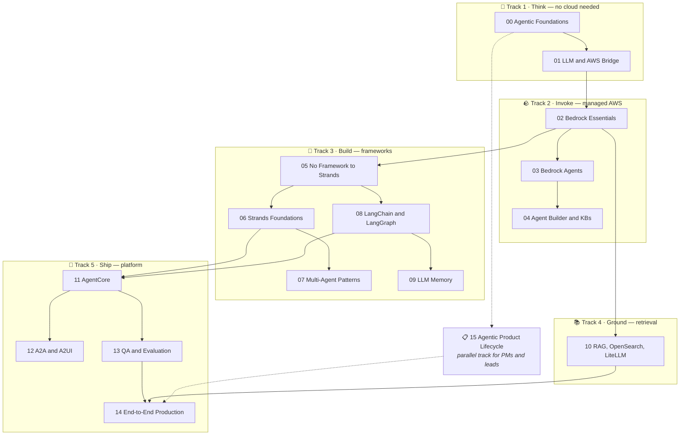
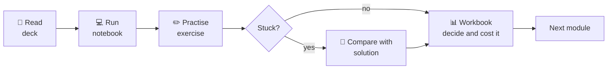
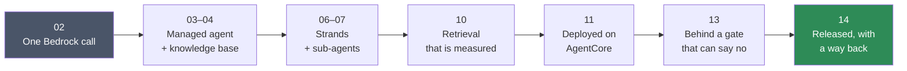
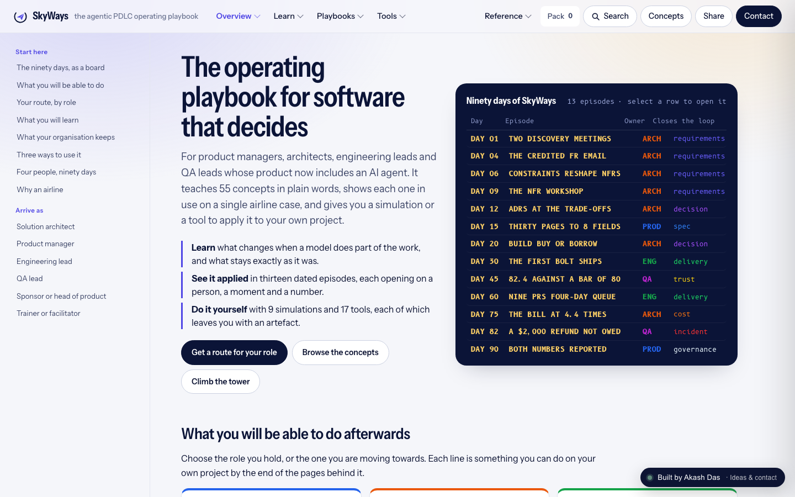

<div align="center">

# Agentic AI on AWS

### Build, evaluate and ship production AI agents with Amazon Bedrock, AgentCore, Strands, LangGraph and RAG

**A complete, free, hands-on curriculum — plus a 77-page field guide and auto-graded labs.**
16 modules · 102 notebooks · 92 exercises · 63 worked solutions · 30 decision workbooks · ~90 hours

[](LICENSE)
[](#the-curriculum)
[](#the-curriculum)
[](#63-worked-solutions--and-honesty-about-the-rest)
[](CONTRIBUTING.md)
[](cheatsheets/)
[](labs/)
[](https://codespaces.new/akash-coded/aws-bedrock-agentcore-strands?quickstart=1)
[](https://github.com/akash-coded/aws-bedrock-agentcore-strands/discussions)
[](https://akash-coded.github.io/aws-bedrock-agentcore-strands/)

**[▶ Start here](docs/START-HERE.md)** &nbsp;·&nbsp;
**[🗺️ Learning paths](docs/learning-paths/)** &nbsp;·&nbsp;
**[🏛️ Architecture](docs/architecture/)** &nbsp;·&nbsp;
**[🧭 Field guide](cheatsheets/)** &nbsp;·&nbsp;
**[🧪 L.A.B. Simulator](labs/)** &nbsp;·&nbsp;
**[📘 The manual](https://akash-coded.github.io/aws-bedrock-agentcore-strands/)** &nbsp;·&nbsp;
**[⚙️ Setup](docs/setup/aws-account-setup.md)** &nbsp;·&nbsp;
**[📖 Wiki](https://github.com/akash-coded/aws-bedrock-agentcore-strands/wiki)** &nbsp;·&nbsp;
**[💬 Discussions](https://github.com/akash-coded/aws-bedrock-agentcore-strands/discussions)**

</div>

---

## Why this exists

Most agentic AI material stops at a working demo. A demo is the easy 20%. The hard part is everything
after: proving the thing works, knowing what it costs, deciding whether it should have been an agent at
all, and having something to roll back to when it fails at 2 a.m.

This curriculum was built and delivered across three professional cohorts and rebuilt for public use. It is
opinionated in one specific way:

> **Every abstraction is preceded by the thing it abstracts.**
> You write the agent loop by hand before you meet a framework. You build RAG by hand before you touch a
> managed knowledge base. You write the evaluation gate before you deploy. Nothing is magic, because you
> built the layer underneath it.

## What you will be able to do

- Decide, with a defensible artefact, whether a use case should be an agent at all
- Call Amazon Bedrock properly — Converse API, tool use, multi-turn state, token accounting
- Build agents in **Bedrock Agents**, **Strands** and **LangChain/LangGraph**, and choose between them with evidence
- Design multi-agent topologies and predict their cost before running them
- Build a retrieval pipeline with hybrid search and reranking, and **prove** it works
- Deploy to **Bedrock AgentCore** with memory, identity, a gateway and observability
- Gate a release on evaluation metrics, and roll it back when the gate is right

## Quick start

```bash
git clone https://github.com/akash-coded/aws-bedrock-agentcore-strands.git
cd aws-bedrock-agentcore-strands
python3 -m venv .venv && source .venv/bin/activate
pip install -r requirements.txt
jupyter lab
```

Then open **[`docs/START-HERE.md`](docs/START-HERE.md)**.

> **Before Module 02:** [set up AWS](docs/setup/aws-account-setup.md) and
> [set a budget alarm](docs/setup/cost-controls.md). Model access approval is not always instant.
> Modules 00, 01 and 15 need no AWS account — start there while access is pending.

---

## Choose your path

Sixteen modules is a lot, and nobody needs all of them in the same order.

| Path | For | Time | Finish line |
| --- | --- | --- | --- |
| 🚀 **[Weekend Sprint](docs/learning-paths/weekend-sprint.md)** | "Show me it works, this weekend" | ~12 h | A working Bedrock agent with your own tools |
| 🛠️ **[Agent Engineer](docs/learning-paths/agent-engineer.md)** | Building and shipping agents | ~70 h | A deployed, evaluated, gated agent |
| 🏛️ **[Solutions Architect](docs/learning-paths/solutions-architect.md)** | Designing and reviewing agent systems | ~45 h | A defensible architecture with a cost model |
| 📋 **[Product Manager](docs/learning-paths/product-manager.md)** | Deciding what to build, and defending it | ~25 h | A PRD and a gate review you can chair |
| 🔬 **[RAG Specialist](docs/learning-paths/rag-specialist.md)** | Retrieval quality as the job | ~35 h | A measured, gated RAG pipeline |

---

## How it fits together



**[→ Full architecture, including the TravelMind reference application](docs/architecture/)**

---

## The curriculum

| # | Module | Time | 📓 | ✏️ | 📗 | Design |
| --- | --- | --- | --- | --- | --- | --- |
| **[00](modules/00-agentic-foundations/)** | 🧭 **[Agentic Foundations](modules/00-agentic-foundations/)**<br/><sub>Decide what deserves to be an agent before you build one.</sub> | 4–5 h | 0 | 6 | 2 | [LLD](docs/architecture/lld/00-agentic-foundations.md) |
| **[01](modules/01-llm-and-aws-bridge/)** | 🌉 **[LLM Intuition and the AWS Bridge](modules/01-llm-and-aws-bridge/)**<br/><sub>Build a working mental model of LLMs, then map it onto AWS.</sub> | 3–4 h | 0 | 2 | 0 | [LLD](docs/architecture/lld/01-llm-and-aws-bridge.md) |
| **[02](modules/02-bedrock-essentials/)** | 🪨 **[Amazon Bedrock Essentials](modules/02-bedrock-essentials/)**<br/><sub>Your first real calls: Converse API, tokens, tool use, knowledge bases, guardrails.</sub> | 6–8 h | 5 | 6 | 5 | [LLD](docs/architecture/lld/02-bedrock-essentials.md) |
| **[03](modules/03-bedrock-agents/)** | 🤖 **[Amazon Bedrock Agents](modules/03-bedrock-agents/)**<br/><sub>Console to code: action groups, orchestration, and controlling behaviour.</sub> | 6–7 h | 8 | 7 | 3 | [LLD](docs/architecture/lld/03-bedrock-agents.md) |
| **[04](modules/04-agent-builder-and-knowledge-bases/)** | 🏗️ **[Agent Builder, Knowledge Bases and Guardrails](modules/04-agent-builder-and-knowledge-bases/)**<br/><sub>The low-code surface, and how to wire knowledge and safety into it.</sub> | 4–5 h | 3 | 0 | 0 | [LLD](docs/architecture/lld/04-agent-builder-and-knowledge-bases.md) |
| **[05](modules/05-agent-loop-no-framework-to-strands/)** | 🔁 **[The Agent Loop: No Framework to Strands](modules/05-agent-loop-no-framework-to-strands/)**<br/><sub>Write the loop by hand, feel the pain, then let Strands remove it.</sub> | 5–6 h | 13 | 4 | 4 | [LLD](docs/architecture/lld/05-agent-loop-no-framework-to-strands.md) |
| **[06](modules/06-strands-foundations/)** | 🧵 **[Strands Foundations: Tools, Memory and MCP](modules/06-strands-foundations/)**<br/><sub>Agents with hands, memory, and a standard way to reach the outside world.</sub> | 5–6 h | 5 | 4 | 0 | [LLD](docs/architecture/lld/06-strands-foundations.md) |
| **[07](modules/07-strands-multi-agent-patterns/)** | 🕸️ **[Multi-Agent Patterns with Strands](modules/07-strands-multi-agent-patterns/)**<br/><sub>Swarm, graph, delegation, critique — and when each one is wrong.</sub> | 6–7 h | 8 | 9 | 9 | [LLD](docs/architecture/lld/07-strands-multi-agent-patterns.md) |
| **[08](modules/08-langchain-and-langgraph/)** | 🦜 **[LangChain and LangGraph](modules/08-langchain-and-langgraph/)**<br/><sub>The other ecosystem — and an honest side-by-side with Strands.</sub> | 7–8 h | 16 | 12 | 12 | [LLD](docs/architecture/lld/08-langchain-and-langgraph.md) |
| **[09](modules/09-llm-memory/)** | 🧠 **[LLM Memory Mechanics](modules/09-llm-memory/)**<br/><sub>What models forget, why, and what you can do about it.</sub> | 3–4 h | 2 | 1 | 0 | [LLD](docs/architecture/lld/09-llm-memory.md) |
| **[10](modules/10-rag-opensearch-litellm/)** | 📚 **[RAG, OpenSearch and LiteLLM](modules/10-rag-opensearch-litellm/)**<br/><sub>Retrieval done properly — chunking, hybrid search, reranking, and an evaluation gate.</sub> | 8–10 h | 14 | 6 | 6 | [LLD](docs/architecture/lld/10-rag-opensearch-litellm.md) |
| **[11](modules/11-bedrock-agentcore/)** | ⚙️ **[Amazon Bedrock AgentCore](modules/11-bedrock-agentcore/)**<br/><sub>Runtime, memory, identity, gateway, observability — agents as deployed services.</sub> | 8–10 h | 17 | 4 | 0 | [LLD](docs/architecture/lld/11-bedrock-agentcore.md) |
| **[12](modules/12-a2a-and-a2ui-interop/)** | 🔌 **[A2A and A2UI: Agent Interoperability](modules/12-a2a-and-a2ui-interop/)**<br/><sub>Agents talking to agents, and agents talking to users.</sub> | 4–5 h | 5 | 5 | 2 | [LLD](docs/architecture/lld/12-a2a-and-a2ui-interop.md) |
| **[13](modules/13-agentic-qa-and-evaluation/)** | 🔬 **[Agentic QA and Evaluation](modules/13-agentic-qa-and-evaluation/)**<br/><sub>How you prove an agent works — and block the ones that do not.</sub> | 5–6 h | 2 | 1 | 0 | [LLD](docs/architecture/lld/13-agentic-qa-and-evaluation.md) |
| **[14](modules/14-end-to-end-production/)** | 🚀 **[End-to-End Production Pipeline](modules/14-end-to-end-production/)**<br/><sub>The capstone: build, validate, deploy, fail over, and gate a release.</sub> | 8–10 h | 4 | 9 | 8 | [LLD](docs/architecture/lld/14-end-to-end-production.md) |
| **[15](modules/15-agentic-product-lifecycle/)** | 📋 **[Agentic Product Lifecycle](modules/15-agentic-product-lifecycle/)**<br/><sub>For the people who decide what gets built, and have to defend it.</sub> | 4–5 h | 0 | 16 | 12 | [LLD](docs/architecture/lld/15-agentic-product-lifecycle.md) |
<sub>📓 notebooks · ✏️ exercises · 📗 worked solutions</sub>

---

## How a module works

Every module has the same shape, and its `README.md` tells you the exact order to work through it.

```
modules/NN-topic/
├── README.md      ← objectives, the ordered sequence, common mistakes. Start here.
├── slides/        ← decks and reading material
├── notebooks/     ← runnable code
├── exercises/     ← practice. Attempt closed-book.
├── solutions/     ← worked answers. Read after you have a wrong answer.
├── activities/    ← workbooks where a decision gets written down and costed
├── src/           ← supporting source code
└── labs/          ← extended hands-on
```



### 63 worked solutions — and honesty about the rest

Most exercises ship with a worked solution, written to be read **after** you have a wrong answer to compare
against. That comparison is where the learning is; reading them first turns an hour of work into five
minutes of nodding.

Where there is no answer key, it is deliberate and the module says so:
[Module 06](modules/06-strands-foundations/)'s builds are open-ended designs with levels and
acceptance criteria rather than one right implementation, and
[Module 11](modules/11-bedrock-agentcore/)'s exercises are graded against a self-check rubric.
No module claims a solution set it does not have.

---

## One example, all the way through

**TravelMind** is a travel-operations agent, and it is in almost every module. It starts in Module 02 as a
single Bedrock call and finishes in Module 14 as a deployed, gated, multi-agent service with failover and a
rollback path. Same domain throughout, so you are never learning a new business problem at the same time as
a new technical concept.



The [full request lifecycle and reference architecture](docs/architecture/#3-travelmind--the-reference-application)
is in the architecture docs.

---

## Portable skills vs AWS specifics

A fair question about any cloud-branded curriculum: how much of this transfers?

Most of it. The curriculum is deliberately front-loaded with portable material, and the AWS-specific
surface is concentrated in the platform layer.

| | |
| --- | --- |
| 🟢 **[Portable GenAI concepts](docs/concepts/genai-core-concepts.md)** | Agent loops, tool design, memory strategy, RAG pipeline design, multi-agent topologies, evaluation and gating. Transfers to any stack. |
| 🔵 **[Where AWS comes in](docs/concepts/aws-service-map.md)** | Bedrock, AgentCore, Knowledge Bases, Guardrails, OpenSearch, Lambda, IAM, CloudWatch — service by service, with the module that teaches each. |
| ⚖️ **[Portability matrix](docs/concepts/portability-matrix.md)** | An honest, itemised answer on lock-in, and how to structure a build so the lock-in stays narrow. |

---

## 🗺️ The Field Guide

The curriculum teaches you to build agents. The **[field guide](cheatsheets/)** is what you reach for once
you are building them — in a design review, at 2 a.m. during an incident, in a budget meeting, or in an
interview.

| Section | Contents |
| --- | --- |
| 🧠 **[Frameworks](cheatsheets/frameworks/)** | 17 original mental models — the [Autonomy Ladder](cheatsheets/frameworks/autonomy-ladder.md), [Token Tax Ledger](cheatsheets/frameworks/token-tax-ledger.md), [Handoff Multiplier](cheatsheets/frameworks/handoff-multiplier.md), [Blast Radius Grid](cheatsheets/frameworks/blast-radius-grid.md), [Evidence Ladder](cheatsheets/frameworks/evidence-ladder.md) and more. Each has a procedure and an output, not just a concept |
| 📖 **[Quick reference](cheatsheets/quick-reference/)** | 10 cheat sheets: [Bedrock Converse](cheatsheets/quick-reference/bedrock-converse.md), [Strands](cheatsheets/quick-reference/strands.md), [LangGraph](cheatsheets/quick-reference/langgraph.md), [AgentCore](cheatsheets/quick-reference/agentcore.md), [RAG](cheatsheets/quick-reference/rag-pipeline.md), [IAM](cheatsheets/quick-reference/iam-for-agents.md), [observability](cheatsheets/quick-reference/observability.md) |
| 🚨 **[Runbooks](cheatsheets/runbooks/)** | 9 procedures for when it breaks — [wrong answers](cheatsheets/runbooks/incident-wrong-answers.md), [cost spikes](cheatsheets/runbooks/incident-cost-spike.md), [runaway loops](cheatsheets/runbooks/incident-runaway-loop.md), [rollback](cheatsheets/runbooks/rollback.md), [inheriting an agent](cheatsheets/runbooks/inheriting-an-agent.md) |
| 📋 **[Playbooks](cheatsheets/playbooks/)** | [Design reviews](cheatsheets/playbooks/agent-design-review.md), [build-buy-or-wait](cheatsheets/playbooks/build-buy-or-wait.md), [scoping an engagement](cheatsheets/playbooks/scoping-an-engagement.md), [killing a project well](cheatsheets/playbooks/killing-an-agent-project.md) |
| 💼 **[Interview guides](cheatsheets/interviews/)** | Both sides of the table for [engineer](cheatsheets/interviews/agent-engineer.md), [architect](cheatsheets/interviews/solutions-architect.md), [PM](cheatsheets/interviews/product-manager.md), [BA](cheatsheets/interviews/business-analyst.md), [QA](cheatsheets/interviews/qa-engineer.md) — plus a [hiring guide](cheatsheets/interviews/as-the-interviewer.md) |
| 🎓 **[How-to by role](cheatsheets/how-to/)** | 17 recipes for [engineers](cheatsheets/how-to/engineers/), [PMs](cheatsheets/how-to/product/), [architects](cheatsheets/how-to/architects/), [business analysts](cheatsheets/how-to/business-analysts/), [QA](cheatsheets/how-to/qa-and-test/) and [engineering managers](cheatsheets/how-to/engineering-managers/) |

**Not only for engineers.** Product managers get [acceptance criteria for non-deterministic systems](cheatsheets/how-to/product/write-acceptance-criteria.md)
and [how to price a feature](cheatsheets/how-to/product/price-an-agent-feature.md). Business analysts get
[how to build a golden set from real tickets](cheatsheets/how-to/business-analysts/build-a-golden-set.md) —
the artefact that *is* the specification. Architects get [topology selection with cost multipliers](cheatsheets/how-to/architects/choose-a-topology.md).

**[→ Open the field guide](cheatsheets/)**

---

## 🧪 The L.A.B. Simulator

**Learn → Apply → Break.** Auto-graded, bite-sized labs where you build the pieces yourself and then try
to break them. No API keys, no dependencies — every lab runs offline on Python 3.11+.

**[Open in Codespaces](https://codespaces.new/akash-coded/aws-bedrock-agentcore-strands?quickstart=1)** and type `lab next` — that is the entire setup. Or locally:

```bash
python labs/runner/labctl.py next          # what you can start right now
python labs/runner/labctl.py start PDL-01
python labs/runner/labctl.py run   PDL-01  # public checks
python labs/runner/labctl.py break PDL-01  # now survive the failures that end real runs
```

Most practice platforms give you a stub and a happy-path test. Agents do not fail on the happy path — they
fail when a tool returns `[]` and the model reads it as "nothing applies". So every lab has three phases:

| | Phase | What you get |
| --- | --- | --- |
| **L** | Learn | A mental model, a diagram, and **one decision with the answer withheld**. Your choice changes what you build |
| **A** | Apply | A spec, public checks you can see, hidden checks on submit. Every check explains what it teaches when it fails |
| **B** | Break | `SystemExit` from a library. A chunk bigger than the whole budget. A footnote `[1]` corrupting your citation map. Survive them |

**[10 labs and 9 drills across 8 tracks](labs/)**, ordered by a [justified pathway](labs/PATHWAY.md) — and the decision
inside each one accumulates into the [seven PRD artefacts](docs/prd/), so you finish with a working system
*and* the paperwork to defend it.

Or skip the clone entirely: post `/drill AGL-101` with a python block in the
[Simulator Arena](labs/ARENA.md) and a bot grades it in the thread, names the skill you demonstrated, and points
at the next one. Trainers `/assign`; progress lands on the [scoreboard](https://github.com/akash-coded/aws-bedrock-agentcore-strands/wiki/Scoreboard) and the
[Hands-on Tracker](https://github.com/users/akash-coded/projects/9).

The catalog is **self-verifying**: CI proves every reference solution passes all three phases and every
starter fails, so no lab can ship with TODOs that do not need doing. Fork the repo, commit your solutions,
and [the workflow grades your pull request](.github/workflows/labs.yml).

**[→ Open the L.A.B. Simulator](labs/)**

---

## 📘 The agentic manual — your role, end to end

**[https://akash-coded.github.io/aws-bedrock-agentcore-strands/](https://akash-coded.github.io/aws-bedrock-agentcore-strands/)**

An operating manual for building software that decides. You enter by **role** and walk it from the
first discovery conversation to the number you report at the end. Five roles, forty steps,
**264 sub-steps** — and at every single step: what you actually do, where a model helps and where it
must not be trusted, the artefact you produce, a fill-in **template**, copy-paste **prompts**, a worked
example, the pitfalls, and a testable done-when.

| Role | The arc | |
| --- | --- | --- |
| **[Product manager](https://akash-coded.github.io/aws-bedrock-agentcore-strands/product-manager/)** | Discover → Qualify → Frame → Specify → Plan → Gate → Launch → Learn | From a vibe to a number you can defend |
| **[Solution architect](https://akash-coded.github.io/aws-bedrock-agentcore-strands/solution-architect/)** | Elicit → Constrain → Map → Shape → Decide → Bound → Detail → Evolve | From requirements to a system that holds |
| **[Engineering lead](https://akash-coded.github.io/aws-bedrock-agentcore-strands/engineering/)** | Prepare → Slice → Floor → Layer → Gate → Harness → Ship → Operate | From a story file to a shipped bolt |
| **[QA lead](https://akash-coded.github.io/aws-bedrock-agentcore-strands/qa/)** | Define → Curate → Check → Harness → Measure → Attack → Shadow → Watch | From "it works" to a number you can defend |
| **[DevOps and platform](https://akash-coded.github.io/aws-bedrock-agentcore-strands/devops/)** | Baseline → Access → Environments → Pipeline → Deploy → Observe → Protect → Recover | From a laptop to production, repeatably |

Each role gets its own arc, because the shape of the work differs. One running case throughout —
**SkyWays**, an airline building a rebooking assistant for disrupted passengers — so you can switch
roles and stay oriented.

**[📋 All 40 templates](https://akash-coded.github.io/aws-bedrock-agentcore-strands/templates/)** &nbsp;·&nbsp;
**[💬 All 116 prompts](https://akash-coded.github.io/aws-bedrock-agentcore-strands/prompts/)** &nbsp;·&nbsp;
**[🧩 Frameworks and acronyms](https://akash-coded.github.io/aws-bedrock-agentcore-strands/frameworks/)** &nbsp;·&nbsp;
**[🛫 The SkyWays simulator](https://akash-coded.github.io/aws-bedrock-agentcore-strands/simulator/)**

[](https://akash-coded.github.io/aws-bedrock-agentcore-strands/)

The **[simulator](https://akash-coded.github.io/aws-bedrock-agentcore-strands/simulator/)** is the same case, playable: thirteen dated episodes, eight loops,
nine simulations where a wrong choice plays out in front of you, and seventeen calculators that do the
arithmetic on your own numbers. The **[wiki](https://github.com/akash-coded/aws-bedrock-agentcore-strands/wiki/The-Agentic-PDLC)** carries the method in writing,
and every journey has a [reading copy](https://github.com/akash-coded/aws-bedrock-agentcore-strands/wiki/Journey-Product-Manager) there too.

This is an original work and the intellectual property of Akash Das, open-sourced here under the MIT
licence for knowledge and experience sharing. Keep the attribution when you reuse it.

---

## Design documents

Because "how do I design one of these" is the question the demos never answer.

| Document | What it gives you |
| --- | --- |
| **[Architecture HLD](docs/architecture/)** | The whole system: curriculum structure, TravelMind reference architecture, request lifecycle, cost model |
| **[LLD per module](docs/architecture/lld/)** | 16 zoom-ins: the mechanism, its components, contracts, failure modes and how you detect each |
| **[Sample PRDs](docs/prd/)** | Seven artefacts across the lifecycle — idea brief, discovery PRD, agent spec, technical design, evaluation plan, production readiness, post-launch review. Worked for TravelMind, usable as templates. |
| **[Glossary](docs/concepts/glossary.md)** | Terms as used here, including where the industry definition is contested |
| **[Training frameworks playbook](docs/reference/training-frameworks-playbook.md)** | The instructional design behind the structure, if you want to teach from this |

---

## Repository map

```
.
├── modules/          16 topic modules — the curriculum
├── labs/             the L.A.B. Simulator — auto-graded, decision-driven labs
│   ├── catalog/              labs, by track
│   ├── runner/               labctl — list · start · run · break · submit · verify
│   ├── workspace/            your solutions (graded in CI on a PR)
│   └── PATHWAY.md            the justified 41-lab progression
├── cheatsheets/      the field guide — 77 reference pages
│   ├── frameworks/           17 original mental models
│   ├── quick-reference/      10 API and decision cheat sheets
│   ├── runbooks/             9 incident and operational procedures
│   ├── playbooks/            4 strategic playbooks
│   ├── interviews/           6 role guides, both sides of the table
│   └── how-to/               17 recipes across 6 roles
├── wiki/             seed for the wiki — the written playbook, plus living notes
├── site/             the manual on GitHub Pages
│   ├── content/roles/        five role journeys as JSON, authored in Python
│   ├── render.py             content → static HTML; wiki_export.py → the same, as wiki pages
│   └── app/                  the SkyWays simulator, published unchanged
├── docs/
│   ├── START-HERE.md         entry point
│   ├── learning-paths/       5 paths by role and time budget
│   ├── architecture/         HLD + 16 LLDs
│   ├── concepts/             portable concepts · AWS map · portability · glossary
│   ├── prd/                  7 sample PRDs across the lifecycle
│   ├── setup/                AWS setup · local env · cost controls · troubleshooting
│   └── reference/            video index · FAQ · training playbook
└── projects/         standalone build projects
```

---

## Prerequisites

**You need:** enough Python to read and modify a function, and an AWS account you are allowed to spend on.

**You do not need:** machine learning background, maths, or prior LLM experience. Module 01 builds the
model intuition from zero.

**Cost:** tens of dollars if you tear down as you go; considerably more if you leave OpenSearch Serverless
collections and AgentCore runtimes running. Read **[cost controls](docs/setup/cost-controls.md)** first —
it has a teardown checklist per module.

---

## Contributing

Corrections, better explanations, new exercises and updates for changed AWS behaviour are all welcome.

- 🐛 **Something wrong or out of date?** [Open an issue](https://github.com/akash-coded/aws-bedrock-agentcore-strands/issues/new/choose)
- 💬 **Question, or want to show what you built?** [Discussions](https://github.com/akash-coded/aws-bedrock-agentcore-strands/discussions)
  — 60+ threads, all tagged by track and level. Start with the
  [index of every exercise and lab](https://github.com/akash-coded/aws-bedrock-agentcore-strands/discussions/64),
  the [answered Q&A](https://github.com/akash-coded/aws-bedrock-agentcore-strands/discussions/categories/q-a),
  or [where to post what](docs/DISCUSSIONS.md)
- 🤝 **Want to contribute?** [`CONTRIBUTING.md`](CONTRIBUTING.md)
- 🏛️ **How should a project like this be run?** The [Agentic PDLC · Lifecycle Reference](https://github.com/users/akash-coded/projects/8)
  board — the repo's seven artefacts and four gates, cross-mapped to AiDD, BMAD and AWS AI-DLC
- 📈 **What's happening right now?** [Repo Pulse](https://github.com/users/akash-coded/projects/10)
- 🗺️ **What's next?** The [extension roadmap](docs/extension-roadmap.md) and its
  [public board](https://github.com/users/akash-coded/projects/6) — five phases, most items open to contributors
- 📜 **What changed?** [`CHANGELOG.md`](CHANGELOG.md)
- 📖 **Living notes** — the [wiki](https://github.com/akash-coded/aws-bedrock-agentcore-strands/wiki) holds
  what changes too often to freeze in a reviewed file: a growing
  [error index](https://github.com/akash-coded/aws-bedrock-agentcore-strands/wiki/Error-Index),
  [model and region notes](https://github.com/akash-coded/aws-bedrock-agentcore-strands/wiki/Model-and-Region-Notes),
  a community [cost log](https://github.com/akash-coded/aws-bedrock-agentcore-strands/wiki/Cost-Log),
  and calendar-shaped [study plans](https://github.com/akash-coded/aws-bedrock-agentcore-strands/wiki/Study-Plans).
  Anyone can edit it

AWS moves quickly. If something here no longer matches reality, that is a bug worth reporting.

---

## Running this repository · secrets

**If you are here to learn, you need no secrets, tokens or API keys.** Nothing in the curriculum, the
labs, the field guide or the playbook asks for one. This is for whoever maintains the repository.

There are two, and only the first is in use.

| | Secret | What it is | What happens without it |
| --- | --- | --- | --- |
| 🔑 | **`PROJECT_TOKEN`** — GitHub Actions secret | A **classic** PAT, **`project` scope only**. Powers the [Hands-on Tracker](https://github.com/users/akash-coded/projects/9) and [Repo Pulse](https://github.com/users/akash-coded/projects/10) boards | Those two boards stop refreshing. The [scoreboard](https://github.com/akash-coded/aws-bedrock-agentcore-strands/wiki/Scoreboard), `/leaderboard`, `/progress`, the weekly digest and the PDLC board all keep working |
| 📮 | The relay's **mirror token** — AWS Secrets Manager | A **fine-grained** PAT limited to one private repository, *Issues: read and write*. Only for the [contact relay](site/contact-relay/README.md) | Not in use — the relay is not deployed, and the site's form opens the visitor's mail app instead |

Two things worth knowing about the first one. It **cannot** be a fine-grained token: those have no
permission covering *user-owned* Projects, and neither has the built-in `GITHUB_TOKEN`. And when it
expires **the workflow does not fail** — it warns and the scoreboard still publishes, deliberately, so
the signal is a board that has stopped moving rather than a red run.

**[→ First-time setup](docs/setup/project-token.md)** &nbsp;·&nbsp;
[Both secrets, side by side](docs/setup/README.md#secrets-and-who-needs-them) &nbsp;·&nbsp;
[Check, rotate, revoke](https://github.com/akash-coded/aws-bedrock-agentcore-strands/wiki/Maintainer-Runbook#the-board-sync-token)

---

## Frequently asked

**Do I need an AWS account?** For most of it. Modules 00, 01 and 15 need nothing.
**Strands or LangChain?** Both are here, compared head-to-head on the same task in [Module 08](modules/08-langchain-and-langgraph/).
**Are there videos?** Not yet — the written material is self-contained. [Progress is tracked here](docs/reference/video-index.md).
**Can I teach from this?** Yes, MIT licensed. See [`CITATION.cff`](CITATION.cff).
**Do I need any API keys or tokens?** No. The one secret here is for maintainers and affects two boards only.

**[→ Full FAQ](docs/reference/faq.md)**

---

## Licence and credits

MIT — see [`LICENSE`](LICENSE). Built by [Akash Das](https://github.com/akash-coded) from material
developed and delivered across three professional training cohorts. [The agentic manual](https://akash-coded.github.io/aws-bedrock-agentcore-strands/),
the simulator on the project site, is an original work and the intellectual property of Akash Das, released
under the same licence; keep the attribution when you reuse it.

If this was useful, a ⭐ helps other people find it.

<div align="center">
<sub>

**Topics:** agentic-ai · amazon-bedrock · bedrock-agentcore · strands-agents · langchain · langgraph ·
rag · multi-agent-systems · llm · aws · generative-ai · ai-agents · opensearch · litellm · mcp ·
agent-evaluation · llmops

</sub>
</div>
