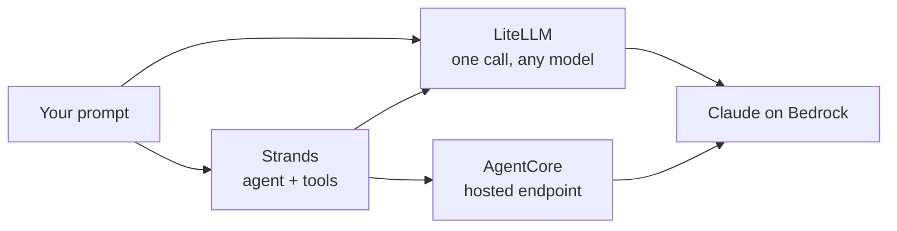

# Try LiteLLM on AWS Bedrock (then Strands, then AgentCore)

Welcome. By the end of this you will have called a Claude model on AWS Bedrock in
about ten lines of Python, using LiteLLM. That is the whole core exercise, and it
is genuinely small. After that, two optional segments show the same idea two
other ways: first as a Strands agent, then deployed as a hosted endpoint with
AgentCore. Do Part 1 today. Come back for the optional parts when you are curious.

Everything uses one model, in one region, so there is very little to keep in your
head:

- Model: `us.anthropic.claude-haiku-4-5-20251001-v1:0` (Claude Haiku 4.5, fast and cheap)
- Region: `us-east-1`

## The 30-second mental model

Three tools, three different jobs. They stack on top of each other.

| Tool | One-line job | You use it to |
|---|---|---|
| **LiteLLM** | one function to call any model | send a prompt, get text back |
| **Strands** | an agent framework | give the model tools and let it decide when to call them |
| **AgentCore** | a hosting runtime | turn that agent into an endpoint others can call |

Part 1 is just the first row. You do not need the other two to get value today.

---

## Before you start

You need three things:

1. **An AWS account with Bedrock access** in `us-east-1`. In a workshop, your
   instructor has set this up for you.
2. **Permission to call the model.** Technically this is the IAM action
   `bedrock:InvokeModel` on the Claude inference profile. Workshop credentials
   already include it. If you are on your own account, see the "If it breaks"
   table for the exact policy.
3. **Python 3.10 or newer.**

> A note on "model access": older Bedrock accounts had a console page where you
> manually enabled each model. That page was retired in late 2025, and
> serverless models like Claude are enabled automatically now. If you are on an
> older account and get an access error, enable the model once in the Bedrock
> console under Model access.

---

## Setup (pick one)

### VS Code or any local terminal (3 steps)

```bash
python -m venv .venv && source .venv/bin/activate     # 1. create + activate a venv
aws configure                                         # 2. paste your keys, region us-east-1
pip install litellm                                   # 3. install LiteLLM (it pulls in boto3)
```

`aws configure` asks for four things: Access Key ID, Secret Access Key, default
region (`us-east-1`), and output format (just press Enter). It writes them to
`~/.aws/`, so you only do this once.

### Google Colab (3 steps)

```python
!pip install -q litellm                                 # 1. install
import os                                                # 2. credentials
os.environ["AWS_ACCESS_KEY_ID"] = "PASTE_KEY"           #    (in real projects use Colab Secrets,
os.environ["AWS_SECRET_ACCESS_KEY"] = "PASTE_SECRET"    #     not plain text)
os.environ["AWS_REGION_NAME"] = "us-east-1"             # 3. region for LiteLLM + Bedrock
```

> Friendly safety note: never commit keys to a notebook you share. For anything
> past a workshop, use a role or a secret store, not literal keys in a cell.

---

## Part 1: The easiest LiteLLM + Bedrock call

This is the core of the exercise. Three steps, then one call.

### Step 1. Install (done above)

`pip install litellm`. That is it. LiteLLM brings the AWS SDK (boto3) along with it.

### Step 2. Set credentials and region

If you ran `aws configure`, your keys are already found automatically. LiteLLM
still wants the region in its own variable, so set this one line either way:

```python
import os
os.environ["AWS_REGION_NAME"] = "us-east-1"   # LiteLLM reads THIS name for Bedrock
```

> Why a special name? LiteLLM looks for `AWS_REGION_NAME` specifically for
> Bedrock. Plain AWS tools use `AWS_REGION` or `AWS_DEFAULT_REGION`. Setting
> `AWS_REGION_NAME` removes all doubt.

### Step 3. Make the call

```python
from litellm import completion

response = completion(
    # the bedrock/ prefix tells LiteLLM which provider to use.
    # us. is the cross-region inference profile, required for on-demand Claude.
    model="bedrock/us.anthropic.claude-haiku-4-5-20251001-v1:0",
    messages=[
        {"role": "user", "content": "In one sentence, what is AWS Bedrock?"}
    ],
)

# LiteLLM returns an OpenAI-shaped response, no matter the provider.
print(response.choices[0].message.content)
```

Run it. You should see a single clean sentence, something like: "AWS Bedrock is a
managed service that lets you call foundation models from several providers
through one API." The exact wording will vary; that is the model thinking, not a
bug.

**Congratulations. You just called a frontier model on AWS in about ten lines.**
The thing worth noticing: you did not import boto3, build a Bedrock client, or
format a Bedrock-specific request body. LiteLLM hid all of that behind one
`completion()` call with an OpenAI-style shape.

### Read the response

The response object carries more than the text. Two fields are worth knowing:

```python
print("answer :", response.choices[0].message.content)   # the text
print("tokens :", response.usage)                          # prompt / completion / total
print("model  :", response.model)                          # which model actually answered
```

`response.usage` is how you track cost. Haiku 4.5 is about $1 per million input
tokens and $5 per million output tokens, so a short call like this costs a
fraction of a cent. Watching `usage` early is a good habit; it is the number that
shows up on the bill.

### Try these (small, quick changes)

Change one thing at a time and re-run. This is the fastest way to build intuition.

1. **Add a system prompt** to set the model's role:

   ```python
   response = completion(
       model="bedrock/us.anthropic.claude-haiku-4-5-20251001-v1:0",
       messages=[
           {"role": "system", "content": "You are a terse travel assistant. Reply in one line."},
           {"role": "user", "content": "My flight got cancelled because of weather. What now?"},
       ],
   )
   print(response.choices[0].message.content)
   ```

2. **Control length and creativity** with parameters LiteLLM passes straight through:

   ```python
   response = completion(
       model="bedrock/us.anthropic.claude-haiku-4-5-20251001-v1:0",
       messages=[{"role": "user", "content": "Give me three rebooking tips."}],
       max_tokens=200,      # cap the answer length (and cost)
       temperature=0.2,     # lower = more focused, higher = more varied
   )
   print(response.choices[0].message.content)
   ```

3. **Print just the token count** after each call and watch how length changes it:

   ```python
   print(response.usage.total_tokens, "tokens")
   ```

That is the entire LiteLLM-on-Bedrock skill. One call, a few knobs.

### If it breaks (the three errors almost everyone hits)

| What you see | What it means | The fix |
|---|---|---|
| `... is not found` / a 404-style model error | the model id is wrong, often missing the `us.` prefix | use the full inference-profile id: `bedrock/us.anthropic.claude-haiku-4-5-20251001-v1:0` |
| `AccessDenied` / 403 on invoke | your IAM identity cannot call this model | attach a policy allowing `bedrock:InvokeModel` on the inference-profile ARN and the regional foundation-model ARNs (see below) |
| `Unable to locate credentials` | AWS keys are not set, or you passed `api_key` to LiteLLM | run `aws configure` or set the `AWS_ACCESS_KEY_ID` / `AWS_SECRET_ACCESS_KEY` env vars, and do NOT pass `api_key` to `completion()` for Bedrock |

> The `api_key` trap is sneaky and worth repeating: Bedrock authenticates with
> AWS credentials, not an API key. If you pass `api_key="..."` to LiteLLM for a
> Bedrock model, it tries to use that instead of your AWS credentials and auth
> fails. For Bedrock, just leave `api_key` out.

Minimal IAM policy for the 403 (replace `ACCOUNT_ID`):

```json
{
  "Version": "2012-10-17",
  "Statement": [{
    "Effect": "Allow",
    "Action": ["bedrock:InvokeModel", "bedrock:InvokeModelWithResponseStream"],
    "Resource": [
      "arn:aws:bedrock:us-east-1:ACCOUNT_ID:inference-profile/us.anthropic.claude-haiku-4-5-20251001-v1:0",
      "arn:aws:bedrock:us-east-1::foundation-model/anthropic.claude-haiku-4-5-20251001-v1:0",
      "arn:aws:bedrock:us-east-2::foundation-model/anthropic.claude-haiku-4-5-20251001-v1:0",
      "arn:aws:bedrock:us-west-2::foundation-model/anthropic.claude-haiku-4-5-20251001-v1:0"
    ]
  }]
}
```

The profile is multi-region, so the role needs the profile ARN and the three
regional model ARNs it can route to.

---

## Optional Segment A: The same call, as a Strands agent

LiteLLM gives you a single model call. Strands wraps a model into an **agent**: a
small loop that can call **tools** you define and decide when to use them. Same
Bedrock model underneath, more capability around it.

### Install

```bash
pip install strands-agents
```

### The code

```python
from strands import Agent, tool
from strands.models import BedrockModel

# 1. Point Strands at the SAME model. Note the id format difference below.
model = BedrockModel(
    model_id="us.anthropic.claude-haiku-4-5-20251001-v1:0",   # NO "bedrock/" prefix here
    region_name="us-east-1",
    temperature=0.2,
)

# 2. Give the agent a tool. A tool is just a Python function with a docstring.
@tool
def get_rebooking_options(pnr: str) -> list:
    """Return alternative flights for a disrupted booking, by PNR."""
    options = {
        "JX48Q2": [{"flight": "AI-318", "dep": "18:40"},
                   {"flight": "6E-552", "dep": "21:15"}],
    }
    return options.get(pnr.upper(), [])

# 3. Build the agent and ask it something that needs the tool.
agent = Agent(model=model, tools=[get_rebooking_options],
              system_prompt="You are TravelMind. Use tools before answering.")

result = agent("My booking JX48Q2 was cancelled. What are my options?")
print(str(result))
```

Run it. The model reads your question, decides on its own to call
`get_rebooking_options("JX48Q2")`, gets the two flights back, and writes a
natural answer that includes them. You did not tell it to call the tool; it
chose to. That decision-making is what makes it an agent rather than a single
call.

### The one gotcha that trips everyone

The model id is written **differently** in LiteLLM and in Strands:

| Where | Model id |
|---|---|
| LiteLLM `completion()` | `bedrock/us.anthropic.claude-haiku-4-5-20251001-v1:0` (with `bedrock/`) |
| Strands `BedrockModel` | `us.anthropic.claude-haiku-4-5-20251001-v1:0` (no `bedrock/`) |

LiteLLM uses the `bedrock/` prefix to pick the provider. Strands already knows it
is Bedrock from the class name `BedrockModel`, so the prefix would be wrong there.
Copy the right form for the right tool and you will avoid a confusing 404.

### So when do I use which?

| Use LiteLLM when | Use Strands when |
|---|---|
| you just need text from a model | you need tools, multi-step reasoning, or a real agent |
| you want one API across many providers | you are building on AWS and want the agent loop handled for you |
| you want easy fallback across providers | you want typed tools and a clean agent abstraction |

They are not rivals. A common setup is a Strands agent for the logic, with
LiteLLM sitting underneath only if you need to route across providers.

---

## Optional Segment B (advanced): Deploy the agent with AgentCore

You have an agent that runs on your laptop. AgentCore Runtime turns it into a
managed, scalable endpoint that other systems can call over HTTP. This is the
step from "it works on my machine" to "it is a service."

### Install

```bash
pip install bedrock-agentcore bedrock-agentcore-starter-toolkit
```

The first package is the SDK you import. The second gives you the `agentcore`
command-line tool.

### Step 1. Wrap the agent (this is the only new code)

Save this as `my_runtime.py`. It reuses the agent from Segment A.

```python
from bedrock_agentcore.runtime import BedrockAgentCoreApp
from strands import Agent, tool
from strands.models import BedrockModel

@tool
def get_rebooking_options(pnr: str) -> list:
    """Return alternative flights for a disrupted booking, by PNR."""
    return {"JX48Q2": [{"flight": "AI-318", "dep": "18:40"}]}.get(pnr.upper(), [])

model = BedrockModel(model_id="us.anthropic.claude-haiku-4-5-20251001-v1:0",
                     region_name="us-east-1")
agent = Agent(model=model, tools=[get_rebooking_options],
              system_prompt="You are TravelMind. Use tools before answering.")

app = BedrockAgentCoreApp()           # 1. the runtime app object

@app.entrypoint                        # 2. the function AgentCore calls per request
def invoke(payload):
    # payload is the JSON request body. Read "prompt", return the answer string.
    return str(agent(payload.get("prompt", "")))

if __name__ == "__main__":
    app.run()                          # 3. serves /invocations + /ping on port 8080
```

Three additions: the `app`, the `@app.entrypoint` function, and `app.run()`. Your
agent logic is untouched. The contract is now: callers send `{"prompt": "..."}`
and get a string back.

### Step 2. Test it locally first

```bash
python my_runtime.py
```

`app.run()` starts a server on port 8080. From a second terminal:

```bash
curl localhost:8080/ping
# {"status": "healthy"}

curl -X POST localhost:8080/invocations \
     -H 'Content-Type: application/json' \
     -d '{"prompt":"Options for JX48Q2?"}'
```

If the local server answers, you are ready to deploy. If it fails here, it will
fail in the cloud too, so always get this green first.

### Step 3. Deploy

> First, know which CLI you have. Two different tools answer to `agentcore`. This
> exercise uses the **starter toolkit** you installed above (`configure`,
> `launch`, `invoke`). If you see `agentcore create` / `deploy` instead, you are
> on the other (`@aws/agentcore` npm) CLI; reinstall the Python starter toolkit.

```bash
agentcore configure --entrypoint my_runtime.py
agentcore launch
agentcore invoke '{"prompt":"My booking JX48Q2 was cancelled. Options?"}'
```

- `configure` records your entrypoint and creates an execution role and an image
  target.
- `launch` builds the image, pushes it, and provisions the managed runtime. This
  takes about 5 to 10 minutes. That is one-time setup, not per-call latency.
- `invoke` calls your live agent. The same answer now comes from AWS.

### The wall: the two errors to expect

| Code | Cause | Fix |
|---|---|---|
| 404 | model id missing the `us.` inference-profile prefix | use `us.anthropic.claude-haiku-4-5-20251001-v1:0` |
| 403 | the execution role cannot invoke the model | attach the IAM policy from Part 1 to the execution role |

Fix the 404 first (right id), then the 403 (right permissions on that id).

### What changes in production

| In this exercise | In production |
|---|---|
| keys via `aws configure` | the execution role, no long-lived keys in code or image |
| region hardcoded | region from config or environment |
| broad permissions | least privilege: only the model you use, only your log group |
| no retries | adaptive retries and a request timeout (throttles are normal at scale) |
| logs only | observability on at deploy, so you can debug a non-deterministic agent |

### Cleanup (so it stops costing)

```bash
agentcore destroy        # tears down the runtime you just created
```

Also remove the container image and log group if you will not reuse them.

---

## How the three fit together



- **LiteLLM** is the simplest path to a model. Start here.
- **Strands** adds tools and the agent loop around a model.
- **AgentCore** hosts a Strands agent as a real service.

You can stop at any layer. Many useful things never need more than Part 1.

---

## Self-check

You are done with the core exercise when you can tick the first three. The rest
are bonus.

- [ ] I called Claude on Bedrock through LiteLLM and printed the answer.
- [ ] I printed `response.usage` and know roughly what the call cost.
- [ ] I changed the system prompt or a parameter and saw the answer change.
- [ ] (Optional A) I built a Strands agent that called a tool on its own.
- [ ] (Optional B) I deployed the agent with AgentCore and invoked it live.

---

## Copy-paste cheat sheet

Everything you need in one place.

**Model id, by tool**
```text
LiteLLM   : bedrock/us.anthropic.claude-haiku-4-5-20251001-v1:0
Strands   : us.anthropic.claude-haiku-4-5-20251001-v1:0
AgentCore : us.anthropic.claude-haiku-4-5-20251001-v1:0   (same as Strands)
```

**Environment variables**
```text
AWS_ACCESS_KEY_ID       your access key
AWS_SECRET_ACCESS_KEY   your secret key
AWS_REGION_NAME         us-east-1        (LiteLLM reads this name for Bedrock)
```

**Installs**
```text
LiteLLM   : pip install litellm
Strands   : pip install strands-agents
AgentCore : pip install bedrock-agentcore bedrock-agentcore-starter-toolkit
```

**The one-call core**
```python
from litellm import completion
r = completion(
    model="bedrock/us.anthropic.claude-haiku-4-5-20251001-v1:0",
    messages=[{"role": "user", "content": "Hello from Bedrock!"}],
)
print(r.choices[0].message.content)
```

> Tip: if any model id ever stops working, open the Bedrock console, go to the
> model catalog, and copy the exact id from there. Ids update over time, and the
> console is always the source of truth.
