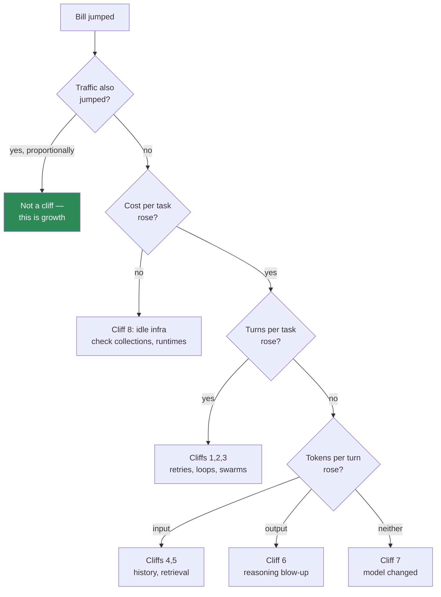

# The Cost Cliff Map

> **One line:** agent cost is not linear — it has cliffs, and you should know where yours are before you
> walk off one.

Cost models assume "twice the traffic, twice the bill". Agent systems have step changes. This map names
the eight cliffs and the guard for each.

---

## The cliffs

| # | Cliff | Trigger | Multiplier | Guard |
| --- | --- | --- | --- | --- |
| 1 | **Retry storm** | Downstream flaky → agent retries → each retry re-sends full context | 2–5× | Retry cap; exponential backoff; circuit breaker |
| 2 | **Loop non-convergence** | Tool never satisfies the model | 3–10× | Hard iteration cap + escalation path |
| 3 | **Swarm without a stop rule** | No termination condition | Unbounded | Mandatory stop rule and budget ceiling |
| 4 | **History overflow spiral** | Buffer grows → summarise → summary grows | 2–4× | Cap history; summarise at a threshold |
| 5 | **Corpus growth → top-k inflation** | More docs → recall falls → someone raises k | 1.5–3× | Fix k by measurement; improve ranking instead |
| 6 | **Reasoning-token blow-up** | A prompt change makes the model deliberate more | 1.5–4× | Track output tokens per turn as a metric |
| 7 | **Fallback to a pricier model** | Primary throttles → fallback is a larger model | 1.5–6× | Log answering model; alert on fallback share |
| 8 | **Idle infrastructure** | Classic search collections, runtime instances and stored memory billing for existing | Fixed drain | Teardown checklist; scheduled sweep |

## Where each cliff shows up in your bill

Three metrics answer every branch: **cost per task**, **turns per task**, **tokens per turn (in/out split)**.
If you track nothing else, track these three.

## The four guards worth having on day one

1. **Iteration cap** on every loop. Not a suggestion in the prompt — a counter in the code that raises.
2. **Budget alarm** at the account level. It does not stop spend; it tells you.
3. **Cost per task, daily.** The single metric that catches cliffs 1–7.
4. **Teardown checklist** run at the end of every module or project phase. Catches cliff 8, which is the
   most common of all and the least interesting.

## The pre-launch cost pre-mortem

For each cliff, one line:

| Cliff | Can it happen to us? | Guard in place? | Who notices? |
| --- | --- | --- | --- |
| Retry storm | | | |
| Loop non-convergence | | | |
| Swarm unbounded | | | |
| History spiral | | | |
| Top-k inflation | | | |
| Reasoning blow-up | | | |
| Fallback to pricier model | | | |
| Idle infrastructure | | | |

"Who notices" is the column people leave blank. A guard with no owner is a guard nobody acts on.

## Where this shows up

- [Cost controls](../../docs/setup/cost-controls.md) — the teardown checklist
- [Module 11 · cost and capacity workbench](../../modules/11-bedrock-agentcore/activities/AgentCore_Cost_and_Capacity_Workbench.xlsx)
- [Cost spike runbook](../runbooks/incident-cost-spike.md)

**Related:** [Token Tax Ledger](token-tax-ledger.md) · [Handoff Multiplier](handoff-multiplier.md) ·
[Three Clocks](three-clocks.md)
