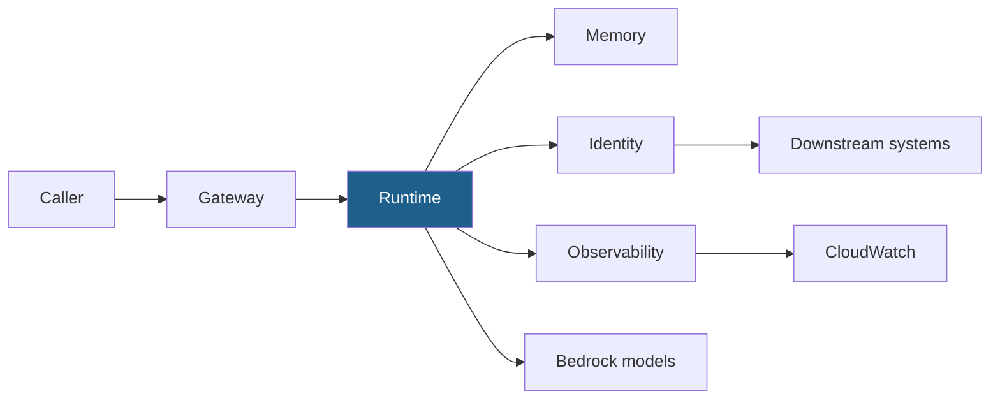

# Bedrock AgentCore — Cheat Sheet

The platform that turns an agent from a notebook into a service. Five primitives, framework-agnostic.

---

## The five primitives

| Primitive | Gives you | Decide up front |
| --- | --- | --- |
| **Runtime** | Agent deployed as an invocable service | Which framework (it does not care) |
| **Memory** | Managed session + long-term store | **Retention TTL** — this is the storage bill |
| **Identity** | Scoped credentials per tool | Least privilege *per tool*, not per agent |
| **Gateway** | Front door, routing, tool exposure | What is public, what is internal |
| **Observability** | Traces and metrics per run | Trace id returned to callers |



## Framework-agnostic by design

The runtime does not care what produced the agent. [Module 11](../../modules/11-bedrock-agentcore/) deploys
the same agent three ways — Strands, LangGraph, and no framework at all — specifically to demonstrate this.

| Framework | Deploy walkthrough |
| --- | --- |
| Strands | [`AgentCore_01_Strands_Minimum_Deploy.ipynb`](../../modules/11-bedrock-agentcore/walkthroughs/AgentCore_01_Strands_Minimum_Deploy.ipynb) |
| No framework | [`AgentCore_02_NoFramework_Minimum_Deploy.ipynb`](../../modules/11-bedrock-agentcore/walkthroughs/AgentCore_02_NoFramework_Minimum_Deploy.ipynb) |
| LangGraph | [`AgentCore_03_LangGraph_Minimum_Deploy.ipynb`](../../modules/11-bedrock-agentcore/walkthroughs/AgentCore_03_LangGraph_Minimum_Deploy.ipynb) |

## The entrypoint shape

A runtime handler receives an invocation payload and returns a response. Keep it thin — it is a transport
adapter, not where your logic lives.

```python
from bedrock_agentcore.runtime import BedrockAgentCoreApp
from strands import Agent

app = BedrockAgentCoreApp()
agent = Agent(tools=[...])

@app.entrypoint
def handler(payload):
    result = agent(payload.get("prompt", ""))
    return {"answer": str(result.message),
            "model": result.metrics.model_id,     # log which model answered
            "trace_id": payload.get("trace_id")}

if __name__ == "__main__":
    app.run()
```

**Return the answering model on every response.** It costs one field and it is the only thing that makes
[silent failover](../frameworks/silent-degradation-watchlist.md) detectable.

## The reference project

[`modules/11-bedrock-agentcore/src/MyFirstRuntimeAgent/`](../../modules/11-bedrock-agentcore/src/MyFirstRuntimeAgent/)
is a complete CDK-managed AgentCore project:

```
MyFirstRuntimeAgent/
├── agentcore/
│   ├── agentcore.json      runtime + build config
│   ├── aws-targets.json    deployment targets
│   └── cdk/                the stack
└── app/MyAgent/
    ├── main.py             the entrypoint
    ├── model/              model loading
    ├── mcp_client/         MCP wiring
    └── skills/             the tools
```

## Memory — the decision that controls the bill

Memory is a **retention decision** before it is a technical one:

| Scope | Keep | TTL | Because |
| --- | --- | --- | --- |
| Session | Turns in the current interaction | Session end | Multi-turn clarification |
| Long-term | Summaries, resolved outcomes | **Set one** — e.g. 30 days | Audit window, not forever |
| Never | Raw PII, payment details, full records | — | Nothing to leak is the best control |

> Deploying without a retention policy is [cost cliff 8](../frameworks/cost-cliff-map.md): storage grows
> silently, forever.

## Identity — per tool, not per agent

The default production mistake is one broad role for the whole agent. Scope per tool:

```
❌  AgentRole: { "Action": ["dynamodb:*", "s3:*", "lambda:InvokeFunction"] }

✅  get_booking      → dynamodb:GetItem on Bookings only
    search_policy    → bedrock:Retrieve on KB123 only
    draft_response   → no AWS permissions at all
```

If your only guard against a catastrophic action is a sentence in a prompt, you do not have a guard. See
[Blast Radius Grid](../frameworks/blast-radius-grid.md).

## Observability — the three that matter

| Signal | Catches |
| --- | --- |
| Answering model per response | Silent failover |
| Abstention rate, daily | Retrieval decay, tool failures, prompt drift |
| Cost per task, daily | Seven of eight [cost cliffs](../frameworks/cost-cliff-map.md) |

## Teardown — read this before you build

Know what bills while it exists. A **Runtime instance** bills from boot until it is stopped, and its volumes
even then; **long-term memory records** bill hourly while they are stored; a **microVM session** bills until
it ends, idle time included. Gateways bill per call, and a runtime with no sessions bills only for its code
storage. Delete what you are not using.

```
□ delete runtimes      □ delete gateways      □ delete memory stores
□ cdk destroy stacks   □ delete log groups
```

Full checklist: [cost controls](../../docs/setup/cost-controls.md#teardown-checklist).

## Common mistakes

| Symptom | Cause |
| --- | --- |
| Deploy succeeds, invoke fails | Runtime role missing a downstream permission |
| Memory growing without bound | No TTL set |
| Cannot explain a production failure | No trace id returned to the caller |
| Quality dropped, no code change | Failover — and you are not logging which model answered |

## Learn it properly

[Module 11](../../modules/11-bedrock-agentcore/) · [Module 11 LLD](../../docs/architecture/lld/11-bedrock-agentcore.md) ·
[Module 14](../../modules/14-end-to-end-production/) for the release path
