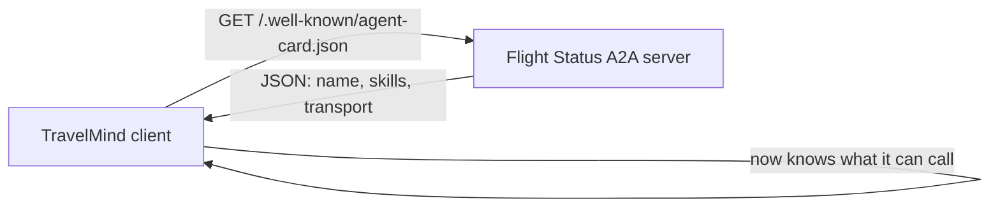

# Exercise 1: Read the Card

**Type:** Small warm-up | **Time:** 20 minutes | **Work:** solo or pairs

> World: You work on the platform team at **Meridian Airways**. Your support agent, **TravelMind**, is about to start delegating work to specialist agents over A2A. Before TravelMind can call anyone, it has to discover what each agent can do. That starts with the Agent Card.

This is your first contact with a live A2A agent. Small win first, then one real bug.

---

## Why this matters

A2A discovery is one HTTP GET. No SDK, no credentials, no model call. Any client in any language reads an agent's capabilities from a single JSON file at a well-known path. If that file is wrong, every downstream call fails before it starts.

You will boot a real agent, read its card, find why its card is broken, and fix it.

---

## Setup

```bash
pip install -q 'strands-agents[a2a]'
```

You need nothing else for this exercise. No AWS credentials. The Agent Card serves without ever calling a model.

Reference: `01_A2A_with_Strands.ipynb`, Part A.

---

## The scene

A teammate shipped a **Flight Status agent** and pinged you the file below. They swear it has two tools. Save it as `flight_status_broken.py`.

```python
# flight_status_broken.py
from strands import Agent
from strands.multiagent.a2a import A2AServer
from strands.models import BedrockModel

def get_flight_status(flight_no: str) -> dict:
    """Return the live status of a flight."""
    return {"flight": flight_no, "status": "DELAYED", "new_departure": "18:40"}

def is_disrupted(pnr: str) -> dict:
    """Return whether the booking is affected by a disruption."""
    return {"pnr": pnr, "disrupted": True, "reason": "weather"}

agent = Agent(
    name="Flight Status Agent",
    description="Live flight status and disruption checks for Meridian Airways.",
    model=BedrockModel(model_id="us.anthropic.claude-haiku-4-5-20251001-v1:0"),
    tools=[get_flight_status, is_disrupted],
)

server = A2AServer(agent=agent)

if __name__ == "__main__":
    server.serve()
```

Boot it:

```bash
python flight_status_broken.py
```

In a second terminal or notebook cell, read the card:

```bash
curl -s http://127.0.0.1:9000/.well-known/agent-card.json | python -m json.tool
```

---

## What discovery looks like



---

## Core task (15 min)

### Part 1: Read it (5 min)

From the card JSON, answer these three. Write the answers in a scratch file or chat.

1. What is the agent's `name`?
2. What is its `protocolVersion` and `preferredTransport`?
3. What is in its `skills` list?

### Part 2: The bug (10 min)

Question 3 has a nasty answer. The `skills` list is **empty**, even though the agent was given two tools.

Your job:

- Explain in one sentence why `skills` is empty.
- Fix the file so both tools show up as skills.
- Re-boot and re-read the card to prove both skills now appear, each with its description.

**Bounded done:** the card's `skills` array contains two entries, `get_flight_status` and `is_disrupted`, each carrying the docstring as its description. You can state the one-line cause out loud.

**Hint if you are stuck after 5 minutes:** watch the server's startup logs the moment it boots. It is telling you something about the tools.

---

## Stretch (5 min, optional)

- Add a third tool, `estimate_delay(flight_no)`, with a clear docstring. Re-read the card. Confirm it appears as a skill with **no extra wiring**. That auto-conversion is the payoff of doing it right.
- Change the agent's `description` to something a calling agent would actually search on, then confirm the card reflects it. A vague description is a discovery failure waiting to happen.

---

## Reflection (write 2 lines)

Another agent, built by another team in another language, will read this card to decide whether to call you. If your `skills` are empty or your descriptions are vague, what happens to that agent's decision?

---

## Skeptic's corner

"Why not just publish an OpenAPI spec or a README?" Because the Agent Card is a **standard at a fixed path** that every A2A client already knows how to fetch and parse. A README needs a human. A card needs zero prior agreement. That is the difference between integration and interoperability.