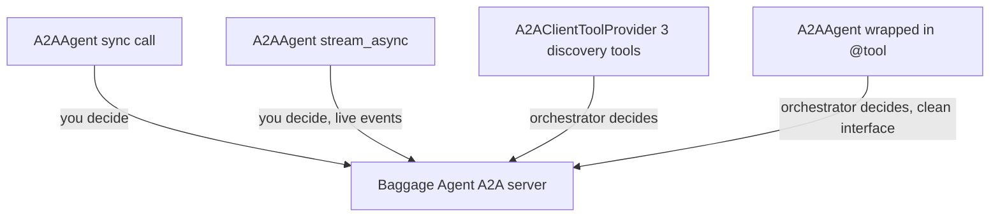
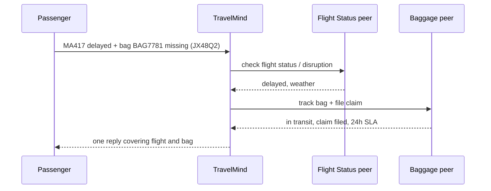

# Exercise 2: The Two-Agent Handshake

**Type:** Comprehensive | **Time:** 50 to 60 minutes | **Work:** solo or pairs

> World: A passenger on **Meridian Airways** flight MA417 just landed. Their checked bag did not. **TravelMind** has no idea how baggage works, and it should not. Baggage is a specialist's job. Your task: build that specialist as an A2A agent, then learn every way TravelMind can talk to it.

By the end you will have built one peer and consumed it four ways, from fully manual to fully autonomous. This is the core A2A muscle.

---

## Learning goals

- Stand up a working A2A server with real skills
- Call a peer synchronously and read its result
- Stream from a peer and handle the event shape correctly (the trap that wastes hours)
- Hand an orchestrator the discovery tools and let it call on its own
- Wrap a peer as one clean tool and route a mixed request across two peers

---

## Setup

```bash
pip install -q 'strands-agents[a2a]' 'strands-agents-tools[a2a_client]'
```

| Need | Value |
|---|---|
| Model | `us.anthropic.claude-haiku-4-5-20251001-v1:0` (inference profile, not bare model id) |
| Region | `us-east-1`, AWS account `452203592848` |
| Credentials | required from Tier C onward (the peer calls a model) |
| Reference | `01_A2A_with_Strands.ipynb`, Parts A and B |

Reminder: the bare model id `anthropic.claude-haiku-...` throws `ValidationException`. Keep the `us.` prefix.

---

## The four ways to talk to a peer



Same peer. Control moves from you to the orchestrator as you go down the list.

---

## Task ladder

Everyone starts at Tier C. Climb as far as your time and confidence allow. Higher tiers are open to all, never locked.

### Tier C: Build it and call it (Base)

Build a **Baggage Agent** A2A server with two skills:

| Tool | Signature | Returns |
|---|---|---|
| `track_bag` | `track_bag(tag_id: str)` | tag, current location, status |
| `file_claim` | `file_claim(pnr: str)` | pnr, a claim id, an SLA in hours |

Use mock return values. Decorate both with `@tool` or your card ships empty.

Then, as a client, call it **once synchronously** to ask about bag tag `BAG7781` and read the answer.

**Requirements**
- `baggage_server.py` boots on `127.0.0.1:9000`
- Its Agent Card lists both skills
- A client script or cell makes one sync `A2AAgent` call and prints `result.message`

**Bounded done:** the card shows both baggage skills, and a single synchronous call returns a sensible plain-language answer about the bag. You did not stream and you did not use an orchestrator yet.

### Tier B: Stream it, then let it discover (Stretch)

Add two more consumption styles against the same running server.

1. **Streaming.** Call the peer with `stream_async` and print the final answer. The shape, confirmed from the SDK:

   ```
   {"type": "a2a_stream", "event": <A2A object>}   # zero or more
   {"result": AgentResult}                          # always LAST
   ```

   The final answer lives in the **last** event under `event["result"].message`. It is **not** under `event["data"]`. Branch on `event.get("type")` first.

2. **Tool provider.** Build an orchestrator agent, give it `A2AClientToolProvider(known_agent_urls=[...]).tools`, and ask it in plain English to discover the agent and check bag `BAG7781`. Let the model decide when to call `a2a_discover_agent` and `a2a_send_message`.

**Bounded done:** streaming prints the same answer as the sync call, sourced from the last event. The tool-provider orchestrator discovers the peer on its own and reports the bag status without you naming any tool by hand. You can say in one line how "you decide" (sync/stream) differs from "the model decides" (tool provider).

### Tier A: Two peers, one mixed request (Advanced)

Wrap the baggage peer as a single clean `@tool` (give the `A2AAgent` a `name`). Then bring in the **Flight Status agent** from Exercise 1 as a second peer, also wrapped as a tool.

Build a **TravelMind** orchestrator holding both peer-tools. Hand it one mixed request:

> "I'm on MA417, it was delayed, and my checked bag BAG7781 never arrived. Booking JX48Q2. What's going on and what happens to my bag?"

TravelMind must call **both** peers and compose one warm reply.

**Production angle (required at Tier A):** make the orchestrator degrade gracefully when a peer is unreachable. Stop one peer, send the request again, and confirm TravelMind still answers about the reachable peer instead of crashing.



**Bounded done:** one passenger request fans out to two peers and returns a single coherent answer. With one peer stopped, the reply still helps the passenger on the other concern and names what it could not reach. No stack trace reaches the user.

### Bonus (any finisher)

Pick one:

- Have `file_claim` return a structured **Artifact** (a claim record) and make TravelMind quote the claim id back to the passenger.
- Stream TravelMind's own progress so the passenger sees "checking your flight... now your bag..." instead of one silent pause.
- Add a third peer (a Loyalty agent that credits goodwill miles for the delay) and route to all three.

---

## LLM-integrated task (required, pass or fail)

An agent's `description` and `system_prompt` are how other agents find and trust it. Vague text breaks discovery.

1. Ask the model to draft the Baggage Agent's `description` (the one in the Agent Card) and its `system_prompt`.
2. Paste the prompt you used and the model's raw output into your reflection.
3. Name **two** ways the draft is too vague for another agent to route to correctly. Example weakness: "handles baggage issues" tells a router nothing about whether it tracks by tag, by PNR, or files claims.
4. Show your corrected version that a routing agent could actually match against.

You pass this task only if all four parts are present: prompt, raw output, two named weaknesses, corrected version.

---

## Reflection (4 lines)

- Which of the four consumption styles would you ship for a high-traffic production path, and why?
- The tool provider gives the model three generic tools. The `@tool` wrapper gives it one named tool. When is each the right call?

---

## Skeptic's corner

"This is just an HTTP call wrapped in ceremony. Why not let TravelMind import the baggage function directly?" Because the day the baggage team rewrites their service in Go, redeploys it behind their own scaling, or a second airline reuses it, the import breaks and the A2A contract does not. You are paying a small tax now to avoid a rewrite later. If baggage will never leave your repo, the skeptic is right and you should keep it in-process. That judgment is exactly Exercise 3.

---

<details>
<summary><b>Answer Key</b></summary>

### Solution shape

**Server (Tier C):**

```python
from strands import Agent, tool
from strands.multiagent.a2a import A2AServer
from strands.models import BedrockModel

@tool
def track_bag(tag_id: str) -> dict:
    """Track a checked bag by its tag id. Returns current location and status."""
    return {"tag": tag_id, "location": "MA417 transfer belt 3", "status": "IN_TRANSIT"}

@tool
def file_claim(pnr: str) -> dict:
    """File a lost or delayed baggage claim for a booking. Returns a claim id and SLA."""
    return {"pnr": pnr, "claim_id": "CLM-" + pnr, "sla_hours": 24}

agent = Agent(name="Baggage Agent",
              description="Tracks checked baggage by tag id and files lost or delayed baggage claims by PNR for Meridian Airways.",
              model=BedrockModel(model_id="us.anthropic.claude-haiku-4-5-20251001-v1:0"),
              tools=[track_bag, file_claim], callback_handler=None)
A2AServer(agent=agent).serve()
```

**Sync client (Tier C):**

```python
from strands.agent.a2a_agent import A2AAgent
peer = A2AAgent(endpoint="http://127.0.0.1:9000")
print(peer("Where is bag BAG7781 and what's its status?").message)
```

**Streaming (Tier B):**

```python
import asyncio
from strands.agent.a2a_agent import A2AAgent
async def run():
    peer = A2AAgent(endpoint="http://127.0.0.1:9000")
    final = None
    async for event in peer.stream_async("Track bag BAG7781."):
        if event.get("type") == "a2a_stream":
            pass                       # raw protocol event under event["event"]
        elif "result" in event:        # LAST event
            final = event["result"].message
    print(final)
asyncio.run(run())
```

**Tool provider (Tier B):**

```python
from strands import Agent
from strands.models import BedrockModel
from strands_tools.a2a_client import A2AClientToolProvider
provider = A2AClientToolProvider(known_agent_urls=["http://127.0.0.1:9000"])
orch = Agent(model=BedrockModel(model_id="us.anthropic.claude-haiku-4-5-20251001-v1:0"),
             tools=provider.tools, callback_handler=None)
print(orch("Discover the agent at the known URL and check bag BAG7781.").message)
```

**Agent-as-tool wrapper and graceful degradation (Tier A):**

```python
from strands import tool
from strands.agent.a2a_agent import A2AAgent

baggage = A2AAgent(endpoint="http://127.0.0.1:9000", name="baggage_agent")

@tool
def ask_baggage(question: str) -> str:
    """Delegate baggage tracking or claims to the Baggage agent."""
    try:
        return str(baggage(question).message)
    except Exception as e:
        return f"Baggage service unreachable right now: {e}"   # degrade, do not crash
```

The `try/except` returning a string is the simplest correct degrade pattern. The orchestrator reads the apology string as a normal tool result and works around it.

### Three common errors

1. **Empty skills again.** Carryover from Exercise 1. They forget `@tool`. The card is the tell.
2. **Streaming returns nothing.** They check `event["data"]` (from stale tutorials), never hit it, and print `None`. Point them to the printed event keys: the payload is `event["event"]`, the final answer is `event["result"]`, emitted last.
3. **Tier A crashes when a peer is down.** They call `baggage(...)` with no guard. The unhandled exception aborts the whole orchestrator turn. The fix is catching it inside the tool so the model sees a graceful string.

### Five discussion prompts

- Why does `stream_async` yield raw protocol events instead of text deltas like a normal agent?
- The tool provider exposes three tools. What is the cost of that generality versus a purpose-named wrapper?
- Where should the retry-on-throttle logic live: in the tool wrapper, the orchestrator, or the peer?
- If two peers both claim a `track_bag` skill, how does the orchestrator choose?
- What belongs in an Agent Card description so a router picks you and not a sibling agent?

### Five viva questions (easy to hard)

1. Name the four ways to consume an A2A peer shown here.
2. In streaming, which event carries the final answer and what key holds it?
3. Why must tools be decorated for them to appear as skills?
4. Your orchestrator must call a peer that is sometimes down. Where do you put the guard and what does the model see when it fires?
5. You have a peer wrapped as a tool and the same peer reachable via the tool provider. A teammate says "pick one for the whole system." What do you tell them and why?

### Timing

Tier C ~25 min, Tier B ~15 min, Tier A ~15 min.
</details>
