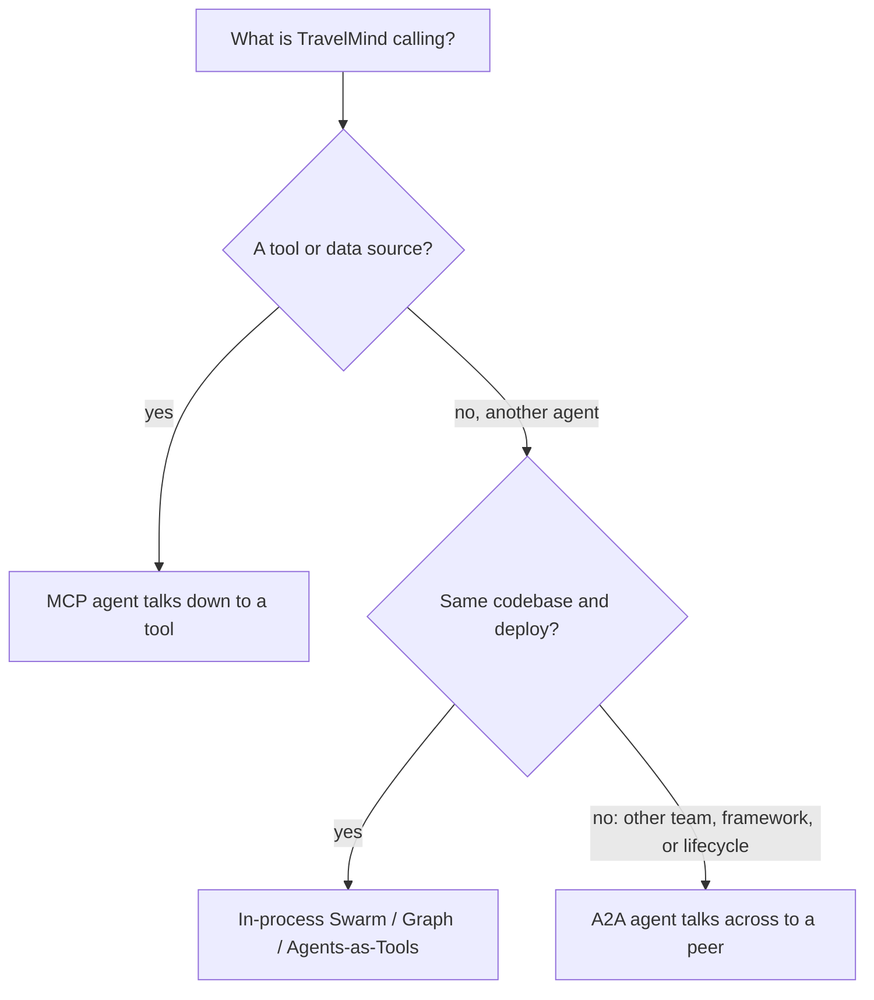
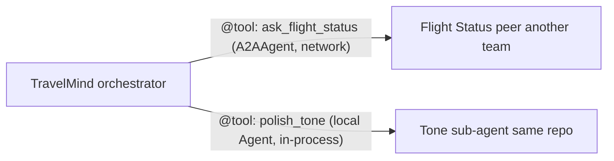
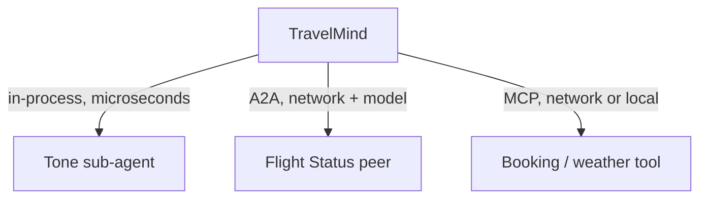

# Exercise 3: Right Tool, Right Job

**Type:** Comprehensive | **Time:** 50 to 60 minutes | **Work:** solo or pairs

> World: **Meridian Airways** is putting TravelMind through architecture review. The room is full of engineers who reach for A2A on instinct. Your job is to prove you know when A2A is the right call and when it is expensive ceremony, then build a system that mixes three coordination styles correctly.

A2A is a network protocol with real cost: HTTP hops, serialization, separate deploys, auth. Reaching for it when a function call would do is a classic over-engineering tell. This exercise is about judgment first, code second.

---

## Learning goals

- Classify any agent interaction as A2A, in-process multi-agent, or MCP, with a defensible reason
- See that an in-process sub-agent and an A2A peer can look identical as tools yet differ in cost and ownership
- Build a hybrid: one in-process sub-agent, one A2A peer, one MCP tool, coordinated by one orchestrator
- Reason about which hop is slowest and which can fail

---

## The decision, in one picture



The honest rule from the session: **stay in-process until an organizational or deployment wall forces you out. When it does, A2A is the door. For tools and data, the answer is MCP, not A2A.**

---

## Setup

```bash
pip install -q 'strands-agents[a2a]' 'strands-agents-tools[a2a_client]'
```

| Need | Value |
|---|---|
| Model | `us.anthropic.claude-haiku-4-5-20251001-v1:0` |
| Region | `us-east-1`, account `452203592848` |
| Credentials | required from Tier B onward |
| Reference | A2A deck Part 5, plus `01_A2A_with_Strands.ipynb` |

You will reuse the **Flight Status agent** from Exercise 1 as a real A2A peer. Have it ready to boot.

---

## Task ladder

### Tier C: Classify six interactions (Base)

No code. Here are six real things TravelMind needs to do. For each, pick **A2A**, **In-process**, or **MCP**, and write a one-line reason.

| # | Interaction | Your call | One-line reason |
|---|---|---|---|
| 1 | Polish its final reply for tone and empathy before sending | ? | ? |
| 2 | Get live flight status from the Operations team's agent, built in a different framework | ? | ? |
| 3 | Look up the passenger's booking in the reservations database | ? | ? |
| 4 | Run its own internal steps (read intent, plan, draft) that always ship together | ? | ? |
| 5 | Request a refund decision from the Finance team's refund agent, which scales and deploys on its own | ? | ? |
| 6 | Fetch the destination city's current weather from a public weather service | ? | ? |

Two of these are traps. One sounds like a peer but is really a local sub-step. One sounds like calling a service but is really data access.

**Bounded done:** all six classified with a one-line reason each. You can defend the two trap rows out loud.

### Tier B: Build the in-process piece and the A2A piece (Stretch)

Implement two rows from your table, and notice they look the same to TravelMind even though they are not.

1. **In-process sub-agent (row 1).** Build a small "tone polisher" as a Strands `Agent`, wrap it as a `@tool`. It rewrites a blunt message into a warm one. Same process, same repo, no network.

2. **A2A peer (row 2).** Wrap the Flight Status agent's `A2AAgent` as a `@tool`. This one crosses the network to a peer the Operations team owns.

Give TravelMind both tools. Send: "MA417 looks delayed, tell the passenger gently." Watch it call the peer for facts, then the local sub-agent for tone.



**The lesson to write down:** both are `@tool` to TravelMind. One is an `A2AAgent` reaching across the network. The other is a local `Agent` running in the same process. The interface hides a real difference in latency, ownership, and failure.

**Bounded done:** one request triggers both a network peer call and an in-process sub-agent call, and the difference between the two tools is one network hop. You can point to the line in each tool that proves which is which.

### Tier A: Add MCP and reason about the seams (Advanced)

Add the third style. Give TravelMind an **MCP-style tool** for row 3 or row 6 (booking lookup or destination weather). This is agent-to-tool, the vertical axis, distinct from the agent-to-agent peer call.

You may stand up a real MCP tool if you have one handy, or use a local function that stands in for the MCP boundary. The point at this tier is the **classification and the seam analysis**, not MCP plumbing.

Then write a short **seam note** (8 to 12 lines):

- Of the three calls (in-process, A2A peer, MCP tool), which is slowest and why?
- Which can fail independently, and what does TravelMind do when each fails?
- If traffic spikes 10x, which seam breaks first?



**Bounded done:** TravelMind coordinates all three styles in one request, and your seam note correctly identifies the slowest hop and a failure response for each. The note shows you understand cost, not just wiring.

### Bonus (any finisher)

Pick one and write half a page:

- Find one row in your Tier C table that you classified as A2A but that a sharp reviewer could argue should be in-process. Defend collapsing it.
- Take an in-process row and describe the exact organizational change that would force it to become an A2A peer. Be specific about who owns what.

---

## LLM-integrated task (required, pass or fail)

Models love to over-recommend A2A and sometimes blur MCP and A2A.

1. Ask the model to classify all six interactions and justify each.
2. Paste the prompt and the model's raw answer.
3. Find at least **one** classification or justification where the model is wrong or weak. Common failures: calling the booking lookup "A2A" because it sounds like a service, or recommending A2A for the tone step "for modularity."
4. Write the corrected classification with the reasoning the model missed.

Pass requires all four: prompt, raw answer, the flagged error, the correction.

---

## Reflection (4 lines)

- What does A2A cost that an in-process call does not? Name three things.
- "Microservices but for agents" is a common dismissal of A2A. Where is it fair, and where does it miss?

---

## Skeptic's corner

"If everything is Python in one repo today, A2A buys nothing." Correct, and you should say so in review. A2A earns its cost the moment a second team ships an agent in a second framework, or an agent must scale on its own lifecycle. The skill is not knowing the protocol. It is knowing the day it stops being premature.

---

<details>
<summary><b>Facilitator notes (do not project)</b></summary>

### Answer key (Tier C)

| # | Correct | Why |
|---|---|---|
| 1 | In-process | A reasoning sub-step in the same repo, latency-sensitive, no independent owner. Use Agents-as-Tools. Trap: sounds like it could be a peer. |
| 2 | A2A | Different team, different framework, its own deploy. Textbook peer. |
| 3 | MCP | This is data access, not an agent. Agent talks down to a tool. Trap: "look up in a service" tempts an A2A answer. |
| 4 | In-process | Internal steps that always ship together. Graph or Swarm in one codebase. |
| 5 | A2A | Different team, independent scaling and deploy. Peer. |
| 6 | MCP | A tool and data source, not an agent. Vertical, not horizontal. |

Net: 2 MCP, 2 in-process, 2 A2A. The two traps are rows 1 and 3.

### Solution shape (Tier B)

```python
from strands import Agent, tool
from strands.models import BedrockModel
from strands.agent.a2a_agent import A2AAgent

MODEL = "us.anthropic.claude-haiku-4-5-20251001-v1:0"

# In-process sub-agent, wrapped as a tool (Agents-as-Tools). No network.
_tone = Agent(model=BedrockModel(model_id=MODEL),
              system_prompt="Rewrite the given message to be warm and reassuring. Keep all facts.",
              callback_handler=None)

@tool
def polish_tone(message: str) -> str:
    """Rewrite a blunt message into a warm, reassuring one. Runs in-process."""
    return str(_tone(message).message)

# A2A peer, wrapped as a tool. Crosses the network.
_flight = A2AAgent(endpoint="http://127.0.0.1:9000", name="flight_status_agent")

@tool
def ask_flight_status(question: str) -> str:
    """Ask the Operations team's Flight Status peer about a flight. Network call over A2A."""
    try:
        return str(_flight(question).message)
    except Exception as e:
        return f"Flight status peer unreachable: {e}"

travelmind = Agent(name="TravelMind", model=BedrockModel(model_id=MODEL),
                   tools=[ask_flight_status, polish_tone], callback_handler=None)
print(travelmind("MA417 looks delayed, tell the passenger gently.").message)
```

The teaching beat: both decorated functions are tools. `polish_tone` calls a local `Agent`. `ask_flight_status` calls an `A2AAgent` over HTTP. Identical interface, different world.

### Seam note model answer (Tier A)

- Slowest: the A2A peer call. It is a network round trip plus a model inference on the other side. The MCP tool is next if it is remote. The in-process sub-agent is fast but still pays one model inference; if the sub-agent did pure string work it would be microseconds.
- Independent failure: the A2A peer can be down or throttled (guard with try/except, degrade to "I can't reach flight status right now"). The MCP tool can time out (return a safe default or skip). The in-process sub-agent fails only if your own process fails.
- 10x traffic: the A2A peer breaks first because it is a shared dependency you do not own. Watch for `-32503` throttling. The MCP data source is next. In-process scales with your own fleet.

### Three common errors

1. Classifying row 3 or row 6 as A2A. Anchor them: "Is the thing on the other end an agent that reasons, or a tool that returns data?"
2. Classifying row 1 as A2A "for modularity." Modularity does not require a network boundary. Ownership and deploy lifecycle do.
3. At Tier B, students cannot articulate the difference between the two tools because the code looks the same. That is the point. Make them read the body of each tool and name `Agent` versus `A2AAgent`.

### Five discussion prompts

- Name a real cost A2A adds that Agents-as-Tools does not.
- Why is calling a database an MCP concern and not an A2A concern?
- Two teams own two agents that must cooperate. What breaks if you wire them in-process instead of A2A?
- When does "modularity" justify a network boundary and when is it cargo cult?
- Could the tone sub-agent ever become an A2A peer? What would have to change?

### Five viva questions (easy to hard)

1. A2A, in-process, or MCP: TravelMind reads a passenger's seat assignment from the booking system. Which, and why?
2. Name two things A2A costs that an in-process call does not.
3. Your in-process sub-agent and your A2A peer are both `@tool`. How do you tell them apart in code?
4. Traffic spikes 10x. Which of your three seams fails first and what error do you watch for?
5. Defend this claim or refute it: "We should make every sub-agent an A2A peer so the architecture is future-proof."

### Timing

Tier C ~15 min and is the heart of the exercise; do not let strong students skip it for code. Tier B ~20 min. Tier A ~20 min, most of which is the written seam note. The seam note is where the judgment shows; grade it harder than the wiring.
</details>
