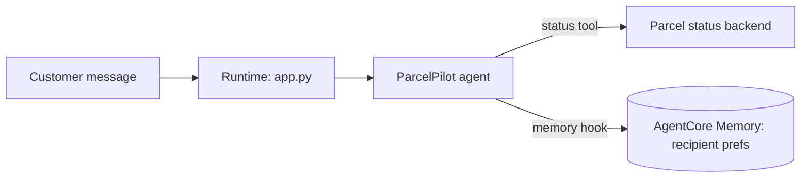

# Mid-Session Exercise A — “ParcelPilot”

**Follows:** notebooks 01–03 (build an agent three ways · Runtime · Memory)
**Format:** two parts — Part 1 is thinking only (no code), Part 2 is build
**Time box:** ~55 min total · Part 1 ~18 min · Part 2 ~37 min
**Assumes you can already:** create a Strands `Agent` with a `@tool`, wrap it in `BedrockAgentCoreApp`, deploy with `Runtime()`, attach AgentCore Memory.
**Region / models:** us-east-1 · Haiku 4.5 for the agent.

> Different domain from TravelMind on purpose. Copying the capstone won’t fit. Design for *this* problem.

---

## Scenario

**Company:** ParcelPilot, a last-mile delivery startup.
**Your role:** solutions engineer embedded with the support team.
**The pain:** every time a customer messages, agents re-ask the same things — “where should we leave it?”, “which gate?”, “call on arrival?”. Customers hate repeating themselves, and handle time is high. Leadership wants an assistant that **remembers each recipient’s delivery preferences** and answers basic **parcel-status** questions.

That’s the whole brief you were handed. It is deliberately thin. Expanding it is the first half of your job.

---

## The problem to expand

“Build an agent that remembers delivery preferences and answers status questions.”

A sentence is not a spec. Before any code, turn it into something a teammate could build from.

---

## Part 1 — Design & brainstorm (no code, ~18 min)

Work on paper, a whiteboard, or a doc. Produce these seven deliverables.

1. **Job decomposition.** List every distinct job the agent must do. For each, mark **tool** (needs data/action) or **model-only** (reasoning/phrasing). Example to get you started: *look up parcel status* → tool; *phrase a polite update* → model.

2. **Tool design.** Define the one or two tools you need: name, inputs, and the exact output shape (a dict with which fields?). State what is **mocked today** and what becomes a **real backend** later.

3. **Memory model — the key decision.**
   - What belongs in **short-term** (this conversation) vs **long-term** (across conversations)?
   - Which preferences are durable long-term facts? Pick the **strategy** (`userPreferenceMemoryStrategy`? `semanticMemoryStrategy`?) and a **namespace template** using `{actorId}`.
   - On a brand-new conversation, what exactly should the agent recall *before* the customer types anything?

4. **Invocation contract.** Define the request payload (which keys) and the response shape. Decide: **who is `actor_id`** in a delivery context — the recipient, the address, the account? Justify it.

5. **Conversation design.** Write the agent’s **system prompt in plain English**: its scope, tone, and the rule for *when* to use remembered preferences vs ask.

6. **Acceptance checks.** Write **three concrete checks a non-technical PM could verify** by chatting with it (e.g., “Returning customer is not asked for their drop spot again”).

7. **Architecture sketch.** Draw it as a simple diagram, e.g.:

**Skeptic prompts — answer at least two in writing:**
- What happens on the **very first** message from a new recipient (cold memory)? Does the agent break, or degrade gracefully?
- Two people share one address but want **different** drop spots. Does your `actor_id` choice handle that, or quietly mix them up?
- What should **never** go in memory? (Think payment details, one-off instructions, anything that shouldn’t persist.)

**Part 1 is “done” when:** a peer could pick up your seven deliverables and start building without asking you a clarifying question.

---

## Part 2 — Build (code / agent actions, ~37 min)

Layered. Do your band; reach up if you finish.

### Base — everyone
Implement the agent in Strands with your status tool, and test it locally (plain Python call, no deploy).
- Use Haiku 4.5 (`us.anthropic.claude-haiku-4-5-20251001-v1:0`).
- **Bounded done:** asking “what’s the status of parcel PP-1234?” returns a correct answer that used the tool.

### Stretch
Wrap the agent in `BedrockAgentCoreApp` with an `@app.entrypoint` that honors **your** payload contract, and test the container locally.
- **Bounded done:** `curl /ping` is healthy and `curl /invocations` with your payload returns the agent’s answer.

### Advanced
Add a **memory hook** that preloads recipient preferences on init and persists turns. Demonstrate cross-session recall.
- Run two *separate* conversations (two `session_id`s) for the **same** `actor_id`. In conversation 1 the customer states a drop preference; in conversation 2 the agent honors it **without being told again**.
- **Bounded done:** the preference set in session 1 is recalled in session 2.

**Run it (essentials — full steps in NB0/NB2):**
- *VS Code:* activate the venv → set creds (`aws configure` or env vars) → select the `Python (agentcore)` kernel.
- *Colab:* `pip install -r requirements.txt` → credentials via Colab secrets/env vars → run.
- *Production note (write as a comment, don’t implement):* `actor_id` must be a stable id, secrets never hardcoded, `MEMORY_ID` injected via env.

**You may not:** paste the TravelMind capstone and rename it. The tools, memory namespace, and contract must be yours, designed in Part 1.

---

## LLM-integrated task (pass/fail — required)

Send your agent a **vague** request: just “my parcel?”.
- Paste the prompt and the agent’s response.
- Name **one** weakness (assumed the wrong parcel? ignored memory? asked too much?).
- **Rewrite the system prompt** to fix it, and paste the improved response.

Pass = you show the before, the diagnosis, and a genuinely better after.

---

## Reflection & viva-readiness

Be ready to answer in ~2 minutes each:
- Within a Runtime session the agent already “remembers” via the warm microVM. **Why does that not remove the need for AgentCore Memory?**
- Where did you draw the **short-term vs long-term** line, and what made a fact “long-term”?
- What would start failing at **1,000 concurrent customers**? (You’ll fix exactly this in the production session.)

---

## Self-check rubric (100 pts — formative)

| Area | What earns full marks | Pts |
|---|---|---|
| Problem expansion (Part 1) | Seven deliverables, clear and buildable; skeptic prompts answered | 30 |
| Tool correctness | Tool has a sane input/output; agent actually calls it | 20 |
| Memory model & wiring | STM/LTM line justified; correct strategy + namespace; hook works | 25 |
| Cross-session recall demonstrated | Preference set in one session recalled in another | 15 |
| LLM-integrated reflection | Real weakness found and genuinely fixed | 10 |

---

## Facilitator & TA notes (appendix — not for the learner sheet)

**Expected approach (solution shape, not code):** one `@tool get_parcel_status(tracking_id)` returning a status dict; agent on Haiku; `BedrockAgentCoreApp` entrypoint reading `{prompt, actor_id, session_id}`; a `userPreferenceMemoryStrategy` under `parcelpilot/{actorId}/preferences`; a memory hook that retrieves on `AgentInitializedEvent` and writes on `MessageAddedEvent`. `actor_id` = recipient identity (not raw address), which is what resolves the shared-address trap.

**Three common confusions + unstick hints (give hints, not answers):**
- *“Memory returns nothing right after I write it.”* → Ask: which read is immediate vs which is async? (STM `get_last_k_turns` vs LTM `retrieve_memories`.)
- *Read namespace ≠ write template.* → Ask them to print the resolved namespace for one actor and compare to the strategy template.
- *Wrong `actor_id` granularity.* → Ask: “If two people share this address, who gets the drop preference?”

**Three discussion prompts:** What’s the cost of remembering the *wrong* thing? · When is asking better than recalling? · How would you let a customer reset their preferences?

**Spot-check (30 sec):** have them invoke session 2 live and show the recalled preference. If it doesn’t recall, ask them to walk the namespace, not the code.
