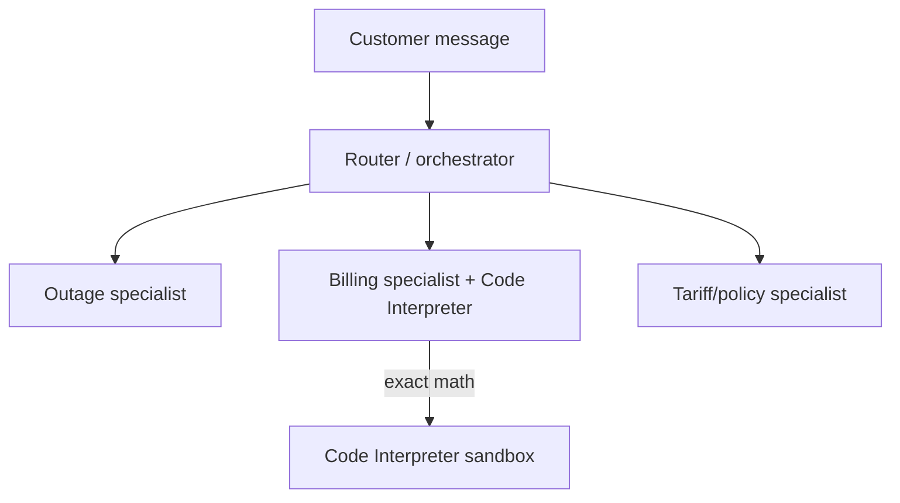

# Mid-Session Exercise B — “VoltDesk”

**Follows:** notebooks 04–05 (Tools & Identity · Multi-agent orchestration)
**Format:** Part 1 thinking only (no code), Part 2 build
**Time box:** ~60 min total · Part 1 ~20 min · Part 2 ~40 min
**Assumes you can already:** give an agent the Code Interpreter tool, reason about Gateway/Identity, and build at least one multi-agent pattern (agents-as-tools / graph / swarm).
**Region / models:** us-east-1 · Haiku 4.5 for specialists · Sonnet 4.5 if you use an orchestrator.

> New domain again. The point is to *choose* an orchestration pattern with justification, not to reuse one by reflex.

---

## Scenario

**Company:** VoltDesk, the support arm of a regional electricity utility.
**Your role:** AI solutions engineer.
**The pain:** customer messages arrive mixed and urgent — *“is the power out in my area?”*, *“my bill doubled, why?”*, *“what’s this new tariff?”*. One generalist bot does all three badly: it fabricates outage info, gets bill math wrong, and waffles on tariff rules. Leadership wants **specialists** behind one assistant, and the **billing answers must be numerically exact**.

Thin brief. Expand it.

---

## The problem to expand

“Route utility questions to the right specialist, and never get the bill math wrong.”

---

## Part 1 — Design & brainstorm (no code, ~20 min)

Produce these deliverables.

1. **Identify the specialists.** Name them, give each a one-line brief and its tools. At minimum you’ll have an **outage** specialist, a **billing** specialist, and a **tariff/policy** specialist. State what each is forbidden from answering.

2. **Pick the orchestration pattern — and defend it.** Choose one: agents-as-tools, sequential graph, conditional/parallel graph, or swarm. Write **three sentences** justifying the choice against the alternatives. Use these lenses: Is the routing predictable? Do any branches run in parallel? Is the sequence known up front? How hard is it to debug? (This mirrors the pattern-chooser from notebook 05.)

3. **Where computation must be exact.** Billing cannot be vibes. Identify every place a number is produced and decide which must run in the **Code Interpreter** rather than the model’s head. Write the **proration formula** you’ll have it compute, for example a mid-cycle tariff change:

$$
\text{bill} = \frac{\text{old rate} \times d_{\text{old}} + \text{new rate} \times d_{\text{new}}}{1} \times \text{kWh per day}
$$

(Define your own variables; the point is to commit to an exact formula, not approximate it.)

4. **Outage data — make it real (or honestly mock it).** Decide the outage specialist’s source. Two honest options:
   - **Mock** a status function now (fine for the session), or
   - **Stretch:** call a **real, free public API** to add signal — e.g., a public weather API such as Open-Meteo (no key) to check whether a storm correlates with the outage. Read that API’s own docs for the endpoint; don’t guess it.
   Note which you chose and why.

5. **Identity plan (design only).** Suppose the billing specialist must call the **real** billing system, which needs an API key. Describe how you’d handle that **without hardcoding the secret**: which credential-provider type, and which decorator injects it at runtime (`@requires_api_key` vs `@requires_access_token`). One paragraph.

6. **Routing contract.** What does a request look like, and how does the system decide the path? If you chose a graph with a classifier, write the classifier’s **one-line instruction**.

7. **Architecture sketch.**

**Skeptic prompts — answer at least two:**
- A message is **both** an outage report **and** a billing complaint. Does your pattern handle multi-intent, or does it pick one and drop the other?
- Why not just let the model do the arithmetic? Give the failure you’re preventing.
- Swarm is tempting because it feels “smart.” Name one concrete reason it’s **worse** here than a graph.

**Part 1 is “done” when:** your pattern choice is defended in writing and every number in the system has an owner (model vs Code Interpreter).

---

## Part 2 — Build (code / agent actions, ~40 min)

### Base — everyone
Build the **billing specialist** as a Strands agent with the **Code Interpreter** tool, and prove the math.
- Give it a prorated-bill question with specific numbers; it must run code and return the **exact** figure.
- **Bounded done:** the returned number matches a hand check, and you can see it computed (not guessed).

### Stretch
Add the other two specialists and wire your chosen **orchestration pattern** (agents-as-tools or a `GraphBuilder` graph).
- Send a mixed message and show it reaches the right specialist(s).
- **Bounded done:** for a billing question the billing agent answers; for an outage question the outage agent answers; you can read which ran (`execution_order` for a graph, or the orchestrator’s tool calls).

### Advanced
Make one branch real or parallel:
- **Either** call a real public API in the outage specialist (read its docs for the endpoint),
- **or** build a conditional graph where a disruption fans out to **two specialists in parallel** (e.g., outage + billing-credit), then joins.
- **Bounded done:** the real call returns live data, **or** two nodes are shown running in parallel.

**Run it (essentials — full steps in NB0/NB2/NB4):**
- *VS Code:* venv → creds → `Python (agentcore)` kernel; for the Browser/real-API path, `pip install` what the API client needs.
- *Colab:* `pip install` deps → creds via secrets → run.
- *Production note (comment only):* the real billing key goes in a credential provider, injected via `@requires_api_key`; never in the notebook.

**You may not:** answer billing with the model alone. If a number isn’t computed in the Code Interpreter, the Base task is not met.

---

## LLM-integrated task (pass/fail — required)

Ask your **generalist** (or a single specialist) a billing question **without** the Code Interpreter, and capture the answer. Then ask the Code-Interpreter version the same question.
- Paste both answers.
- Show where the no-code version is wrong or unverifiable.
- State the one-line rule this proves about agents and arithmetic.

Pass = you demonstrate the difference concretely, not just assert it.

---

## Reflection & viva-readiness

- Why did you pick your orchestration pattern, and what would make you switch?
- What exactly does the Code Interpreter buy you that a bigger model would not?
- Where would Identity (outbound auth) enter this system in production, and why is hardcoding the key unacceptable?

---

## Self-check rubric (100 pts — formative)

| Area | What earns full marks | Pts |
|---|---|---|
| Pattern choice defended (Part 1) | Specialists named; pattern justified vs alternatives in writing | 25 |
| Exact computation isolated | Every number owned by model vs Code Interpreter; formula committed | 20 |
| Billing math correct & visibly computed | Returned figure matches hand check, computed in sandbox | 20 |
| Orchestration works | Right specialist(s) reached; you can show the path | 20 |
| Reflection (LLM-integrated) | Concrete no-code-vs-code contrast shown | 15 |

---

## Facilitator & TA notes (appendix — not for the learner sheet)

**Expected approach (shape, not code):** three Haiku specialists with `name`s and narrow prompts; billing agent gets `AgentCoreCodeInterpreter(...).code_interpreter`; orchestration via agents-as-tools (Sonnet coordinator) or a `GraphBuilder` with a classifier node and conditional edges. Advanced parallel path = two conditional edges from the classifier with the same condition. Real API path is optional and should be kept behind a try/except so a flaky network degrades, not crashes.

**Three common confusions + unstick hints:**
- *Model “does” the math anyway.* → Ask them to inspect whether a tool call actually happened; if not, the prompt must instruct the agent to compute with code.
- *Swarm chosen for the wrong reason.* → Ask: “What’s your debugging story when it loops?” Steer toward a graph for predictable routing.
- *Conditional edges never fire.* → Have them print the classifier node’s output and confirm the condition reads `state.results["classifier"]`.

**Three discussion prompts:** When is one good generalist cheaper and better than three specialists? · What’s the latency cost of each extra hop? · How would you test that routing is correct at scale?

**Spot-check (30 sec):** ask for one billing number live and have them show it was computed in the sandbox, then ask which pattern they chose and why in one breath.
