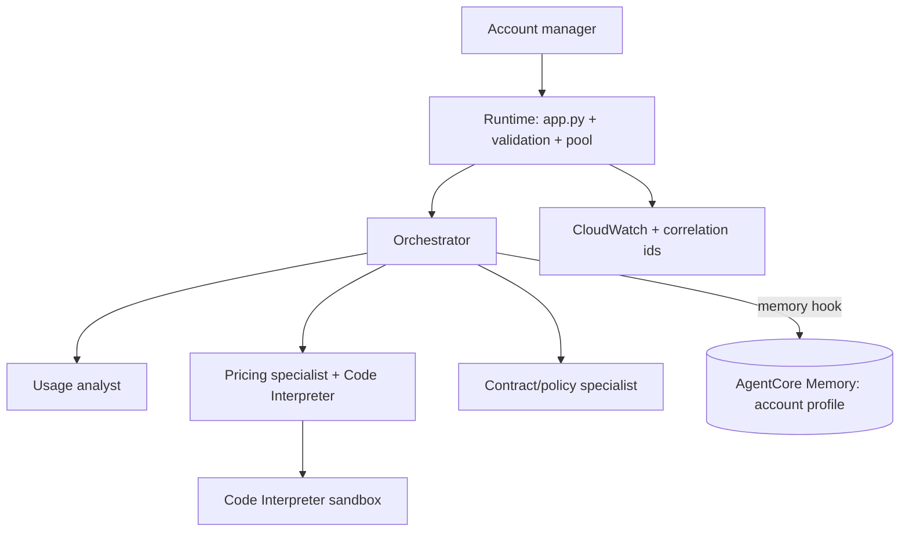

# End-Session Exercise — “RenewQ” (combine the day)

**Follows:** the full day (notebooks 01–07)
**Format:** Part 1 design (no code), Part 2 build — this is the integrative one
**Time box:** ~90 min total · Part 1 ~28 min · Part 2 ~52 min · reflection ~10 min
**Pulls together:** building an agent, Runtime deployment, Memory, the Code Interpreter, multi-agent orchestration, and at least one production-hardening pattern.
**Region / models:** us-east-1 · Haiku 4.5 (specialists) · Sonnet 4.5 (orchestrator).

> This is a small but complete system you **design then build**. Treat Part 1 like a mini-PRD. The grader cares as much about your reasoning as your code.

---

## Scenario

**Company:** RenewQ, a B2B SaaS platform selling seat-based subscriptions.
**Your role:** AI solutions engineer building an internal assistant for account managers (AMs).
**The pain:** at renewal time an AM has to pull the account’s usage, work out a renewal quote (list price, overages, loyalty and multi-year discounts, sometimes a currency conversion), and check the contract’s notice terms — across three systems, under time pressure, often getting the math or the terms subtly wrong. Renewals slip and quotes are inconsistent.

**What they want:** one assistant an AM can ask — *“prep the renewal for Acme”* — that **remembers the account**, **computes the quote exactly**, **routes to the right specialist**, and is **reliable enough for the whole sales team to hit at once** near quarter-end.

---

## Part 1 — Design (no code, ~28 min) — write it like a PRD

Produce a short structured brief. Headers below are your sections.

**1. Problem statement & scope.** Rewrite the one-line ask into 3–5 sentences. List **non-goals** (what RenewQ explicitly will *not* do in v1). Naming non-goals is half of good scoping.

**2. Users & the core job.** Who is the actor? What does a great “prep the renewal for Acme” response contain?

**3. Specialists & tools.** Name the specialists and their tools. A sensible set: a **usage analyst** (summarize seats used, overages), a **pricing specialist** (compute the quote — exactly), a **contract/policy specialist** (renewal terms, notice window). State each one’s forbidden zone.

**4. Orchestration pattern + justification.** Choose one pattern and defend it in three sentences against the alternatives (predictable routing? parallelism? known sequence? debuggability?).

**5. Memory model.** What about an account is **long-term** (its preferences, its negotiated discount, its currency) vs **this-conversation** short-term? Choose strategy + namespace template. State what the agent recalls when an AM opens a fresh chat about Acme.

**6. Exact-math plan.** Every number lives in the **Code Interpreter**, not the model’s head. Commit to a renewal-quote formula, e.g.:

$$
\text{quote}_{\text{usd}} = (\text{list price} \times \text{seats}) \times (1 - d_{\text{loyalty}}) \times (1 - d_{\text{multiyear}}) + \text{overage charges}
$$

and, if multi-currency:

$$
\text{quote}_{\text{local}} = \text{quote}_{\text{usd}} \times \text{fx rate}
$$

Define your own variables and discount rules.

**7. Identity & secrets (design only).** The usage/pricing data really lives in a CRM/billing system behind an API key. Describe how you’d fetch it **without hardcoding the secret** (credential-provider type + which decorator injects it).

**8. Production hardening plan.** Quarter-end means the whole sales team hits this at once. From the production session, decide which apply and **commit to at least one you’ll build**: orchestrator **pool**, **retry + backoff** on throttling, **input validation**, **observability** (correlation id + token/latency logging), **guardrails**. For each chosen item, one sentence on the failure it prevents.

**9. Success metrics & risks.** Three business metrics (e.g., quote accuracy, AM time saved, renewals on time) and three technical ones (e.g., p95 latency, throttle rate, pool reuse). List the top **two risks** and your mitigation.

**10. Architecture.** One diagram showing the full system, e.g.:

**Skeptic prompts — answer at least three in writing:**
- What breaks first when 40 AMs hit RenewQ in the same hour, and which hardening item addresses it?
- An AM asks for a renewal on an account RenewQ has **never seen** (cold memory). Graceful, or broken?
- The pricing API times out mid-request. What does the AM see — a crash, or a degraded-but-useful answer?
- Why is pooling **per (account, session)** rather than per account alone? (Think conversation isolation.)

**Part 1 is “done” when:** sections 1–10 are written, your hardening choice is committed, and a teammate could build from it without asking you anything.

---

## Part 2 — Build (code / agent actions, ~52 min)

Layered. Everyone clears Base; bands set how far up you go.

### Base — everyone
The **multi-agent core** with exact pricing.
- Build the three specialists; give the pricing specialist the **Code Interpreter**; wire your chosen orchestration pattern.
- Ask it to prep a renewal with specific numbers; the quote must be **computed in the sandbox** and match a hand check.
- **Bounded done:** “prep the renewal for Acme” (with given seats/usage/discounts) returns a correct, exactly-computed quote, and you can see which specialists ran.

### Stretch
Make it a **deployed, memory-aware service**.
- Wrap it in `BedrockAgentCoreApp` with an entrypoint reading your contract (`actor_id` = account; carry a correlation id from `context.session_id`). Deploy with `Runtime()`; invoke it.
- Add a **memory hook** so a second chat about the same account recalls its profile (e.g., its negotiated loyalty discount) without being re-told.
- **Bounded done:** the deployed agent answers, and account context set in one session is recalled in another.

### Advanced
Add **one** production feature you committed to in Part 1, and **run one failure drill**.
- Implement at least one of: orchestrator **pool** (bounded LRU + TTL), **retry/backoff** on `ModelThrottledException`, **input validation** in the entrypoint, or **observability** (log correlation id + token usage per request).
- Then run **one drill** and show graceful behavior: bad input (empty prompt → clean error, no crash), specialist failure (a tool raises → partial answer), or memory off (no `MEMORY_ID` → still answers, logs “skipped”).
- **Bounded done:** the chosen hardening feature is in place **and** the drill shows the system degrading cleanly, not crashing.

**Run it (essentials — full steps in NB0/NB2/NB6/NB7):**
- *VS Code:* venv → creds (`aws configure` or env) → `Python (agentcore)` kernel.
- *Colab:* `pip install -r requirements.txt` → creds via secrets → run.
- *Production notes (comments only):* `MEMORY_ID`/`SESSION_BUCKET`/`GUARDRAIL_ID` via env vars, least-privilege execution role, secrets in Identity, retries + bounded context on by default.

**You may not:** (1) submit pricing the model produced without the Code Interpreter; (2) rename the TravelMind capstone — the domain, specialists, memory model, and contract must be RenewQ’s, designed in Part 1.

---

## LLM-integrated task (pass/fail — required)

Capture RenewQ answering “prep the renewal for Acme” **before** you added your production feature, and the orchestrator’s system prompt.
- Identify one weakness in the *response* (missed a discount? ignored recalled context? unclear quote breakdown?).
- Improve the **orchestrator system prompt** to fix it; paste the better response.
- In two sentences, separate what the **prompt** fixed from what only **architecture** (Code Interpreter, memory, pool) could fix.

Pass = before, diagnosis, after, and a clear prompt-vs-architecture distinction.

---

## Reflection & viva-readiness (be ready to defend, ~2 min each)

- Walk your architecture in 90 seconds: where does each capability from the day appear?
- Which hardening item did you build, what failure does it prevent, and what did you consciously **leave out** for v1?
- Where could RenewQ still embarrass you in front of a customer, and what’s your guardrail?
- If asked to cut cost 30% tomorrow, what’s your first move? (Think routing, caching, model tiers.)

---

## Submission

- A short **design brief** (Part 1, sections 1–10) — markdown or a doc.
- Your **code** (notebook or files) showing the core, plus the deployed/memory and hardening pieces you reached.
- The **LLM-integrated** before/after.
- A **one-paragraph executive memo**: what RenewQ does, what it’s not yet, and the one risk you’d flag to leadership. (Portfolio-ready — this is the kind of thing that reads well in an interview.)

---

## Rubric (100 pts)

| Area | What earns full marks | Pts |
|---|---|---|
| Design brief (Part 1) | Sections 1–10 present; scope + non-goals clear; ≥3 skeptic prompts answered; hardening committed | 25 |
| Pattern & memory reasoning | Pattern defended vs alternatives; STM/LTM line justified with strategy + namespace | 10 |
| Multi-agent core works | Right specialists run; you can show the path | 15 |
| Exact pricing in Code Interpreter | Quote computed in sandbox, matches hand check | 15 |
| Deployed + memory recall | Runtime invoke works; account context recalled across sessions | 12 |
| Production feature + failure drill | One hardening feature in place; one drill shows graceful degradation | 13 |
| LLM-integrated reflection | Before/after with a real prompt-vs-architecture distinction | 10 |

**Pass gate (separate from points):** the pricing number must be computed in the Code Interpreter. A model-guessed quote fails the exercise regardless of total score.

---

## Facilitator & TA notes (appendix — not for the learner sheet)

**Expected solution shape (not code):** three Haiku specialists with `name`s; pricing specialist holds `AgentCoreCodeInterpreter(...).code_interpreter`; agents-as-tools orchestrator on Sonnet (cleanest for a guided demo) or a `GraphBuilder` graph; `BedrockAgentCoreApp` entrypoint `(payload, context)` reading `{prompt, actor_id, session_id}`; `userPreferenceMemoryStrategy` under `renewq/{actorId}/profile`; memory hook on init+message. Advanced = drop in the NB7 `OrchestratorPool` keyed by `(actor, session)` **or** `call_with_retry` **or** the `validate()` guard **or** correlation-id + token logging; drill = empty-prompt validation or a tool that raises.

**Time guidance:** Base is reachable by a mid-band learner in ~30 min; Advanced should stretch a strong learner and not be finishable in <20 min. If a team is stuck at Base past ~35 min, point them at the capstone’s structure (06) for the wiring and let them keep their own domain logic.

**Five common confusions + unstick hints (hints, not solutions):**
- *Everything in one agent.* → Ask which answers a generalist gets wrong, and let that justify splitting.
- *Model does pricing.* → Ask them to show the tool call; if absent, the prompt must force code.
- *Pooling per account leaks conversations.* → Ask: “If the AM has two open chats on Acme, should they share message history?”
- *Memory recalls nothing.* → Walk the namespace, not the code; confirm async vs immediate read.
- *Hardening bolted on but never tested.* → Require the drill output; “added a pool” without a reuse log doesn’t count.

**Five viva questions (easy → hard):**
1. What does `actor_id` mean in RenewQ, and why that choice?
2. Why must the quote run in the Code Interpreter?
3. Why is your orchestration pattern right here, and when would you switch?
4. Which production feature did you build, and what exact failure does it stop?
5. Quarter-end doubles traffic overnight — walk me through what saturates first and your response.

**Discussion prompts:** What’s the real cost of a wrong quote to a customer? · Where’s the line between “remember” and “assume”? · How would you prove RenewQ is reliable enough to trust with revenue?
