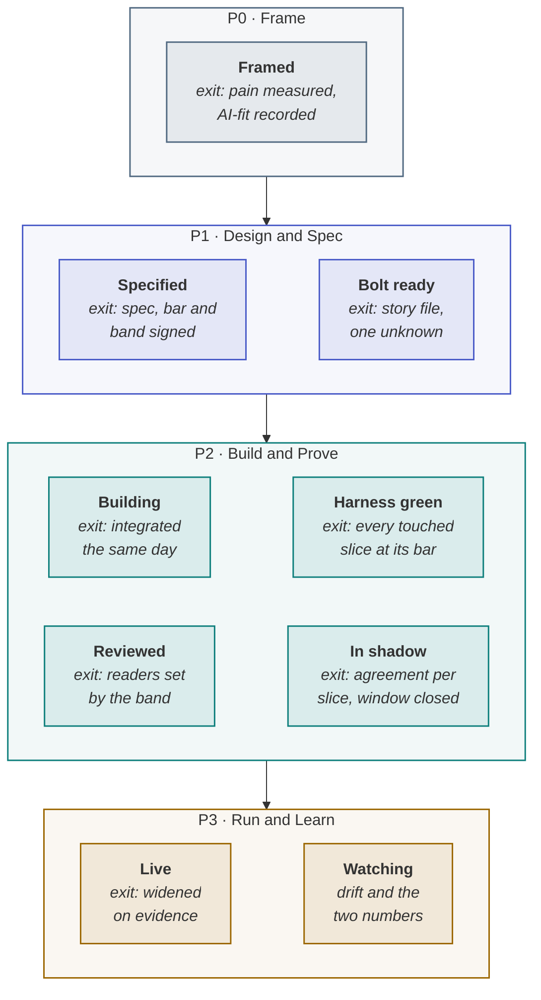

> [!TIP]
> **The board in one sentence.** An agentic delivery board has columns whose **exit rules are
> evidence** — framed, specified, bolt ready, building, harness green, reviewed, in shadow, live, and
> watching — **swimlanes by risk band**, so a money change never shares a lane with a label change,
> **work-in-progress limits** set by review capacity, and cards that each carry exactly one unknown.



**In this lesson** you'll learn:

- which columns an agentic board needs, and the evidence that moves a card out of each;
- why the swimlanes should be risk bands, and how to set work-in-progress limits;
- the three numbers a programme manager should read off the board every week.

## Sound familiar?

- Every card says "In progress" until it says "Done", and "Done" means someone said so.
- A change to a refund limit sits in the same column, with the same reviewers, as a change to a button label.
- Review is the longest column on the board, and the fix proposed is "review faster".

A board built for software that behaves the same way every time moves cards on status. An agentic
board has to move them on evidence.

## What is different about an agentic board?

Three things. **Columns end on evidence**: a card leaves "harness green" only when every slice it
touched is at its bar, because "code complete" says nothing about whether a model's answers are good
enough. **Lanes are risk bands**: what a change touches decides how it is reviewed and gated, so the
board makes the band visible. And **work-in-progress limits come from review capacity**, because when
agents write the code, reading it is the scarce resource.

## Set it up, step by step

### Step 1 · Create the columns, each with a written exit rule

Use the nine columns in the diagram. Write each exit rule on the column itself — most tools let you
add a description — so nobody has to remember it. The column that matters most is **Specified**: its
exit is the [hard gate](lesson:the-hard-gate), and nothing passes it without a signed spec, bar and
band.

### Step 2 · Make the swimlanes risk bands

Add a lane per band, R1 to R5, from the authority budget: read-only, reversible writes, hard-to-reverse
writes, money, and irreversible changes. A card inherits the band of the most dangerous tool or path
it touches — never of its size. The lane then tells everyone, at a glance, how many readers a change
needs and whether a named approver must sign.

### Step 3 · Put one unknown on every card

Each card is a bolt, and each bolt carries exactly one unknown, written on the card: *does the adapter
authenticate?*, *does ranking hit its bar on codeshare?* Add three custom fields: the **band**, the
**slice** it touches, and the **bar** for that slice. A card with no unknown should be merged; a card
with two should be split.

### Step 4 · Set work-in-progress limits from review capacity

Little's law says the time a card waits equals the work queued divided by the rate it is cleared. Count
review in **slots**, not cards — a change needing two readers takes two — and measure slots cleared per
day from the last four weeks. At SkyWays nine changes needed 18 slots against 4.5 a day: a four-day
queue. Routing readers by band cut the slots needed to 7 and the queue to 1.6 days, with nobody reading
faster. Set the limit on the Building column so that what enters matches what review can clear.
[Review by risk band](lesson:review-ai-generated-code)

### Step 5 · Show blocked decisions, not just blocked work

Add a marker for a card waiting on a **decision** rather than on work — a soft gate with a placeholder,
an owner and a date. The decision's owner and date go on the card. A card blocked on a decision with no
owner is the single most useful thing a programme manager can find on the board.

### Step 6 · Read three numbers every week

| Number | Where it comes from | What it tells you |
| --- | --- | --- |
| **Review queue, in days** | Slots waiting ÷ slots cleared per day | Whether the review policy, not the people, is the bottleneck |
| **Same-day integration rate** | Bolts integrated on their day ÷ bolts built | Whether the cut is right — a falling rate means bolts depend on each other |
| **Cards in shadow and live, by slice** | The last two columns | How much of the work has earned evidence, rather than merely been built |

## Where you'll use it

- **As a programme or delivery manager**: the board is your status report, and the three numbers are
  your weekly update.
- **In GitHub Projects, Jira, Linear or any board tool**: columns, a band field for the swimlanes, and
  a slice and bar field on each card are all it needs.
- **In the weekly review with the sponsor**, alongside the two-number report.

## Why it matters

A status board hides the two things that decide whether agentic delivery is fast: where evidence is
missing, and where review is queued. An evidence board shows both. The review queue in particular is
invisible on most boards and is usually the longest wait in the whole flow.

## Try it

Your board shows 12 cards waiting for review. Eight need one reader, four need two. Your reviewers
clear 5 slots a day. **How long is the review queue, and what would shorten it without anyone reading
faster?**

<details><summary>Show the answer</summary>

**3.2 days.** The cards need 8 × 1 + 4 × 2 = 16 slots; 16 ÷ 5 = 3.2. To shorten it without reading
faster, reduce the slots needed: move the read-only R1 changes to a harness-only lane with no reader —
and count any defects that escape through it — and check that the two-reader cards genuinely touch
money, identity or policy rather than being large. Adding work to the Building column would only
lengthen the queue.

</details>

## Key takeaways

1. **Columns end on evidence**, not status — and the Specified column is the hard gate.
2. **Swimlanes are risk bands**: a card takes the band of the most dangerous thing it touches.
3. **WIP limits come from review capacity**, counted in slots — read the queue, the integration rate and the evidence columns weekly.

## FAQ

### What columns should an AI project board have?

Framed, specified, bolt ready, building, harness green, reviewed, in shadow, live and watching — each
with a written exit rule that is evidence rather than status. They follow the four phases of the
agentic PDLC, from a measured pain to a system being watched for drift.

### How do you set WIP limits for AI development?

From review capacity. Count review in slots — a change needing two readers takes two — and measure how
many slots your team actually clears per day. Limit the work entering the build so that it matches what
review can clear; otherwise the queue grows, whatever the agents produce.

### Should AI agents be on the board?

The work should be, whoever does it. Each card is a bolt with one unknown, whether a person or a coding
agent builds it; the board tracks the evidence the bolt produces, not who typed it.

### Can I use Scrum boards for agentic projects?

Yes, with changes: add the evidence columns after "done" — harness green, reviewed, in shadow, live —
because in agentic delivery code complete is roughly the halfway point, and add risk-band swimlanes so
review depth is visible.

## Apply it in your role

| If you are… | Do this | The AI-augmented shortcut |
| --- | --- | --- |
| **A forward-deployed engineer** | Put the customer's work on an evidence board they can see: columns with exit rules, lanes by risk band. It replaces most status meetings. | Ask a model to write the board configuration — columns, exit rules, WIP limits — for the customer's tool. |
| **A product manager or FDPM** | Read three numbers every week: review queue in days, same-day integration rate, cards in shadow and live. | Have a model compute the three from the board export. |
| **A GenAI or agentic AI engineer** | Let CI move the cards: a green harness advances one, a failed slice sends it back. | Ask a coding agent for the webhook that updates the card from the CI result. |

**Across the enterprise.** One board template for every AI team gives the portfolio a live view of
evidence rather than status, and blocked decisions appear as cards with owners.

**The ten-minute workflow.** The weekly numbers, straight from an export:

```text
Here is our board export: <CSV>. Compute (1) review queue in days = review slots waiting ÷ slots
cleared per day, (2) the same-day integration rate, and (3) cards in shadow and live, by slice. Flag
any card with more than one unknown, and any money card sharing a lane with read-only work.
```

## Sources and credits

| Idea | Origin | Source |
| --- | --- | --- |
| Visualise work, limit work in progress, make policies explicit | **Borrowed** | Anderson, D. J. (2010). *Kanban: Successful Evolutionary Change for Your Technology Business*. Blue Hole Press |
| Queue time from work queued and rate cleared | **Borrowed** | Little, J. D. C. (1961). A proof for the queuing formula L = λW. *Operations Research* 9(3) |
| Evidence exit rules, risk-band lanes and the three weekly numbers | **Original** — this tutorial, from the playbook's gates and bands | [Gates and Governance](wiki:Gates-and-Governance) |
| Review counted in slots; routing by band | **Original** — this playbook | [How to review by risk band](wiki:How-to-Review-by-Risk-Band) |
| The SkyWays review queue | **Illustrative** — a fictional airline | [Try the queue calculator](sim:#/toolkit/queue) |
