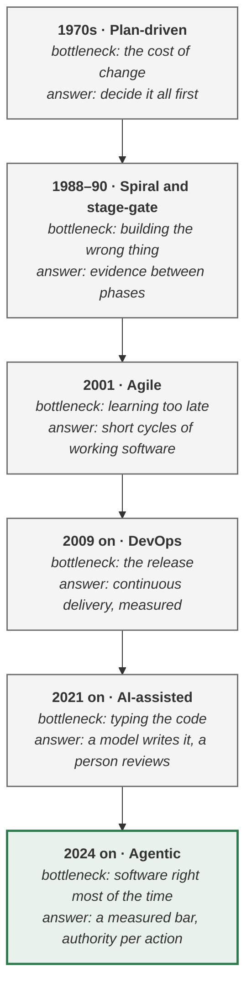

> [!TIP]
> **The evolution in one sentence.** Each lifecycle fixed the bottleneck of its era — plan-driven
> development the cost of change, agile the cost of learning late, DevOps the cost of releasing — and
> the agentic PDLC fixes the newest one: software that is right only most of the time. Each kept most
> of what came before, and so should you.

**In this lesson** you'll learn:

- which bottleneck each lifecycle removed, and what it left behind that still works;
- what is genuinely new when a model does part of the work, and what is not;
- how to tell a real lifecycle change from a rebrand.

## Sound familiar?

- "We're agile, so we don't need phases" — and then the agent shipped with a refund limit that lived only in its prompt.
- Your delivery metrics are excellent, and nobody can tell you whether the agent's answers are right.
- Every vendor says its lifecycle is new, and each looks like the last one with "AI" in front.

This lesson gives you the one question that sorts them: **which bottleneck does it move?**

## A short history, one bottleneck at a time

### Step 1 · Plan-driven development: the cost of change

In 1970 Winston Royce described building large software in sequential phases — requirements,
design, coding, testing, operation. Change was expensive, so the logic was to decide everything
first. Royce himself warned that the purely sequential version was risky and recommended iterating;
the name "waterfall" came later. What survives: written requirements, and design reviewed before it
is built.

### Step 2 · Spiral and stage-gate: building the wrong thing

Barry Boehm's spiral model (1988) ordered work by risk, tackling the biggest unknown first. Robert
Cooper's stage-gate system (1990) put a gate between product phases, opened only by evidence. What
survives: **risk-first ordering and evidence at the gates** — both reappear in the agentic PDLC,
where each bolt carries one risk and each hand-off needs an artefact.

### Step 3 · Agile: learning too late

The Agile Manifesto (2001) valued working software and responding to change over following a plan.
Short cycles meant a wrong idea was found in weeks rather than at the end. What survives: iterations,
backlogs, retrospectives and the customer in the room. The agentic PDLC shortens the cycle further
into **bolts** of hours or days, but it does not replace the team process.

### Step 4 · DevOps and continuous delivery: the release

From 2009 the bottleneck became the release itself. Continuous delivery (Humble and Farley, 2010)
made shipping routine, and *Accelerate* (Forsgren, Humble and Kim, 2018) showed which measures —
deployment frequency, lead time, change failure rate and time to restore — predict performance. What
survives: pipelines, feature flags, observability and rollback. The agentic PDLC adds a stage to the
pipeline — the evaluation harness — and a new member to the environment: the pinned model version.

### Step 5 · AI-assisted development: typing the code

From 2021, coding assistants made writing code cheap. The bottleneck moved to reviewing it and to
deciding what to build. The evidence on speed is mixed: in a 2025 randomised trial, experienced
open-source developers took 19% longer with AI tools while believing they were 20% faster — a result
its authors now describe as historical — and DORA's 2025 research found that AI **amplifies** a
team's existing strengths and weaknesses rather than fixing them.

### Step 6 · Agentic delivery: software that is right most of the time

Once a model does not just write code but **acts** — ranks the options, drafts the reply, issues the
refund — the product itself becomes probabilistic. It is right a share of the time, fluent all of
the time, and wrong without an error. The new bottleneck is deciding what "right enough" means, who
may authorise each action, and noticing when it stops being true. That is what the four phases of the
[agentic PDLC](lesson:what-is-the-agentic-pdlc) are for.

## What changes, and what does not

Most of the discipline you have still applies. The honest list of what changes:

| You already have | What a model in the middle changes |
| --- | --- |
| Discovery and the pain behind the ask | The pain must be a measurement, because the machine downstream cannot ask what you meant |
| A PRD with problem, users, scope and metrics | Eight fields a coding agent can read, acceptance in a checkable syntax, and a bar per slice |
| Sprints and milestones | Bolts: one risk each, the walking skeleton first, the shadow run as the milestone |
| Unit, integration and end-to-end tests | Exact work tested exactly; best-guess work measured as a share, by slice |
| Code review | Depth set by the risk of the change, never by the size of the diff |
| Threat modelling | One genuinely new threat: every text the agent reads is a possible instruction |
| Postmortems | The question is which enforced control was missing, not who was careless |

## Where you'll use this

- **With a sceptical colleague** who says the team is already agile: agile answers *learning late*,
  not *right only most of the time*.
- **When deciding what to keep.** Almost everything — gates, tests, flags, postmortems. The additions
  are few and specific.
- **When a vendor pitches a new lifecycle.** Ask which bottleneck it moves. If the answer is "typing",
  it is AI-assisted development with a new name.

## Why it matters

Teams that treat agentic delivery as entirely new throw away gates, tests and postmortems that still
work. Teams that treat it as nothing new skip the three things that genuinely are — **the bar, the
authority budget and the drift watch** — and those three are where the expensive failures come from.

## Try it

A team says: *"We do continuous delivery with 90% test coverage and a clean DORA scorecard, so our new
agent is covered."* **Which bottleneck is still unaddressed?**

Show the answer

**Software that is right only most of the time.** Tests prove *exact* work — the fare arithmetic,
the schema — and they fail loudly. They say nothing about *best-guess* work, such as which rebooking
suits this passenger, which has to be measured as a share against a bar for each slice. And no test
catches drift, because drift happens with no deploy at all. The team has solved the release; it has
not yet solved "right enough".

## Key takeaways

1. **Each lifecycle moved one bottleneck** and kept most of what came before it.
2. The agentic bottleneck is **software that is right most of the time**: what counts as right enough, who authorises each action, and when it stops being true.
3. **Keep** your gates, tests, flags and postmortems; **add** the bar, the authority budget and the drift watch.

## FAQ

### What is the difference between the SDLC and the PDLC?

The software development lifecycle (SDLC) runs from requirements to deployment and maintenance of
software. The product development lifecycle (PDLC) is wider: it starts before anything is built —
should we build this at all? — and runs until the product's value and cost are known. The agentic
PDLC is a PDLC because its first phase asks whether the job needs a model at all, and its last
reports what the feature saved beside what it cost.

### Is agile dead in the agentic era?

No. Agile solved learning late, and that problem has not gone away. Stand-ups, backlogs and
retrospectives carry on; the unit of work inside them shrinks to a bolt, and "done" gains a measured
bar for the parts a model decides.

### Did Winston Royce invent the waterfall model?

Royce's 1970 paper described sequential phases, but he presented the purely sequential version as
risky and recommended iterating. The name "waterfall" was applied later. Treating his paper as an
endorsement of one-pass delivery misreads it.

### When did agentic software development begin?

Models that call tools and take actions became practical in 2023 and 2024. The first widely used
published methods for building with them followed in 2025, including AWS's AI-Driven Development
Life Cycle in July and GitHub's Spec Kit for spec-driven development in September.

## Sources and credits

| Idea | Origin | Source |
| --- | --- | --- |
| Sequential phases, and the warning to iterate | **Borrowed** | Royce, W. W. (1970). Managing the development of large software systems. *Proceedings of IEEE WESCON* |
| Risk-first ordering | **Borrowed** | Boehm, B. (1988). A spiral model of software development and enhancement. *Computer* 21(5) |
| Gates opened by evidence | **Borrowed** | Cooper, R. G. (1990). Stage-gate systems. *Business Horizons* 33(3) |
| Working software over following a plan | **Borrowed** | Beck, K. et al. (2001). [Manifesto for Agile Software Development](https://agilemanifesto.org/) |
| Continuous delivery | **Borrowed** | Humble, J. & Farley, D. (2010). *Continuous Delivery*. Addison-Wesley |
| Four measures that predict delivery performance | **Borrowed** | Forsgren, N., Humble, J. & Kim, G. (2018). *Accelerate*. IT Revolution |
| 19% slower with AI, believing 20% faster | **Borrowed** | METR (2025). [Measuring the impact of early-2025 AI on experienced open-source developer productivity](https://arxiv.org/abs/2507.09089) |
| AI as an amplifier | **Borrowed** | DORA (2025). [State of AI-assisted Software Development](https://dora.dev/dora-report-2025/) |
| Bolts of hours or days | **Adapted** | Raja SP (2025). [AI-Driven Development Life Cycle](https://aws.amazon.com/blogs/devops/ai-driven-development-life-cycle). AWS |
| The bottleneck reading of the history, and the keep-and-add list | **Original** — this playbook | [The Agentic PDLC](wiki:The-Agentic-PDLC#what-is-genuinely-new-and-what-is-not) |
