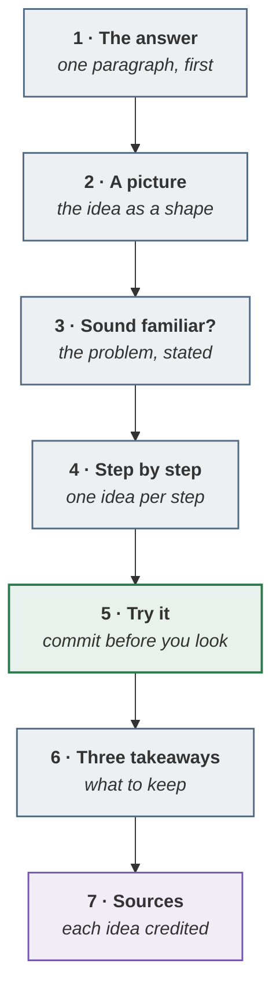

> [!TIP]
> **The short version.** Each lesson is a five-to-ten-minute read that opens with the answer, shows
> it as a picture, states the problem it solves, walks through it step by step, gives you something
> to try, and ends with three takeaways and its sources. If you have two minutes, read the first box
> and the takeaways; they are written to stand on their own.



**In this lesson** you'll learn:

- what each of the seven slots in a lesson is for;
- which learning research each slot comes from;
- how to move through the tracks, whatever your starting point.

## Sound familiar?

- You have read three "complete guides" to agentic AI and still could not tell a colleague what to do on Monday.
- Each article defined the same terms differently, and none said where its ideas came from.
- You wanted the part for your role, and got a tour of everybody else's.

This tutorial is built against all three: it ends every lesson on something you can do, it credits
every idea, and it lets you enter at your role.

## The seven slots, and why each one is there

### Step 1 · The answer comes first

The first box in every lesson answers the question in the title, completely, in one paragraph.
Newspapers settled on this order — the most important fact first — around the turn of the twentieth
century, partly because a telegraphed story could be cut off at any point. A reader arriving from a
search is in the same position: they may stop after one paragraph, so that paragraph has to be the
whole answer.

### Step 2 · A picture, before the detail

Every lesson carries at least one picture, and the rule is strict: a board, a figure or a diagram,
never decoration. People learn more from words and pictures together than from words alone —
the **multimedia principle** — provided the picture carries the idea rather than illustrating it.
On the site the boards are live; on the wiki they are screenshots of the same boards.

### Step 3 · The problem, stated rather than asked

"Sound familiar?" lists three symptoms in plain statements. It is there so you can decide in ten
seconds whether the lesson is for you, and so that the explanation that follows has something to
attach to.

### Step 4 · Step by step, one idea at a time

The core of a lesson is short numbered steps, each carrying one idea. Splitting material into
learner-paced segments helps people who are new to it — the **segmenting principle** — and cutting
anything that would survive unchanged in a lesson on a different topic helps everyone: the
**coherence principle**. That second rule is why these lessons are short.

### Step 5 · Try it — commit before you look

Each lesson ends its teaching with one problem, and the answer is hidden until you open it. Trying to
recall or apply an idea strengthens memory of it more than reading it again — the **testing effect**
— and the benefit holds even when your first attempt is wrong.

### Step 6 · Three takeaways

Three short, parallel statements: what to keep if you keep nothing else. They are written to be
quoted, and to be the thing you check yourself against a week later.

### Step 7 · Sources, with an origin mark

Every lesson ends with a table crediting each idea as one of three:

| Mark | Means | What you can do with it |
| --- | --- | --- |
| **Borrowed** | Used as published, from a named author | Check it against the source |
| **Adapted** | An outside idea, changed here | Read the source to see what changed |
| **Original** | Constructed by this playbook | Treat it as a default to tune on your own evidence |

The marks let you argue with the right things. A borrowed statistic is checkable in a minute; an
original method is a starting point, not a standard. The full list of every claim and its standing
is on [Sources and Confidence](wiki:Sources-and-Confidence).

## Where to start

| You are | Start at | Then |
| --- | --- | --- |
| New to agentic delivery | [What is the agentic PDLC?](lesson:what-is-the-agentic-pdlc) | The fundamentals, in order |
| Already delivering, and something is going wrong | [Why agentic AI projects fail](lesson:why-agentic-ai-projects-fail) | The phase your problem lives in |
| Here for one phase | [P0](lesson:p0-frame) · [P1](lesson:p1-design-and-spec) · [P2](lesson:p2-build-and-prove) · [P3](lesson:p3-run-and-learn) | The next phase |

Each lesson shows its reading time, level and position in its track at the top. Reading time is
counted at 238 words a minute — the average for adults reading non-fiction silently — plus a few
seconds for each picture.

## Two copies of one source

The lessons are written once and published in two places:

- **On the site**, under `/learn/`, with the live boards. This is the copy search engines index.
- **On the GitHub wiki**, beside the playbook's full reference pages, with screenshots of the boards.

There are two because GitHub does not let search engines index a wiki unless the repository has at
least 500 stars *and* its wiki is closed to public editing. The site copy is canonical, and each
lesson is also available as plain markdown — add `index.md` to its address — for tools that read
text.

## Try it

You have two minutes before a meeting about a lesson you have not read. **Which two parts should you
read?**

<details><summary>Show the answer</summary>

**The answer box at the top and the three key takeaways at the bottom.** Both are written to stand
alone: the first is the complete answer in one paragraph, and the takeaways are the three things the
lesson exists to leave you with. The "Sound familiar?" list is a good third if you have another
thirty seconds — it tells you what problem you are being asked to solve.

</details>

## Key takeaways

1. Every lesson has **the same seven slots in the same order**, so you always know where the answer is.
2. Each slot comes from learning research: **answer first, a picture, one idea at a time, try before you look**.
3. Every idea is marked **Borrowed, Adapted or Original**, so you know what to check and what to tune.

## FAQ

### How long does the tutorial take?

Each lesson takes five to ten minutes. The start page shows each track's total, and the fundamentals
take a little over an hour. There is no need to read them in one sitting; each lesson stands alone.

### Is it free?

Yes. The lessons, the playbook and the simulator are free and open source under the MIT licence.
Keep the attribution if you reuse them.

### Do I need an AWS account, or any particular tool?

No. The agentic PDLC is method- and vendor-agnostic, and nothing here needs an account. The
repository's hands-on curriculum uses AWS, and some examples name AWS services where they are the
concrete case.

### Can I use it with my team?

Yes. The lessons work as pre-reading for a weekly session, one track at a time; the
[study plans](wiki:Study-Plans) include a twelve-week reading-group format.

## Apply it in your role

| If you are… | Do this | The AI-augmented shortcut |
| --- | --- | --- |
| **A forward-deployed engineer** | Use the lesson shape to brief a customer's team: the answer first, a picture, one worked problem. Their engineers read it in ten minutes. | Have a model draft a one-page explainer of your deployment in the seven slots, then cut every sentence that would fit any project. |
| **A product manager or FDPM** | Write product briefs in the same shape: the answer box is the summary, "Sound familiar?" the problem, the try-it the acceptance test. | Give a model your draft and ask which slot is missing or weakest. |
| **A GenAI or agentic AI engineer** | Read the takeaways, then only the steps you would get wrong. The sources table says which ideas are standards and which are working methods. | Ask a model for three new versions of a lesson's Try it, with different numbers, before you use the idea at work. |

**Across the enterprise.** Use the tracks as role onboarding: two weeks per role, one lesson a day, each
Try it worked aloud in a team session. The same shared vocabulary is what the gates and reviews rely on.

**The ten-minute workflow.** Make a lesson test you rather than inform you:

```text
Read this lesson: <paste or link>. Write three new problems in the style of its "Try it", with
different numbers, and hide the answers. When I reply, mark my working, not only the result, and
tell me which step I would have got wrong at work.
```

## Sources and credits

| Idea | Origin | Source |
| --- | --- | --- |
| The most important fact first | **Borrowed** | Pöttker, H. (2003). News and its communicative quality: the inverted pyramid — when and why did it appear? *Journalism Studies* 4(4) |
| Words with pictures; nothing extraneous; learner-paced segments | **Borrowed** | Mayer, R. E. (2021). *Multimedia Learning*, 3rd ed. Cambridge University Press |
| Retrieval strengthens memory more than rereading | **Borrowed** | Roediger, H. L. & Karpicke, J. D. (2006). Test-enhanced learning. *Psychological Science* 17(3) |
| State what the learner will be able to do | **Borrowed** | Mager, R. F. (1962). *Preparing Objectives for Programmed Instruction* |
| 238 words a minute for non-fiction | **Borrowed** | Brysbaert, M. (2019). How many words do we read per minute? *Journal of Memory and Language* 109 |
| Extra seconds for each picture | **Borrowed** | Medium's published read-time method |
| A sidebar of short lessons, each ending in a summary | **Adapted** | the structure of mysqltutorial.org |
| A problem to try inside the lesson | **Adapted** | Brilliant's problem-first lessons |
| The seven-slot anatomy and the three origin marks | **Original** — this tutorial | [The authoring guide](repo:site/content/learn/README.md) |
| When search engines index a GitHub wiki | **Borrowed** | GitHub Docs, [About wikis](https://docs.github.com/en/communities/documenting-your-project-with-wikis/about-wikis) |
