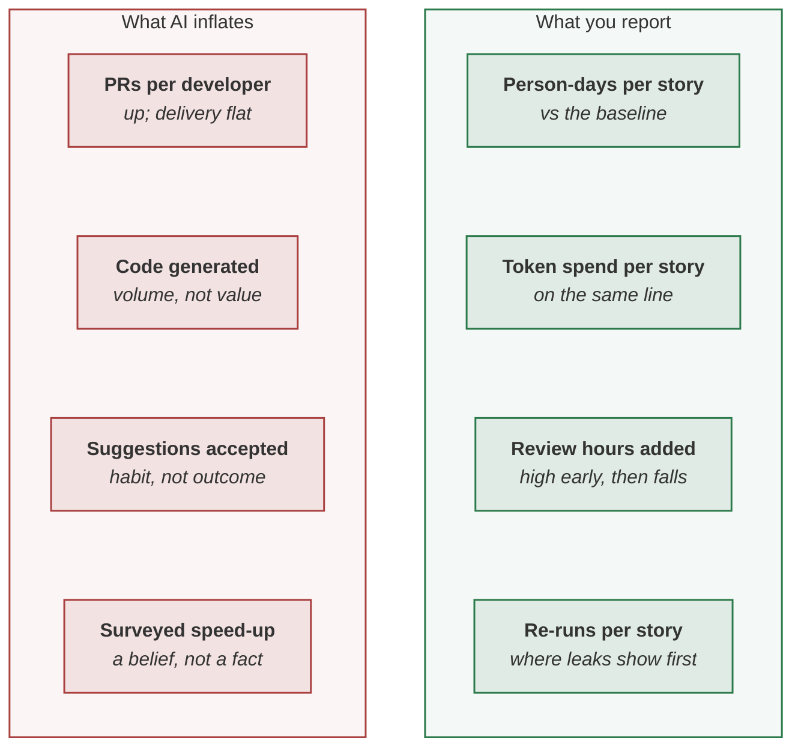

> [!TIP]
> **The method in one sentence.** Measure AI productivity as a change against a baseline taken before
> the pilot — person-days per story — reported every cycle beside what it cost: token spend per story,
> review hours added and re-runs. Activity counts rise with AI whether or not delivery does, a surveyed
> speed-up is a belief rather than a measurement, and one number reported alone gets pushed.



**In this lesson** you'll learn:

- why activity metrics mislead once a model is writing the work;
- the four rows of an honest productivity report, and the baseline it depends on;
- how to read the first cycles, when the saving and the cost arrive at different speeds.

## Sound familiar?

- The team feels faster, and nobody wrote down how long a story took before the pilot.
- Pull requests per developer have doubled, and the release date has not moved.
- The token bill reached a review before the saving did — from finance.

Each is a measurement problem, and each is cheaper to prevent than to explain.

## What does AI productivity actually mean?

**Outcome per unit of work, at the level of the system, against its full cost.** Not how much is
produced: a model raises the volume of code, pull requests and suggestions whether or not anything
ships sooner. Faros AI measured 98% more pull requests merged per developer across 10,000 developers,
while delivery at the level of the organisation stayed flat — more changes were produced, and the same
number of people read them.

What people *feel* is weaker evidence still. In METR's 2025 study, experienced open-source developers
took **19% longer** on tasks where AI was allowed, while estimating afterwards that it had made them
**20% faster**. A survey tells you what is believed; it cannot tell you what happened.

## Measure it, step by step

### Step 1 · Take the baseline before anything changes

Person-days per story, today, on the work the pilot will touch. It takes an afternoon, and **it cannot
be recovered later** — once the pilot starts, every earlier number is a reconstruction. If you have
already started, say so in the report and take one on the next feature.

### Step 2 · Count a unit of work, not a unit of activity

A story done, or a case handled, counted where value lands — merged and released, not generated. The
unit has to mean the same thing before and after, which rules out anything the model makes cheaper
to produce: lines, commits, pull requests.

### Step 3 · Report the saving beside the spend, every cycle

Two numbers on one line, and two rows beneath them that keep them honest: **review hours added**, which
is high early and falls, and **re-runs**, the leak signal. At SkyWays — this playbook's fictional
airline — the day-ninety report read:

{{figure:two_numbers}}

A 43% saving, $310 of tokens per story, and review time up 0.8 hours — with the reason it would fall.

### Step 4 · Keep belief and measurement apart

Surveys and system data answer different questions. DORA's 2025 survey found 80% of developers report a
productivity gain, while 30% place little or no trust in AI-generated code — the same people reporting
both feelings. Use belief to decide what to measure; use the tracker and the per-call log to measure it.

### Step 5 · Read the trajectory, not the first cycle

A first cycle that saves time and costs more is normal: review hours are high while people learn to
trust the harness, and artefacts are being written for the first time. Judge cycle two on the trend —
review hours falling, re-runs falling with them, the saving holding. A saving whose re-runs are rising
is eroding.

### Step 6 · Never report one number alone

A single figure gets optimised at the expense of whatever is not reported beside it. Pair every measure
with its side effect: the saving with the spend, speed with review load, throughput with re-runs.

## Where you'll use it

- **Before a pilot starts**, to take the one number that cannot be taken later.
- **In every cycle's report** to a sponsor, on one line.
- **When someone quotes a survey**, to ask what was measured instead.

## Why it matters

A programme is cancelled on the number it hid, never on the one it showed. The failure is familiar: every
cycle shows time saved, none shows spend, and eventually finance computes the token bill and brings a number nobody
in the programme has seen. The credibility of the first number dies with the second.

## Try it

Baseline: 6.0 person-days per story. This cycle: 4.5. Review hours added per story rose from 1.5 to 2.5,
and re-runs per story rose from 1.4 last cycle to 2.1. **What do you report, and what is the warning?**

<details><summary>Show the answer</summary>

**A 25% saving — (6.0 − 4.5) ÷ 6.0 — beside the token spend per story, with both rows visible.** The
warning is the re-runs: they rose by half in one cycle, which is where leaks show first, so the saving
is likely to erode. Before the next cycle, read the per-call log for what is being re-run and why. The
review hours rising is less alarming on its own this early, but it should start to fall next cycle.

</details>

## Key takeaways

1. **Take the baseline first**: person-days per story, before the pilot. It cannot be recovered.
2. **Report four rows together**: the saving, the spend, review hours added and re-runs.
3. **Activity and belief are not outcome** — measure where value lands, and read the trend.

## FAQ

### How do you measure the productivity impact of AI?

Take a baseline of person-days per story before the pilot, then report the change every cycle beside
the token spend per story, the review hours added and the re-runs per story. Count stories done, not
pull requests or lines, because a model inflates those whether or not delivery improves.

### Does AI make developers more productive?

The evidence is mixed and depends on how it is measured. Developers widely report gains, while controlled
measurements have found slowdowns on some work and organisation-level delivery staying flat as output
rises. Measure your own team against its own baseline rather than relying on industry figures.

### What metrics should we use for AI ROI?

Person-days per story against a dated baseline, token spend per story, review hours added and re-runs,
reported together. The first two are the return and the cost; the last two show whether the return
will hold.

### Why did output go up but delivery didn't get faster?

Usually because review became the bottleneck: more changes are produced and the same people read them.
Route review by risk rather than by size, so that attention goes where a mistake is expensive.

## Apply it in your role

| If you are… | Do this | The AI-augmented shortcut |
| --- | --- | --- |
| **A forward-deployed engineer** | Take the customer's baseline in week one — person-days per story, or minutes per case — before anything changes. It is the number the renewal rests on. | Ask a model to compute the baseline from their tracker history, with the date range and method stated. |
| **A product manager or FDPM** | Report all four rows every cycle, and read the re-run trend before celebrating the saving. | Have a model draft the productivity section of the cycle report with the four rows. |
| **A GenAI or agentic AI engineer** | Log what the measures need from systems, not surveys: stories done, tokens per story, review time, re-runs. | Ask a coding agent to join the tracker, the per-call log and the review log into one weekly table. |

**Across the enterprise.** Measure each team against its own baseline and never rank teams on activity
counts. Publish self-reported and system-measured figures separately, and never add them together.

**The ten-minute workflow.** A baseline worth defending, from history you already have:

```text
Here is our tracker export for the last six months: <CSV with story id, start, done, assignees>.
Compute person-days per story before <pilot start date>, with the method and any exclusions stated,
and the spread. Flag stories that would distort the baseline: abandoned, reopened or unusually large.
```

## Sources and credits

| Idea | Origin | Source |
| --- | --- | --- |
| The two-number report, with review hours and re-runs beside it | **Original** — this playbook | [For leadership](site:protocol/) |
| Take the baseline before the pilot; keep the review and re-run rows | **Original** — this playbook | [Paired indicators](wiki:Gates-and-Governance#paired-indicators-and-the-two-number-report) |
| Experienced developers 19% slower, believing they were 20% faster | **Borrowed** | METR (2025). *Measuring the Impact of Early-2025 AI on Experienced Open-Source Developer Productivity*. arXiv:2507.09089 |
| 98% more pull requests merged per developer, delivery flat | **Borrowed** | Faros AI (2025), 10,000 developers; see [Sources and Confidence](wiki:Sources-and-Confidence#industry-measurements-quoted) |
| 80% report a gain; 30% have little or no trust in AI code | **Borrowed** | DORA (2025). *State of AI-assisted Software Development* |
| Productivity has several dimensions; activity alone misleads | **Borrowed** | Forsgren, N. et al. (2021). The SPACE of developer productivity. *ACM Queue* 19(1) |
| Every measure reported beside its side effect | **Borrowed** | Grove, A. (1983). *High Output Management*. Random House |
| The SkyWays figures | **Illustrative** — a fictional airline | [The simulator](sim:#/) |
