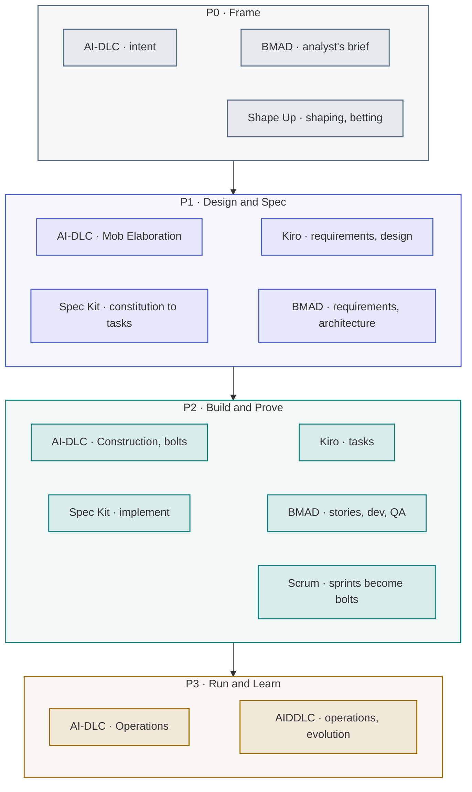

> [!TIP]
> **The map in one sentence.** Every building method fits onto the agentic PDLC's four phases — most
> of their stages land in P1 and P2 — and laying them side by side shows the same gap in all of them:
> none sets an acceptance bar per slice from what a mistake costs, none enforces authority per action,
> and almost none says how to watch a model in production and report its value beside its cost.

**In this lesson** you'll learn:

- where each well-known method's stages sit on the four phases;
- the decisions every one of them leaves open, and who should own each;
- how to combine a building method with the lifecycle without running two processes.

## Sound familiar?

- The team runs Scrum, the architects want Spec Kit, and a vendor is pitching AI-DLC — and the argument is about which one wins.
- Every method you evaluate has a planning phase and a building phase, and none has a clear answer to "is it good enough to ship?"
- After launch, nobody's method says who watches the agent, or who tells the sponsor what it cost.

The map settles the first by showing that the methods mostly agree. It exposes the second and third
as gaps that a lifecycle has to fill, whichever method you choose.

## Where does each method sit?

| Method | P0 · Frame | P1 · Design & Spec | P2 · Build & Prove | P3 · Run & Learn |
| --- | --- | --- | --- | --- |
| **AWS AI-DLC** | Inception: the business intent | Inception: Mob Elaboration, units of work | Construction: Mob Construction, in bolts | Operations: infrastructure and deployment |
| **AIDDLC** | Foundation | Inception, elaboration | Construction, hardening | Operations, evolution |
| **Kiro** | — | `requirements.md`, `design.md` | `tasks.md`, task by task | — |
| **GitHub Spec Kit** | — | Constitution, specify, plan, tasks | Implement | — |
| **BMAD Method** | The analyst's brief | The product manager's requirements, the architect's design | Stories, developer, QA | Learn and adjust, into the next plan |
| **Scrum** | Backlog refinement | Sprint planning | Sprints — here, bolts — and the review | The retrospective |
| **Shape Up** | Shaping and the betting table | The shaped pitch | The six-week cycle | — |
| **Stage-gate** | Discovery and scoping | The business case | Development, testing and validation | Launch |

## How to combine them, step by step

### Step 1 · Map your method's stages onto the four phases

Write your method's stages against P0 to P3, as in the table. Most land in P1 and P2, because most
methods are about how to build. That is not a flaw — it is what they are for.

### Step 2 · Find the empty cells and the thin ones

Look for the phases your method leaves empty or covers only in part. For almost every building method
the same things are missing, because they are questions about **the model inside the product**, not
about how the product is built:

| Open decision | Phase | Who should own it |
| --- | --- | --- |
| Whether the job needs a model at all, and what it is worth net of running and checking | P0 | Product manager |
| The acceptance bar for each slice, from what a mistake costs | P1 | Product manager and QA |
| Authority per action, with every limit enforced in a tool's signature | P1 | Solution architect |
| A harness that blocks a merge when a slice falls below its bar, and a shadow run | P2 | Engineering and QA |
| A drift watch, and the saving reported beside the spend | P3 | QA, DevOps and the sponsor |

### Step 3 · Give each gap an owner inside your existing ceremonies

Do not add a second process. Put the bar and the authority budget into the planning ceremony you
already hold; make the harness a required check in the pipeline you already run; add the drift chart
and the two numbers to the review you already give the sponsor.

### Step 4 · Keep one spec, whatever the method

Every method above produces some form of specification. Keep one, in the repository, as the artefact
agents build from — whether your tool calls it `requirements.md`, a spec, a PRD or a pitch. The eight
fields of the [agentic spec](lesson:p1-design-and-spec#step-2--write-the-eight-field-spec) are what it
must contain.

### Step 5 · Hold the phase exits, not the method's ceremonies

What makes it work is not the rituals but the exits: each phase ends on evidence, and P1 → P2 is
the [hard gate](lesson:the-hard-gate). A team can run Scrum, Spec Kit and AI-DLC's mob sessions and
still skip every exit; a team that holds the exits can run any of them.

## Where you'll use it

- **When choosing a method**: map the candidates first, and choose on what fits your team, since the
  gaps are the same.
- **When two teams run different methods**: the four phases are the shared vocabulary for hand-offs.
- **When auditing a programme**: an empty P3 column is the most common and most expensive gap.

## Why it matters

Method arguments are expensive and mostly beside the point. The failures that cancel agentic projects
— escalating cost, unclear value, weak risk controls — live in the cells that every building method
leaves empty. Mapping them makes that visible in one table.

## Try it

A team runs Scrum with Spec Kit inside its sprints. Its product is an agent that drafts and sends
customer replies. **Using the map, which phase has no owner at all?**

Show the answer

**P3, Run & Learn.** Spec Kit stops at *implement*, and Scrum's retrospective looks at the team, not at
the agent's behaviour in production. Nobody is watching the mix of the agent's replies for drift, nobody
has rehearsed switching it back to drafting-only, and nobody reports what it saved beside what it
costs. The fix is an owner for each inside existing ceremonies — not a new method.

## Key takeaways

1. **Every method fits the four phases**, and most of their stages land in P1 and P2.
2. They share **the same gaps**: the bar per slice, authority per action, proof before launch, and the operating loop.
3. Combine without a second process: **own the gaps inside your existing ceremonies**, keep one spec, and hold the phase exits.

## FAQ

### Can I use AI-DLC with Scrum?

Yes. The ceremonies can stay; the planning unit shrinks from the sprint to the bolt, and Inception's
Mob Elaboration can replace or feed sprint planning. The phase exits — especially the hard gate between
design and build — apply whichever you keep.

### What is the best AI development methodology?

There is no best one in general. The methods mostly agree on how to build and differ in ceremony and
tooling; choose the one that fits your team and tools. What decides success is whether the decisions
they all leave open — the bar, the authority budget, the operating loop — have owners.

### Is Shape Up compatible with AI-driven development?

Yes. Shaping and the betting table are a strong P0; the shaped pitch is a P1 input; and the six-week
cycle can be run as a sequence of bolts. Shape Up's appetite — how much time an idea deserves — pairs
naturally with the value line.

### What replaces the sprint when AI writes the code?

The bolt: a slice of hours or days, carrying one unknown, integrated the same day. The term comes from
AWS's AI-DLC; the rule of one unknown per bolt is this playbook's.

## Sources and credits

| Idea | Origin | Source |
| --- | --- | --- |
| AI-DLC's phases, rituals and bolts | **Borrowed** | Raja SP (2025). [AI-Driven Development Life Cycle](https://aws.amazon.com/blogs/devops/ai-driven-development-life-cycle). AWS |
| AIDDLC's seven phases | **Borrowed** | [AIDDLC standard](https://www.aiddlc.ai/) |
| Kiro's specs and Spec Kit's workflow | **Borrowed** | [Kiro specs](https://kiro.dev/docs/specs/) · GitHub (2025). [Spec Kit](https://github.com/github/spec-kit) |
| The BMAD Method | **Borrowed** | BMad Code. [BMAD-METHOD](https://github.com/bmad-code-org/BMAD-METHOD) |
| Scrum's events | **Borrowed** | Schwaber, K. & Sutherland, J. (2020). [The Scrum Guide](https://scrumguides.org/) |
| Shaping, betting and six-week cycles | **Borrowed** | Singer, R. (2019). [*Shape Up*](https://basecamp.com/shapeup). Basecamp |
| Stage-gate | **Borrowed** | Cooper, R. G. (1990). Stage-gate systems. *Business Horizons* 33(3) |
| The mapping, and the gaps it shows | **Original** — this tutorial | [The Agentic PDLC](wiki:The-Agentic-PDLC#how-the-named-methods-sit-on-the-spine) |
