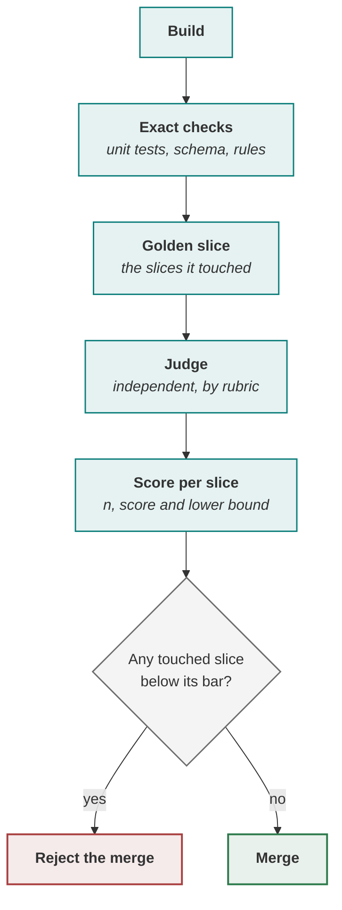

> [!TIP]
> **P2 in one sentence.** P2 Build & Prove builds the agent in **bolts** — slices of hours or days,
> one risk each — puts every exact step in tested code, measures every best-guess step against its bar
> on a golden set in CI so that a merge dropping any slice below its bar is blocked, and ends with a
> **shadow run** in which the agent works beside the live process without acting.

{{figure:bolt_days}}

**In this lesson** you'll learn:

- how to cut the build into bolts and why the first one has no model in it;
- how to wire a harness that blocks a merge when any slice falls below its bar;
- what a shadow run proves that a golden set cannot.

## Sound familiar?

- The sprint demo is on day fourteen, and nobody knows until then whether the hard part works.
- The overall score went up after a prompt change, and so did the complaints about refunds.
- The evaluation runs on every pull request, posts a comment, and can be clicked past.

P2 replaces all three with evidence that arrives daily and a check that can actually say no.

## What is P2 Build & Prove?

P2 is the third phase of the [agentic PDLC](lesson:what-is-the-agentic-pdlc), and it opens only
after the [hard gate](lesson:the-hard-gate): a signed spec, a bar for each slice and an authority
budget. The **engineering lead** is accountable. QA owns the golden set, the checkers and the shadow
comparison; DevOps owns the pipeline, the environments and the flags.

P2 ends when **the golden set clears the bar for every slice and a shadow run agrees with the people
doing the job**.

## P2, step by step

### Step 1 · Cut the build into bolts

When building is fast, the unit of planning shrinks to match. A **bolt** is a thin, shippable slice,
built and integrated the same day, carrying **one unknown**. The cut is by dependency, not by
priority: a walking skeleton that runs end to end with no model in it goes first, exact code goes
early because it never blocks, and a gated write goes only after the control it needs exists.

At SkyWays a two-week sprint with five stories and a demo became ten one-day bolts. Day one's
skeleton — read a booking, display it, no model — took half a day and found a credentials problem in
the reservation adapter that would otherwise have surfaced in week two.

### Step 2 · Build the exact floor, then the gates, in code

Every number the feature computes and then acts on is a function with a unit test, never a prompt.
A model doing arithmetic fails **fluently**: at SkyWays it returned $80 where the ledger said $62,
with no error. Then put each boundary in the tool itself — a typed, bounded parameter that raises —
with two tests that were seen failing before they passed: one over the cap, one without the
confirmation the model cannot create for itself.

### Step 3 · Measure every slice against its bar

The golden set is the acceptance bar made executable: real past cases, each with the expected
outcome and a slice tag — fifty to start, five hundred to trust. A harness runs it in CI as a
required check, in cost order, so the cheap definitive checks reject before you pay for a judge:



Two rules make it honest. **Report per slice, never overall**: SkyWays' prompt v7 lifted same-day
cases by three points and dropped refunds by four, the overall number rose, and the per-slice gate
rejected it. **Report the lower bound, never the score**: codeshare scored 412 of 500 — 82.4% against a
bar of 80 — but the lower bound was 79.1%, so the slice was not yet proven and owed more cases.

### Step 4 · Put an independent checker after the risky steps

Chained steps multiply: four steps at 90% each are right 66% of the time end to end. Keep the chain
short, then put a checker after each step where a wrong answer is expensive — and make it
**independent**, a different model or a fresh context with an adversarial brief. At SkyWays a
"review your answer before returning it" step changed no scores and raised the bill by a fifth,
because the model was grading its own work with its own reasoning still in view.

### Step 5 · Run the shadow before you run instead of it

The golden set proves the agent is right about cases *you chose*. A **shadow run** proves it agrees
with the live desk on *today's* traffic — the storm day, the partner outage — by deciding every case
and acting on none, for a window fixed in advance. Report agreement per slice, keep money actions
separate, and read every disagreement.

SkyWays cleared its threshold with 96% agreement over fourteen days against a 95% default. Inside
that 96%, the agent had disagreed with the desk on four of eleven refunds — which is why money
actions are never averaged into the headline.

## Where you'll use it

- **Every day of the build.** One bolt a day, integrated the same day, with the harness result for
  its slice in the build log.
- **On every prompt, model or tool change** after launch: the harness is how a prompt edit is
  reviewed, because a prompt is a deployable artefact.
- **Before any live traffic.** No agent switches on with nothing to compare against.

## Why it matters

P2 is where "it works" becomes a number someone can defend. Without the harness, a regression that
lifts the average ships; without the lower bound, a slice that merely got lucky ships; without the
shadow, the first real storm day is also the first test.

## Try it

A pull request changes the drafting prompt. The harness reports: same-day **88% → 90%** (n = 500,
bar 50%), codeshare **86% → 80%** (n = 500, bar 80%), refunds unchanged. The overall score rose.
**Should it merge?**

<details><summary>Show the answer</summary>

**No.** Codeshare was proven before — the lower bound of 86% on 500 cases is about 83% — and now it is
not: 80% sits exactly on the bar as a point estimate, but its lower bound on 500 cases is about 76%. The harness should reject the merge regardless of the rise in the overall score,
which is the easy, high-volume slice lifting the average over the hard one.

</details>

## Key takeaways

1. **Build in bolts** — one unknown each, the walking skeleton first, integrated the same day.
2. **Exact work in code, best-guess work measured per slice** — and a merge that drops any touched slice below its bar is blocked.
3. **Prove with lower bounds and a shadow run**, not with a demo or an average.

## FAQ

### How do you test an AI agent?

Split the work first. Exact steps — arithmetic, lookups, rules — get ordinary unit tests. Best-guess
steps — ranking, drafting, classifying — are measured as a share on a golden set of real, tagged
cases, per slice, against a bar derived from what a mistake costs. Consequential actions get tests
that prove their limits raise. Then a shadow run compares the agent with the live process.

### What is a golden set?

A file of real past cases, each with its expected outcome and a slice tag, re-scored on every change.
Fifty cases are enough to start finding problems; around five hundred per important slice are needed
to prove a bar with confidence.

### What is a shadow run?

A period in which the agent handles live traffic, decides every case and acts on none, while its
decisions are compared with what the people doing the job actually did. It tests the agent on the
traffic you did not think to put in the golden set.

### What is a bolt in agile?

A bolt is a work cycle of hours or days that replaces the sprint as the unit of planning when AI does
much of the building. The term comes from AWS's AI-Driven Development Life Cycle; this playbook adds
the rule that each bolt carries exactly one unknown.

## Apply it in your role

| If you are… | Do this | The AI-augmented shortcut |
| --- | --- | --- |
| **A forward-deployed engineer** | Ship a walking skeleton in the customer's environment on day one — their authentication, their data, no model. Integration is where engagements stall. | Ask a coding agent to scaffold the skeleton against the customer's API specification, with contract tests. |
| **A product manager or FDPM** | Read the per-slice report, never only the average. A merge that lifts the average and drops a slice is rejected, and you should be able to say why. | Ask a model to explain each failed harness run in one sentence for the stakeholder update. |
| **A GenAI or agentic AI engineer** | Make the harness a required check with a bar per slice, and put an independent checker after every risky best-guess step. | Have a coding agent write the harness from the golden-set schema, failing on any touched slice below its bar. |

**Across the enterprise.** Offer the harness as a platform template. Every team's golden sets run in the
same CI shape, and the governance board reads the same per-slice report for every product.

**The ten-minute workflow.** A harness a coding agent can write in one pass:

```text
Write a pytest harness for an AI step. Input: a JSONL golden set in which each case has id, slice,
input and expected. For every slice this change touches, run the step, score each case with <the
checker>, and compute score, n and the lower bound: p − 1.96·√(p(1−p)/n), or the Wilson bound under
100 cases. Fail if any lower bound is below that slice's bar in bars.yaml, and print a per-slice table.
```

## Sources and credits

| Idea | Origin | Source |
| --- | --- | --- |
| Bolts of hours or days | **Adapted** — one unknown per bolt is this playbook's rule | Raja SP (2025). [AI-Driven Development Life Cycle](https://aws.amazon.com/blogs/devops/ai-driven-development-life-cycle). AWS |
| The walking skeleton | **Borrowed** | Cockburn, A. (2004). *Crystal Clear*. Addison-Wesley |
| Risk-first ordering | **Borrowed** | Boehm, B. (1988). A spiral model of software development and enhancement. *Computer* 21(5) |
| The harness in cost order, per-slice gating and the checker rules | **Original** — this playbook | [QA lead](site:qa/) · [Engineering lead](site:engineering/) |
| Lower bound of a proportion | **Borrowed** | Wilson, E. B. (1927). *JASA* 22 — worked in [Formulas](wiki:Formulas-and-Calculators#the-lower-bound-of-a-score--established-wilson-1927) |
| Stratified samples, one per slice | **Borrowed** | Neyman, J. (1934). *Journal of the Royal Statistical Society* 97(4) |
| Shadow deployment and canary release | **Borrowed** | General practice; see [Shadow, then five percent](site:qa/#shadow) |
| The SkyWays figures | **Illustrative** — a fictional airline | [The simulator](sim:#/) |
