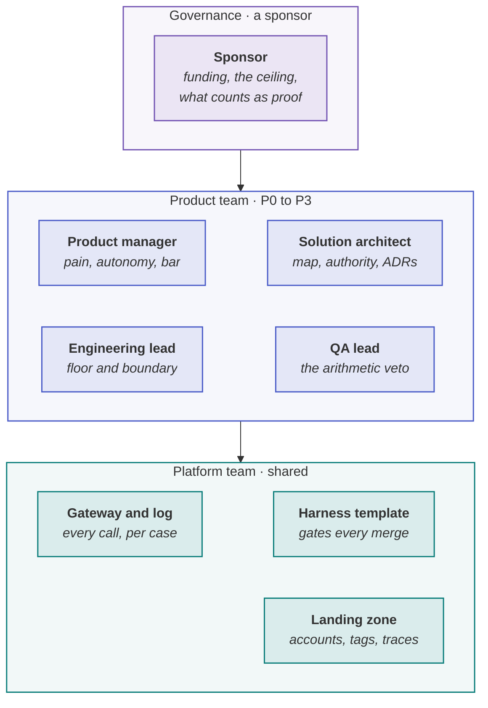

> [!TIP]
> **The answer in one sentence.** Agentic AI needs no new roles and removes none: keep a small product
> team — product manager, architect, engineering lead, QA lead — that owns one product from P0 to P3,
> give it a platform team for what every team needs (the gateway, the harness, the landing zone), move
> two boundaries (the product manager stops approving code; QA gains an arithmetic veto), put the system's
> seams where the team boundaries already are, and name one sponsor who owns governance.



**In this lesson** you'll learn:

- why agentic AI needs no new roles, and which two boundaries between roles move;
- how to split product teams, a platform team and governance;
- why the system's seams follow the org chart, and what to do about it.

## Sound familiar?

- A central "AI team" builds agents for other departments, and neither side owns the result.
- Every team built its own model integration, and nobody can say what the organisation spends.
- The multi-agent design has one agent per department, and the hand-offs between them are where it breaks.

Each is an organisational decision showing up as a technical defect.

## What changes in the organisation?

Less than the market implies. **Five roles; none is new, none disappears.** What moves is the boundary
between them, in two places: **the product manager stops approving things they cannot evaluate**, and
**QA gains a veto that is arithmetic rather than opinion** — a slice whose lower bound is below its bar
does not pass. Almost everything else is the discipline you already have, applied to a product that is
now partly probabilistic.

## Structure it, step by step

### Step 1 · Keep the five roles, and move the two boundaries

Product manager, solution architect, engineering lead, QA lead, DevOps and platform — plus a sponsor.
Write down, per role, what is theirs and what is not, and remove the approvals people cannot evaluate.
[Who signs what](lesson:ai-governance-gates#who-signs-what)

### Step 2 · Give each product one team that owns it end to end

A small product team — a pod of four, plus DevOps support — owns one product, or one agent, from framing
to operation: the pain, the spec, the build, the proof and the running system. The decisions that matter most (the bar, autonomy per
action) are business decisions, so they belong with the team that owns the business outcome, not with a
separate AI group.

### Step 3 · Build a platform team for what every product team needs

Everything that should be the same everywhere goes to one platform team: the model gateway with its
per-call log, the landing zone and cost tags, the harness template, flags and traces. The one decision to
take centrally is not which assistant — teams can choose their own editor — but that every model call in
production passes through one layer you own. The gateway is a fortnight of work, and without it a
surprise invoice is a mystery rather than a diagnosis.

### Step 4 · Put the seams where the teams are

A system's structure tends to copy the communication structure of the organisation that builds it —
Conway's law. In agentic AI that means **agent boundaries follow team boundaries**: one agent per
department is often an org chart, not a design. Decide the seams on purpose. Start with one agent per
product and give each hand-off a named limit; *n* agents have n(n − 1) ÷ 2 possible hand-offs, and so do
*n* teams.

### Step 5 · If you have a central AI group, make it enable rather than build

A central group earns its place by coaching the method across teams and by providing the platform, not
by building other people's agents — which separates the model from the business decisions it depends
on. That is the difference between an enabling or platform team and a bottleneck.

### Step 6 · Name one governance owner

Governance spans the whole lifecycle and belongs to no delivery role. Name the sponsor who owns it. If
the answer is "we all do", nobody does.

## Where you'll use it

- **When an organisation starts its second or third agentic product** and the first one's shortcuts start to hurt.
- **When costs or model integrations have fragmented** across teams.
- **When a multi-agent design mirrors the org chart** — check whether that was a decision.

## Why it matters

Agentic AI needs no reorganisation to start, and a wrong structure makes it expensive to scale: agents
owned by nobody, integrations duplicated everywhere, hand-offs placed where departments meet rather
than where the work divides. The structure above keeps decisions with the people who own the outcome,
and the shared machinery in one place.

## Try it

A company plans an "AI Centre of Excellence" of twelve engineers who will build agents for sales,
support and finance on request. **What would you change?**

<details><summary>Show the answer</summary>

**Split it into a platform team and an enabling team, and move the building to the product teams.** The
platform half runs the gateway, the landing zone, the harness template and the traces for everyone. The
enabling half coaches the method — framing, bars, authority budgets — inside each product team. Sales,
support and finance each own their agent end to end, because only they can decide what a mistake costs
them and what the agent may do without a person.

</details>

## Key takeaways

1. **No new roles, none disappears** — two boundaries move: the PM stops approving code, QA's veto is arithmetic.
2. **Product teams own products end to end**; a **platform team** owns what every team needs.
3. **Seams follow team boundaries** — decide them on purpose, and name one governance owner.

## FAQ

### How should we structure teams for AI agents?

A small product team per product — product manager, architect, engineering lead and QA lead — owning
it from framing to operation; a platform team providing the model gateway, landing zone, harness and
traces for everyone; and a named sponsor owning governance.

### Do we need an AI centre of excellence?

A central group helps if it enables and provides — coaching the method and running the shared platform —
rather than building agents for other departments, which separates the agent from the business
decisions it depends on.

### What new roles does agentic AI create?

Fewer than expected. The five delivery roles and the sponsor remain; what changes is what each owns. The
work of writing precise specs, deriving bars and enforcing limits in code is spread across existing roles.

### What is Conway's law?

The observation, from Melvin Conway in 1968, that organisations design systems whose structure copies
their own communication structure. In agentic AI it predicts that agent boundaries will follow team
boundaries unless someone decides otherwise.

## Apply it in your role

| If you are… | Do this | The AI-augmented shortcut |
| --- | --- | --- |
| **A forward-deployed engineer** | You sit between the product teams and the customer. Route what you learn back through the platform and product teams, not around them. | Ask a model to draft a monthly field report — patterns, blockers, requests — grouped by customer. |
| **A product manager or FDPM** | Keep the pod small: PM, architect, engineering lead and QA lead, with DevOps from the platform. As an FDPM you are the pod's link to the customer's roadmap. | Have a model draft the pod's RACI from the playbook's role pages and your current titles. |
| **A GenAI or agentic AI engineer** | Build on the platform, not beside it. The gateway, the harness template and the landing zone are shared for a reason. | Ask a coding agent to check your service against the platform's standards and list the gaps. |

**Across the enterprise.** Split a central AI group into a platform team and an enabling team, and let
product teams own their agents end to end — including the decisions about what a mistake costs.

**The ten-minute workflow.** Test your design against Conway's law:

```text
Here are our org chart and our agent architecture: <paste both>. Map every agent boundary and hand-off to
the team boundary it follows. List each hand-off with no named limit, each agent that no product team
owns, and each shared service that has been built more than once. Suggest the smallest change to either.
```

## Sources and credits

| Idea | Origin | Source |
| --- | --- | --- |
| Five roles, none new; the two boundaries that move | **Original** — this playbook | [For leadership](site:protocol/) |
| Systems copy the communication structure of their organisation | **Borrowed** | Conway, M. E. (1968). How do committees invent? *Datamation* 14(4) |
| Stream-aligned, platform and enabling teams | **Borrowed** | Skelton, M. & Pais, M. (2019). *Team Topologies*. IT Revolution |
| Communication paths grow as n(n − 1) ÷ 2 | **Borrowed** | Brooks, F. P. (1975). *The Mythical Man-Month*. Addison-Wesley |
| One layer every model call passes through, funded centrally | **Original** — this playbook | [For leadership](site:protocol/) |
| A central group that enables and provides rather than builds | **Adapted** — Team Topologies' enabling and platform teams, applied to agents | Skelton & Pais (2019) |
