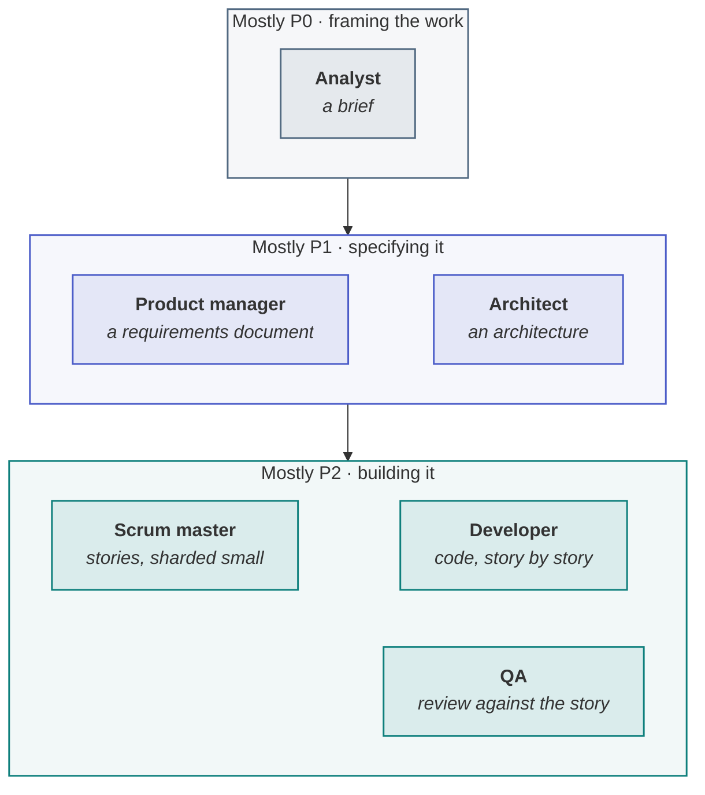

> [!TIP]
> **The BMAD Method in one sentence.** BMAD — the *Breakthrough Method for Agile AI-Driven
> Development*, an open-source method from BMad Code — structures building with AI the way an agile
> team is structured: specialised agent personas such as an analyst, a product manager, an architect,
> a scrum master, a developer and QA, each producing a versioned document the next one builds on, so
> that decisions stay explicit and the context carries forward.

**In this lesson** you'll learn:

- what the BMAD Method is, who publishes it, and how its personas hand work on;
- how it has evolved, and what stays constant across its versions;
- when its paper trail pays for itself, and when it is overhead.

## Sound familiar?

- A single long AI conversation "designed" the system, and nobody can find where any decision was made.
- An auditor asks who approved the architecture, and the answer is a chat log.
- The coding agent builds each story in isolation, and the pieces do not fit.

BMAD was built against the first two, and its hand-offs are designed to prevent the third.

## What is the BMAD Method?

The BMAD Method is an open-source framework, published by BMad Code on GitHub as `BMAD-METHOD`, for
structuring software development done with AI agents. Its core idea is borrowed from agile teams:
instead of one general-purpose assistant doing everything in one conversation, you run **focused
personas** that each own one kind of work and hand the next a **document**. The documents — a brief,
a requirements document, an architecture, small stories — are the single source of truth, so every
AI pass is incremental and each decision can be traced to the artefact that made it.

## How BMAD works, step by step

### Step 1 · Plan with personas, not one long chat

Planning runs through personas modelled on agile roles: an **analyst** turns an idea into a brief, a
**product manager** writes the requirements, an **architect** designs the system. Each works from the
previous document rather than from a shared conversation, which is what keeps the decisions explicit.

### Step 2 · Shard the plan into small stories

A **scrum master** persona breaks the plan into small, self-contained stories — BMAD calls the pieces
*shards* — each carrying the context a developer agent needs. It is the same move as this playbook's
story file: context by reference, the spec, the tools, the tests and the done-when in one file.

### Step 3 · Build and verify story by story

A **developer** persona implements one story at a time, and **QA** checks the result against the
story rather than against a general impression. Because the story is a file, the review is a diff and
the work can be re-run.

### Step 4 · Let the process size itself

BMAD has changed quickly. Its earlier releases were described as a four-phase pipeline — analysis,
planning, solutioning and implementation — while its current documentation frames the loop as
**clarify, plan, build and verify, then learn and adjust**, with small changes going straight to the
build and complex work getting deeper planning. What stays constant is the principle in its own
words: decisions stay explicit, context carries forward, and the process sizes itself to the work.

## When BMAD pays, and when it does not

| Change | BMAD's persona trail | Why |
| --- | --- | --- |
| A new feature across several teams | **Worth it** | The versioned hand-offs are the integration seam between teams |
| Audited or regulated work | **Worth it** | The trail is the evidence an auditor asks for |
| A standard feature for one team | Optional | Spec-driven development and the gates usually suffice |
| A one-line fix, even to a money cap | **Overhead** | Six documents for one line; the depth comes from the risk band, not the persona count |

The failure this playbook sees most is adopting a method as an identity. "We are a BMAD shop" means
the persona trail runs on a typo fix, and within a month the team quietly skips it everywhere —
including on the audited work it was built for. [How much process a change needs](lesson:how-much-process-does-a-change-need).

## Where you'll use it

- **On complex, multi-team or audited work**, where a versioned trail of decisions is the point.
- **When one long AI conversation has become the design**, and you need the decisions out of it.
- **Alongside the agentic PDLC**: BMAD structures P0 to P2; the lifecycle adds the bar per slice, the
  authority budget and the operating loop that BMAD does not decide.

## Why it matters

BMAD is the clearest published answer to a real problem: unstructured, prompt-driven AI development
produces code nobody can audit and decisions nobody can find. Its personas and documents fix that —
at a cost in ceremony that is worth paying on some changes and not on others.

## Try it

Your team maintains a payments service. This week's work: (a) a new cross-border payout feature that
touches three teams and is reviewed by compliance; (b) renaming a log field. **Which gets the BMAD
persona trail?**

Show the answer

**The cross-border payout feature.** It crosses three teams — the versioned hand-offs are exactly
the integration seam BMAD provides — and compliance reads the result, so the trail is evidence rather
than overhead. Renaming a log field is shallow and reversible: a spec update and one editor agent are
enough. Both still get a spec; only one gets six documents.

## Key takeaways

1. **BMAD** structures AI-driven development as **agile personas handing versioned documents** to each other.
2. Its documents are **the single source of truth**, so decisions stay explicit and traceable.
3. Use it where a **trail is the point** — multi-team, audited work — and not as an identity on every change.

## FAQ

### What does BMAD stand for?

The Breakthrough Method for Agile AI-Driven Development. It is published as open source by BMad Code
in the `bmad-code-org/BMAD-METHOD` repository on GitHub, under the MIT licence.

### What are the BMAD agents?

Personas modelled on agile team roles — typically an analyst, a product manager, an architect, a UX
designer, a product owner, a scrum master, a developer and QA — each with its own instructions and
each producing a document for the next. The exact set has changed between releases.

### BMAD vs spec-driven development: which should I use?

They overlap. Spec-driven development makes the spec the artefact agents build from; BMAD adds a
pipeline of personas that produce and review those documents. Use spec-driven development on every
change, and add BMAD's persona trail on complex, multi-team or audited work.

### Does BMAD work with Claude Code or Cursor?

It is designed to run inside AI coding tools, and its documentation describes installing it into
them. Check the current release for the tools it supports, since it changes quickly.

## Sources and credits

| Idea | Origin | Source |
| --- | --- | --- |
| The BMAD Method, its personas and its documents | **Borrowed** | BMad Code. [BMAD-METHOD](https://github.com/bmad-code-org/BMAD-METHOD) · [docs.bmad-method.org](https://docs.bmad-method.org/) |
| Clarify, plan, build and verify, learn and adjust; the process sizes itself | **Borrowed** | [BMad Method documentation](https://docs.bmad-method.org/) |
| Analysis, planning, solutioning and implementation | **Borrowed** | extinctsion (2025). [BMAD: the agile framework that makes AI actually predictable](https://dev.to/extinctsion/bmad-the-agile-framework-that-makes-ai-actually-predictable-5fe7). DEV |
| Where BMAD sits on P0–P3, and when its trail pays | **Original** — this playbook | [The Agentic PDLC](wiki:The-Agentic-PDLC#how-the-named-methods-sit-on-the-spine) |
| The story file as BMAD's shard | **Original** — this playbook | [Engineering lead, step 2](site:engineering/) |
