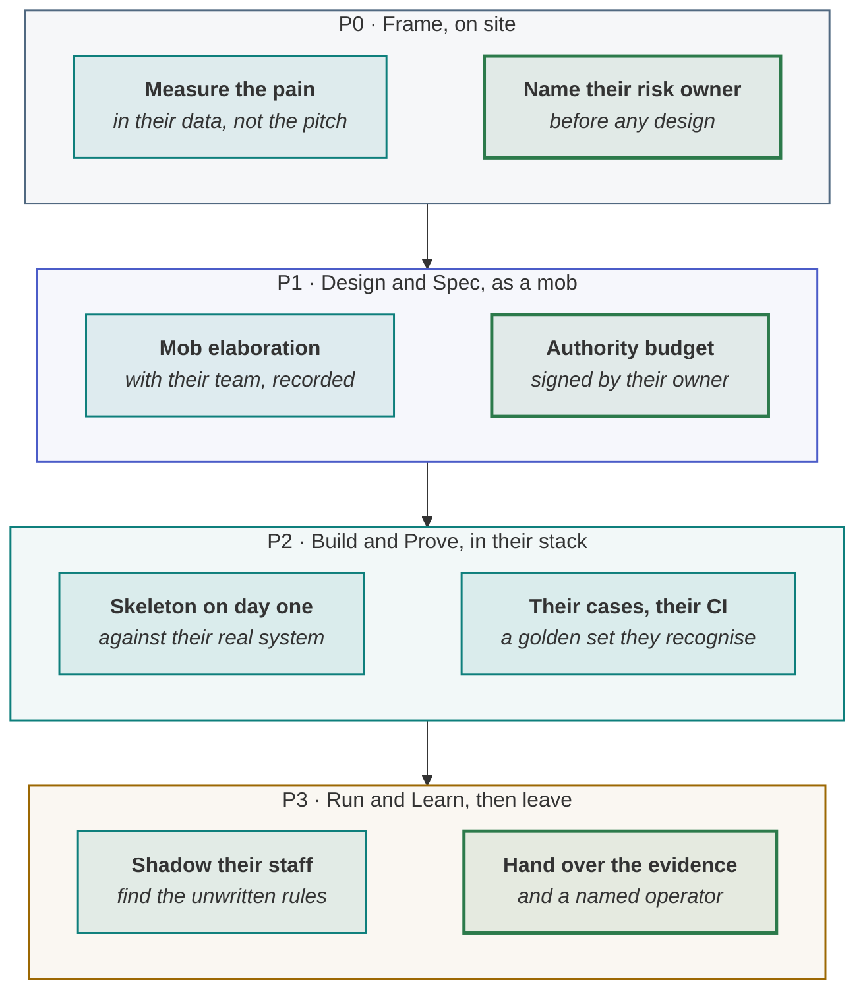

<!-- generated by site/learn_export.py from site/content/learn — edit the source, not this page -->
# AI-DLC and AIDD for Forward-Deployed Engineers: A Field Guide

*You carry the whole lifecycle into someone else's organisation — and the decisions that are theirs to make stay theirs, even when it would be faster to make them yourself.*

**6 min read** · Intermediate · Lesson 5 of 9 in [By role](Tutorial-By-Role) · Updated 23 Sep 2026 · [Read it on the site, with live diagrams ↗](https://akash-coded.github.io/aws-bedrock-agentcore-strands/learn/ai-dlc-for-forward-deployed-engineers/)

> [!TIP]
> **The field guide in one sentence.** A forward-deployed engineer runs the whole agentic lifecycle
> inside a customer's organisation — measuring the pain in *their* data, running AI-DLC's mob sessions
> with *their* people, building with AIDD habits in *their* stack — while making sure every decision
> that trades their risk against their return is signed by *their* owner, and leaving behind an evidence
> pack and a named person to run it.

**In this lesson** you'll learn:

- how AI-DLC and AIDD change when you run them inside a customer rather than your own team;
- the three decisions a forward-deployed engineer must get signed and must never make alone;
- how to hand over so the system survives your leaving.

## Sound familiar?

- The pilot was scoped from the sales deck, and the customer's real pain turned up in week three.
- You set the refund limit yourself because the customer's risk team was slow, and now it is yours.
- The deployment worked while you were on site, and quietly degraded after you left.

Each is a decision that belonged to the customer being made — or left unowned — by the person who was
there. A forward-deployed engineer's leverage is speed; the risk is that speed moves decisions to the
wrong side of the contract.

## What is a forward-deployed engineer?

A forward-deployed engineer (FDE) is a software engineer embedded with a customer to make a technical
deployment succeed in that customer's systems and workflows. The role was popularised by Palantir and is
now common at AI companies, including OpenAI and Anthropic. Where a product engineer builds one
capability for many customers, an FDE builds whatever one customer needs — which, with AI agents, means
running the whole lifecycle, fast, in someone else's organisation.

## The field guide, step by step

### Step 1 · Measure the pain in their data, in week one

Replace the pitch with a pain register line from the customer's own records: who, how often, what it
costs, and the evidence. It is also your first test of their data access — which is usually the
longest lead time you will meet. [P0 Frame](P0-Frame-Is-an-AI-Agent-Worth-Building)

### Step 2 · Name their risk owner before you design anything

Find the person in the customer's organisation who can accept risk on each consequential action — money,
identity, customer communications. If nobody can, you have found the first blocker, and it is not a
technical one.

### Step 3 · Run Inception as a mob, with their people

AI-DLC's **Mob Elaboration** is well suited to a customer site: the AI proposes requirements and asks its
clarifying questions, and the customer's own experts answer in the room. Record who answered what — the
customer's decisions should carry the customer's names. [What is AI-DLC?](What-Is-AI-DLC-AWS-AI-Driven-Development-Lifecycle)

### Step 4 · Get the authority budget signed by them

Autonomy per action, the caps and the approvals are **theirs**: a table of actions, each with a level
and an approver, signed by the risk owner from step 2. You then enforce every cap in a tool signature
with tests — but you do not choose the numbers.
[Guardrails that hold](AI-Agent-Guardrails-That-Hold)

### Step 5 · Build with AIDD habits in their stack

A context file in *their* repository, story files per bolt, exact code first, and a walking skeleton
against *their* real system on day one — it will find the credentials, network and data problems while
they are cheap. Start their lead-time items immediately: model access in the region their data must stay
in, security review, change approvals. [AIDD](What-Is-AIDD-AI-Driven-Development)

### Step 6 · Prove it on their cases, in their pipeline

Build the golden set from the customer's historical cases, tagged by the slices *they* care about, and
wire the harness into *their* CI so the check outlives you. [Prove the bar](How-to-Prove-an-AI-Agent-Meets-Its-Bar)

### Step 7 · Shadow beside their staff

A shadow run at a customer finds the rules that live in people's heads. At SkyWays — this playbook's
fictional airline — fourteen disagreements were all one rule: the evening shift never uses a certain
partner after 18:00, because its transfer desk closes. No spec had it. [Shadow and cut-over](Shadow-Mode-and-Canary-Releases-for-AI-Agents)

### Step 8 · Hand over evidence and an owner, then leave

Leave behind the evidence pack, the two-number report and — most important — a **named person in their
organisation** who owns the running system: the drift watch, the rollback switches, the next brief. A
deployment with no owner after the FDE leaves has no P3. [The evidence pack](The-Evidence-Pack-Before-Each-Hand-off)

## What is yours, and what is theirs

| Yours to do | Theirs to decide |
| --- | --- |
| Measure the pain, run the mob sessions, build the system | Which pain is worth solving, and at what value |
| Enforce every limit in code, with tests | The limits themselves, and who may approve above them |
| Build the golden set and the harness | What counts as a right answer in their business |
| Run the shadow and rehearse the rollback | Whether to widen, and when |
| Hand over the evidence pack | Who runs it after you leave |

## Where you'll use it

- **On every customer deployment of an AI agent**, from the first on-site week.
- **When the customer's process is slower than yours**: speed up the mechanics, never the risk decisions.
- **In the contract and the statement of work**: name the customer's risk owner and operator in writing.

## Why it matters

Forward-deployed engineering exists to get AI from pilot to production inside real organisations. The
deployments that survive are the ones where the customer owns the decisions and the running system; the
ones that fail are the ones that depended on the engineer who has since gone home.

## Try it

A customer's compliance team will take three weeks to approve a refund limit. Your pilot ends in two.
**What do you do?**

Show the answer

**Ship everything except the unapproved action.** Run the refund action in shadow — deciding, logged,
never acting — while the rest of the pilot goes live on its own evidence. Record the open decision with
the compliance owner's name and date, and build the refund tool with the cap as a typed parameter so the
approved number is a one-line configuration change. Do not choose the limit yourself: that turns their
risk into yours.

## Key takeaways

1. An FDE runs **the whole lifecycle in someone else's organisation** — in their data, stack and pipeline.
2. **Their risk owner signs** the autonomy, the limits and the widening; you enforce them in code.
3. **Hand over evidence and a named operator**, or the deployment has no P3 after you leave.

## FAQ

### What does a forward-deployed engineer do?

Embeds with a customer to make a technical deployment succeed in that customer's systems — scoping the
real problem, integrating with their data and infrastructure, building and adapting the solution, and
handing it over. With AI agents, that means running the full lifecycle quickly at the customer site.

### How do forward-deployed engineers use AI-DLC?

AI-DLC's Mob Elaboration and Mob Construction fit customer sites well: the AI proposes and the customer's
experts decide in the room, with decisions recorded under their names. Bolts of hours or days suit
short engagements, and the adaptive workflows keep small customer requests from getting heavy process.

### What is the biggest risk in forward-deployed AI work?

That the engineer makes the customer's risk decisions — limits, autonomy, acceptance — because it is
faster, and then leaves. The decisions should be signed by the customer's owner, and the running system
should have a named operator in the customer's organisation.

### How is an FDE different from a solutions engineer?

A solutions engineer typically supports the sale and the design; a forward-deployed engineer builds and
ships inside the customer's environment, often on site, and stays until the deployment works in
production.

## Sources and credits

| Idea | Origin | Source |
| --- | --- | --- |
| The forward-deployed engineer role and its origin | **Borrowed** | Wikipedia. [Forward Deployed Engineer](https://en.wikipedia.org/wiki/Forward_Deployed_Engineer) |
| Mob Elaboration and bolts | **Borrowed** | Raja SP (2025). [AI-Driven Development Life Cycle](https://aws.amazon.com/blogs/devops/ai-driven-development-life-cycle). AWS |
| The field guide, and the split between what the FDE does and the customer decides | **Original** — this tutorial | [The Agentic PDLC](The-Agentic-PDLC) |
| The SkyWays shadow finding | **Illustrative** — a fictional airline | [DevOps, step 5](https://akash-coded.github.io/aws-bedrock-agentcore-strands/devops/) |

---

| | |
| :--- | ---: |
| [← For engineers](Agentic-PDLC-for-Software-Engineers) | [For QA →](Agentic-PDLC-for-QA-Testing-Probabilistic-Software) |

**[All lessons](Start-Here)** · **[By role](Tutorial-By-Role)** · [This lesson on the site](https://akash-coded.github.io/aws-bedrock-agentcore-strands/learn/ai-dlc-for-forward-deployed-engineers/)
