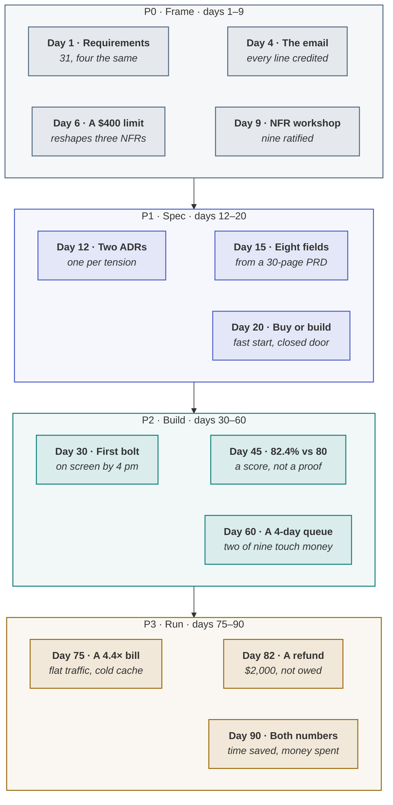

<!-- generated by site/learn_export.py from site/content/learn — edit the source, not this page -->
# Agentic AI Case Study: SkyWays, 90 Days from Pain to Proof

*A case study with its failures left in. Three of the thirteen episodes go wrong, and they teach more than the ten that go right.*

**6 min read** · Beginner · Lesson 1 of 4 in [Practice](Tutorial-Practice) · Updated 23 Sep 2026 · [Read it on the site, with live diagrams ↗](https://akash-coded.github.io/aws-bedrock-agentcore-strands/learn/skyways-case-study/)

> [!TIP]
> **The case in one sentence.** SkyWays is this playbook's worked example — a fictional airline building
> a rebooking assistant for disrupted passengers, with four people: Priya owns the product, Arjun the
> architecture, Sam the engineering and Maya the quality. Its ninety days run in thirteen episodes, each
> opening on a number and closing one of the eight loops, from 31 requirements on day 1 to two numbers
> in front of the steering committee on day 90.



**In this lesson** you'll learn:

- the thirteen episodes in order, and what each one produced;
- the four moments that went wrong, and the control each one left behind;
- how to use the case to rehearse your own project before it starts.

## Sound familiar?

- Case studies that show the launch and skip the three months before it.
- Numbers quoted without the day they were measured or the decision they changed.
- A success story with no incident in it, which is how you know it was edited.

SkyWays is built the other way round: every episode carries a number, and the failures stay in.

## What is the SkyWays case?

**A fictional airline, one agent, ninety days — and every number in it is illustrative.** The request
was "make rebooking smarter". Two days later it read: disrupted passengers wait an average of **38
minutes** for a rebooking decision; **240 cases a day**; **11% are codeshare**, which no simple rule can
handle; measured cost **$9.40 a case**. The AI-fit verdict was *agentic with gates*: a proposed rebooking
can be withdrawn, a cash refund cannot, so the gate went on the refund.

## The thirteen episodes, step by step

| Day | What happened | Loop it closes | What it left behind |
| --- | --- | --- | --- |
| 1 | Two discovery meetings: 31 requirements from six people, four of them the same one | Requirements | Discovery notes, stakeholder map |
| 4 | The requirements email keeps all 31 lines, each credited to whoever said it | Requirements | Credited email, consolidated requirements with rationale |
| 6 | Compliance adds one constraint — every refund over $400 needs a named approver | Requirements | 7 constraints by type, 9 candidate NFRs, utility trees |
| 9 | Six stakeholders, two hours: nine NFRs ratified, three of them in tension | Requirements | Ratified NFRs, 3 sensitivity points |
| 12 | Two decision records and a third scheduled — one per sensitivity point, no more | Decision | ADR-001 to ADR-003 |
| 15 | A 30-page PRD becomes an eight-field spec; the five agentic fields were undecided | Spec | Spec in EARS, a bar per slice |
| 20 | Three ways to get an agent framework, six weighted criteria, a three-year cost | Decision | Decision matrix, ADR-004 |
| 30 | A walking skeleton reads a booking and shows it by four in the afternoon | Delivery | Bolt plan, story file, context file |
| 45 | 500 golden cases score 82.4% against an 80% bar | Trust | Golden set, checker per slice, shadow plan |
| 60 | Nine pull requests and a four-day queue | Delivery | Review routed by risk band |
| 75 | The token bill is 4.4 times the estimate, with traffic flat | Cost | Root-cause note, caching and routing config |
| 82 | A $2,000 refund goes out that was not owed | Incident | Postmortem, ADR, lower autonomy, next P0 brief |
| 90 | Two numbers in front of the steering committee | Governance | Two-number report, maturity check |

Read in order, the playbook's artefacts arrive in the order a real team produces them.
[The eight loops](The-8-Feedback-Loops-of-Agentic-Delivery)

## The four moments that went wrong

### Day 45 · A score that looked like a pass

412 of 500 is 82.4%, above an 80% bar — and its lower bound is 79.1%, below it. Maya's verdict was
"probably above the bar, not yet proven", and the shadow run started that afternoon instead of the
launch. [Prove the bar](How-to-Prove-an-AI-Agent-Meets-Its-Bar)

### Day 60 · Review as if every change moved money

Every change was read by two senior engineers; only two of the nine touched money. Sorted by what they
touch, two went to two readers first, three to one reader, and four were proven by the harness alone.
[Review AI-generated code](How-to-Review-AI-Generated-Code-by-Risk)

### Day 75 · A bill with no runaway in it

Four ordinary habits multiplied, and the trace showed the cache had stopped hitting after the second
week. The fix was a design change with an order to it, not a spending freeze. [Why the bill is
4×](Why-Your-AI-Agent-Costs-4x-the-Estimate)

### Day 82 · A cap that lived in a prompt

The $400 limit had been a constraint since day 6 and was written into the prompt; the refund tool's
signature accepted any amount. The postmortem named the missing control, not a person, and the incident became the next P0.
[AI incident postmortems](Postmortems-for-AI-Incidents-Find-the-Missing-Control)

## Where you'll use it

- **Before your own project starts**: run the ninety days as a simulation, one decision per episode.
- **As a template**: every calculator in the simulator opens with SkyWays' numbers, ready to replace.
- **In training**: give each role its episodes, and ask what they would have done on day 45.

## Why it matters

A case with its failures left in teaches the controls; a success story teaches nothing you can copy.
Each of the four failures above produced an artefact the next feature inherits — a lower bound, a review
policy, a caching configuration, a cap in code — which is the practical meaning of a process that learns.

## Try it

Three of the thirteen episodes close loops that nobody is waiting on — no downstream person will chase
them if they stay open. **Which three, and why do they need a named owner?**

<details><summary>Show the answer</summary>

**Day 75 (cost), day 82 (incident) and day 90 (governance).** The other loops close forward into the
next phase, where someone needs the artefact and will ask for it. These three run backwards — cost into
design, incident into the next frame, governance across the whole lifecycle — so nobody downstream is
blocked when they stay open. Unless a named person owns each, the bill, the incident and the review of
whether it is working all get handled once and never fed back.

</details>

## Key takeaways

1. **Thirteen episodes, eight loops**: each opens on a number and leaves an artefact behind.
2. **Four failures, four controls**: a lower bound, review by risk, a design fix, a cap in code.
3. **Rehearse it first**: the simulator runs the same ninety days, one decision at a time.

## FAQ

### Is SkyWays a real airline?

No. SkyWays is a fictional airline built as a worked example, and every figure in it is illustrative. The
methods are real, and each is credited to its source in this tutorial.

### What does the SkyWays agent do?

It ranks rebooking options for disrupted passengers, including codeshare cases that no simple rule can
handle, and rebooks or refunds within limits. A rebooking can be withdrawn and a cash refund cannot, so
refunds carry a cap and a named approver.

### How long did the SkyWays project take?

Ninety days from the first discovery meeting to the steering committee, with the first bolt on day 30,
the shadow run from day 45 and the first report of both numbers on day 90.

### Can I run the SkyWays case as a simulation?

Yes. The simulator's "Ninety days of SkyWays" simulation asks for one decision in each of the thirteen
episodes and shows what each option does to the episodes that follow.

## Apply it in your role

| If you are… | Do this | The AI-augmented shortcut |
| --- | --- | --- |
| **A forward-deployed engineer** | Use SkyWays as the rehearsal before a real engagement: run the ninety days in the simulator, and write down where your customer will differ. | Ask a model to map each SkyWays episode onto your customer's likely equivalent. |
| **A product manager or FDPM** | Take one episode a week into the team retrospective: what would we have done on day 45? | Have a model turn an episode into a 20-minute team exercise with a debrief. |
| **A GenAI or agentic AI engineer** | Reproduce the engineering failures in a sandbox — the four-day queue, the 4.4× bill, the cap in a prompt — and write the test that catches each. | Ask a coding agent for a minimal reproduction of the day-82 refund, with a failing test. |

**Across the enterprise.** Use the case as shared vocabulary across teams. "A day 82" quickly becomes
shorthand for a cap that lived in a prompt, and saves a paragraph in every review.

**The ten-minute workflow.** Find your own day 45 before it arrives:

```text
Here are the thirteen SkyWays episodes: <list them from the lesson>. For our project <describe>, write the
equivalent of each episode — the day it is likely to happen, the number it would carry, the loop it
closes — and mark the three we are least prepared for.
```

## Sources and credits

| Idea | Origin | Source |
| --- | --- | --- |
| SkyWays, its cast and its thirteen episodes | **Illustrative** — a fictional airline | [Ninety days of SkyWays](https://akash-coded.github.io/aws-bedrock-agentcore-strands/simulator/#/story) |
| The eight loops the episodes close | **Original** — this playbook | [The Loop Map](https://akash-coded.github.io/aws-bedrock-agentcore-strands/simulator/#/loopmap) |
| Utility trees and sensitivity points | **Borrowed** | Kazman, R., Klein, M. & Clements, P. (2000). *ATAM*. SEI, CMU/SEI-2000-TR-004 |
| Architecture decision records | **Borrowed** | Nygard, M. (2011). *Documenting Architecture Decisions* |
| The EARS acceptance syntax | **Borrowed** | Mavin, A. et al. (2009). Easy Approach to Requirements Syntax. *IEEE RE'09* |

---

| | |
| :--- | ---: |
| [← Rolling it out in 90 days](How-to-Roll-Out-Agentic-AI-Delivery) | [The operating rhythm →](Agentic-Delivery-Cadence-Daily-Weekly-Quarterly) |

**[All lessons](Start-Here)** · **[Practice](Tutorial-Practice)** · [This lesson on the site](https://akash-coded.github.io/aws-bedrock-agentcore-strands/learn/skyways-case-study/)

<sub>✏️ This page is generated from [`site/content/learn/lessons/skyways-case-study.md`](https://github.com/akash-coded/aws-bedrock-agentcore-strands/blob/main/site/content/learn/lessons/skyways-case-study.md). To change it, [edit the lesson](https://github.com/akash-coded/aws-bedrock-agentcore-strands/edit/main/site/content/learn/lessons/skyways-case-study.md) — an edit made here is replaced at the next sync.</sub>
