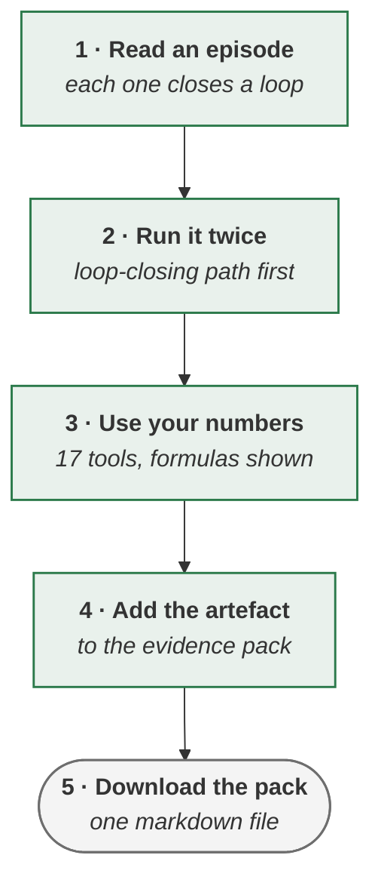

<!-- generated by site/learn_export.py from site/content/learn — edit the source, not this page -->
# Agentic AI Simulator: Practise 90 Days of Delivery Decisions

*Reading about a shadow run is not the same as deciding whether to end one. The simulator puts you in the chair, with the consequences shown.*

**6 min read** · Beginner · Lesson 3 of 4 in [Practice](Tutorial-Practice) · Updated 23 Sep 2026 · [Read it on the site, with live diagrams ↗](https://akash-coded.github.io/aws-bedrock-agentcore-strands/learn/agentic-delivery-simulator/)

> [!TIP]
> **The simulator in one sentence.** The SkyWays simulator is a free companion to this tutorial that
> runs entirely in your browser: thirteen dated episodes of one fictional project, nine simulations that
> ask for a decision and show what each option does to the steps that follow, seventeen tools that open
> filled in with SkyWays' numbers ready for yours, and an evidence pack that collects every artefact and
> downloads as one markdown file.

**In this lesson** you'll learn:

- what each part of the simulator is for, with a screenshot of each;
- how to run a simulation so that it teaches something, rather than being won;
- how to take its artefacts into your own project.

## Sound familiar?

- You have read about bars and shadow runs, and never had to make the call with a room watching.
- The last workshop taught a framework with slides, and nothing happened when anyone chose badly.
- Templates arrive empty, and nobody on the team knows what a good one looks like.

The simulator is built for all three: decisions with consequences, and every template filled in first.

## What is the SkyWays simulator?

**One web page, no sign-in, and nothing you type leaves your browser.** It follows SkyWays — this
playbook's fictional airline — through the same ninety days as [the case study](Agentic-AI-Case-Study-SkyWays),
and every concept in it links to where it is taught, where it is practised and the tool that applies it.
The evidence pack is kept in your browser only.

## Use it, step by step

### Step 1 · Start with the story

Thirteen episodes, each opening at a moment with a number in it and closing one loop. Read them in
order and the artefacts arrive in the order a real team produces them. [Open the story](https://akash-coded.github.io/aws-bedrock-agentcore-strands/simulator/#/story)

### Step 2 · Run a simulation twice

Each of the nine simulations is a sequence of decisions on the SkyWays case, and each option shows what
it does to the steps that follow and the artefact it leaves behind. Run each one twice: once on the path
that closes the loop, and once on the path that feels faster — the second run is where the lesson is.

The nine are the NFR workshop, the paper agent, build, buy or borrow, ninety days of SkyWays, the
six-week deadline, the review bottleneck, the pricing-page walk, the bill blowout and the incident.
[All simulations](https://akash-coded.github.io/aws-bedrock-agentcore-strands/simulator/#/simulations)

### Step 3 · Replace SkyWays' numbers with yours

Every tool arrives filled in, so the result can be read before anything is typed; replace the values
with your project's and the result and the artefact change as you type. Each tool shows the formula or
rule it uses.

The calculator states its confidence as **one-sided 95%**, the constant 1.645. This tutorial quotes the
more conservative 1.96, so the same cases read 79.1% and 968 here, and 79.6% and 682 there. The verdict
is the same: not yet proven. [The toolkit](https://akash-coded.github.io/aws-bedrock-agentcore-strands/simulator/#/toolkit)

### Step 4 · Keep the Loop Map in view

One picture that every page returns to: four phases drawn as a closing loop, the hand-off artefacts
written on the arrows, and the eight loops numbered around it. Select a phase or a loop to see where it
is worked through.

### Step 5 · Collect the evidence pack

The pack lists the documents that the product manager, the architect and the engineering lead hand to
each other at the four hand-offs, marks the ones you already hold, and downloads as one markdown file
that can go straight into a repository. [The evidence pack](The-Evidence-Pack-Before-Each-Hand-off)

### Step 6 · Go deeper by role

Three playbooks — Solution Architect, Product Manager, and Engineering and QA — walk the same case from
P0 to P3 in eighteen steps each, with the traditional practice and the agentic change side by side. The
simulator's own guide suggests paths by the time you have: a 90-minute briefing, a half-day workshop or a
full day. [How to use the simulator](https://akash-coded.github.io/aws-bedrock-agentcore-strands/simulator/#/guide/g-how)

## Where you'll use it

- **Before a project starts**, as a rehearsal: run the ninety days, then the simulation for your riskiest step.
- **In team training**: one simulation per session, run twice, with the second run argued out loud.
- **On a live project**: open the tool for the artefact you owe next, and replace SkyWays' numbers.

## Why it matters

Decisions are learned by making them. A meta-analysis of 225 studies found that students taught with
active learning outperformed those taught by lecture, and were less likely to fail. The simulator applies
the same idea to delivery: a choice, its consequence, and the artefact it leaves, before the real ones.

## Try it

In the confidence calculator, 412 of 500 against an 80% bar gives a lower bound of 79.6% and 682 cases
needed. The tutorial says 79.1% and 968. **Which is wrong?**

Show the answer

**Neither.** They use different confidence levels. 0.824 − 1.645 × √(0.824 × 0.176 ÷ 500) = 0.796 is a
one-sided 95% bound; with 1.96 it is 0.791, which is one-sided 97.5%. The cases needed scale with the
square of the constant: 1.96² ÷ 1.645² ≈ 1.42, and 682 × 1.42 ≈ 968. Both say the bar is not yet proven.
Pick one convention per programme and write it on the bar sheet, so that nobody chooses it after seeing
the score.

## Key takeaways

1. **Five parts**: the story, nine simulations, seventeen tools, the Loop Map and the evidence pack.
2. **Run each simulation twice** — the path that feels faster is where the lesson is.
3. **Every tool starts filled in**: read SkyWays' result first, then replace the numbers with yours.

## FAQ

### Is the agentic AI simulator free?

Yes. It is a single web page with no sign-in, published with this playbook. Everything runs in your
browser, and nothing you type is sent anywhere.

### Which simulation should I run first?

"Ninety days of SkyWays" for the whole arc — one decision per episode — then the one closest to your
next hard decision: the review bottleneck, the bill blowout or the incident.

### Can I use the simulator for team training?

Yes. Run one simulation per session, twice: once choosing the loop-closing option and once the faster
one, and discuss why the consequences differ. The artefacts from the session go into the evidence pack.

### Does the simulator save my work?

The evidence pack is kept in your browser's local storage, on that device only. Download it as a
markdown file to keep it or share it.

## Sources and credits

| Idea | Origin | Source |
| --- | --- | --- |
| The simulator, its simulations, tools and evidence pack | **Original** — this playbook | [The simulator](https://akash-coded.github.io/aws-bedrock-agentcore-strands/simulator/#/) |
| Active learning outperforms lecture | **Borrowed** | Freeman, S. et al. (2014). Active learning increases student performance in science, engineering, and mathematics. *PNAS* 111(23) |
| The Wilson bound the calculator shows beside the normal one | **Borrowed** | Wilson, E. B. (1927). *JASA* 22(158) |
| SkyWays and its figures | **Illustrative** — a fictional airline | [Ninety days of SkyWays](https://akash-coded.github.io/aws-bedrock-agentcore-strands/simulator/#/story) |

---

| | |
| :--- | ---: |
| [← The operating rhythm](Agentic-Delivery-Cadence-Daily-Weekly-Quarterly) | [Twelve exercises →](Agentic-PDLC-Exercises-with-Answers) |

**[All lessons](Start-Here)** · **[Practice](Tutorial-Practice)** · [This lesson on the site](https://akash-coded.github.io/aws-bedrock-agentcore-strands/learn/agentic-delivery-simulator/)
