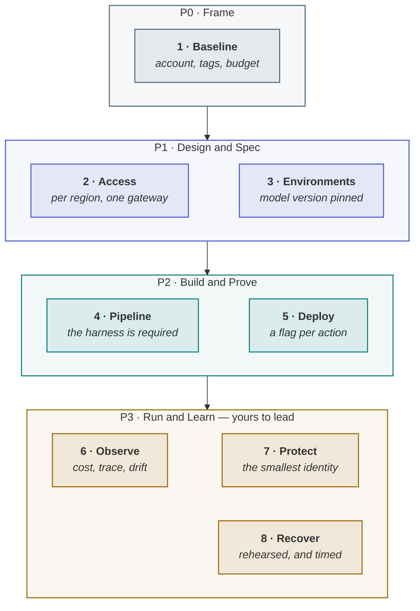

<!-- generated by site/learn_export.py from site/content/learn — edit the source, not this page -->
# The Agentic PDLC for DevOps and Platform Teams

*Some of what this workload needs bills for existing, the model version is part of the environment, and the prompt is a deployable artefact.*

**6 min read** · Intermediate · Lesson 7 of 9 in [By role](Tutorial-By-Role) · Updated 23 Sep 2026 · [Read it on the site, with live diagrams ↗](https://akash-coded.github.io/aws-bedrock-agentcore-strands/learn/agentic-pdlc-for-devops/)

> [!TIP]
> **The role in one sentence.** In the agentic PDLC DevOps and platform make the system repeatable,
> observable and reversible: a landing zone with cost attributable per feature, one model gateway every
> call passes through, environments with the model version pinned, the evaluation harness as a check the
> merge cannot bypass, one flag per action, traces that redact, and rollbacks timed before anyone needs them.



**In this lesson** you'll learn:

- the platform team's eight steps, and why several of them must start in week one;
- the three things a normal operations stack does not watch, and how to add them;
- what "enforced" means for a platform, as distinct from "requested".

## Sound familiar?

- A test collection was stood up in week two, never wired in, and never switched off — until the bill.
- The same model call exists in four codebases, each with its own retry logic and none with a log.
- Nobody has ever timed how long it takes to switch the agent off.

The platform question for an agentic workload is not different in kind. It is different in **when**:
several of the costs and delays arrive before a single line of the feature is written.

## What changes for DevOps and platform?

**You stop treating a prompt as configuration, and start treating it as a deployable artefact.** An
agentic system has three things to deploy and roll back — the code, the prompt and the model version —
and three signals ordinary monitoring lacks: what a case costs, what the system did and why, and whether
its behaviour is drifting.

## Your eight steps

### P0 · Frame — the platform, first

**1 · Baseline.** The account, isolation and a tag scheme that makes cost attributable per feature, plus
a budget alarm — before any resource exists, because some services this workload uses bill for
existing rather than for use.

### P1 · Design & Spec

**2 · Access.** Model access is granted per model and **per region**, on request: a lead-time item for
day one. SkyWays lost six days because access existed in one region and the data had to stay in
another. Then put every call behind **one gateway** with a per-call log. **3 · Environments.** Make them
comparable, with the **model version pinned** in each manifest — for a probabilistic system the model is
part of the environment.

### P2 · Build & Prove

**4 · Pipeline.** The evaluation harness as a **required status check**, not a comment that can be clicked
past. **5 · Deploy.** One flag per action with four states — shadow, 5%, wider, all — and every trace
recording which flag state and prompt version produced it. [Shadow and cut-over](Shadow-Mode-and-Canary-Releases-for-AI-Agents)

### P3 · Run & Learn — the phase you lead

**6 · Observe** the three signals: cost per case, a trace per consequential action, the output mix.
**7 · Protect**: the smallest identity that can do the job, an egress allowlist, and the injection suite on
every pull request. **8 · Recover**: throw every switch with a stopwatch before cut-over — SkyWays measured
40 seconds, 2 minutes, 3 minutes and 11 minutes — and cap loops and cost per case.

## What is yours, and what is not

| Yours to own | Not yours |
| --- | --- |
| The landing zone and the per-feature cost tags | The acceptance bar — you make the gate unarguable; you do not set it |
| The model gateway and its per-call log | Prompt content — you version, deploy and roll it back; you do not write it |
| The pipeline, with the harness as a required check | Which slices exist and what a mistake costs — the business's input to your caps |
| Three deployable artefacts and three rollback paths | The behaviour, release and expansion gates — you supply the evidence |
| The enforced controls: role scope, egress, caps in signatures; the kill switch | |

## How to use a model in this role

Use a model where there is **a schema to be right against and a cheap way to check**. It is strong at
infrastructure templates, workflow files, policy shapes and first drafts of scripts, and confidently
wrong about your account boundaries, your regions, your quotas and what a permission actually reaches.
Let the model write the change and a machine judge it — a linter, a diff, a plan output, an access
analyser — then read the diff rather than the prose.

## Where you'll use it

- **In week one**: the account, the tags, the budget alarm and the access requests.
- **Before the first feature branch**: the gateway and the harness as a required check.
- **Before cut-over, and after every incident**: the rollback rehearsal.

## Why it matters

Most of the surprises in an agentic programme land on the platform: the bill with no traffic change,
the quality drop with no deploy, the access that takes a week, the rollback nobody has tried. Each has a
platform control, and each control is cheapest before it is needed.

## Try it

Quality dropped on Tuesday. Nobody deployed. **What should the platform already be able to tell you,
and from where?**

<details><summary>Show the answer</summary>

**Which model and prompt version answered every call, and when that changed.** The gateway's per-call
log should show whether calls were routed to a different model — a failover to a smaller one, say — or
whether the provider updated the model behind an alias; the pinned version in the environment manifest
shows what *should* be answering. If neither changed, look at the inputs and retrieved data for drift.
Without the per-call log, the only evidence is the complaint.

</details>

## Key takeaways

1. **Start the platform in week one**: tags, budget, access requests, then one gateway with a per-call log.
2. **Three artefacts, three rollbacks** — code, prompt, model version — and a flag per action.
3. **Three new signals** — cost per case, trace, output mix — and rollbacks timed before cut-over.

## FAQ

### What is LLMOps?

The operational practice of running applications built on large language models: managing model access
and versions, routing and caching calls, deploying prompts as artefacts, evaluating changes before they
ship, tracing what the system did, monitoring cost and drift, and rolling back quickly.

### Why do AI agents need a model gateway?

Because without one, model calls scatter across codebases with different retries, no shared log and no
single place to set routing, budgets or fallbacks. A gateway makes every call visible per case — which
is what turns a surprise bill or a quality drop into a diagnosis.

### Should prompts be version-controlled?

Yes. A prompt changes behaviour as much as code does, so it is versioned, reviewed, evaluated by the
harness, deployed behind a flag and rolled back like code, and every trace records which version
produced each response.

### What is the difference between MLOps and LLMOps?

MLOps grew up around training and serving your own models — data pipelines, training runs, model
registries. LLMOps is mostly about operating applications on top of models someone else trains:
prompts, routing, caching, evaluation, cost and drift.

## Apply it in your role

| If you are… | Do this | The AI-augmented shortcut |
| --- | --- | --- |
| **A forward-deployed engineer** | In a customer's AWS account the first week is platform work: model access per region, a gateway, cost tags, a budget alarm. | Ask a model to draft the day-one access requests and the IaC checklist from the customer's account structure. |
| **A product manager or FDPM** | Ask DevOps for the three rollback times before cut-over, and put them in the release gate. | Have a model turn the rollback rehearsal log into release-gate evidence. |
| **A GenAI or agentic AI engineer** | Treat prompts and model versions as deployable artefacts: versioned, flagged and rolled back like code. | Ask a coding agent to move prompts into versioned files loaded from a manifest, with the version logged on every call. |

**Across the enterprise.** A platform team provides the gateway, the landing zone, the harness template and
the trace for every AI product, and teams keep the freedom to choose their own editors.

**The ten-minute workflow.** A platform plan, as infrastructure as code:

```text
Write an infrastructure-as-code plan (CDK or CloudFormation) for an AI feature's platform: a cost tag
per feature, a budget alarm, model access in <regions>, a gateway that logs every call (model, tokens,
latency, feature, prompt version) and a feature flag per action with four states. List everything that
needs an access request with a lead time, and who it goes to.
```

## Sources and credits

| Idea | Origin | Source |
| --- | --- | --- |
| DevOps and platform's eight steps, owns and not-yours | **Original** — this playbook | [DevOps and platform, end to end](https://akash-coded.github.io/aws-bedrock-agentcore-strands/devops/) · [Role: DevOps](Role-DevOps) |
| Model access per model and per region | **Borrowed** — documented, September 2026 | Amazon Bedrock documentation; see [Error Index](Error-Index) |
| Least privilege | **Borrowed** | Saltzer, J. H. & Schroeder, M. D. (1975). *Proceedings of the IEEE* 63(9) |
| A model gateway with routing, budgets and a per-call log | **Borrowed** — documented | LiteLLM, as the named example; see [Sources and Confidence](Sources-and-Confidence) |
| The SkyWays examples | **Illustrative** — a fictional airline | [Journey: DevOps](Journey-DevOps) |

---

| | |
| :--- | ---: |
| [← For QA](Agentic-PDLC-for-QA-Testing-Probabilistic-Software) | [For business sponsors →](Agentic-PDLC-for-Business-Sponsors) |

**[All lessons](Start-Here)** · **[By role](Tutorial-By-Role)** · [This lesson on the site](https://akash-coded.github.io/aws-bedrock-agentcore-strands/learn/agentic-pdlc-for-devops/)

<sub>✏️ This page is generated from [`site/content/learn/lessons/agentic-pdlc-for-devops.md`](https://github.com/akash-coded/aws-bedrock-agentcore-strands/blob/main/site/content/learn/lessons/agentic-pdlc-for-devops.md). To change it, [edit the lesson](https://github.com/akash-coded/aws-bedrock-agentcore-strands/edit/main/site/content/learn/lessons/agentic-pdlc-for-devops.md) — an edit made here is replaced at the next sync.</sub>
