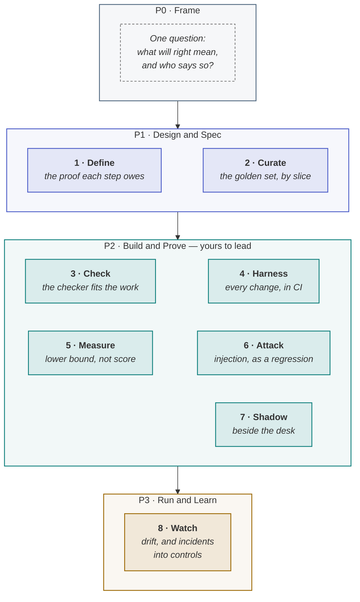

<!-- generated by site/learn_export.py from site/content/learn — edit the source, not this page -->
# The Agentic PDLC for QA: How to Test Probabilistic Software

*"It works" stops being a yes or a no. Your job becomes the number that says how often it works, and whether that number is proof.*

**5 min read** · Intermediate · Lesson 6 of 9 in [By role](Tutorial-By-Role) · Updated 23 Sep 2026 · [Read it on the site, with live diagrams ↗](https://akash-coded.github.io/aws-bedrock-agentcore-strands/learn/agentic-pdlc-for-qa/)

> [!TIP]
> **The role in one sentence.** In the agentic PDLC the QA lead decides what proof each kind of step
> owes, curates the golden set by slice, reports the lower bound rather than the score, matches a checker
> to each kind of work, runs the injection suite as a regression, compares the shadow run with the
> people doing the job, and watches for drift — and owns the behaviour and expansion gates.

**In this lesson** you'll learn:

- the QA lead's eight steps, from one question in P0 to the drift watch in P3;
- the three kinds of step and the three kinds of proof they owe;
- why the gates QA owns are arithmetic, and how to keep them that way.

## Sound familiar?

- You are asked to sign off a demo, and the demo is the only evidence there is.
- An accuracy figure goes into the board pack without a sample size, and nobody objects.
- The injection tests passed at launch and have not been run since.

The skills are the same; the object has changed. Software that is right a share of the time needs
proof that is a number, with a width, per slice.

## What changes for QA?

**You stop signing off on a demo, and start reporting a lower bound.** Exact work still gets exact tests.
But best-guess work — ranking, drafting, classifying — can only be measured as a share, against a bar,
on a sample; and a share from a sample is an estimate, not a fact. QA's new authority is arithmetic
rather than opinion: a slice whose lower bound is below its bar does not pass, whoever wants it to.

## Your eight steps

### P0 · Frame — one question

Ask what *right* will mean, and who says so. That is all P0 needs from you, and it is the question the
rest of your work depends on.

### P1 · Design & Spec

**1 · Define** the proof each kind of step owes: **exact** work a unit test, green or red; **best-guess**
work a measured share against a derived bar; **consequential** work a gate and a test that it refuses.
**2 · Curate** the golden set from real cases — fifty to start, five hundred to trust — each tagged by
slice. SkyWays' first fifty took an afternoon, and twenty-four failed.

### P2 · Build & Prove — the phase you lead

**3 · Check**: an exact check in code for arithmetic and rules, an independent judge for drafted text,
calibrated against human labels. **4 · Harness**: build → exact checks → golden slice → judge → per-slice
score → merge or reject, on every change. **5 · Measure**: the lower bound, never the score — 412 of 500
is 82.4%, and its lower bound of 79.1% does not prove an 80% bar. **6 · Attack**: the injection suite, every
entry point against every gated tool, weekly. **7 · Shadow**: agreement per slice over a fixed window,
money actions reported separately. [Prove the bar](How-to-Prove-an-AI-Agent-Meets-Its-Bar)

### P3 · Run & Learn

**8 · Watch** the output mix against two thresholds, with a breach wired to the release gate; and turn
every incident into an enforced control plus new golden cases. [Drift](AI-Drift-How-to-Catch-the-Defect-With-No-Error-Message)

## What is yours, and what is not

| Yours to own | Not yours |
| --- | --- |
| The behaviour gate: does it meet the spec, per slice, with the lower bound? | The bar itself — the PM derives it; you make it executable |
| The expansion gate: have we earned wider use? | The intent and plan gates — you are consulted |
| The golden set: which cases count, what each expects, its slice | The fix — you name the defect and the proof it owes |
| The checker per kind of step, and the judge's measured accuracy | Model, temperature, prompt wording — you assert on behaviour |
| The injection suite and its weekly run; the drift chart and its alert | |

## How to use a model in this role

Use a model for **the volume, never for the verdict**. It will turn a redacted ticket export into three
hundred candidate cases, cluster forty shadow disagreements into four themes, and write the harness that
runs them. It must not decide what counts as right, or grade its own family's outputs and hand you the
number unlabelled: a judge is a measuring instrument with an unknown error until you calibrate it
against people.

## Where you'll use it

- **At the behaviour gate**, where no score leaves your hands without its sample size and lower bound.
- **At every prompt, model or tool change**, where the harness and the injection suite run again.
- **Every week in production**, on the drift chart.

## Why it matters

In an agentic system QA is the only role whose gates are arithmetic. That makes QA the brake nobody can
argue with — and the reason a launch can be defended afterwards, because "it passed" means a lower bound
cleared a derived bar on a sample someone can inspect.

## Try it

A developer reports: "The new prompt improves accuracy from 80% to 85% on our 100-case test set." **What
do you ask before accepting it?**

Show the answer

**Per slice, lower bound, and the judge.** Which slices moved, and did any fall — an overall rise can
hide a drop on the slice that matters. What is the lower bound: on 100 cases, 85% has a Wilson lower
bound of about 77%, so against a bar above that it proves nothing yet. And how was "accurate" judged —
by an exact check, or by a model judge calibrated against human labels? Then run it through the harness
rather than accepting the report.

## Key takeaways

1. **Three kinds of step owe three kinds of proof**: a unit test, a measured share, a refusal test.
2. **Report the lower bound, never the score**, per slice, with the sample size beside it.
3. QA owns **behaviour and expansion**, and keeps the injection suite and the drift watch running.

## FAQ

### How do you test an AI agent?

Split its steps: exact steps get unit tests; best-guess steps are measured as a share on a golden set of
real cases, per slice, against a bar derived from what a mistake costs; consequential actions get tests
that prove their limits refuse. Then run an injection suite on every change, a shadow run before launch,
and a drift watch after.

### What does a QA lead do in an AI project?

Defines the proof each kind of step owes, curates the golden set by slice, chooses and calibrates the
checkers, runs the evaluation harness and the injection suite, measures lower bounds rather than scores,
compares the shadow run with the people doing the job, and owns the behaviour and expansion gates.

### How big should an AI test set be?

Fifty real cases per important slice to start finding problems, and around five hundred to prove a bar
with confidence — more when the score sits close to the bar, because the cases needed grow with the
square of the gap.

### Can an LLM grade another LLM?

Yes, as a judge for drafted text, provided it is independent of the model being judged and you have
measured how often it agrees with human labels on a held-back sample. An uncalibrated judge is another
unproven score.

## Sources and credits

| Idea | Origin | Source |
| --- | --- | --- |
| The QA lead's eight steps, owns and not-yours | **Original** — this playbook | [QA lead, end to end](https://akash-coded.github.io/aws-bedrock-agentcore-strands/qa/) · [Role: QA lead](Role-QA-Lead) |
| The Wilson score interval | **Borrowed** | Wilson, E. B. (1927). *JASA* 22(158) |
| Prompt injection as the top LLM risk | **Borrowed** | OWASP (2025). [Top 10 for LLM Applications 2025](https://genai.owasp.org/resource/owasp-top-10-for-llm-applications-2025/) |
| The SkyWays examples | **Illustrative** — a fictional airline | [Journey: QA lead](Journey-QA-Lead) |

---

| | |
| :--- | ---: |
| [← For forward-deployed engineers](AI-DLC-and-AIDD-for-Forward-Deployed-Engineers) | [For DevOps and platform →](Agentic-PDLC-for-DevOps-and-Platform-Teams) |

**[All lessons](Start-Here)** · **[By role](Tutorial-By-Role)** · [This lesson on the site](https://akash-coded.github.io/aws-bedrock-agentcore-strands/learn/agentic-pdlc-for-qa/)
