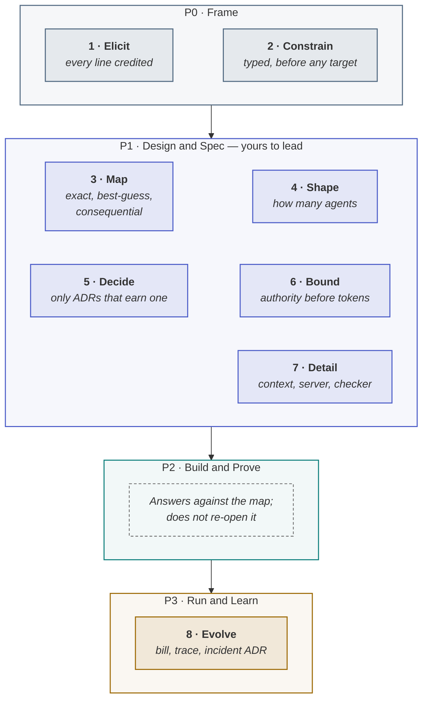

<!-- generated by site/learn_export.py from site/content/learn — edit the source, not this page -->
# Agentic PDLC for Solution Architects: Authority and Topology

*You stop specifying model settings and start specifying behaviours — and exactly where each limit lives in code.*

**6 min read** · Intermediate · Lesson 3 of 9 in [By role](Tutorial-By-Role) · Updated 23 Sep 2026 · [Read it on the site, with live diagrams ↗](https://akash-coded.github.io/aws-bedrock-agentcore-strands/learn/agentic-pdlc-for-solution-architects/)

> [!TIP]
> **The role in one sentence.** In the agentic PDLC the solution architect decides the shape of the
> system: which steps are exact, best-guess or consequential, how many agents it needs (start with one),
> what each tool may do and where its cap lives, where the checkers sit, and which few decisions earn a
> record — then turns every bill and incident into a design change.



**In this lesson** you'll learn:

- the architect's eight steps, and why P2 is the phase you deliberately stay out of;
- the four P1 decisions that make an agentic system safe: map, shape, bound and detail;
- what to record, what to leave to engineering, and where a model helps.

## Sound familiar?

- The design document specifies the model, the temperature and the framework version — and every one is wrong by the next release.
- An engineer built fifteen agents to show what the framework could do, and nobody can say why there are fifteen.
- The refund limit is in the design, the prompt and the slides, and not in the code.

The architect's job in an agentic system is less about boxes and arrows and more about **where
authority lives** and **where probability is allowed**.

## What changes for a solution architect?

**You stop specifying model settings and start specifying behaviours — and where the caps live.**
Temperature and framework versions belong to engineering and go stale; what does not go stale is which
steps may be probabilistic at all, what each tool may do, and where the checks sit. Those are the
decisions that make an agentic system safe.

## Your eight steps

### P0 · Frame — the evidence under the product manager's verdict

**1 · Elicit.** Two discovery meetings split by proximity to the work, every requirement credited to
the person who raised it. SkyWays: 31 lines from six people. **2 · Constrain.** Constraints sorted by
type *before* any quality target is set, because a constraint can make a target impossible — the $400
refund rule reshaped three of nine quality targets.

### P1 · Design & Spec — the phase you lead

**3 · Map** every step as exact, best-guess or consequential. **4 · Shape**: start with one agent and add
one only on a named limit — SkyWays' fifteen agents collapsed to one agent, a fan-out tool, a function
and a checker. **5 · Decide**: merge the stakeholders' utility trees and write a decision record only at
the sensitivity points. **6 · Bound**: the authority budget before the token budget — every tool banded,
every cap in a signature with tests. **7 · Detail**: layered context, one server per legacy system with
reads open and writes gated, and an independent checker after each expensive step.
[P1 Design & Spec](P1-Design-and-Spec-Write-a-Spec-an-Agent-Can-Build)

### P2 · Build & Prove — answer, do not re-open

In P2 you answer questions against the map; you do not re-open it. Every bolt was cut against the
design as signed, so a redesign mid-build moves the ground under work already in flight — if the map is
wrong, say so and re-cut in the open, rather than changing it quietly.

### P3 · Run & Learn

**8 · Evolve.** A bill that leaves its estimate becomes a new version of a decision record; an incident
becomes a typed parameter rather than a name. [The cost loop](Why-Your-AI-Agent-Costs-4x-the-Estimate)

## What is yours, and what is not

| Yours to own | Not yours |
| --- | --- |
| The ratified quality targets and their sensitivity points | The intent and release gates — the product manager's |
| The exact / best-guess / consequential map, and the proof each kind needs | Temperature, top-p, framework version — engineering picks the knobs |
| The shape: how many agents, and the limit that would justify another | The golden set's contents and the judge rubric — QA's |
| The authority budget and gate map, every cap in a signature | Which pain is worth solving, and what a mistake costs the business |
| The decision records, one per trade-off point, and the plan gate with the PM | |

## How to use a model in this role

Use a model where the work is **mechanical and checkable**, nowhere near the trade-offs. It will turn two
transcripts into a credited requirement register, rewrite nine adjectives as measurable scenarios, grep a
repository for arithmetic hiding in prompts, and draft a tool schema from an API. It will also band a
money tool as low risk because the diff is one line. Verify every band yourself.

## Where you'll use it

- **At the start of P0**, running the two discovery meetings and the constraint register.
- **Through P1**, where every decision that is expensive to reverse is yours.
- **After every bill anomaly and incident**, closing the loop in the design.

## Why it matters

Agentic systems fail at the seams the architect owns: a probabilistic step doing exact work, a swarm
where one agent would do, a cap that lives in a prompt, a checker that grades its own work. Each is a
design decision, cheap in P1 and expensive in production.

## Try it

A team proposes five agents for an insurance claims flow: an intake agent, a policy-lookup agent, a
fraud-scoring agent, a payout-calculation agent and a reviewer. **Using the shape rule, what would you
ask for?**

<details><summary>Show the answer</summary>

**A named limit for every agent beyond the first.** Five agents have ten possible hand-offs. Policy
lookup is exact — a function or a tool, not an agent. Payout calculation is arithmetic — a tested
function, never a model. Intake and fraud scoring may be one agent with tools. The reviewer is the one
worth keeping separate, because a checker's value is its independence. Likely result: one agent, a few
tools and functions, and one checker — with the limit that would justify a second agent written into
the record.

</details>

## Key takeaways

1. **Specify behaviours and where the caps live**, not model settings.
2. **Start with one agent**; add one only on a named limit, and keep checkers independent.
3. **Lead P1, stay out of P2's way**, and close bills and incidents back into the design.

## FAQ

### What does a solution architect do in an AI agent project?

Decides which steps may be probabilistic, how many agents the system needs, what each tool may do and
where its limits are enforced, how context is layered, where independent checkers sit, and which
decisions deserve a record — and turns production bills and incidents into design changes.

### Should I use a multi-agent architecture?

Start with a single agent and add another only when you can name the limit that forces it — a context
that genuinely overflows, or parallel work a tool cannot express. Each added agent multiplies hand-offs;
a fan-out tool usually gives the parallelism without them.

### How do you design permissions for an AI agent?

Set the authority budget before the token budget: band every tool by what it can change, from
read-only to irreversible, give the agent only the tools the job needs, put every cap in the tool's
signature with a test, and require a confirmation token the model cannot create for money actions.

### What goes in an architecture decision record for AI systems?

Only the decisions at genuine trade-off points — where changing the decision would change a quality
target — each naming the options it rejected and why. Model settings and framework versions do not
belong in one; they go stale in weeks.

## Apply it in your role

| If you are… | Do this | The AI-augmented shortcut |
| --- | --- | --- |
| **A forward-deployed engineer** | At a customer, draw the step map before the architecture. Which steps are exact, best-guess or consequential decides everything else. | Ask a model to draft the step map from the process description and mark every step that moves money or data. |
| **A product manager or FDPM** | Ask the architect for the authority budget in plain language: what the agent does alone, with a veto, with an approver, and never. | Have a model translate the authority budget into a one-page table for the sponsor. |
| **A GenAI or agentic AI engineer** | Build to the architect's decisions: caps in signatures, one agent until a named limit justifies a second, checkers after risky steps. | Ask a coding agent to compare the code with the decision records and list every divergence. |

**Across the enterprise.** An architecture review for agents reviews three artefacts — the step map, the
authority budget and the topology — rather than slides.

**The ten-minute workflow.** An authority budget that refuses to guess:

```text
Here are the actions our agent can take: <list>. For each, ask me what one mistake costs and whether it
can be undone. Then propose a risk band (R1 read-only to R5 not delegated), the autonomy level, the cap,
where the cap is enforced (tool signature, identity or approval) and the test that proves it refuses.
Do not assign a band I have not given you evidence for.
```

## Sources and credits

| Idea | Origin | Source |
| --- | --- | --- |
| The architect's eight steps, owns and not-yours | **Original** — this playbook | [Solution architect, end to end](https://akash-coded.github.io/aws-bedrock-agentcore-strands/solution-architect/) · [Role: Solution architect](Role-Solution-Architect) |
| Utility trees and sensitivity points | **Borrowed** | Kazman, R., Klein, M. & Clements, P. (2000). *ATAM: Method for Architecture Evaluation*. SEI |
| Architecture decision records | **Borrowed** | Nygard, M. (2011). Documenting architecture decisions |
| Start with the simplest solution; add agents only when needed | **Borrowed** | Schluntz, E. & Zhang, B. (2024). [Building effective agents](https://www.anthropic.com/engineering/building-effective-agents). Anthropic |
| Least privilege | **Borrowed** | Saltzer, J. H. & Schroeder, M. D. (1975). *Proceedings of the IEEE* 63(9) |
| The SkyWays examples | **Illustrative** — a fictional airline | [Journey: Solution architect](Journey-Solution-Architect) |

---

| | |
| :--- | ---: |
| [← For program managers](Agentic-PDLC-for-Program-Managers) | [For engineers →](Agentic-PDLC-for-Software-Engineers) |

**[All lessons](Start-Here)** · **[By role](Tutorial-By-Role)** · [This lesson on the site](https://akash-coded.github.io/aws-bedrock-agentcore-strands/learn/agentic-pdlc-for-solution-architects/)

<sub>✏️ This page is generated from [`site/content/learn/lessons/agentic-pdlc-for-solution-architects.md`](https://github.com/akash-coded/aws-bedrock-agentcore-strands/blob/main/site/content/learn/lessons/agentic-pdlc-for-solution-architects.md). To change it, [edit the lesson](https://github.com/akash-coded/aws-bedrock-agentcore-strands/edit/main/site/content/learn/lessons/agentic-pdlc-for-solution-architects.md) — an edit made here is replaced at the next sync.</sub>
