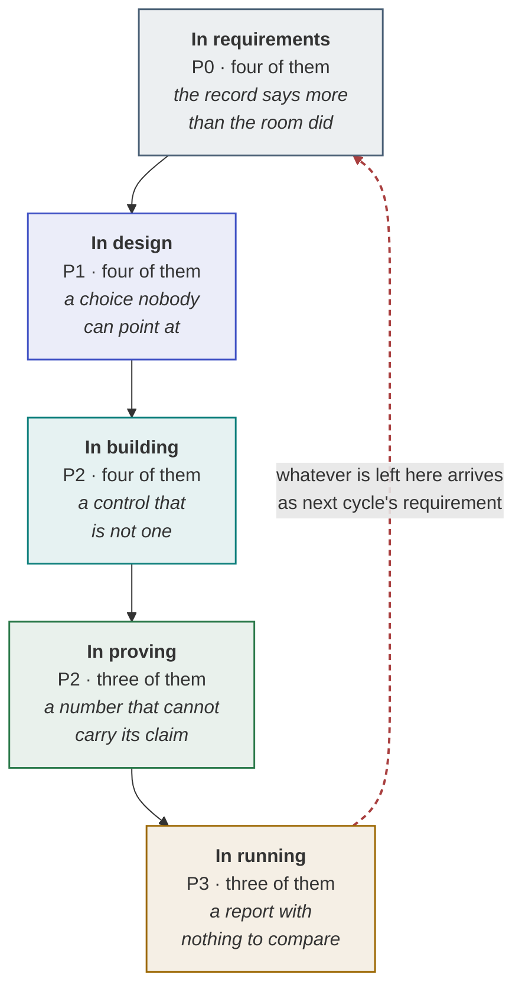

# Anti-patterns

Eighteen ways this goes wrong, what each one costs, and the move that prevents it.

None of these are carelessness. Every one is a sensible decision made by a competent person under
local pressure, which is why "be more careful" has never fixed any of them. The line that matters in
each entry below is **why capable people do it** — until that reads as something you recognise, the
fix will not survive the next deadline.

Every entry ends in a mechanical test: a grep, a query, a count, or a question with a wrong answer.
Judgement is not the scarce resource here. A check somebody can run on a Tuesday is.

The running case is **SkyWays**, an airline rebooking assistant for disrupted passengers at 240 cases
a day. Its ninety days are in the [Scenario Library](Scenario-Library).

---

## The eighteen, and where they live

Each stage fails in its own characteristic way, and the way is more useful than the list. Read the
italic line in each band first: if it describes something you recognise, the entries in that stage
are where to look.



The dotted line is the one people miss. An anti-pattern left standing in running does not stay in
running: it comes back as a requirement in the next cycle wearing a different name, which is why the
same three keep reappearing and nobody recognises them.

### Find yours

The **★** marks the [two that cause the most damage](#the-two-that-cause-the-most-damage). Both look
exactly like a control until somebody asks to be shown it.

| | Stage | Anti-pattern | The test somebody can run on a Tuesday |
| --- | --- | --- | --- |
| 1 | req | [Consolidating in the room](#consolidating-in-the-room) | Count the distinct names in the requirement list against the number of people in the room |
| 2 | req | [NFRs left as adjectives](#nfrs-left-as-adjectives) | Grep the measures for a digit. How many contain none? |
| 3 | req | [Constraints gathered after ratification](#constraints-gathered-after-ratification) | Count the NFRs whose "reshaped by" field is blank |
| 4 | req | [A vote with dots on a wall](#a-vote-with-dots-on-a-wall) | Ask where cost per case ranked, and what it ranked below |
| 5 | design | [A record for every decision](#a-record-for-every-decision) | Count the decision records, then count how many name an option that was rejected |
| 6 | design | [A swarm for work one tool can fan out](#a-swarm-for-work-one-tool-can-fan-out) | Turn agents into hand-offs with n(n−1)÷2, then ask which written limit justified the second agent |
| 7 | design | [Fixing the model's knobs in a spec](#fixing-the-models-knobs-in-a-spec) | Grep the spec for `temperature`, `top_p` and a pinned model id |
| 8 | design | [Treating every decision as a hard gate](#treating-every-decision-as-a-hard-gate) | Count the hard gates. For each soft one, check there is a placeholder, an owner and a date |
| 9 ★ | build | [A cap that lives in a prompt](#a-cap-that-lives-in-a-prompt) | Grep the prompt for the cap, then grep the code for the line that enforces it |
| 10 | build | [The drafter grading itself](#the-drafter-grading-itself) | Take the last hundred drafts. What share did the checker reject? |
| 11 | build | [A plug scheduled after its consumer](#a-plug-scheduled-after-its-consumer) | List the gated writes and check none has its plug scheduled after the day it goes live |
| 12 | build | [Reviewing by size of diff](#reviewing-by-size-of-diff) | Correlate review time with lines changed, then with risk band. Which is stronger? |
| 13 | prove | [Counting cache hits as wrong answers](#counting-cache-hits-as-wrong-answers) | Open the alert definition. Is a cache hit excluded from the wrong-answer count? |
| 14 ★ | prove | [Reporting a score without its sample size](#reporting-a-score-without-its-sample-size) | Count the percentages quoted last month that carried no `n` |
| 15 | prove | [Cutting over at fifty percent](#cutting-over-at-fifty-percent) | Find the date a rollback was last thrown, and how many minutes it took |
| 16 | run | [Reporting one number](#reporting-one-number) | Count the headline numbers in the last report, and how many arrived without a pair |
| 17 | run | [A postmortem that ends in a name](#a-postmortem-that-ends-in-a-name) | Take the last postmortem. Does an action name a control with a file and a line? |
| 18 | run | [Counting AI tools as a maturity metric](#counting-ai-tools-as-a-maturity-metric) | Score the six controls by running them, not by counting the tools that could |

Every test above is mechanical on purpose. Judgement is not the scarce resource here, and a finding
you re-derive from memory next quarter is not a finding.

---

## In requirements

### Consolidating in the room

**The story.** Thirty-one lines are on the whiteboard, four of them the same need in four different
voices, and there are twenty minutes left. The architect starts merging live, out loud, and by the
end there are twelve clean requirements and general agreement. Two people leave having watched their
sentence disappear into somebody else's line. One is the compliance officer, and in week five the
$400 approval rule arrives as a constraint rather than as a requirement.

**What it costs.** One dropped voice returns as a constraint that reshapes three of the nine NFRs,
after the design has been drawn against the other shape. The re-work is a week; the arrival of a
requirement carrying the authority of somebody who was ignored lasts longer than that.

**Why capable people do it.** Consolidating live looks like respect for everyone's time, and it is
the visibly competent thing to do with a full whiteboard and twenty minutes left. Merging afterwards
in private feels like doing the work where nobody can check it. The logic is sound and the sequencing
is wrong: credit is what buys the right to consolidate, and it has to come first.

**The fix.** Read the list back aloud, in full, credited by name — about eleven minutes for thirty-one
lines. Read the duplicates separately, all four times. Consolidate in the email afterwards, with a
rationale per merge.

**The test that catches it.** Count the distinct attributions in the consolidated document against
the number of people who spoke. Fewer means somebody was dropped. Then ask each person by name which
line is theirs; a pause is the finding.

### NFRs left as adjectives

**The story.** The candidate list says *fast*, *reliable*, *secure*, *auditable*. The workshop opens
on *fast* and forty minutes later has established that operations meant thirty seconds at peak while
the architect had been costing two seconds at mean. Nobody was wrong, because there was no measure to
be wrong about. The three real conflicts sit at 1:25 on the agenda and the room empties at 2:00.

**What it costs.** Two hours of six senior people arguing about words, and the conflicts — the only
reason six people were in one room — are never reached. The workshop is held twice, and the second
one starts from a position where the process has visibly failed once.

**Why capable people do it.** An adjective is what the stakeholder actually said, and recording it
verbatim is the discipline discovery teaches. Turning *fast* into *30 seconds at P95 during a peak
hour* means supplying four facts nobody stated, which feels like putting words in their mouth. It is
not: it is a question. The way to ask it is to circulate the number and let them correct it.

**The fix.** Six-part scenarios — source, stimulus, artefact, environment, response, measure —
circulated before the room meets. Any part you cannot fill in is written `UNKNOWN`, and the UNKNOWN
list is the agenda for the follow-up calls.

**The test that catches it.** Grep the candidate list for a digit. Every measure without one is an
adjective in costume. Then have two people read the same measure aloud and say what would falsify
it; two different answers means it is not yet a measure.

### Constraints gathered after ratification

**The story.** Nine NFRs are ratified on day nine, including thirty seconds at P95. On day eleven the
platform team mentions that the reservation system exposes SOAP only and a call takes eleven seconds
on a good day. The latency target is not ambitious, it is impossible, and three of the nine were
scored against an architecture that cannot exist.

**What it costs.** The workshop runs twice. Worse, the three reshaped NFRs were scored and traded off
against each other on false premises, so the priority ordering the room agreed is also void.

**Why capable people do it.** Constraints are dull, they come from people who are not in the product
conversation, and collecting them looks like administrative drag in front of a sponsor who wants
momentum. Requirements feel like the real work because they contain the ambition. The order is
counter-intuitive and not negotiable: a constraint can make a quality target impossible.

**The fix.** Constraints by type — technical, regulatory, commercial — on day six, before any target
is ratified. Each names what it **forbids**, carries a number where one exists, and lists the
candidates it reshapes.

**The test that catches it.** Put a "reshaped by" column on the ratified NFR list. More than one or
two blanks means constraints arrived late, if at all. Second test: any constraint that does not
forbid something specific is a preference or a motivation, filed in the wrong place.

### A vote with dots on a wall

**The story.** Nine candidates on a wall, five dots each, six people. Latency takes eleven dots
because the operations lead spoke first and spoke well. Cost per case takes two — nobody in the room
pays the bill, and the person who will is in finance and was not invited. On day 75 the invoice
arrives at 4.4 times its estimate, and nothing in the record says the room decided cost did not
matter.

**What it costs.** The loudest group wins, and the attribute that got two dots returns as a crisis.
For SkyWays it returns as 1.6 × 1.5 × 1.3 × 1.41 = **4.4×** on flat traffic.

**Why capable people do it.** Dot-voting is fast, visibly democratic, and it ends a meeting on time.
It also produces a number, which feels like evidence. The flaw is not the democracy but the
anchoring: everyone votes in one room, in sequence, watching each other's hands, so the result
records the room's dynamics rather than its judgement.

**The fix.** Utility trees scored separately — value 1–3, complexity 1–3, `priority = value ×
(4 − complexity)` — then merged. A gap of five or more between two stakeholders is a conflict with an
owner and a date, not a discussion point.

**The test that catches it.** Look for cost per case on the ratified list. Absent or near the bottom
means the scoring was social. Then check whether any two stakeholders scored in the same room at the
same time; if so, the second set is an echo of the first.

---

## In design

### A record for every decision

**The story.** The team adopts decision records and, being conscientious, writes one for each choice:
the logging library, the branch naming, the retry interval. Forty in the first week. Six weeks later
somebody needs to know why the framework was chosen, searches, gets eleven matches, and asks in chat
instead. The three records carrying real trade-offs are indistinguishable from the thirty-seven that
carry none.

**What it costs.** Forty records in a week, nobody reads the forty-first, and the three that mattered
are buried among them. The decision the records existed to preserve is re-litigated from memory.

**Why capable people do it.** A record costs ten minutes and the guidance says record decisions, so
recording more feels strictly safer — the failure everyone has lived through is the *undocumented*
decision. Volume looks like rigour and it is cheap to produce. What it spends is signal, and signal
is the thing a record is for.

**The fix.** One record per **sensitivity point** — an item rated high on both importance and
difficulty, where a single design decision moves the outcome — and nowhere else. SkyWays wrote two on
day 12 and scheduled one.

**The test that catches it.** Count records per month, then count how many name a rejected option
with the number that rejected it. A record with no rejected alternative is a note. More than about
two records per ADR-triggering conflict means you are logging rather than deciding.

### A swarm for work one tool can fan out

**The story.** The design opens with a research agent, a ranking agent, a policy agent, a drafting
agent and a supervisor, because the work has five distinguishable parts. Two sprints later the bug is
that the passenger's visa status reaches the ranking agent but not the policy agent, intermittently,
and reproducing it costs a day. The five parts were five *tools*, and the search across six partner
airlines was one fan-out call.

**What it costs.** Five agents have **ten** possible hand-offs, each one a coordination failure
waiting to happen, for work a single fan-out tool does with none. The debugging cost is not linear in
the agent count, because the failures live in the edges rather than in the boxes.

**Why capable people do it.** Decomposition is the correct instinct for every other kind of software,
and the frameworks make multi-agent topologies easy to draw and pleasant to review. Five labelled
boxes communicate a design better than one box with five tools. The error is treating parallelism as
a property of the agent count when it is a property of a tool.

**The fix.** Start single — one agent with its tools — and write the escalation condition into the
record: the named limit that would justify a second agent, and the evidence that would show it had
been reached.

**The test that catches it.** Write `n(n−1)/2` beside the topology diagram. If nobody can state in
one sentence the limit that justified n > 1, it is not justified. Then ask which hand-offs have a
schema and a test; the unschematised ones are the ones that fail.

### Fixing the model's knobs in a spec

**The story.** The design document specifies temperature, top-p, a model id and one tool call per
turn. Three months later the framework renames the parameter and the model version is retired.
Engineering ships without updating the document, because updating it changes nothing, and by the next
quarter the design describes a system that does not exist and nobody opens it.

**What it costs.** The spec is wrong at the next framework release, and a spec that is wrong once is
a spec that stops being read. The artefact meant to outlive the code dies before the code does.

**Why capable people do it.** Precision is a virtue and a vague spec is what gets blamed for a bad
build, so an architect who has been burned reaches for more specificity rather than less. Knobs are
also the most concrete thing available, and concrete reads as rigorous. The distinction that resolves
it is durability: behaviour survives a framework change and knobs do not.

**The fix.** Behaviour in the spec, the knob in engineering's configuration. "Ranked alternatives are
reproducible across two runs of the same case" is a behaviour with a test; a temperature setting is
one implementation of it.

**The test that catches it.** Grep the design document for `temperature`, `top_p`, `top-p`, a model
id, a version pin and any SDK method name. Every hit is a line to move or delete. Then ask of each
sentence: would this still be true on a different framework? If not, it is a knob.

### Treating every decision as a hard gate

**The story.** Eleven decisions are open at the start of the phase and the team is careful, so each
gets a meeting and each blocks something. The framework choice takes three weeks because it feels
irreversible, when an interface layer in front of it would have made it a Tuesday afternoon.
Meanwhile the decision that genuinely was irreversible — the autonomy level on refunds — was settled
by whoever wrote the prompt.

**What it costs.** The build waits behind eleven open decisions. Three weeks of it goes to a choice
that was reversible all along, and the attention spent on eleven gates is attention not spent on the
three that halt anything.

**Why capable people do it.** Every hard gate is defensible on its own, and no single meeting is the
one that blocked the build. Caution is also asymmetric in memory: everyone can name a decision that
should have been settled earlier, and nobody can name the three weeks that a deferral would have
saved. Nobody decides to stall; the stall is the sum of eleven reasonable decisions.

**The fix.** The four questions, on every open decision, with one "no" making it hard. For SkyWays
three halt and eight run behind placeholders you can open in the repository.

**The test that catches it.** Count the hard gates. More than three is a classification failure, not
a careful team. Then, for each soft one, ask somebody to open the placeholder — a stub, an interface,
a flag. A soft gate with no placeholder is a decision being taken by whoever has the ticket.

---

## In building

### A cap that lives in a prompt

**The story.** Compliance writes the $400 refund limit on day six. It goes into the system prompt as
*never refund more than $400 without a named approver*, which is exactly what it says. Five layers of
defence are listed in the design review and everyone believes the cap exists. On day 82 a passenger
writes something that reframes the conversation, the model calls the refund tool with 2,000, and the
tool accepts it.

**What it costs.** **$2,000** that was not owed, a postmortem, an amended record and an autonomy level
dropped by one. Five claimed layers, none enforced — and with either the cap or the approver in code,
the money does not move.

**Why capable people do it.** A sentence in a prompt reads exactly like a rule, it passes every test
anybody thinks to run, and it sits in the place where the model's behaviour is specified. Nothing in
code review flags prose. The engineer put the rule where the behaviour lives, which is the right
instinct applied to the wrong kind of artefact: a prompt is a request, and a model can be talked past
a request.

**The fix.** A typed, bounded parameter that **raises** — not clamps, not logs, not warns — with the
cap read from a reviewed config file, plus a confirmation token minted where the model cannot reach
it. Keep the prompt sentence, labelled as policy, with a comment naming the file that enforces it.

**The test that catches it.** Grep every prompt file for `never`, `always`, `do not`, `ask before`,
`limit`, `maximum` and any currency symbol, and find the line of code enforcing each hit. No line
means no control. The mechanical version: for each cap, a test that sends ten times the limit and
asserts it raises.

### The drafter grading itself

**The story.** A *review your answer before returning it* step is added after the ranking call. It
looks like diligence, it costs one extra call per case, and the scores do not move. The model is
reading its own output with its own reasoning still in context, so it agrees with the flight choice
it produced a moment earlier, confidently, every time. The bill rises a fifth and the checker has
once said no.

**What it costs.** A review step that adds a call per case and catches nothing — roughly a fifth more
spend for zero movement on any slice. Replacing it with an independent checker moved the SkyWays
codeshare slice four points.

**Why capable people do it.** Self-review is a real and effective practice for humans, the
instruction is one line, and the step produces plausible review text that looks like it is working.
Every incentive points at adding it and nothing points at measuring it. The missing property is
independence: shared context means shared blind spots.

**The fix.** A different model, or a fresh context with an adversarial brief, given the constraints
and the output and nothing else. Cap the re-draft loop while you are there — one SkyWays case went
round eleven times before anybody read the log.

**The test that catches it.** Count the checker's rejection rate over the last hundred cases. A
checker that has never rejected anything is not a checker. Second: assert in code that the drafter's
reasoning never reaches the checker's context, and let the build fail if it does.

### A plug scheduled after its consumer

**The story.** The sprint plan reads well — rebook bolt on Tuesday, refund bolt Wednesday, MCP server
for the booking system Thursday. On Tuesday morning the rebook bolt cannot be built, because the
thing it calls does not exist yet, and the day goes into a mock that will be thrown away on Thursday.
Moving the plug earlier would have cost an hour of planning.

**What it costs.** A whole day, mid-sprint, every time it happens — and it is the single most common
sequencing error. Discovering it on the day is what makes it expensive; the fix itself is an hour.

**Why capable people do it.** Plans are ordered by **value**, and the rebook bolt is what the sponsor
asked for while the MCP server is plumbing. Ordering by value is correct for a backlog and wrong for
a sprint, where the binding constraint is dependency. Nobody notices, because both items are real
work and both are in the plan.

**The fix.** Dependency order: walking skeleton first, exact code early, and every plug — MCP server,
connector, adapter — before the gated write that needs it.

**The test that catches it.** One row per gated write, one column for the day its plug lands. Any row
where the plug day is later than the consumer day is the day you are about to lose. Run it as a
single pass over the plan, not per ticket.

### Reviewing by size of diff

**The story.** Nine pull requests, two senior reviewers on everything, a four-day queue. The
four-hundred-line help-text rewrite gets two careful readers because it is large. The three-line
change to the refund cap check is approved in ninety seconds because it is three lines and the author
is trusted. Both readings were reasonable; only one of them was on a path that moves money.

**What it costs.** 18 slots against a capacity of 4.5 a day is a **4.0-day** queue, where routing the
same nine changes by band needs **7 slots** and **1.6 days** from the same two people. The queue is
the visible cost. The invisible one is a money path read in ninety seconds.

**Why capable people do it.** Size is the only signal a diff offers for free, and effort-matching
feels fair: a big change deserves a big read. Most small diffs genuinely are small, so the prior is
even a good one. It is uncorrelated with danger — the band belongs to the path, not to the patch.

**The fix.** A path rule in the repository, generated from the authority budget, so files behind each
tool carry that tool's band and nobody classifies their own change. Shared code takes the band of its
most dangerous caller.

**The test that catches it.** Take the last twenty merged changes and plot reviewers against lines
changed, then against the highest band touched. Correlation with the first and not the second is the
anti-pattern, measured. Second: is there any path a diff can touch that is not in the band map?

---

## In proving

### Counting cache hits as wrong answers

**The story.** Prompt caching goes in and the latency dashboard lights up: hundreds of responses far
faster than the historical distribution, flagged by a rule that treats very fast responses as
suspected failures. The rule was written before the cache existed and it was a good rule then.
Somebody proposes switching the cache off until the quality problem is understood.

**What it costs.** A false quality alarm, a wasted week, and a serious proposal to switch off the
thing that was working. Switching it off raises the bill by about a third within a day.

**Why capable people do it.** An anomaly detector firing on a genuine change in the distribution is
doing exactly what it was built to do, and nobody re-reads alert rules when a performance improvement
ships. The alarm is also loud and specific, which makes it credible. Caching changes the shape of the
latency distribution, and no rule written before it knows that.

**The fix.** Record cache-read tokens on every trace row and exclude hits from the latency alert.
Assert the cache is working on the **second** call, never the first.

**The test that catches it.** Ask of every alert rule: what would this do if a response came back in
a tenth of the usual time for a legitimate reason? Then check whether the trace schema has a field
that distinguishes a cache hit at all. If it does not, no alert can exclude one.

### Reporting a score without its sample size

**The story.** The slide says codeshare 82%, the bar is 80%, and the room reads it as a pass. The
number came from forty cases curated in an afternoon. The 95% lower bound is 70.1% on the normal
approximation and 67.5% on Wilson, and neither appears anywhere. The release goes out and nothing
happens for three weeks, which is the worst outcome available because it confirms the method.

**What it costs.** 82% on forty cases is presented as clearing an 80% bar when the lower bound is
70%. At 82.4% on 500 cases the bound is 79.1% against the same bar, and proving it takes **968**
cases — 468 more than the set holds, about eighteen days of codeshare history to curate.

**Why capable people do it.** A percentage is what everybody asked for, it fits on a slide, and
adding "on forty cases" invites a question the presenter cannot answer in the meeting. Dashboards
show point estimates because that is what dashboards show. This one is skipped by careful people
precisely because 82% against an 80% bar looks exactly like a pass; the arithmetic that says
otherwise has to be run on purpose.

**The fix.** Print the lower bound beside the score in the readout — Wilson below about a hundred
cases, normal above, method stated per row. Turn every miss into a cases-owed number, which is a plan
where "it failed" is an argument.

**The test that catches it.** Grep the last month of reports, release notes and chat for a percent
sign with no `n` in the same sentence. Every hit is an unproven claim. Second: make the readout
template refuse to render a row where n is missing.

### Cutting over at fifty percent

**The story.** The shadow run agrees with the desk on nine cases in ten, the golden set is green, and
the team is behind. Fifty percent reads as confident and five percent reads as timid. The first storm
day arrives four days later, the codeshare path behaves in a way no curated case covered, and half
the disrupted passengers that morning meet it.

**What it costs.** Half your customers meet the first-day failure, and the rollback is thrown for the
first time under load by somebody who has never thrown it.

**Why capable people do it.** The evidence genuinely was good, and a 5% ramp looks like a lack of
conviction in front of a sponsor who has waited. There is a real cost to going slow, too: at 5% of
240 cases a day, 500 cases of live evidence takes **42 days**. The tension is honest, and the
resolution is not the percentage — it is widening across conditions rather than across volume.

**The fix.** Five percent with the shadow result in hand, then widen deliberately across conditions —
a storm day, a partner outage, a peak hour. Rehearse the rollback first, with somebody watching, and
write down how many minutes it took.

**The test that catches it.** Has anybody thrown the rollback, on what date, and how long did it
take? A rollback nobody has thrown is a rollback of unknown duration. Second: list the conditions the
live sample has covered. Six weeks of normal Tuesdays means the widening was volume only.

---

## In running

### Reporting one number

**The story.** Every cycle report carries the saving, because the saving is what was asked for. The
token spend goes to a finance dashboard, because that is where spend goes. On day 90 somebody outside
the programme assembles both for a budget review, from sources the team has not seen, and presents
them together. Nobody lied, and the programme spends the meeting defending its arithmetic instead of
its results.

**What it costs.** The steering committee learns the token bill from finance instead of from you, and
stops trusting the report — including the parts that were right. The programme is cancelled on the
number you hid, never on the one you showed.

**Why capable people do it.** Each number goes to the audience that asked for it, which is ordinary
organisational competence, and no single step is wrong. The cost row is also genuinely unflattering
in cycle one, when review hours are highest and the saving has not yet compounded, so the honest
report looks worst exactly when the programme is most fragile.

**The fix.** Both numbers on one line, in one document, every cycle, with the review-hours and re-run
rows beside them. SkyWays reported 40–45% fewer person-days **and** $4,200 of tokens on day 90, review
hours up, and the programme continued because both numbers came from the team.

**The test that catches it.** Take the last cycle report and find the paired indicator for every
headline number: throughput with quality, cost with the bar, speed with re-runs. Any unpaired number
is one somebody else is already assembling. Second: check the baseline's date against the git log.

### A postmortem that ends in a name

**The story.** The hour opens with "who wrote this prompt, and who approved it?" The name arrives in
five minutes and the remaining fifty-five are that person's defence, conducted politely. Everybody
leaves knowing who, an action item is raised about being more careful with prompts, and the refund
tool still accepts any amount.

**What it costs.** Fifty-five minutes of one person's defence, and a control that is still absent —
the same incident is available again tomorrow, and the next one will be reported later because
everybody watched what happened to the last reporter.

**Why capable people do it.** "Who" is the first question a human asks, and it is not malice:
accountability is a real value and somebody usually does need to know what happened. It is also the
question everybody walks in holding, so an unwritten agenda is replaced by it within a minute.
Blameless is a discipline rather than a mood, and it survives about four minutes unaided.

**The fix.** Write **"which enforced control would have made this impossible?"** on the wall before
the room fills, and put one person from outside the delivery team in it whose only job is to
interrupt the third sentence that starts with a person.

**The test that catches it.** Read the document and count the sentences with a person as their
subject. Then check what left the room: a postmortem that did not produce a control with a file and a
line, an amended record and a brief for the next cycle has not finished.

### Counting AI tools as a maturity metric

**The story.** The quarterly slide shows tool adoption: nine assistants in use, up from four, with a
seat-count chart. It is the easiest thing to measure and it rises reliably. Meanwhile the caps live
in prompts, the harness is advisory, the trace does not redact, and the number that goes up every
quarter would also go up if the team were getting worse.

**What it costs.** It rewards the least mature behaviour available. Nine tools with no gates is level
one, and the metric cannot say so.

**Why capable people do it.** Adoption is countable, it arrives from a licence report on the first of
the month, and it is the number a sponsor asks for. Controls are harder to count and the honest
answer goes down as well as up. A metric that only rises is comfortable to own; nobody chooses the
wrong measure on purpose, they choose the one they can produce.

**The fix.** Six controls, each present or absent: a context file the agent reads, a spec with a bar
and an owner, a harness gating the merge per slice, caps in tool signatures, a redacting trace, and
production evidence by segment with drift watched. The level is how many; the next step is the first
one missing.

**The test that catches it.** Score it by **running** each test rather than remembering: grep the
prompts for the cap and grep the signatures, lower a bar and push to see whether the merge blocks,
search a week of trace rows for a passport pattern. Anything marked present on a decision rather than
a test is absent.

---

## The two that cause the most damage

If you fix nothing else on this page:

> **1 · A rule that lives only in a prompt.**
> It reads exactly like a rule and nothing in code review flags it. Everyone believes the cap exists.
> Grep your prompts for `never`, `always`, `do not`, `ask before` and any currency symbol, and move
> every consequential one into a signature.

> **2 · A score without its sample size.**
> It is the most common way a team ships something that has not been proven, and it is invisible in
> every dashboard, because the dashboard shows the point estimate.

These two share a structure, and it is worth naming because it tells you where the next one will
come from. **Both look identical to the thing they are not.** A cap in a prompt looks like a cap; 82%
looks like a pass. Neither produces an error, a red test or an unhappy reviewer, so no ordinary
feedback loop touches them — the first signal in both cases is a customer or an invoice.

They are also the two with the shortest fix. The cap is a typed parameter and two tests, which is an
afternoon. The lower bound is one line in a readout template. Compare that with the two cultural ones
at the end of this page, which need a sponsor asking for the same thing repeatedly for a quarter.

**What to do this week.** Run the two greps. For every consequential hit in a prompt, open a ticket
banded at the level of the tool it protects. For every percentage in circulation with no `n`, add the
denominator and the bound and re-send the number. Both are mechanical, both are finishable, and both
remove a class of failure rather than an instance of one.

---

## A twenty-minute audit

Run this on your own team, with the repository open. Every step is a command or a question with a
wrong answer, so none of it needs a meeting first. Write "found", "not found" or "cannot tell" beside
each — *cannot tell* counts as found, because a control nobody can evidence is not one.

1. **0:00–0:03 · The prompts.** Grep every prompt and context file for `never`, `always`, `do not`,
   `ask before`, `limit`, `maximum` and any currency symbol. For each hit, find the line of code that
   enforces it. Catches: **a cap that lives in a prompt**.
2. **0:03–0:05 · The percentages.** Grep the last month of reports, release notes and release
   channels for `%` with no `n` in the same sentence. Catches: **a score without its sample size**.
3. **0:05–0:07 · The review record.** Take the last twenty merges. Plot reviewer count against lines
   changed, then against the highest band touched. Catches: **reviewing by size of diff**, and any
   path missing from the band map.
4. **0:07–0:09 · The design document.** Grep for `temperature`, `top_p`, a model id and a version
   pin. Then grep the NFR list for a digit. Catches: **knobs in a spec** and **NFRs as adjectives**.
5. **0:09–0:11 · The records.** Count decision records this quarter, and how many name a rejected
   option with the number that rejected it. Catches: **a record for every decision**.
6. **0:11–0:13 · The topology and the plan.** Write `n(n−1)/2` beside the agent diagram and ask for
   the limit that justified n > 1. Then check every gated write against the day its plug lands.
   Catches: **a swarm for work one tool can fan out** and **a plug after its consumer**.
7. **0:13–0:15 · The gates.** Count the hard gates, and for each soft one open the placeholder.
   Catches: **treating every decision as a hard gate**.
8. **0:15–0:17 · The harness and the traces.** Get the checker's rejection rate over the last hundred
   cases, then confirm the trace has a cache-hit field and the latency alert excludes it. Catches:
   **the drafter grading itself** and **counting cache hits as wrong answers**.
9. **0:17–0:19 · The last cycle report and the last postmortem.** Is every headline number paired?
   Does the baseline predate the first agent commit? Did the postmortem produce a control with a file
   and a line? Catches: **reporting one number**, **a postmortem that ends in a name**.
10. **0:19–0:20 · Score.** Count the entries you marked found, out of eighteen. **0–3:** unusual, and
    worth re-running with somebody sceptical in the room. **4–8:** ordinary for a team past its first
    release; fix the two from the section above first, because they are the cheapest. **9 or more:**
    the gap is not diligence, it is that no artefact exists to carry these decisions — start with the
    authority budget and the bar sheet, and half the list closes behind them.

Two rules make the score honest. Score by **running** the test, never by remembering whether you
agreed to something. And do the audit with somebody from outside the delivery team holding the
sheet, for the same reason a postmortem needs one.

<details><summary><b>Template · Anti-pattern audit</b></summary>

```markdown
# Anti-pattern audit · <team> · <date>
Run by: <name>   Held by: <name, from outside the delivery team>
Scored by RUNNING each test. "Cannot tell" is recorded as FOUND.
Previous audit: <date>, <n>/18 found.

| # | Phase | Anti-pattern | Found? | Evidence — the command, file or answer |
|---|-------|--------------|--------|-----------------------------------------|
| 1 | req | Consolidating in the room | found / not / cannot tell | <n> names in a <n>-person list |
| 2 | req | NFRs left as adjectives | | <n> of <n> measures contain no digit |
| 3 | req | Constraints gathered after ratification | | <n> NFRs with a blank "reshaped by" |
| 4 | req | A vote with dots on a wall | | <cost per case ranked <n> of <n>> |
| 5 | design | A record for every decision | | <n> records, <n> naming a rejected option |
| 6 | design | A swarm for work one tool can fan out | | <n> agents = <n> hand-offs; limit: <> |
| 7 | design | Fixing the model's knobs in a spec | | <grep hits: temperature/top_p/model id> |
| 8 | design | Treating every decision as a hard gate | | <n> hard; <n> soft with no placeholder |
| 9 | build | A cap that lives in a prompt | | <n> prompt hits, <n> with an enforcing line |
| 10 | build | The drafter grading itself | | checker rejection rate <n>% of last 100 |
| 11 | build | A plug scheduled after its consumer | | <n> gated writes with a later plug day |
| 12 | build | Reviewing by size of diff | | <corr. with lines vs corr. with band> |
| 13 | prove | Counting cache hits as wrong answers | | <cache field present? alert excludes?> |
| 14 | prove | Reporting a score without its sample size | | <n> percentages with no n, last month |
| 15 | prove | Cutting over at fifty percent | | <rollback thrown on <date>, <n> min> |
| 16 | run | Reporting one number | | <n> headline numbers, <n> unpaired |
| 17 | run | A postmortem that ends in a name | | <control with a file and a line? y/n> |
| 18 | run | Counting AI tools as a maturity metric | | <n>/6 controls, scored by running |

**Found: <n> / 18.**  Change since <date>: <+n / -n>, and what moved it: <one line>.

## The two most expensive, checked first
| | Found? | Evidence | Ticket |
|---|--------|----------|--------|
| A rule that lives only in a prompt | | <file:line, or "no enforcing line"> | <id> |
| A score without its sample size | | <where it was quoted> | <id> |

## The three we fix this cycle, and who
| # | Anti-pattern | Fix, in one line | Owner | Due | Re-test on that date |
|---|--------------|------------------|-------|-----|----------------------|
| | | | | | <the same command, re-run> |

## Deliberately not fixing, with the reason
| # | Why it is acceptable here | Reviewed again on |
|---|---------------------------|-------------------|
```
</details>

---

## Where a model helps

| Tool | Use it for |
| --- | --- |
| **Claude Code** | Run the mechanical half of the audit as a script: the prompt greps, the percentage grep, the reviewer-versus-band table, the record count, the gated-write-versus-plug pass. Written once, re-run every cycle, and the output is evidence rather than recollection |
| **Claude Code** | Turn each finding into the artefact that closes it — the typed signature and its two tests from a prompt cap, the path rule from the authority budget, the readout template that refuses a row with no `n` |
| **Chat LLM, adversarially** | Read a design document or a cycle report back as a hostile outsider and name every claim with no evidence behind it and every number with no pair. It is good at this and it does not mind saying so |
| **Chat LLM** | Draft the "why capable people do it" line for an anti-pattern your team has that is not on this page. If the draft reads as carelessness, the diagnosis is wrong and the fix will not hold |
| **Do not delegate** | Deciding which findings the team will fix this cycle. That is a claim on other people's weeks, and the only person who can make it is the one who will be in the room when something else slips |

---

## Try it

Pick the three from this page you recognise in your own team. For each, write who would have to do
what, this week, to prevent it.

Then do the harder version: for each of the three, write the **why capable people do it** line in
your own team's words, naming the local pressure. "We merge in the room because the workshop is the
only hour we get all six of them." If you cannot write that sentence, you have identified a symptom
rather than a cause, and the fix you were about to propose is an instruction to be more careful.

<details>
<summary>What to expect</summary>

Most of these are prevented by an artefact that takes an afternoon: the authority budget, the bar
sheet, the path rule, the drift chart. That is the genuinely good news about this list — the fixes are
small, and they are small because each one moves a decision from *the moment of pressure* to *a
document written calmly in advance*.

The ones that take longer are the cultural two: the postmortem question and the two-number report.
Both need a sponsor to ask for them consistently, and neither survives being introduced once.

There is a third pattern in the results worth watching for. Teams usually find that their eight or
nine findings cluster in one phase rather than spreading evenly. A cluster in **requirements** means
the artefacts exist and nobody is upstream of them; a cluster in **building** means the authority
budget was never written; a cluster in **proving** means the harness is reporting rather than gating.
The cluster is a better guide to what to fix than the count is, because it names one missing artefact
instead of nine separate habits.
</details>

---

**Next:** [Decision Trees](Decision-Trees) · [Scenario Library](Scenario-Library) ·
[Gates and Governance](Gates-and-Governance) · [Exercises and Answers](Exercises-and-Answers) ·
[How to Run a Missing-Control Postmortem](How-to-Run-a-Missing-Control-Postmortem) ·
[How to Prove the Bar](How-to-Prove-the-Bar) · [Formulas and Calculators](Formulas-and-Calculators)
