# Decision trees

Eleven decisions this playbook makes the same way every time, each drawn as a tree. Print the ones you
use; they are meant to be settled in minutes, not debated in meetings.

A tree is not a shortcut around thinking. It is a record of thinking that was already done, so that
the same question does not cost a meeting every time it arrives. The value is in three properties:
the questions come in a fixed order, each "no" ends the exercise, and the leaf you land on is written
down with a date beside it. An argument that recurs every few weeks with the same people on the same
sides is a tree the team has not adopted yet.

Each tree below carries the same five things: what is being decided and who decides it, the diagram,
the running **SkyWays** case walked to a leaf, what the wrong leaf costs, and the honest boundary —
the assumption the tree makes that will one day be false in your situation. Eight of the eleven end
in a record you can paste into the repository.

**The running case.** SkyWays is an airline rebooking assistant for disrupted passengers: **240 cases
a day**, three slices — same-day, codeshare, refund — and ninety days of decisions, some of them
wrong. The [Scenario Library](Scenario-Library) has the episodes; this page has the branches.

---

## 1 · Is this AI at all?

### The decision

Whether a request becomes a probabilistic system at all, or a function, or a person, or an assisted
workflow with a person on the end of it. The product manager owns the verdict and the solution
architect owns the evidence under it. It is asked once per request, before the word *agent* enters
any document, because every other tree on this page assumes this one came back agentic. The three
questions are ordered by cost: each is cheaper to answer than the one after it, and each "no" ends
the exercise before you have spent anything.

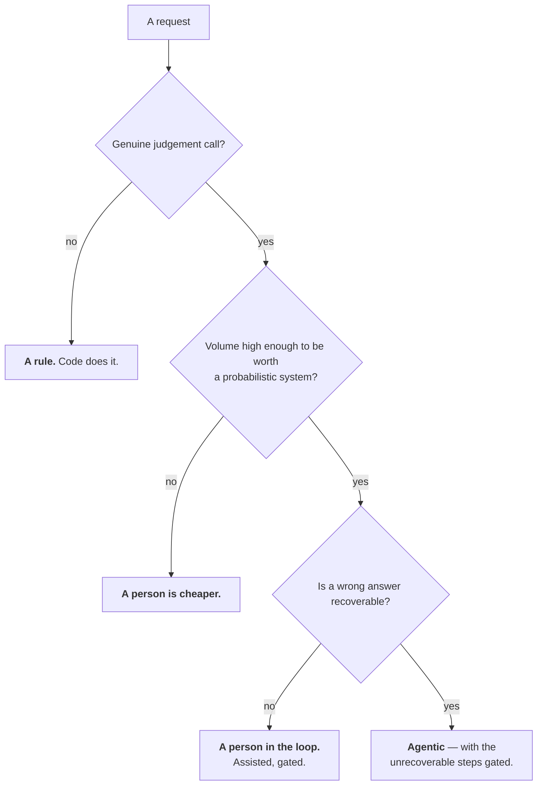

Expect two or three of your top five requests to come back as rules. That is the healthy answer.

### Worked

- **Genuine judgement call?** Yes. Which alternative suits this passenger depends on the visa, the
  onward booking and how they are travelling. Two experienced desk agents differ, and they differ
  about the case rather than about the procedure.
- **Volume high enough?** Yes. 240 disrupted cases a day carries a golden set, a harness, five gates
  and a per-call bill. Eleven cases a week would not.
- **Wrong answer recoverable?** **Partly.** A proposed rebooking can be withdrawn before it is
  confirmed. A refund that has left the account cannot.
- **Leaf: agentic, with the unrecoverable steps gated.** That single word *partly* is the reason the
  design has a named approver on money and on nothing else.
- **The scope in which the verdict flips**, written down the same day: same-route, same-day moves
  only. Inside that scope this is a rule, and the exercise stops at the first question.

### What it costs to get wrong

Answer yes at question one when the criteria sit in a published table and you have built a harness, a
golden set and a per-call bill to reproduce a lookup — for SkyWays that is **$144 a day** of run cost
at $0.60 a case before a single minute is saved. The reverse error is quieter and dearer: a "no" on
recoverability that is recorded as "yes, eventually" ships an unheld money action, which is the
line that runs from this tree straight to day 82 and a $2,000 refund.

### When this tree does not apply

Question two assumes you can estimate volume. For a product with no ticket history the honest answer
is a range, and a range that straddles the fixed cost of a harness means the tree cannot decide —
run a manual month and count, rather than picking the end of the range you prefer. The tree also says
nothing about whether the work is *worth* doing; that is the [value line](Formulas-and-Calculators),
and a request can clear all three questions and still lose money.

<details><summary><b>Template · AI-fit verdict</b></summary>

```markdown
# AI-fit · <request> · <date>
Verdict owner: <name>   Evidence owner: <name>   Status: accepted / superseded by <ADR-n>

| # | Question | Answer | The evidence, not the opinion |
|---|----------|--------|-------------------------------|
| 1 | Genuine judgement call? | yes / no | <what two competent people would differ about> |
| 2 | Volume worth a probabilistic system? | yes / no | <n> cases/day, from <source, dated> |
| 3 | Wrong answer recoverable? | yes / no / partly | <what can be undone; what cannot> |

## Leaf reached
<a rule, code does it | a person is cheaper | assisted and gated | agentic, unrecoverable
steps gated>  — reached <date>, in front of <who was in the room>

## The scope in which this is a rule
<e.g. same-route, same-day moves only. Inside that scope the agent is not justified.>

## Steps gated whatever the model quality becomes
| Step | Why it is unrecoverable | The gate |
|------|-------------------------|----------|
| <issue_refund> | <money leaves the account> | <named approver above $400> |

## Rejected, with the number that rejected it
| Option | Why not | The number |
|--------|---------|-----------|
| <a rule in code> | <cannot express the judgement> | <n>% of cases fall outside it |

## Revisit when
<named trigger, never a date>
```
</details>

---

## 2 · What kind of step is this?

### The decision

For one step inside a feature, which of three kinds it is — and therefore what builds it and what
proves it. The solution architect owns the map and the engineering lead builds from it. This is the
tree that decides where the arithmetic lives, and it is answered per step, which means a feature of
nine steps is answered nine times rather than once.

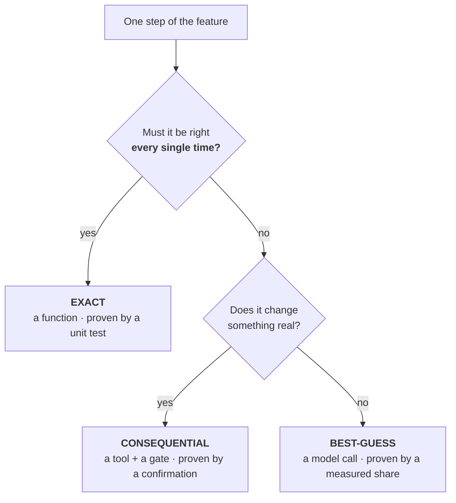

**The rule that never breaks: the best-guess machine never does the exact math.** The model may call
the function and read the result; it never computes the value.

### Worked

- **"Rank the alternatives for this passenger."** Right every time? No. Changes something real? No.
  → **best-guess**, proven by the codeshare slice at an 80% bar.
- **"What is the fare difference between the original and the alternative?"** Right every time? Yes —
  a passenger charged $80 where the rules say $62 is a complaint and a refund. → **exact**, a
  function with a unit test, called by the model and read back.
- **"Issue the refund."** Not right every time in the arithmetic sense, but it changes something
  real and irreversibly. → **consequential**, a tool with a typed cap and a confirmation token.
- **The leaf that matters is the second one.** Written as one step it becomes one prompt containing
  the word *exactly*, which returns a confident wrong number with no error and no red test.

### What it costs to get wrong

An exact step built as a best-guess step fails fluently: no exception, no failed assertion, and the
first person to notice is the passenger reading the invoice. Four steps at 90% chain to **65.6%**
end to end, so a feature that quietly turns one exact step into a model call has not lost ten points,
it has lost the multiplication. The reverse error is cheap and visible — an exact function where
judgement was needed returns the wrong option and somebody argues with it.

### When this tree does not apply

The first question assumes "right" is well defined for the step. For a summary, a tone, or a ranked
list there is no single right answer, so the question reads as "no" by default and the step lands in
best-guess correctly. The trap is a step where "right" *is* well defined but nobody has written the
definition down — it reads as judgement because the rule is undocumented, not because it is absent.
Ask who would arbitrate a dispute about this step; if the answer is a document, the step is exact.

<details><summary><b>Template · Exact / best-guess / consequential map</b></summary>

```markdown
# Step map · <feature> · <date> · Owner: <architect name>

| # | Step | Kind | Built as | Proven by | Number it acts on |
|---|------|------|----------|-----------|-------------------|
| 1 | <read the disruption> | best-guess | <model call> | <slice score> | — |
| 2 | <fare difference> | **exact** | <function, src/fares/diff.py> | <unit test name> | <the amount> |
| 3 | <rank alternatives> | best-guess | <model call> | <codeshare slice, 80%> | — |
| 4 | <issue refund> | **consequential** | <tool + gate> | <confirmation test> | <the amount> |

## Every number this feature acts on, and who computes it
| Number | Computed by | Never computed by | Test that proves it |
|--------|-------------|-------------------|---------------------|
| <fare difference> | <the function> | <the model> | <test name> |
| <refund amount> | <the function> | <the model> | <test name> |

## Words in the prompts that mean a function is missing
Grepped for: calculate, compute, total, sum, exactly, must equal.
| Hit | File | Verdict |
|-----|------|---------|
| <phrase> | <path> | <function exists / FUNCTION MISSING, owner <name>> |

## Chain length
<n> best-guess steps in sequence. At <n>% each, the optimistic end-to-end is <n>%.
Steps removed to shorten the chain: <list, or "none — and that is the finding">
```
</details>

---

## 3 · How much autonomy?

### The decision

What a single action may do without a person. The product manager owns the autonomy record and
compliance signs the rows that move money; the architect turns each leaf into a tool signature. This
is answered per **action**, never per product, which is why one feature can hold three different
leaves at once.

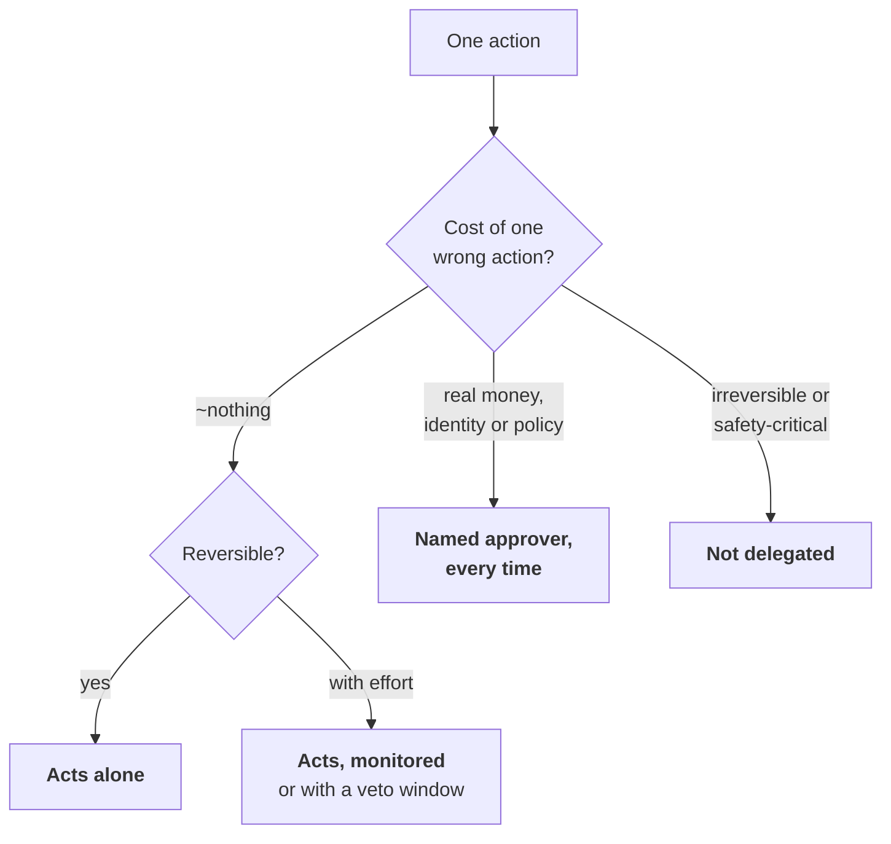

Per **action**, never per product. **Reversibility is the hinge**, and it is the column that ends most
arguments. Levels rise only on evidence; an incident usually drops one.

### Worked

- **`search_flights`.** Cost of one wrong action: about nothing — a bad option a human can ignore.
  Reversible: yes. → **acts alone.**
- **`rebook_passenger`.** Cost: about nothing in money, but undoing it means a second seat movement
  and a second notification. Reversible with effort. → **acts, monitored**, with a veto window until
  the ticket is reissued.
- **`issue_refund`.** Cost: real money leaving the account. → **named approver, every time**, above
  the $400 line compliance set on day six.
- **`change_identity`** on the booking record. Irreversible in the audit trail. → **not delegated.**
- **Day 82 tested the third leaf and it was not there.** The cap and the approver existed in a
  document and in a prompt, and $2,000 left the account.

### What it costs to get wrong

One leaf recorded and not enforced is the whole of the SkyWays day-82 incident: **five claimed layers,
none enforced**, and a $2,000 refund that was not owed. The opposite error has a price too — an
approver on `search_flights` puts a person in front of 240 lookups a day, which removes the saving
the assistant exists to produce and gets the assistant switched off within a month.

### When this tree does not apply

The first branch assumes damage can be priced. A wrong clinical summary, a wrongly refused benefit or
a mis-stated legal position does not have a dollar figure, and inventing one is worse than admitting
you cannot. Where the damage resists pricing, the honest reading is that the action needs a hold
regardless of any number — take the right-hand branch and move on. The tree also says nothing about
**frequency**: an action that is cheap to get wrong once and is taken 240 times a day can be
expensive in aggregate, and that belongs to the value line rather than here.

<details><summary><b>Template · Autonomy record, per action</b></summary>

```markdown
# Autonomy · <feature> · v<n> · <date>
Owner: <PM name>   Money rows signed by: <compliance name>, <date>

| Action | Cost of one wrong one | Reversible? | Level | Enforced where |
|--------|----------------------|-------------|-------|----------------|
| <search_flights> | <~nothing> | yes | acts alone | — |
| <rebook_passenger> | <a second seat movement> | with effort | monitored, <n>-min veto | <path> |
| <issue_refund> | <$<n>, irreversibly> | no | **named approver** | <signature + test> |
| <change_identity> | <unbounded> | no | **not delegated** | <permission set> |

## For every gated row: what enforces it, and the test that was red first
| Action | The limit | The file and line | Test that proves it raises |
|--------|----------|-------------------|----------------------------|
| <issue_refund> | <$400, from config/caps.yaml> | <src/tools/refund/issue.py:41> | <test name> |

## Who may mint the confirmation token
<the approver's screen, signed, scoped to one booking and one amount, expiry <n> min>
The agent cannot construct this from anything it already holds: <how we know>

## Level changes
| Date | Action | Was | Now | Why | Evidence that restores it |
|------|--------|-----|-----|-----|---------------------------|
| <date> | <issue_refund> | <approver> | <not delegated> | <incident <id>> | <n> clean weeks + <test> |
```
</details>

---

## 4 · Hard gate or soft gate?

### The decision

Whether an open decision halts a phase or runs alongside the build behind a placeholder. The
solution architect classifies and the delivery lead holds the register. It is asked of every open
decision on the list, at the start of the phase and again at each weekly review, because evidence is
allowed to change the answer in either direction.

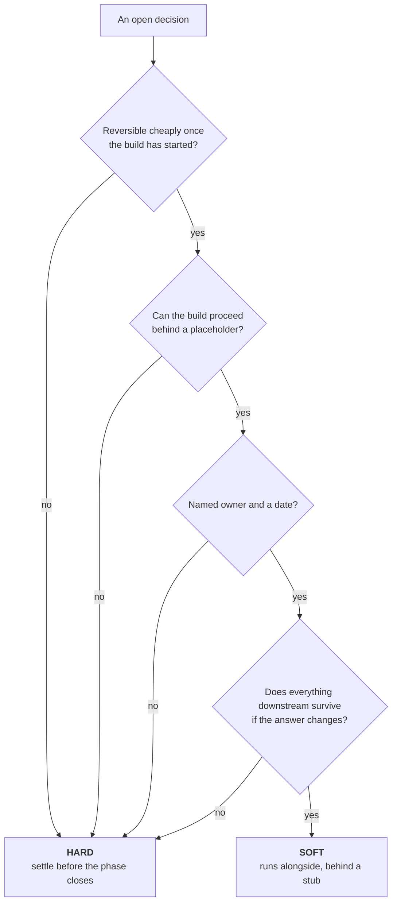

**A single no makes it hard.** For SkyWays, three of eleven are hard and eight run in parallel. Treat
all eleven as hard and the build waits behind every one.

### Worked

- **Model tier per slice.** Reversible cheaply? Yes, it is a routing table. Placeholder? Yes —
  everything on the mid tier behind the gateway. Owner and date? Yes. Downstream survives a change?
  Yes. → **soft**, settled by the shadow run.
- **The framework choice.** All four answers yes, behind an interface layer. → **soft**, settled as
  an ADR on day 20.
- **The autonomy level on money actions.** Reversible cheaply once the build has started? **No** —
  a regulator has a rule about it and the tool contract is built against it. → **hard** at the first
  question, and the other three are not asked.
- **The AI-fit verdict and the spec, bar and guardrails** fail the same first question.
- **Three hard, eight soft.** Every soft one names a placeholder you can open in the repository.

### What it costs to get wrong

Classify all eleven as hard and the build waits behind a framework choice that an interface layer
would have deferred entirely — three weeks, for a decision that was reversible all along. Classify
the money one as soft and the placeholder standing in for it is *the model behaves sensibly*, which
is what a prompt is, and the cost of that is on day 82 at **$2,000**.

### When this tree does not apply

Question two assumes a placeholder can be built, and for a decision that shapes the data model rather
than a call site there may be nothing to stub. Question three is the one teams answer generously:
"named owner and a date" means a person who knows they own it and a date in a calendar, not a team
name and "before P2". And the tree classifies a list rather than producing one — a decision nobody
has noticed is open is neither hard nor soft, and those are found by walking the design, not by
running this.

<details><summary><b>Template · Gate classification, one row per open decision</b></summary>

```markdown
# Gate classification · <feature> · <phase> · <date>
Classified by: <architect>   Re-checked at every weekly review. ONE "no" makes it HARD.

| # | Open decision | Q1 reversible | Q2 placeholder | Q3 owner+date | Q4 downstream | Verdict |
|---|---------------|---------------|----------------|---------------|---------------|---------|
| 1 | <model tier per slice> | yes | yes | yes | yes | soft |
| 2 | <autonomy on money> | **no** | — | — | — | **HARD** |
| 3 | <framework> | yes | yes | yes | yes | soft |

## Hard — what is blocked until each is settled
| # | Decision | The question that made it hard | Blocked | Settle by |
|---|----------|-------------------------------|---------|-----------|
| <n> | | <Q1: not reversible> | <what cannot start> | <date> |

## Soft — the placeholder you can open in the repository
| # | Decision | Placeholder today | Path | Owner | Settled by | Due |
|---|----------|-------------------|------|-------|------------|-----|
| <n> | | <stub / interface / flag> | <src/...> | <name> | <the evidence> | <date> |

## Re-classified this cycle
| # | Was | Now | What changed |
|---|-----|-----|--------------|
| <n> | soft | **HARD** | <a slice now needs it, so downstream no longer survives> |

## Count
Hard: <n>. More than three is a classification failure, not a careful team.
```
</details>

---

## 5 · How many agents?

### The decision

The topology: one agent with tools, an orchestrator with workers, or a full team. The solution
architect decides and writes the hand-off count beside the diagram. The default is not a preference;
it is the starting position the tree returns to unless a named condition moves it.

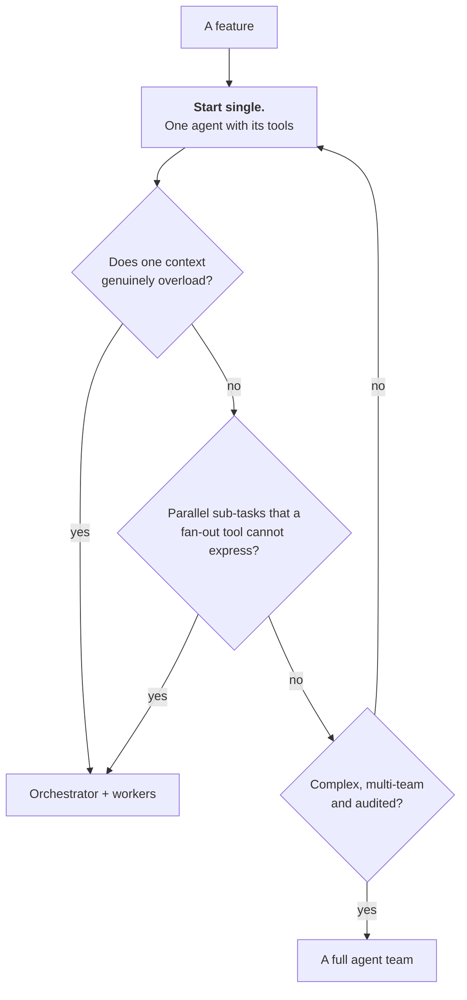

Five agents have **ten** possible hand-offs. Parallelism is a property of a **tool**, not of an agent
count. Write the escalation condition down, or the swarm returns by default.

### Worked

- **Start single.** One agent, four tools: search, rebook, refund, notify.
- **Does one context genuinely overload?** No. A disruption is one passenger, one itinerary and one
  fare-rule set — 2,100 tokens a call at the day-30 baseline, against a budget many times that.
- **Parallel sub-tasks a fan-out tool cannot express?** No. Searching six partner airlines at once is
  fan-out *inside* `search_flights`: one tool, one call, no hand-off.
- **Complex, multi-team and audited?** No. One team, one repository.
- **Leaf: stay single**, with the escalation condition written into the record — if a case needs a
  visa determination and a fare re-computation in the same turn and the context exceeds the budget,
  escalate to orchestrator plus workers, and record the case that triggered it.

### What it costs to get wrong

Five agents create **ten** possible hand-offs, and each one is a place where a field is dropped,
re-serialised or silently defaulted; the debugging cost is not linear in the agent count because the
failure is in the edges. Going the other way is usually cheap and visible — a single agent that truly
overloads produces truncated context and obvious nonsense, which is a better failure than a
coordination bug that only appears on storm days.

### When this tree does not apply

It assumes hand-offs are the dominant cost, which holds when every part of the work sits inside one
trust boundary. Where sub-tasks have genuinely different boundaries — different data residency,
different regulator, different tenant, different credentials — separation is a security requirement
and the hand-off count is a price you pay rather than an argument you win. The tree also assumes one
delivery team; two teams that must ship independently already have an organisational boundary, and
pretending otherwise produces a single agent with two owners.

---

## 6 · Where does this rule live?

### The decision

Whether a rule is written in the prompt or enforced in a tool signature. The engineering lead decides
and the authority budget supplies the input. It is asked once per rule, and it is the shortest tree
on this page because the consequence is binary: one branch produces something a model can be talked
past, and the other produces something it cannot.

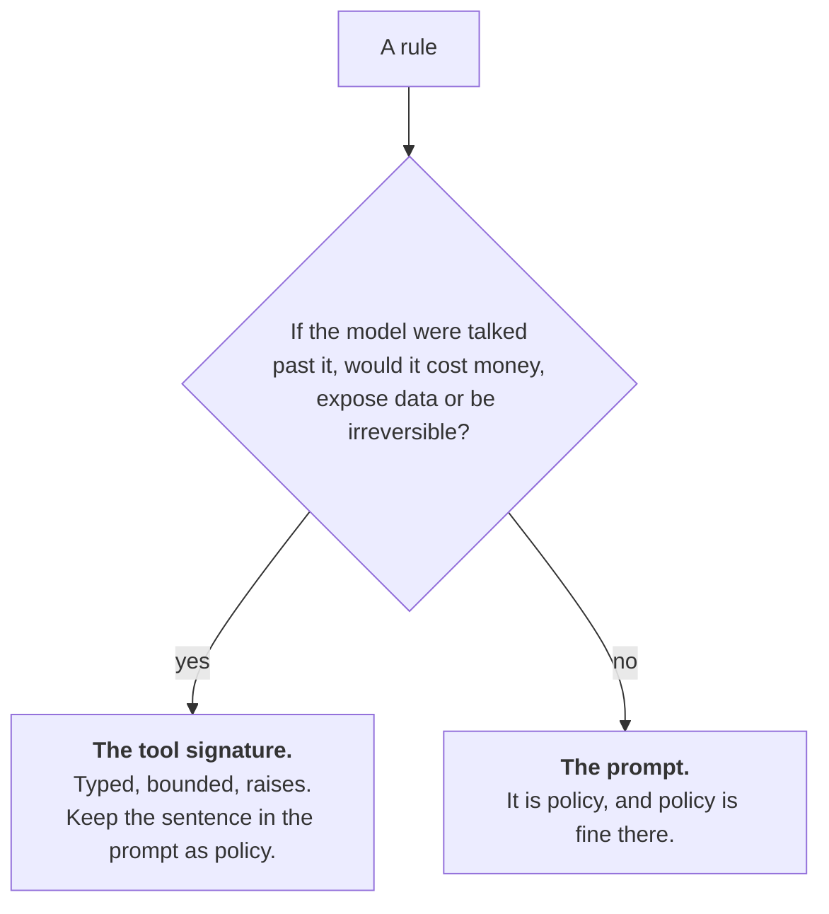

> A prompt is a **request**. A tool contract is a **boundary**.

### Worked

- **"Never refund more than $400 without a named approver."** Talked past, it costs money — on day 82
  it cost **$2,000**. → **the tool signature**: a typed, bounded parameter that raises rather than
  clamps, plus a confirmation token minted on the approver's screen.
- **The prompt sentence stays**, with a comment beside it naming the file that enforces it. That
  comment is what stops the next engineer deleting the signature check because the prompt covers it.
- **"Prefer the earliest arrival when two options are within thirty minutes."** Talked past, it costs
  a slightly worse itinerary. → **the prompt**, proven by the golden set rather than by a test.
- **The two tests that are the step:** an over-cap call raises, a call with no confirmation token
  raises. Both were red before they were green.

### What it costs to get wrong

A cap in a prompt reads exactly like a cap and nothing in code review flags it, which is why five
people in the SkyWays design review believed the $400 limit existed and the ledger disagreed. One
wrong leaf here produced a **$2,000** unowed refund, a postmortem, an amended ADR and an autonomy
level dropped by one. The error in the other direction is mild: a preference hard-coded as a boundary
makes the agent rigid, and somebody raises a pull request.

### When this tree does not apply

It assumes the rule is expressible as a boundary — a parameter, a type, a range, a token. Rules about
tone, ordering, disclosure or what to say when the answer is unknown have no violation you can detect
in a signature, and they belong in the prompt with a golden-set case behind them. It also assumes a
tool exists to carry the signature; where the consequential step is still a paragraph of prompt with
no call site, the first move is to turn it into a tool, and only then run this tree.

<details><summary><b>Template · The policy pair, one per rule</b></summary>

```markdown
# Policy pair · <rule, in one sentence> · <date>
Source: <authority budget v<n> / constraint C-R<n> / <name>, <document §>>

## The test
If the model were talked past this rule, would it cost money, expose data, or be
irreversible?  <yes / no>   Evidence: <what the worst case actually is>

## Leaf
<tool signature | prompt only>

## The request — what stays in the prompt, labelled
> <the sentence, verbatim as it appears in the prompt file>
File: <prompts/...>   Labelled: "policy, not enforcement — the boundary is in <file>"

## The boundary — only if the leaf is "tool signature"
| | |
|---|---|
| Tool | <issue_refund> |
| Parameter | <amount: Decimal, 0 < amount <= cap> |
| Cap comes from | <config/caps.yaml, reviewed like code> |
| On breach | **raises** <RefundCapExceeded> — not clamps, not logs, not warns |
| Confirmation | <token minted on the approver's screen; scoped, signed, expires> |

## The two tests, which were red first
| Test | Asserts | File | Red on |
|------|---------|------|--------|
| <test_over_cap_raises> | <a $5,000 attempt raises> | <tests/...> | <date> |
| <test_no_token_raises> | <a call with no token raises> | <tests/...> | <date> |

## Grep that would have found this rule sooner
<never | always | do not | ask before | $ | limit | maximum>  — run over <prompts/**>
```
</details>

---

## 7 · Which review band?

### The decision

How many people read a change before it merges, and which people. The engineering lead owns the
ladder, the architect maps tools to bands from the authority budget, and a path rule in the
repository applies it — so the answer is produced by the repository rather than by the author of the
change. It is asked of every change, automatically, and the interesting property is that nobody
answers it by hand.

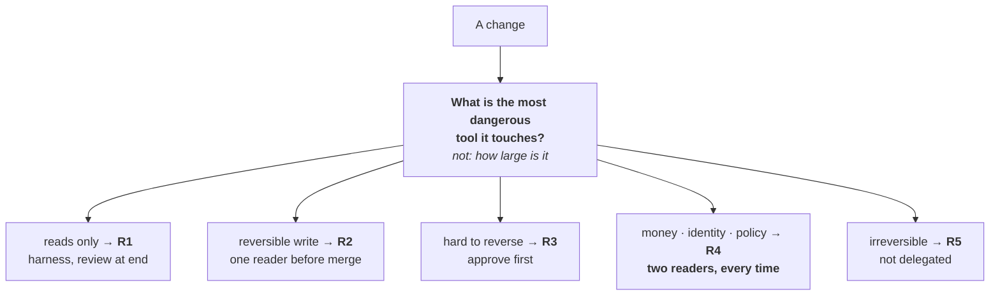

A change **inherits the band of whatever it touches**. Three lines in a refund cap is R4; four hundred
lines of help text is R1. The band comes from a path rule in the repository, never from the author.

### Worked

- **Day 60, nine pull requests, a four-day queue.** Three lines in the refund tool's cap check touch
  `issue_refund` → money → **R4**, two named readers.
- **Four hundred lines rewriting the help text** touch nothing that acts → **R1**, harness, one
  reader at the end.
- **A read-only search filter** → **R2**, one reader.
- **Shared code takes the band of its most dangerous caller**, so the formatting helper used by both
  search and refund is R4, which is the rule teams most often omit.
- **The arithmetic:** 2×2 + 3×1 + 4×0 = **7 slots** against 18 before. At 4.5 slots a day that is
  **1.6 days** against **4.0**. Nobody read faster and nobody was hired.

### What it costs to get wrong

Band by size and the four-hundred-line help-text rewrite gets two senior readers while three lines in
a refund cap get a quick approval — the same misordering that leaves a money path unread on the day
it changes. Band everything at the top instead and the queue stays at **18 slots, 4.0 days**, which
is the policy paying the price of caution on the changes that never needed it.

### When this tree does not apply

It assumes reviewers are interchangeable. If one person is the only one who can review the payment
path, that lane has a capacity of one whatever the headline slots-per-day number says, and the
average hides it — compute the queue per band, not overall. It also assumes the map is complete: a
path that appears in a diff and not in the map is a **gap**, never an R1, and treating unbanded as
low is the single most common way an escape happens.

<details><summary><b>Template · Band record for a change</b></summary>

```markdown
# Band · <change / PR reference> · <date>
Assigned by: <the path rule, .github/review-bands.yml v<n>>. Not by the author.

| Path touched | Band from the map | Set by |
|--------------|-------------------|--------|
| <src/tools/refund/cap.py> | **R4** | <R4 glob> |
| <docs/help/*.md> | R1 | <R1 glob> |

**Band of the change: <R4>** — the highest band of any path it touches, set by <path>.
Lines changed: <n>. This number is not an input to the band.

## Unbanded paths — gaps, not R1
| Path | Tool it appears to serve | Owner of the map fix |
|------|--------------------------|----------------------|
| <path> | <tool> | <name> |

## What a wrong version of this change would do, at its worst
<one sentence — this is the band, restated>

## Readers
| Band | Readers required | Named | Read on |
|------|------------------|-------|---------|
| <R4> | 2, named | <name>, <name> | <date> |

## Queue effect
Slots this change consumes: <n>. Queue today: <slots needed> / <slots per day> = <n> days.
```
</details>

---

## 8 · Does caching pay here?

### The decision

Whether to cache a prompt prefix and, if so, which window. The engineering lead decides per prompt,
from three facts rather than from instinct: how often the prefix repeats, how large it is, and how
long the gap is between calls. It is cheap to get right and it is one of the four factors that
multiply into a surprise bill.

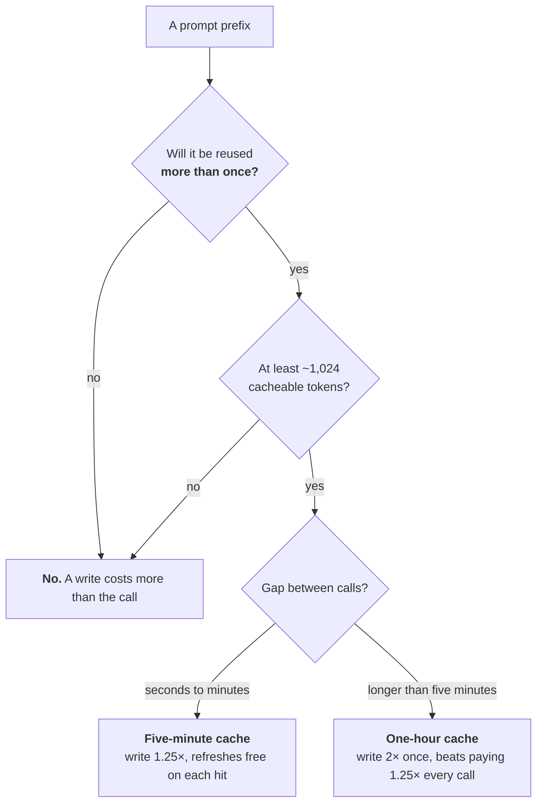

And check the layout: **tools → system → stable context → marker → the request.** One model per task;
no timestamps inside the cached block.

### Worked

- **The live passenger path.** Reused more than once? Yes — every turn of every session. Above 1,024
  cacheable tokens? Yes, once tools, system and the fare-rules context sit above the marker. Gap
  between calls? Seconds. → **five-minute cache**. Twenty calls cost 1.25 + 19 × 0.1 = **3.15 units**
  against 20 uncached, about **84% saved**.
- **The overnight re-scoring job**, one call every twelve minutes, reaches the other leaf. Five calls
  in an hour cost 5 × 1.25 = **6.25** on the five-minute window, or 2 + 4 × 0.1 = **2.40** on the
  one-hour window. The cheaper write, paid every call, is the more expensive option.
- **Day 75 is the counter-example.** An engineer moved the passenger's request to the front of the
  prompt for clarity. Caching stayed switched on and the hit ratio fell to **9%** from 71%.

### What it costs to get wrong

That reordering contributed a **1.30** cache factor to a bill that landed at **4.4×** its estimate on
flat traffic. Caching a prefix used once costs 1.25 units against 1.00 — a 25% surcharge on exactly
the calls that were already cheap. And the failure is silent in both directions: the configuration
still reads as correct, and only the measured hit ratio distinguishes a cache that is working from
one that has never hit.

### When this tree does not apply

The arithmetic assumes the prefix above the marker is **byte-identical** across calls, which is a
stronger condition than "roughly the same". One timestamp, request id or session id inside the block
takes the hit ratio to zero while every branch of this tree still reads yes. The cache is also
model-scoped, so a task that switches model mid-flight pays the write twice and reads neither. Before
you trust any leaf here, hash the prefix across a hundred consecutive calls and check they match.

---

## 9 · Which model tier?

### The decision

Which tier serves a class of request. The engineering lead owns the routing table and the architect
owns the classes; the shadow run settles the boundaries. It is decided per request class rather than
per product, and it is one of the eight soft gates — a placeholder of "everything on the mid tier
behind the gateway" is a legitimate starting position.

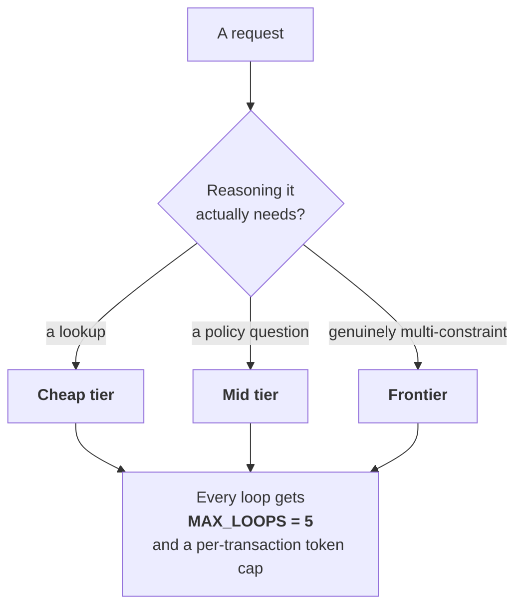

Right-sized, not over- or under-routed. **A model too weak produces wrong answers that get re-run,
which costs more than the right model once.**

### Worked

- **"Is there a later flight on this route today?"** A lookup against a structured answer. →
  **cheap tier.**
- **"Does this fare rule permit a change without a fee?"** One document, one determination. →
  **mid tier.**
- **A codeshare rebooking with a visa, an onward booking and a partner fare rule** — three
  constraints that interact. → **frontier.**
- **All three leaves get the same guard:** `MAX_LOOPS = 5` and a per-transaction token cap, in the
  harness rather than in the prompt.
- **Day 75 shows the drift.** The frontier share was **100%** against a 50% baseline — a factor of
  **1.5** — built out of six temporary escalations after hard cases, none of which carried an expiry.

### What it costs to get wrong

Over-routing is the quiet one: a 1.5 tier factor multiplied by three other habits produced a bill at
**4.4×** estimate with traffic flat, and no single decision in that chain looked wrong on the day it
was taken. Under-routing costs the other way and costs more than it appears to, because a wrong
answer is re-run — a cheap call that fails twice and then escalates has paid three times for one
answer, and the retry factor is where that shows up.

### When this tree does not apply

It assumes the three tiers are a real choice. A request class with a hard latency ceiling may have
only one tier that meets it, in which case the tree is answered by the NFR rather than by the
reasoning. It also assumes you can tell what reasoning a request needs *before* routing it; where
that judgement is itself a model call, the classifier's own cost and its own error rate belong in the
sum, and a classifier that mis-routes 10% of frontier work into the cheap tier can cost more in
re-runs than routing everything to mid would have.

<details><summary><b>Template · Routing table and escalation log</b></summary>

```markdown
# Routing · <product> · v<n> · <date>   Owner: <engineering lead>
Config lives at <config/routing.yaml>, reviewed like code. Settled by: <the shadow run>.

| Request class | Reasoning it needs | Tier | Share of calls | Cost/case |
|---------------|--------------------|------|----------------|-----------|
| <same-day lookup> | <a lookup> | cheap | <n>% | $<n> |
| <fare-rule question> | <a policy question> | mid | <n>% | $<n> |
| <codeshare, visa, onward> | <multi-constraint> | frontier | <n>% | $<n> |

Frontier share, blended: <n>%. Baseline at ratification: <n>%. Tier factor: <n>.

## Guards, in the harness and not in the prompt
| Guard | Setting | Module | Test that proves it fires |
|-------|---------|--------|---------------------------|
| MAX_LOOPS | 5 | <path> | <test name> |
| Per-transaction token cap | <n> | <path> | <test name> |

## Escalations — every one carries an expiry and reverts automatically
| Date | Class | Was | Now | Why | Expires | Reverted? |
|------|-------|-----|-----|-----|---------|-----------|
| <date> | <class> | mid | frontier | <incident <id>> | <date> | <yes/no> |

## Alert
Frontier share above <n>% for <n> days → <owner>. Cost per case above <3x $0.60> → <owner>.
```
</details>

---

## 10 · How deep a process for this change?

### The decision

How much ceremony this change gets: which artefacts are produced, which gates are walked, and whether
the persona trail runs. The solution architect decides, per change, in ten lines or fewer. Depth is a
property of the change rather than of the team, and a depth decision that takes an hour is its own
overhead.

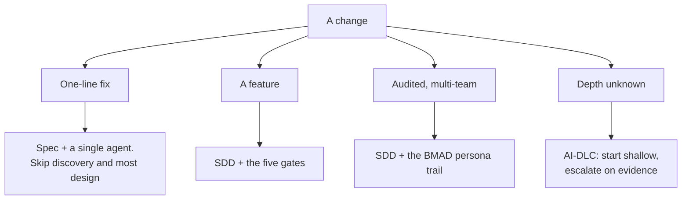

**SDD is the backbone everywhere.** BMAD is layered on only where the work is audited and multi-team —
on a small feature it is twelve personas between you and a one-line change.

### Worked

- **Codeshare rebooking**, the first real slice: a feature, one team, a bar and a golden set. →
  **SDD plus the five gates.**
- **A 900-line refactor of the read-only reporting view:** large and shallow. → **spec plus a single
  agent**, and the size of the diff is not what put it there.
- **The one-line change to the refund cap after day 82:** tiny and deep. A regulator reads the
  result, so it enters at **audited** and keeps the versioned trail, however small the diff is.
- **The retrieval design on day 20**, where nobody could say how deep it went. → **AI-DLC: start
  shallow, escalate on evidence**, and it escalated in week three when a slice needed cross-session
  state.
- **Two changes at different depths in the same sprint** is the sign the tree is being used rather
  than defaulted.

### What it costs to get wrong

Run the persona trail on a typo fix and six artefacts are generated for one line; within a month the
team is quietly skipping the trail on everything, including the audited multi-team work it exists
for. The mirror error is the same mistake upside down — an editor agent and R1 ceremony applied to a
refund cap, which is how three lines that move money reach production with one quick approval.

### When this tree does not apply

It assumes somebody can classify the change before it starts, which is precisely what is false often
enough that the fourth branch exists. Treat "depth unknown" as a real answer rather than as an
admission; the failure is picking a branch to look decisive and then never re-opening it. The tree
also chooses only what is *added*: SDD runs on every branch, so a leaf is never a licence to skip the
spec, and a change with no spec change is a change nobody can review.

---

## 11 · Ship it, or not?

### The decision

Whether a change goes live. The QA lead brings the readout, the product manager owns the bars, and
the release gate is signed by a person whose name is on it. Four questions in a fixed order, and the
order is the point: the cheap deterministic check comes first, and the question about money comes
last because it is the one that is never waived.

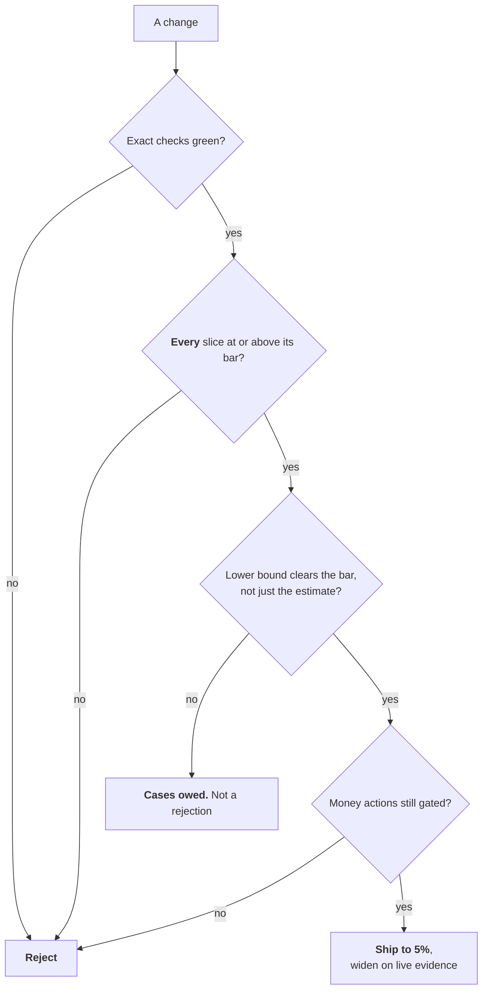

The second box is the one that catches the real regressions: an overall score can rise while the
slice that carries the risk falls below its bar.

### Worked

- **Day 45. Exact checks green?** Yes — fare arithmetic, cap arithmetic, schema validation.
- **Every slice at or above its bar?** Same-day 96% against 50%, codeshare 82.4% against 80%, refund
  held 74% against 71%. Yes, on the point estimates.
- **Lower bound clears the bar?** Codeshare is 412 right of 500. The 95% lower bound is **79.1%**
  against a bar of 80. **No.**
- **Leaf: cases owed, and that is not a rejection.** Proving 82.4% against 80 needs **968** cases;
  the set holds 500, so the team owes **468** — roughly eighteen days of codeshare history to curate,
  or 81 days at 5% of live traffic.
- **The third lever nobody had listed:** a hold on codeshare lowers the damage and brings the bar
  down to meet the number, the same lever that takes refunds from 98% to 71%.
- **Prompt v7 is the second box earning its place:** same-day up three, refunds down four, overall
  number up, merge rejected.

### What it costs to get wrong

Read the point estimate as a pass and you ship a slice that has not been proven; 82% on forty cases
has a lower bound of **70%**, and every dashboard in the building shows the 82. Skip the last box and
the release is the one that leaves a money action ungated — on day 82 the honest answer to that
question was no, and nobody had been asked it.

### When this tree does not apply

It assumes every slice has a bar and a curated set behind it. A slice with no bar is not a pass; it
is **unmeasured**, and this tree cannot tell the two apart, so the first move on any new slice is a
bar rather than a run. The last box asks whether money actions are *gated*, which is a question about
the design, and day 82 is what happens when the answer is taken from the design document instead of
from a test that was red an hour ago.

<details><summary><b>Template · Ship decision</b></summary>

```markdown
# Ship decision · <change> · run <date> · commit <sha>
Readout by: <QA lead>   Bars owned by: <PM>   Gate signed by: <name>

| # | Question | Answer | Evidence |
|---|----------|--------|----------|
| 1 | Exact checks green? | yes / no | <CI run link> |
| 2 | Every slice at or above its bar? | yes / no | <the table below> |
| 3 | Lower bound clears the bar? | yes / no | <the table below> |
| 4 | Money actions still gated? | yes / no | <test names that were red first> |

| Slice | Score | n | 95% lower bound | Method | Bar | Verdict | Cases owed |
|-------|-------|---|-----------------|--------|-----|---------|-----------|
| <same-day> | <n>% | <n> | <n>% | normal | <n>% | PASS | — |
| <codeshare> | <n>% | <n> | <n>% | normal | <n>% | **UNPROVEN** | <n> |
| <refund, held> | <n>% | <n> | <n>% | wilson | <n>% | | |

Method: Wilson below 100 cases, normal above. Stated per row.

## Leaf reached
<reject | cases owed: <n> | ship to 5%>   Reached <date>

## If "cases owed", the three levers, priced
| Lever | Cost | Days | Chosen? |
|-------|------|------|---------|
| Collect <n> more cases | <curation effort> | <n> | |
| Raise the score | <what would change> | <n> | |
| Lower the damage with a hold | <the hold> | <n> | |

## Rollback, rehearsed
Thrown by: <name>, on <date>. Took <n> minutes. It is a <flag / config change>.
```
</details>

---

## Where a model helps across these

| Tool | Use it for |
| --- | --- |
| **Chat LLM** | Run one tree across a backlog in bulk — ten items, the answer at each branch, the leaf, one line of justification. It is fast, and it is generous at the first branch of trees 1 and 2, so re-read every leaf that comes back *agentic* or *best-guess* |
| **Chat LLM, adversarially** | "Argue the other branch, as strongly as you can." One prompt per contested question. The strongest case against your leaf is the cheapest review of it you will get, and it takes five minutes |
| **Claude Code** | Fetch the inputs these trees need out of the repository rather than out of memory: cases a day from the ticket export, cacheable tokens above the marker, which files each tool reaches, the reviewers on last quarter's merges |
| **Claude Code** | Turn a settled leaf into the thing that enforces it — the path rule from a band, the typed signature and its two tests from an autonomy level, the routing config from a tier decision |
| **Do not delegate** | The leaf on any tree whose branches mention money, identity or irreversibility. A model returns a plausible branch, and plausible is the precise failure trees 3, 6 and 11 exist to prevent |

---

## How to use a tree in a room

1. **Read the tree aloud before anyone answers anything** — the questions and the leaves, in order.
   Thirty seconds. People who have seen where the branches end argue about the evidence rather than
   about the destination they fear.
2. **Answer the questions in the order they are drawn.** The order is cost: each question is cheaper
   to answer than the one after it. Answering volume before judgement means costing a system nobody
   has established needs to exist.
3. **Stop at the first stop.** A "no" that ends the exercise has ended it. Continuing "to be
   thorough" invites somebody to re-litigate the answered question with the later ones as leverage.
4. **Answer with evidence or write UNKNOWN.** A branch taken on a number nobody can source is a
   branch taken on a preference. `UNKNOWN` is a legitimate answer; it names the follow-up call and
   whose it is.
5. **Record the leaf and the date on the screen, in the room.** Ambiguity re-enters in the gap
   between agreement and minutes. The record is one of the templates above, filled in while people
   are still present.
6. **Name what would re-open it before anyone leaves** — a trigger, never a date. "Revisit in a
   quarter" means the argument returns in a quarter; "revisit when a slice needs cross-session
   state" means it returns when something has actually changed.

---

## Try it

Take the decision your team argued about most recently. Find it on this page.

Then do three things with it: walk it to a leaf out loud, fill in the template beneath that tree, and
write the one sentence that would re-open it. If any branch stalls because nobody has the number,
that gap is the more useful finding — it is the reason the argument recurred.

<details>
<summary>If it is not here</summary>

Two possibilities, and they are worth telling apart.

**It is a genuine trade-off point** — two quality attributes pulling against each other, with no
general right answer. That is what a decision record is *for*. Write the ADR, name what you rejected,
and stop re-litigating it.

**Or it is a decision this playbook makes the same way every time, and your team has not adopted the
rule yet.** Autonomy arguments, agent-count arguments and review-depth arguments are almost always
this. Adopt the tree, and the argument becomes a two-minute lookup.

The tell: if the argument recurs every few weeks with the same people on the same sides, it is the
second kind.

A third case turns up less often and is worth naming. The argument is real, the tree covers it, and
the tree keeps returning a leaf the team will not accept — usually tree 3 or tree 11. That is almost
never a fault in the tree. It is an input nobody believes: a damage figure somebody invented, or a
bar that was never derived from one. Fix the input and the leaf stops being contentious.
</details>

---

**Next:** [Formulas and Calculators](Formulas-and-Calculators) · [The Agentic PDLC](The-Agentic-PDLC)
· [Exercises and Answers](Exercises-and-Answers) · [Anti-Patterns](Anti-Patterns) ·
[Gates and Governance](Gates-and-Governance) · [How to Review by Risk Band](How-to-Review-by-Risk-Band)
· [The Eight Loops](The-Eight-Loops) · [Scenario Library](Scenario-Library)
