# Decision trees

Eleven decisions this playbook makes the same way every time, each drawn as a tree. Print the ones you
use; they are meant to be settled in minutes, not debated in meetings.

---

## 1 · Is this AI at all?

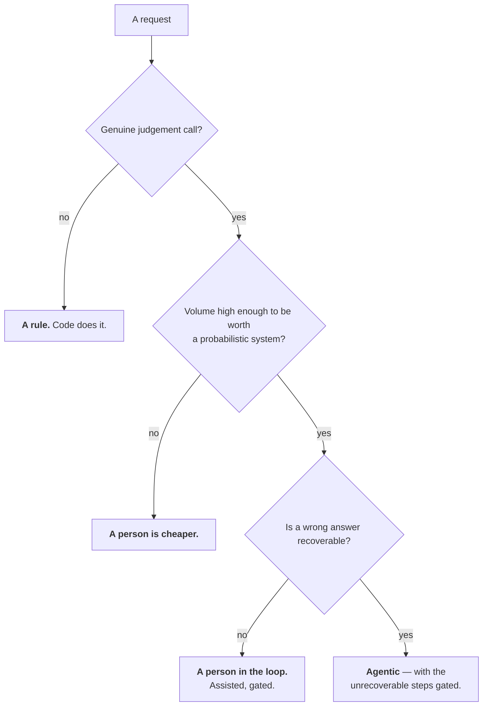

Expect two or three of your top five requests to come back as rules. That is the healthy answer.

---

## 2 · What kind of step is this?

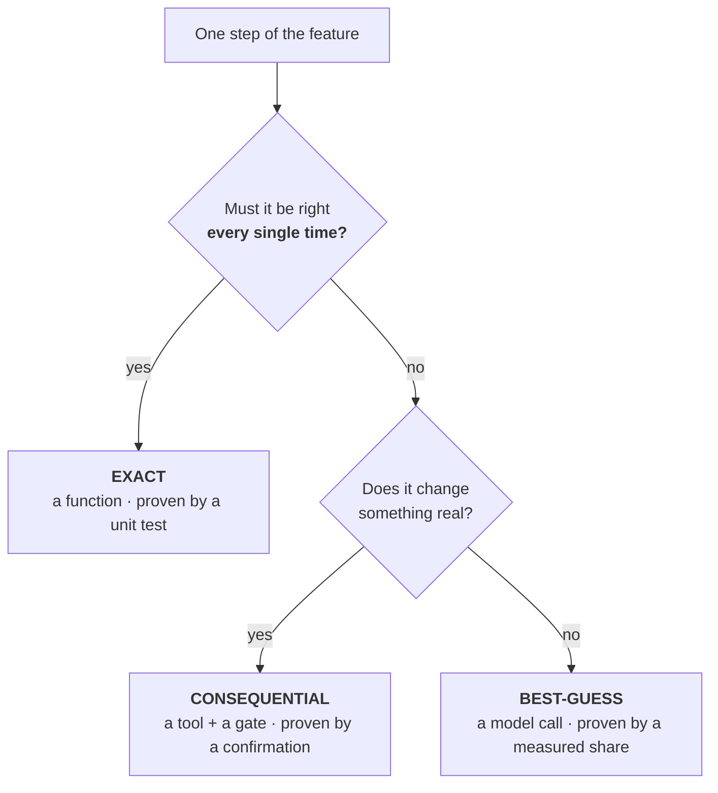

**The rule that never breaks: the best-guess machine never does the exact math.** The model may call
the function and read the result; it never computes the value.

---

## 3 · How much autonomy?

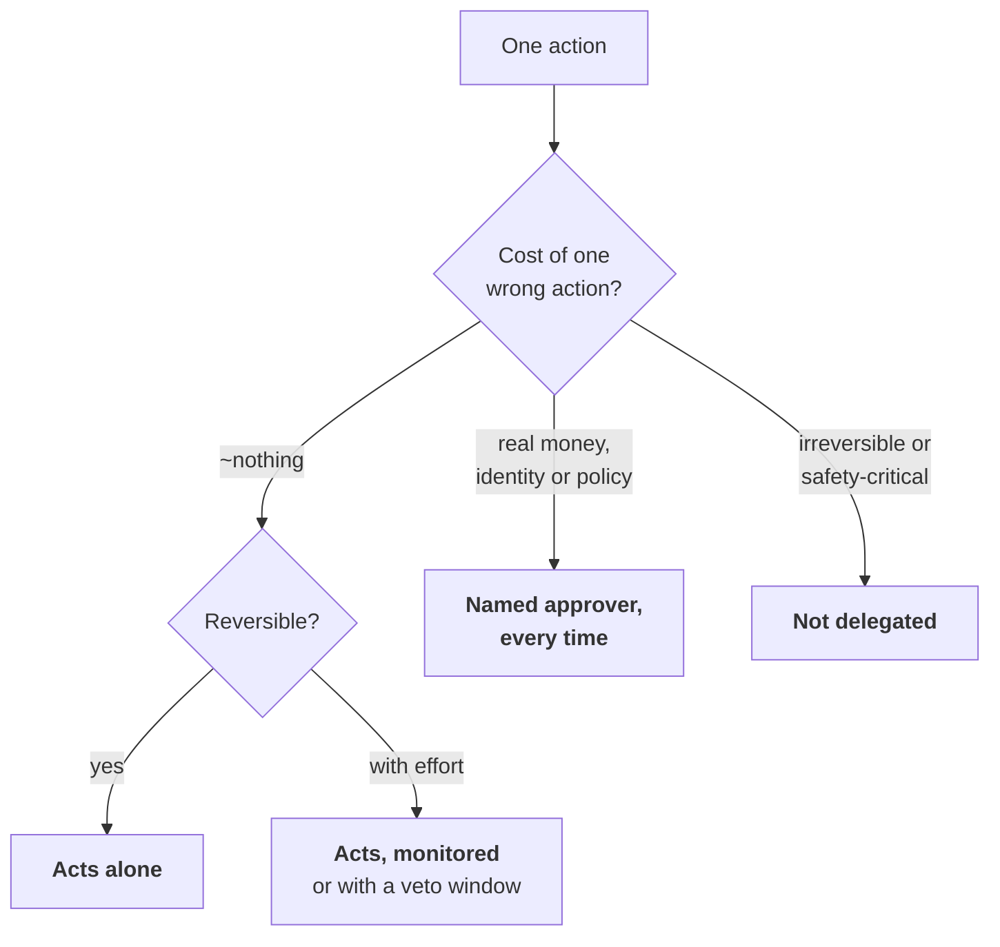

Per **action**, never per product. **Reversibility is the hinge**, and it is the column that ends most
arguments. Levels rise only on evidence; an incident usually drops one.

---

## 4 · Hard gate or soft gate?

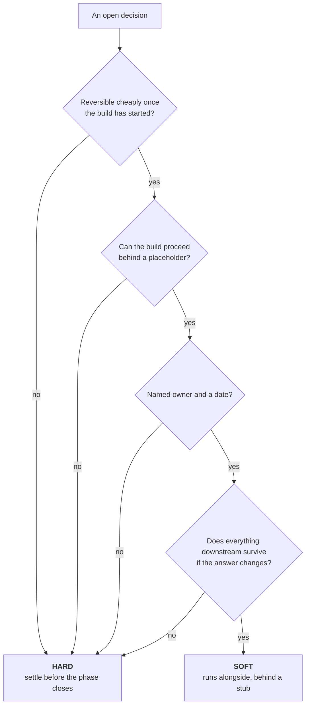

**A single no makes it hard.** For SkyWays, three of eleven are hard and eight run in parallel. Treat
all eleven as hard and the build waits behind every one.

---

## 5 · How many agents?

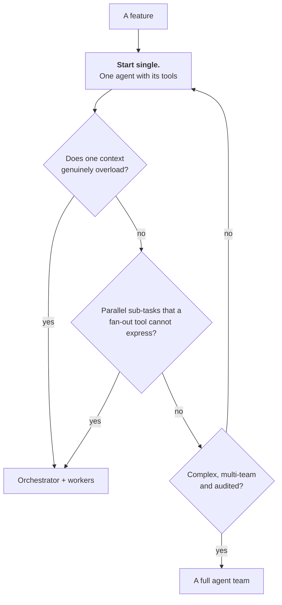

Five agents have **ten** possible hand-offs. Parallelism is a property of a **tool**, not of an agent
count. Write the escalation condition down, or the swarm returns by default.

---

## 6 · Where does this rule live?

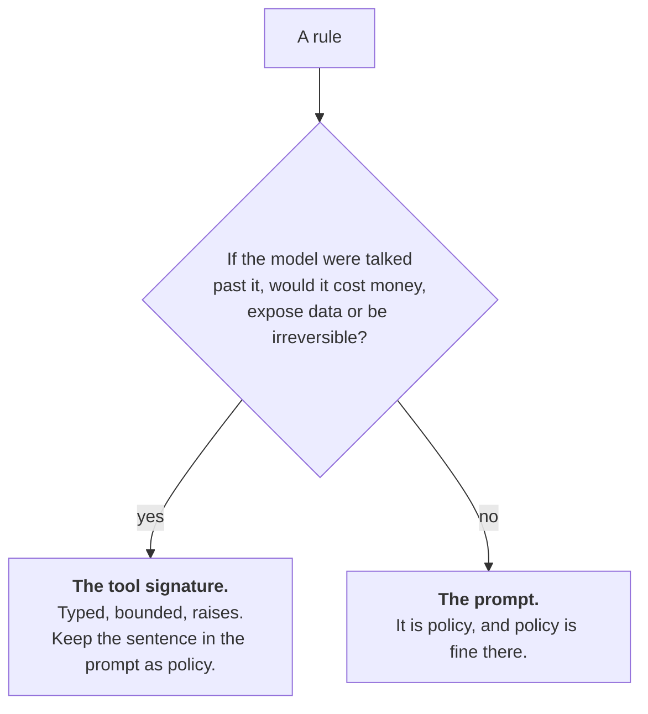

> A prompt is a **request**. A tool contract is a **boundary**.

---

## 7 · Which review band?

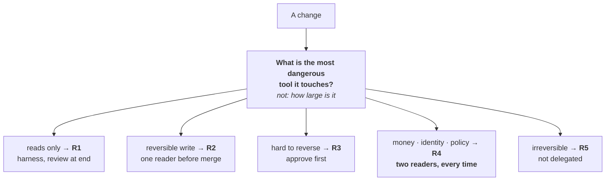

A change **inherits the band of whatever it touches**. Three lines in a refund cap is R4; four hundred
lines of help text is R1. The band comes from a path rule in the repository, never from the author.

---

## 8 · Does caching pay here?

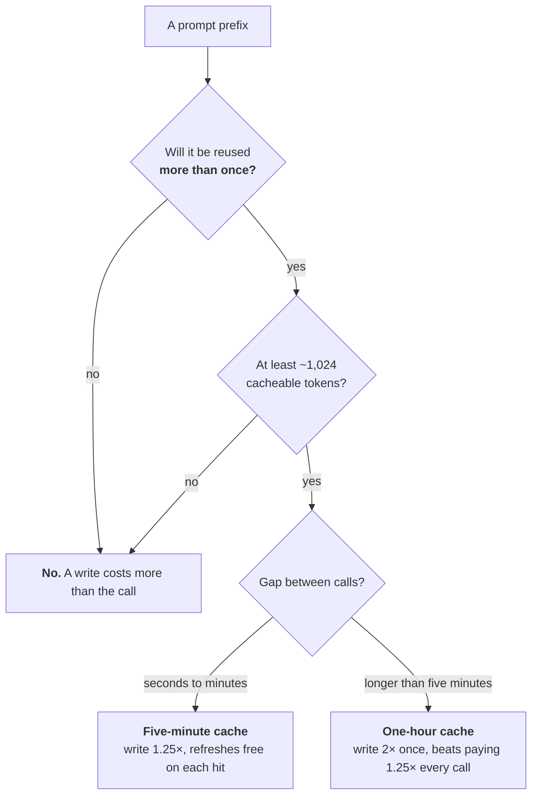

And check the layout: **tools → system → stable context → marker → the request.** One model per task;
no timestamps inside the cached block.

---

## 9 · Which model tier?

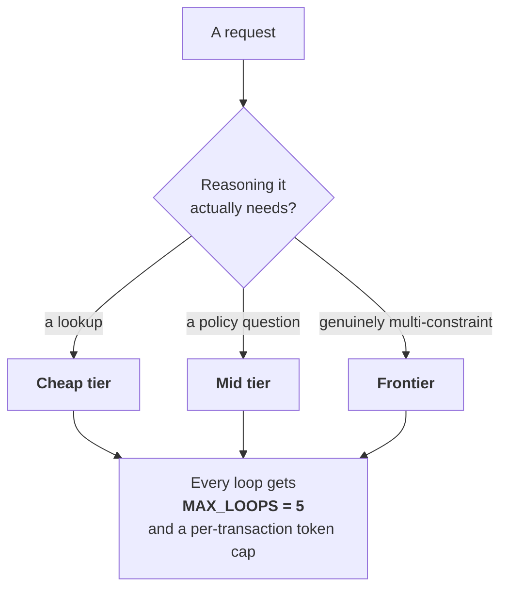

Right-sized, not over- or under-routed. **A model too weak produces wrong answers that get re-run,
which costs more than the right model once.**

---

## 10 · How deep a process for this change?

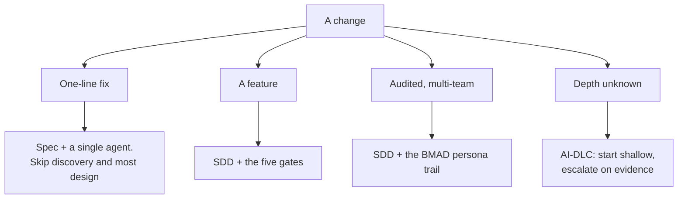

**SDD is the backbone everywhere.** BMAD is layered on only where the work is audited and multi-team —
on a small feature it is twelve personas between you and a one-line change.

---

## 11 · Ship it, or not?

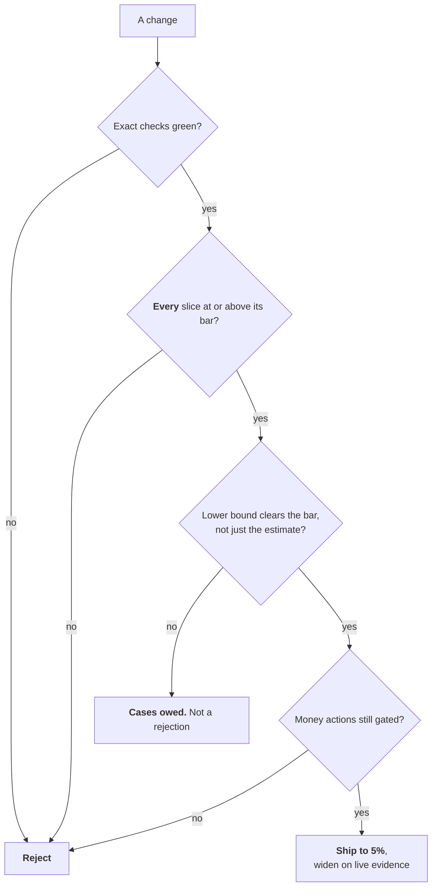

The second box is the one that catches the real regressions: an overall score can rise while the
slice that carries the risk falls below its bar.

---

## Try it

Take the decision your team argued about most recently. Find it on this page.

If it is not here

Two possibilities, and they are worth telling apart.

**It is a genuine trade-off point** — two quality attributes pulling against each other, with no
general right answer. That is what a decision record is *for*. Write the ADR, name what you rejected,
and stop re-litigating it.

**Or it is a decision this playbook makes the same way every time, and your team has not adopted the
rule yet.** Autonomy arguments, agent-count arguments and review-depth arguments are almost always
this. Adopt the tree, and the argument becomes a two-minute lookup.

The tell: if the argument recurs every few weeks with the same people on the same sides, it is the
second kind.

---

**Next:** [Formulas and Calculators](Formulas-and-Calculators) · [The Agentic PDLC](The-Agentic-PDLC)
· [Exercises and Answers](Exercises-and-Answers) · [Anti-Patterns](Anti-Patterns)
