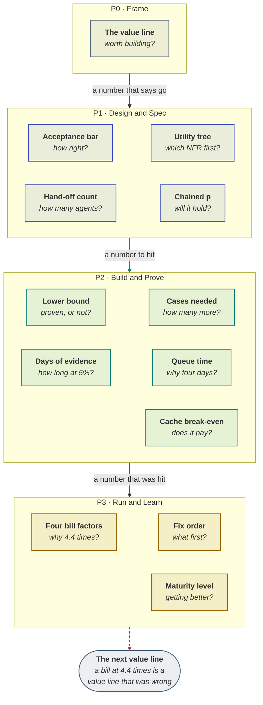

# Formulas and calculators

Every number in the playbook, with the formula behind it, a worked example, and — the part most
reference pages leave out — **when the formula misleads you**.

Seventeen of these have a live calculator:
[the toolkit](https://akash-coded.github.io/aws-bedrock-agentcore-strands/simulator/#/toolkit/aifit).
The role journeys show each one in the step where you actually need it.

**Confidence marks:** **documented** (a vendor's published documentation, dated) ·
**established** (a named, published practice) · **working method** (this playbook's own construction,
a default to tune rather than a finding).

---

## Which formula do I need?

| The question in your head | The formula | Section |
| --- | --- | --- |
| Is this worth building? | net = cases × min × rate − run − review | [The value line](#the-value-line--working-method) |
| How right does it have to be? | bar = N ÷ (N + 1), N = damage ÷ saving | [The acceptance bar](#the-acceptance-bar--working-method) |
| Which NFR do we do first? | priority = value × (4 − complexity) | [Utility-tree priority](#utility-tree-priority--established-atam) |
| How many agents? | hand-offs = n(n − 1) ÷ 2 | [Hand-off count](#hand-off-count--established) |
| Will this chain hold together? | pⁿ | [Chained probability](#chained-probability--established) |
| Have we actually proven it? | lower bound = p − z√(p(1−p)/n) | [The lower bound](#the-lower-bound-of-a-score--established-wilson-1927) |
| How many more cases do we need? | n = z²p(1−p) ÷ (p − bar)² | [Cases needed](#cases-needed-to-prove-a-bar--established) |
| How long at five percent? | days = cases ÷ (share × cases/day) | [Days of live evidence](#days-of-live-evidence--working-method) |
| Why is the review queue four days? | queue = slots needed ÷ slots per day | [Queue time](#queue-time--established-little-1961) |
| Does caching pay here? | (w + 0.1(N−1)) × T × p vs N × T × p | [Cache break-even](#cache-break-even--documented) |
| Why is the bill 4.4×? | context × tier × cache × retry | [The four bill factors](#the-four-bill-factors--working-method) |
| What do I fix first? | priority = (factor − 1) ÷ days | [Fix order](#fix-order--working-method) |
| Are we getting better at this? | level = controls in place, of six | [Maturity](#maturity-level--working-method) |

---

## Where each one is used

The table above answers *which formula*. This answers *when* — and the clustering is the argument.
Nine of the thirteen sit in P1 and P2, because those are the phases where a number still changes a
decision rather than explaining one that has already been taken.



**Nothing in P0 is precise, and that is deliberate.** The value line is one multiplication with four
estimates in it; its job is to end an argument about whether to proceed, not to survive an audit. A
number that would survive an audit is not available at P0 and waiting for one is how framing stalls.

**The last arrow carries arithmetic too.** A bill that came in at 4.4 times its estimate is not an
operations problem — it is a value line that was wrong, arriving late enough to be expensive.

---

## Value and worth

### The value line · *working method*

> **net = cases × minutes × rate − cases × run cost − cases × share reviewed × review minutes × rate**

Value is arithmetic, not adjectives. The two terms people omit are the last two: what it costs to
**run** (tokens) and what it costs to **check** (review).

**Worked — SkyWays, cycle one**

| Term | Value | Arithmetic |
| --- | --- | --- |
| Gross saving | **$1,440/day** | 240 cases × 8 min × $0.75 |
| Run cost | −$144/day | 240 × $0.60 |
| Review load | −$162/day | 240 × 30% × 3 min × $0.75 |
| **Net** | **$1,134/day** | |

**When it misleads.** Three ways, and all three are common:

1. **Extrapolating a pilot linearly.** Saving and run cost scale with volume; the review load does
   not fall on its own. At 50,000 cases a day a 20% review share consumes 40% of the minutes saved,
   forever, unless the artefacts sharpen. Re-run the line at target volume before you promise it.
2. **Counting time saved that nobody reclaims.** Eight minutes saved across forty agents is not five
   person-days unless somebody removes a shift or absorbs more volume.
3. **Omitting the review row to make cycle one look better.** Cycle two then reads as a regression
   when it is actually the recovery.

[Calculator](https://akash-coded.github.io/aws-bedrock-agentcore-strands/simulator/#/toolkit/value)
· [PM journey, step 3](Journey-Product-Manager)

<details><summary><b>Template · Value line with sensitivity</b></summary>

```markdown
# Value line · <feature> · <date>

| Term | Value | Source | Confidence |
|------|-------|--------|-----------|
| Cases per day | <n> | <pain register / ticket export> | measured / estimated |
| Minutes saved per case | <n> | <timed how, on what sample> | |
| Loaded cost per minute | $<n> | finance | |
| **Gross saving per day** | **$<n>** | = cases x minutes x rate | |
| Run cost per case | $<n> | engineering, <date>, cached and routed | |
| Share of cases reviewed | <n>% | cycle 1 estimate | |
| Review minutes per reviewed case | <n> | | |
| **Net per day** | **$<n>** | | |

## Sensitivity — which input actually decides this
| Input | Net if 20% worse | Change | Evidenced? |
|-------|-----------------|--------|-----------|
| <minutes saved> | $<n> | <n>% | <measured on n cases> |
| <review share> | $<n> | <n>% | **estimated — go and measure this** |

The input that is BOTH high-impact AND least evidenced: <name it>. Measure it before
this line is presented.

## At target volume
| | Pilot (<n>/day) | Target (<n>/day) |
|---|---|---|
| Net per day | $<n> | $<n> |
| Review share needed to stay positive | — | <n>% |
```
</details>

---

### The acceptance bar · *working method*

> **N = damage ÷ saving** , **bar = N ÷ (N + 1)**

One wrong case undoes the saving from N right ones, so the assistant breaks even at N right for
every wrong.

| Slice | Saving | Damage | N | Bar |
| --- | --- | --- | --- | --- |
| Same-day lookup | $4 | $4 | 1 | **50%** |
| Codeshare rebook | $9 | $36 | 4 | **80%** |
| Refund, no hold | $12 | $600 | 50 | **98%** |
| Refund, **with a human hold** | $12 | $30 | 2.5 | **71%** |

The last two rows are the lever. **A hold lowers the damage, so it lowers the bar.** That is how a
best-guess feature ships safely at 71% instead of waiting for a 98% it will never reach.

**When it misleads.**

- **Damage is not always money.** A wrong medical summary, a wrongly refused benefit, a mis-stated
  legal position — put a number on it anyway, and if you genuinely cannot, that is the finding: the
  step needs a hold regardless of any bar.
- **One bar for the whole feature** is the most common error. The easy slice waits while the hard
  slice ships below its bar, and the average hides both.
- **A bar above about 95% is usually a design smell**, not a target. It says the damage is too high
  for an unheld step, and the answer is a hold, not a better prompt.

[Calculator](https://akash-coded.github.io/aws-bedrock-agentcore-strands/simulator/#/toolkit/bar)
· [How to Prove the Bar](How-to-Prove-the-Bar)

<details><summary><b>Template · Acceptance bar sheet</b></summary>

```markdown
# Acceptance bars · <feature> · <date> · Owner: <name>

| Slice | Saving per right case | Damage per wrong case | N | Bar | Hold? | Bar with hold |
|-------|----------------------|----------------------|---|-----|-------|---------------|
| <same-day> | $<n> | $<n> | <n> | <n>% | no | — |
| <codeshare> | $<n> | $<n> | <n> | <n>% | no | — |
| <refund> | $<n> | $<n> | <n> | <n>% | **yes — <what the hold is>** | <n>% |

## How damage was estimated, per slice
| Slice | What goes wrong | Who bears it | How the number was reached |
|-------|-----------------|--------------|---------------------------|
| | | | |

## The rule this sheet creates
Any slice whose LOWER BOUND is below its bar rejects the change, whatever the overall
number says. Signed: <name>, <date>.

## Review
Bars are re-derived when the damage changes — a pricing change, a regulatory change, a
new customer segment. Next review: <date>.
```
</details>

<details><summary><b>Prompt · Derive bars for every slice</b></summary>

```text
Derive an acceptance bar for each slice below.

For each: N = damage / saving, bar = N / (N + 1). SHOW the arithmetic per slice.

Then:
1. Flag any slice whose bar is above 95% and say plainly that this is a design signal,
   not a target: propose the human hold that would lower the damage, and re-compute the
   bar with that hold in place.
2. Flag any slice where I gave you a damage figure that is not money, and say what would
   have to be true to price it.
3. Rank the slices by bar, descending. The top one is where the hold goes.

Output one table: | Slice | Saving | Damage | N | Bar | With hold | Bar with hold |

SLICES:
<paste: slice name, saving per right case, damage per wrong case>
```
</details>

---

## Requirements and decisions

### Utility-tree priority · *established* (ATAM)

> **priority = value × (4 − complexity)** , each scored 1–3

Two stakeholders whose priority for the same NFR differs by **5 or more** have a conflict, and every
conflict is a decision-record trigger.

**Why `4 − complexity` and not `÷ complexity`:** the multiplier keeps the scale linear and bounded
(priority runs 1 to 9), and it deliberately punishes high-difficulty work of moderate value, which is
exactly where programmes lose quarters.

**When it misleads.** A wide spread can be two people with *different information* rather than
different interests. Before you write an ADR, ask what single fact would settle it — sometimes the
conflict evaporates.

[Calculator](https://akash-coded.github.io/aws-bedrock-agentcore-strands/simulator/#/toolkit/utree)
· [How to Run an NFR Workshop](How-to-Run-an-NFR-Workshop)

### Weighted decision matrix · *established* (Pugh, 1981)

> **score = Σ weight × rating**

Plus two numbers no vendor page carries: the **three-year cost with the people counted**, and the
**door** (one-way or two-way).

**The flip test:** how far must one weight move before the winner changes? If a single point flips
it, say so in the record — it tells the next reader how firm the decision is.

**When it misleads.** A close spread does not mean "pick either". It means the criteria you chose do
not separate the options, so the real decision is being made by something you have not written down —
usually the exit cost.

[Calculator](https://akash-coded.github.io/aws-bedrock-agentcore-strands/simulator/#/toolkit/bvb)
· [How to Choose Build, Buy or Borrow](How-to-Choose-Build-Buy-or-Borrow)

### Hand-off count · *established*

> **hand-offs = n(n − 1) ÷ 2** for n agents

| Agents | Possible hand-offs |
| --- | --- |
| 2 | 1 |
| 3 | 3 |
| 5 | **10** |
| 10 | 45 |

This is the arithmetic behind "start single, escalate on a named limit". Parallelism is a property
of a **fan-out tool**, not of an agent count.

---
## Reliability

### Chained probability · *established*

> **end-to-end = pⁿ**

| Steps at 90% | End to end |
| --- | --- |
| 2 | 81.0% |
| 4 | **65.6%** |
| 6 | 53.1% |
| 8 | 43.0% |

**Length is the enemy.** Multiply, never average. Four steps at 90% is wrong one time in three, and
it fails *fluently* — no exception, no red test, just a confident wrong answer.

**When it misleads.** The formula assumes independence, and real steps are correlated: a bad
retrieval makes the next three steps worse. So `pⁿ` is the **optimistic** bound. If the measured
end-to-end rate is below it, correlation is the reason, and the fix is upstream of the step you were
blaming.

**Two defences, in order:** shorten the chain (removing one step at 90% buys more than raising any
single step from 90% to 95%), then put an independent checker after the steps that are costly and
easy to miss.

[Role: Solution architect](Journey-Solution-Architect)

---

### The lower bound of a score · *established* (Wilson, 1927)

> **normal: lower bound = p − z × √( p(1 − p) ÷ n )**

The bar is proven only when the **lower bound** clears it, not the point estimate.

| Score | n | Normal lower bound | **Wilson** lower bound | Against an 80% bar |
| --- | --- | --- | --- | --- |
| 82% | 40 | 70.1% | **67.5%** | not proven |
| 82% | 150 | 75.9% | **75.1%** | not proven |
| 82% | 500 | 78.6% | **78.4%** | not proven |
| 86% | 500 | 83.0% | **82.7%** | **proven** |

Two things that table teaches. **82% never proves an 80% bar** at any sample size you will
realistically collect, because the estimate sits too close to the bar. And the normal approximation
is **optimistic at small n** — at forty cases it overstates the bound by 2.6 points, which is exactly
the range where someone is about to ship.

> **Under about a hundred cases, quote Wilson.** Near 0 or 1 it is the only one that behaves.

[Calculator](https://akash-coded.github.io/aws-bedrock-agentcore-strands/simulator/#/toolkit/confidence)
· [QA journey, step 5](Journey-QA-Lead)

---

### Cases needed to prove a bar · *established*

> **n = z² × p(1 − p) ÷ (p − bar)²**

| Score | Bar | Gap | Cases needed |
| --- | --- | --- | --- |
| 95% | 90% | 5 pts | **73** |
| 91% | 85% | 6 pts | **87** |
| 88% | 85% | 3 pts | **451** |
| 82.4% | 80% | 2.4 pts | **968** |

The denominator is squared, so **the cost of proving grows quadratically as your score approaches
the bar.** Halve the gap and you quadruple the cases.

**The practical consequence:** "not proven" is not a rejection. It is a **cases-owed number**, and
saying "we owe 331 more codeshare cases" is a plan where "it failed" is an argument.

**When it misleads.** The formula assumes the cases are representative of the slice. Oversampling an
easy corner of a slice to reach the count proves nothing — the number is necessary, not sufficient.

<details><summary><b>Template · Score readout, per slice</b></summary>

```markdown
# Evaluation readout · <feature> · run <date> · commit <sha>

| Slice | Score | n | 95% lower bound | Bar | Verdict | Cases owed |
|-------|-------|---|-----------------|-----|---------|-----------|
| <same-day> | <n>% | <n> | <n>% | <n>% | PASS | — |
| <codeshare> | <n>% | <n> | <n>% | <n>% | **UNPROVEN** | <n> |
| <refund> | <n>% | <n> | <n>% | <n>% | | |

Bound: Wilson where n < 100, normal otherwise. Method stated per row.

## Change since the previous run
| Slice | Previous | Now | Moved | Regression? |
|-------|----------|-----|-------|-------------|
| | | | | |

**Rule:** any slice whose LOWER BOUND is below its bar rejects the change, whatever the
overall number says. A slice that got worse but still passes is flagged, not blocked.

## Verdict
<ship / do not ship / ship with <slice> still gated> — because <one sentence>.
```
</details>

<details><summary><b>Prompt · Turn raw results into a decidable readout</b></summary>

```text
Convert this evaluation output into a readout I can decide from.

Produce ONE table: | Slice | Score | n | 95% lower bound | Bar | PASS / FAIL / UNPROVEN | Cases owed |

Rules:
- lower bound = p - 1.96*sqrt(p*(1-p)/n). If n < 100, use the WILSON interval instead
  and say so in that row.
- PASS only if the LOWER BOUND is at or above the bar.
- If the score is above the bar but the bound is not: UNPROVEN, and compute cases owed
  as n_needed - n, where n_needed = 1.96^2*p*(1-p)/(p-bar)^2.
- Flag any slice that moved DOWN since the previous run, even if it still passes.
- Show the arithmetic for one row so I can check your method.

Then one line: ship or do not ship, and the single reason.

BARS: <paste the bar sheet>
RESULTS: <paste>
PREVIOUS RUN: <paste, or "none">
```
</details>

---

### Days of live evidence · *working method*

> **days = cases needed ÷ ( traffic share × cases per day )**

| Share | Cases/day seen | Days for 500 cases |
| --- | --- | --- |
| 5% | 12 | **42** |
| 25% | 60 | **8.3** |
| 100% | 240 | 2.1 |

A small share is the safe place to start and a slow place to learn. That tension is the whole reason
a cut-over **widens** rather than sitting at five percent.

**When it misleads.** It assumes the traffic you sample looks like the traffic you do not. At five
percent for six weeks you will see a normal Tuesday many times and a storm day perhaps once, so a
rare-but-costly condition can stay invisible for the whole window. Widen deliberately across
conditions, not just across volume.

[Calculator](https://akash-coded.github.io/aws-bedrock-agentcore-strands/simulator/#/toolkit/cutover)

---

## Delivery

### Queue time · *established* (Little, 1961)

> **queue time = review slots needed ÷ review slots available per day**

| | Slots needed | Per day | Queue |
| --- | --- | --- | --- |
| Two reviewers on everything, 9 changes | 18 | 4.5 | **4.0 days** |
| Routed by band (2×2 + 3×1 + 4×0) | 7 | 4.5 | **1.6 days** |

Capacity is fixed by people and hiring takes a quarter. **Slots needed is a policy variable you can
change this afternoon.**

**When it misleads.** It assumes reviewers are interchangeable. If only one person can review the
payment path, that lane has a capacity of one regardless of the headline, and the average hides it.
Compute the queue per band, not just overall.

[Calculator](https://akash-coded.github.io/aws-bedrock-agentcore-strands/simulator/#/toolkit/queue)
· [How to Review by Risk Band](How-to-Review-by-Risk-Band)

### Exposure in unknown-days · *working method*

> **exposure = Σ, over every day, of the unknowns still open**

Two plans with the same ten bolts can differ by a factor of three on this measure. It is why the
walking skeleton goes first: it retires the largest unknown — "do these pieces connect at all" — on
day one, for half a day's work.

---

## Cost

### Cache break-even · *documented*

> **cost with cache = ( w + 0.1 × (N − 1) ) × T × p** , against **N × T × p** without

where **w** is the write multiplier and **N** the number of uses.

| | Relative to the input price |
| --- | --- |
| Five-minute cache **write** | **1.25×** |
| One-hour cache **write** | **2×** |
| Cache **read** | **0.1×** — *Fable and Mythos 5.1 read at 0.025×* |

| Uses | With cache | Without | Verdict |
| --- | --- | --- | --- |
| 1 | 1.25 | 1.00 | costs more |
| 2 | 1.35 | 2.00 | **break-even passed** |
| 10 | 2.15 | 10.00 | saves 79% |
| 100 | 11.15 | 100.00 | saves 89% |

Minimum around 1,024 cacheable tokens. The five-minute cache refreshes free on each hit. The cache is
**model-scoped**, so one model per task.

**Which window.** At one call every twelve minutes overnight, a five-minute cache has always expired,
so five calls an hour cost **5 × 1.25 = 6.25**. One hour-long write plus four reads costs
**2.0 + 0.4 = 2.4**. The cheaper write, paid every call, is the more expensive option.

**When it misleads.** The arithmetic is right and the hit ratio is the thing that actually varies.
A prefix that *should* be reused earns nothing if anything volatile sits inside the cached block, if
the request is placed before the marker, or if the team switches model mid-task. Check the measured
hit ratio before trusting the model of it.

[Calculator](https://akash-coded.github.io/aws-bedrock-agentcore-strands/simulator/#/toolkit/cache)
· [How to Control the Token Bill](How-to-Control-the-Token-Bill)

### The four bill factors · *working method*

> **context factor** = tokens per call now ÷ baseline
> **tier factor** = blended price now ÷ baseline, where blended = frontier share × price ratio + (1 − frontier share)
> **cache factor** = (1 − 0.9 × hit now × **f**) ÷ (1 − 0.9 × hit baseline × **f**)
> **retry factor** = (1 + retries now) ÷ (1 + retries baseline)
>
> **They multiply.**

Two terms carry more than they look. **`f` is the share of spend sitting in the cacheable prefix** —
without it the cache factor assumes the whole prompt is cacheable, which no prompt is. And the retry
factor works on **attempts** (`1 + retries`), not retries, because a conversation with no retries
still costs one pass. The `0.9` is the documented discount on a cache read.

**Worked — SkyWays, day 75**

| Signature | Baseline | Now | Factor |
| --- | --- | --- | --- |
| Tokens per call | 2,100 | 3,360 | 1.60 |
| Frontier tier share | 50% | 100% | 1.50 |
| Cache hit ratio (with f = 0.40) | 71% | 9% | 1.30 |
| Retries per conversation | 0.2 | 0.7 | 1.42 |
| **Product** | | | **4.42** |

The invoice was **4.4×** its estimate on flat traffic, and four habits multiplying account for it.

**On the last digit.** You will see this case quoted elsewhere as `1.6 × 1.5 × 1.3 × 1.41 = 4.40` —
including in the [simulator](https://akash-coded.github.io/aws-bedrock-agentcore-strands/simulator/#/episode/bill)
and the [scenario library](Scenario-Library). The retry factor is 1.7 ÷ 1.2 = 1.41666…, so 1.41
truncates it and 1.42 rounds it, and the product lands at 4.40 or 4.42 depending which you carry.
Neither is wrong and the difference does not change a single decision — but it is worth seeing once,
because **rounding inside a multiplicative decomposition compounds**. Four factors each rounded down
by half a percent understate the product by two. Carry the unrounded values and round only the
answer.

If your product lands materially off the invoice ratio, that is not a rounding note: something
structural changed — a new feature, a price change, a traffic shift — and the gap is the next
question.

**Get `f` wrong and the diagnosis inverts.** Assume the whole prompt is cacheable (`f = 1`) and the
cache factor reads 2.55 instead of 1.30, the product overshoots the invoice by roughly double, and
you spend a week on the cache when the context was the larger problem. Measure `f` from the per-call
log before you use this.

**When it misleads.** The biggest *ratio change* is rarely the biggest *factor*. Retries rose more
than five-fold in relative terms and contribute the smallest factor of the four. Chase the factor,
not the change.

### Fix order · *working method*

> **priority = (factor − 1) ÷ days to fix**

| Fix | Factor | Days | Priority | Order |
| --- | --- | --- | --- | --- |
| Trim the context | 1.6 | 0.5 | **1.2** | 1st |
| Restore routing | 1.5 | 0.5 | **1.0** | 2nd |
| Pin the model per session | 1.3 | 1 | 0.3 | 3rd |
| Retry breaker | 1.41 | 2 | 0.2 | 4th |

The breaker is the right fix in the wrong position: start there and two days pass with the bill still
at 4.4×, having removed the least multiplier available.

[Calculator](https://akash-coded.github.io/aws-bedrock-agentcore-strands/simulator/#/toolkit/leaks)

<details><summary><b>Template · Bill root-cause note</b></summary>

```markdown
# Bill root cause · <month> · <date> · Owner: <name>

Invoice: $<n> against an estimate of $<n>. Ratio: <n>x. Traffic: <flat / +n%>.

## The four signatures, from the per-call log
| Signature | Baseline | Now | Factor |
|-----------|----------|-----|--------|
| Tokens per call | <n> | <n> | <n> |
| Frontier tier share | <n>% | <n>% | <n> |
| Cache hit ratio | <n>% | <n>% | <n> |
| Retries per conversation | <n> | <n> | <n> |
| **Product** | | | **<n>** |

Product vs invoice ratio: <n> vs <n>. <If these disagree materially, something
structural changed — a new feature, a price change — and that is the next question.>

## Fix order — (factor - 1) / days
| Fix | Factor | Days | Priority | Owner | Done |
|-----|--------|------|----------|-------|------|
| | | | | | |

## Guards, so it does not recur
| Guard | Setting | Owner |
|-------|---------|-------|
| Alert on cost per case | <3x the ratified figure> | |
| Loop cap | MAX_LOOPS = <5> | |
| Cache hit ratio monitor | threshold <n>% | |
| Caching + routing config | one file, reviewed like code | |

## Closes in P1
ADR-<n> amended: cost per case is a MONITORED number, owner <name>, alert at <n>.
```
</details>

---

## Governance

### The two-number report · *working method*

> **fewer person-days = (baseline − now) ÷ baseline**
> **net = person-days saved, reported beside tokens spent and review hours added**

Two rows keep it honest: **review hours added** (high in cycle one, falling) and **re-runs** (the
leak signal — where model switching and vague asks show up first).

**When it misleads.** A baseline taken *after* the pilot started is not a baseline, and everyone in
the room can tell. If that happened, say so in the report rather than being caught; then take a real
baseline on the next feature, which costs an afternoon.

[Calculator](https://akash-coded.github.io/aws-bedrock-agentcore-strands/simulator/#/toolkit/report)

### Maturity level · *working method*

> **level = the number of the six controls in place; the next step is the first one missing**

Context file · spec with a bar and an owner · harness gating the merge per slice · caps in tool
signatures · a redacting trace · production evidence by segment with drift watched.

**When it misleads.** It is deliberately not weighted, so a team can be "level 4" with the two
hardest controls missing. Read the list, not the number.

[Calculator](https://akash-coded.github.io/aws-bedrock-agentcore-strands/simulator/#/toolkit/maturity)

---

## Compute them yourself

Every formula on this page, as one file. No dependencies beyond the standard library.

<details><summary><b>Template · <code>playbook_math.py</code></b></summary>

```python
"""Every formula in the playbook. python3 playbook_math.py to see the worked examples."""
import math

Z95 = 1.96


def bar(damage: float, saving: float) -> float:
    """Acceptance bar for one slice. N right cases pay for one wrong one."""
    n = damage / saving
    return n / (n + 1)


def lower_bound(p: float, n: int, z: float = Z95) -> float:
    """Normal approximation. Optimistic below ~100 cases; prefer wilson() there."""
    return p - z * math.sqrt(p * (1 - p) / n)


def wilson(p: float, n: int, z: float = Z95) -> float:
    """Wilson score lower bound. Behaves at small n and near 0 or 1."""
    den = 1 + z * z / n
    centre = (p + z * z / (2 * n)) / den
    half = z * math.sqrt(p * (1 - p) / n + z * z / (4 * n * n)) / den
    return centre - half


def cases_needed(p: float, target: float, z: float = Z95) -> int:
    """Cases required before p can be called proven against target. Quadratic in the gap."""
    if p <= target:
        raise ValueError("the score must exceed the bar before it can be proven")
    return math.ceil(z * z * p * (1 - p) / (p - target) ** 2)


def days_of_evidence(needed: int, share: float, cases_per_day: int) -> float:
    return needed / (share * cases_per_day)


def chain(p: float, steps: int) -> float:
    """Optimistic: real steps correlate, so measured end-to-end is usually lower."""
    return p ** steps


def queue_days(changes_by_band: dict[str, int], readers: dict[str, int], slots_per_day: float) -> float:
    slots = sum(n * readers[band] for band, n in changes_by_band.items())
    return slots / slots_per_day


def cache_cost(uses: int, write_multiplier: float = 1.25, read_multiplier: float = 0.1) -> float:
    """Cost of a cached prefix over N uses, relative to one uncached use."""
    return write_multiplier + read_multiplier * (uses - 1)


def cache_factor(hit_base: float, hit_now: float, cacheable_share: float) -> float:
    """cacheable_share (f) is the fraction of spend in the cacheable prefix. Measure it;
    assuming f = 1 roughly doubles the apparent factor and sends you after the wrong leak."""
    disc = 0.9  # documented discount on a cache read
    return (1 - disc * hit_now * cacheable_share) / (1 - disc * hit_base * cacheable_share)


def retry_factor(retries_base: float, retries_now: float) -> float:
    """Attempts, not retries: a conversation with no retries still costs one pass."""
    return (1 + retries_now) / (1 + retries_base)


def bill_product(*factors: float) -> float:
    return math.prod(factors)


def fix_priority(factor: float, days: float) -> float:
    """Multiplier removed per day of work. Fix the highest first."""
    return (factor - 1) / days


if __name__ == "__main__":
    print(f"codeshare bar          {bar(36, 9):.0%}")
    print(f"refund, held           {bar(30, 12):.0%}")
    print(f"82% on 40  normal      {lower_bound(0.82, 40):.1%}")
    print(f"82% on 40  wilson      {wilson(0.82, 40):.1%}")
    print(f"88% vs 85% bar needs   {cases_needed(0.88, 0.85)} cases")
    print(f"500 cases at 5%        {days_of_evidence(500, 0.05, 240):.0f} days")
    print(f"four steps at 90%      {chain(0.9, 4):.1%}")
    print(f"9 changes, 2 readers   {queue_days({'R4': 9}, {'R4': 2}, 4.5):.1f} days")
    print(f"routed by band         {queue_days({'R4': 2, 'R2': 3, 'R1': 4}, {'R4': 2, 'R2': 1, 'R1': 0}, 4.5):.1f} days")
    print(f"cache, 10 uses         {cache_cost(10):.2f} vs 10.00 uncached")
    cache_f = cache_factor(0.71, 0.09, cacheable_share=0.40)
    retry_f = retry_factor(0.2, 0.7)
    print(f"cache factor           {cache_f:.2f}   (f = 0.40)")
    print(f"retry factor           {retry_f:.2f}")
    print(f"bill product           {bill_product(3360 / 2100, 1.5, cache_f, retry_f):.2f}x")
    print(f"fix order              {[round(fix_priority(f, d), 2) for f, d in ((1.6, .5), (1.5, .5), (1.3, 1), (1.42, 2))]}")
```
</details>

---

## Quick reference card

| Question | Formula |
| --- | --- |
| Is it worth it? | net = cases × min × rate − run − review |
| How right must it be? | bar = N ÷ (N + 1), N = damage ÷ saving |
| Which NFR first? | priority = value × (4 − complexity) |
| How many agents? | hand-offs = n(n−1)/2 — so: one |
| Will the chain hold? | pⁿ, and that is the optimistic bound |
| Have we proven it? | lower bound = p − z√(p(1−p)/n); Wilson under 100 |
| How many more cases? | n = z²p(1−p) ÷ (p − bar)² |
| How long at 5%? | days = cases ÷ (share × cases/day) |
| How long is the queue? | slots needed ÷ slots per day |
| Does caching pay? | break-even at the 2nd use |
| Why is the bill high? | context × tier × cache × retry |
| What do I fix first? | (factor − 1) ÷ days |

---

**Next:** [Decision Trees](Decision-Trees) · [Exercises and Answers](Exercises-and-Answers) ·
[How to Prove the Bar](How-to-Prove-the-Bar) · [Sources and Confidence](Sources-and-Confidence)
