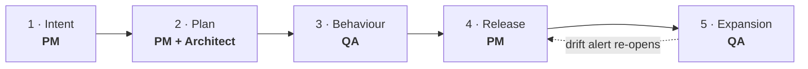
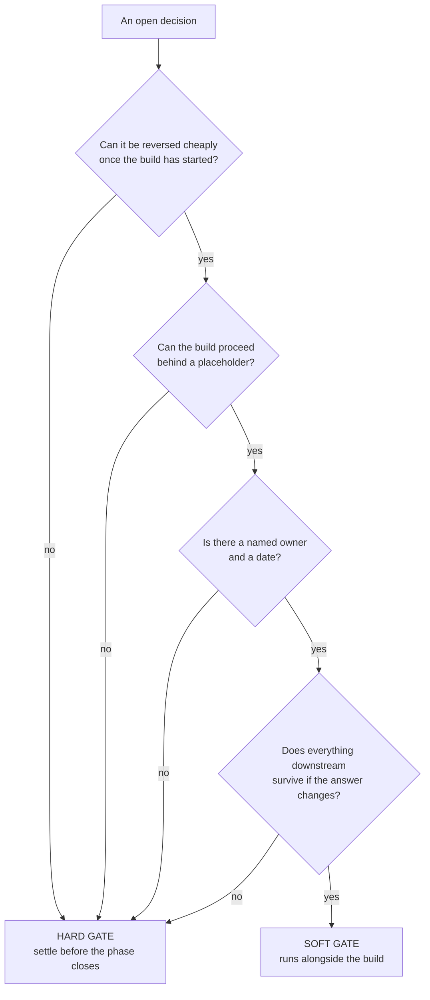

# Gates and governance

A gate is **a decision, with evidence in front of a named person, and their name on it.** It is not a
click, not a status column, and not a meeting that happens to end in "fine".

This page holds the five gates, the hard-and-soft split, the R1–R5 risk ladder, and the two-number
report. Live version:
[Governance](https://akash-coded.github.io/aws-bedrock-agentcore-strands/#/governance/gv-gates).

---

## The five gates

| # | Gate | The question | Owner | The evidence |
| --- | --- | --- | --- | --- |
| 1 | **Intent** | Is this worth doing at all? | Product manager | Pain register, AI-fit verdict, value line |
| 2 | **Plan** | Is this the right slice at the right control level? | PM **and** architect | Bolt cut, authority budget, gate map |
| 3 | **Behaviour** | Does it meet the spec? | QA lead | Golden-set score per slice, with its lower bound |
| 4 | **Release** | Is it safe to show a few real users? | Product manager | Shadow-run comparison, rollback rehearsed |
| 5 | **Expansion** | Have we earned wider use? | QA lead | Live evidence by slice, drift inside threshold |

**The most common failure is a product manager approving a pull request.** Strike every approval you
cannot evaluate, and insist on being asked the ones you can. Behaviour and expansion belong to QA.



That dotted line is a rule, not a nicety: **a drift alert re-opens the release gate automatically.**

---

## Hard gates and soft gates

An agentic build creates more decisions than a traditional one, and most of them do not need to halt
anything. Treating them all as hard is how a build ends up waiting behind eleven open questions.

Four questions classify any open decision. **One "no" makes it hard.**



### The three that are hard

| Decision | Why it halts |
| --- | --- |
| The AI-fit verdict | It fixes the shape of the product; changing it later means starting again |
| The autonomy level on money actions | It moves money, and a regulator has a rule about it |
| The spec, the bar and the guardrails | Everything downstream is built and measured against them |

### The eight that are soft

Each runs behind a placeholder, with an owner and a date.

| Decision | The placeholder it runs behind | Settled by |
| --- | --- | --- |
| Model tier per slice | Everything on the mid tier, behind the gateway | The shadow run |
| Model family | Whichever the gateway points at today | When the golden set exists |
| Framework | An interface layer in front of it | Day 20, as an ADR |
| Cloud service and region | Any in-region option, since data must stay in-region | Before P2 hardening |
| Retrieval design | A stub that returns the fare-rules file | During P2 |
| Memory | None; the first slice does not need it | When a slice needs it |
| Judge rubric | Rubric v0, three criteria | During the shadow run |
| Dashboard cuts | The default trace view | In P3 |

**A placeholder behind every soft gate** is the practice that makes this work. An interface layer or a
stub lets the build proceed while the decision is being measured.

---

## The risk ladder: gate by risk, never by size

The single most expensive review habit is sizing the check to the diff. A one-line change to a refund
cap is tiny and belongs in the highest band there is.

| Band | The action | The check |
| --- | --- | --- |
| **R1** | Reversible draft, sandbox | Review at the end |
| **R2** | Reversible change to real work | Review before merge |
| **R3** | Hard to reverse, small blast radius | Approve first |
| **R4** | Money, identity, policy | A **named** approver, every time |
| **R5** | Irreversible or safety-critical | Not delegated at all |

> **The trap.** "Small changes don't need a gate." A one-line refund-cap change is R4.

The band belongs to the **tool**, assigned once in the authority budget, and a path rule in the
repository routes the review. It is never argued per pull request. See
[How to Review by Risk Band](How-to-Review-by-Risk-Band).

---

## Who signs what

One accountable name per artefact. Not a committee, not a team.

| Artefact | PM | Architect | Engineering | QA | Sponsor |
| --- | :---: | :---: | :---: | :---: | :---: |
| Pain register, AI-fit verdict | **A** | C | I | I | I |
| Ratified NFRs, sensitivity points | C | **A** | C | C | I |
| Eight-field spec, acceptance bar | **A** | C | I | C | I |
| Authority budget and gate map | C | **A** | R | C | I |
| Decision records (ADRs) | I | **A** | C | I | I |
| Bolt cut, dependency order | C | **A** | R | I | – |
| Golden set, checkers | I | C | R | **A** | – |
| Shadow-run comparison, cut-over | **A** | C | R | C | I |
| Trace, redaction, drift alert | I | **A** | R | C | I |
| Two-number report | R | C | R | C | **A** |

*A = accountable, R = responsible, C = consulted, I = informed.*

---

## Paired indicators and the two-number report

Every measure is reported beside the one that shows its side effect, so neither can be pushed alone.
Push throughput without quality and you get merged pull requests nobody read. Push cost down without
the bar and you get a cheap model failing fluently.

**The report carries two numbers and never one:**

```
CYCLE 3                      baseline      now       change
person-days per story            8.0        4.6      −43%
token spend per story              –      $310            
review hours added per story     1.2        2.0       +0.8
re-runs per story                  –        1.4            
────────────────────────────────────────────────────────────
net                        saved 3.4 person-days, spent $310 + 0.8 review hours
```

Three rules that keep it honest:

1. **Take the baseline before the pilot.** After the pilot it is a guess, and everyone knows it.
2. **Keep the review-hours row.** It is high in cycle one and falls as the artefacts sharpen. Hiding
   it makes cycle two look like a regression.
3. **Keep the re-run row.** It is the leak signal — where model switching and vague asks show up first.

> The programme is cancelled on the number you hid, never on the one you showed.

Build it: [Two-number report builder](https://akash-coded.github.io/aws-bedrock-agentcore-strands/#/toolkit/report)
· [Formulas and Calculators](Formulas-and-Calculators)

---

## Maturity: control, not tool count

A team with ten AI tools and no gates is **less** mature than a team with one tool and tight control.
Six controls, each either present or absent. Your level is how many you have; your next step is the
first one you do not.

| # | Control | The test |
| --- | --- | --- |
| 1 | A context file the agent reads | It exists in the repo and is current |
| 2 | Every item has a spec with a bar and an owner | Pick a story at random and look |
| 3 | The harness gates the merge, per slice | A slice below its bar blocks the merge |
| 4 | Caps live in tool signatures | Grep the prompts; find none |
| 5 | The trace redacts | A passport number never reaches a row |
| 6 | Production evidence by segment, with drift watched | The alert re-opens the release gate |

Run it: [Maturity self-check](https://akash-coded.github.io/aws-bedrock-agentcore-strands/#/toolkit/maturity)

---

## Try it

Your last release. Answer three questions in writing.

1. **Who signed the release gate, and what was in front of them?** If the answer is "the team agreed",
   there was no gate.
2. **Which open decisions were treated as hard that should have been soft?** Count the days the build
   waited.
3. **Did the cycle report reach the sponsor with both numbers on it?** If not, write the second number
   now, before somebody asks for it.

<details>
<summary>The pattern behind all three</summary>

Gates fail in one of two directions and teams are usually consistent about which. Either everything is
a gate, and the build queues behind decisions that could have run behind a stub, or nothing is, and
the first time anyone decides is in the postmortem. The four classification questions fix the first.
Naming one accountable person per artefact fixes the second.
</details>

---

**Next:** [The Evidence Pack](The-Evidence-Pack) · [How to Review by Risk Band](How-to-Review-by-Risk-Band)
· [Role: Sponsor](Role-Sponsor) · [Anti-Patterns](Anti-Patterns)
