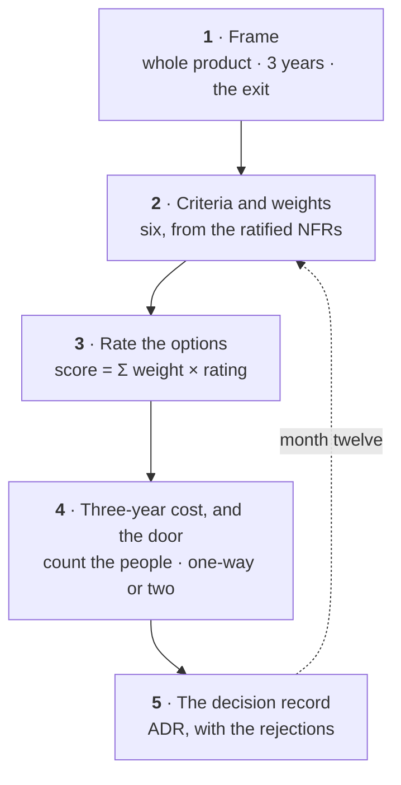

# How to choose: build, buy or borrow

The agent framework decision, as a weighted matrix, a three-year cost and a decision record. Five
moves. The interesting number is never the licence.

This closes the [decision loop](The-Eight-Loops#decision) and it is owned by the solution architect,
with the sponsor on the cost line. It is the same ground as Decide in
[the architect's journey](Journey-Solution-Architect), told as a procedure rather than as a role.

Run it live:
[simulation](https://akash-coded.github.io/aws-bedrock-agentcore-strands/simulator/#/simulations/bvb) ·
[matrix tool](https://akash-coded.github.io/aws-bedrock-agentcore-strands/simulator/#/toolkit/bvb).

---

## The five moves



| # | Move | Produces | Done when |
| --- | --- | --- | --- |
| 1 | [Frame the decision](#1--frame-the-decision) | A decision frame: scope, horizon, exit | The question names the whole product and three years |
| 2 | [Criteria and weights](#2--criteria-and-weights) | Six weighted criteria, each traced | Every weight points at a ratified NFR |
| 3 | [Rate the options](#3--rate-the-options) | A scored matrix and a flip test | Every cell has a reason, written before any preference was stated |
| 4 | [Three-year cost, and the door](#4--three-year-cost-and-the-door) | Cost with people counted, door per option | The exit cost is a number, not an adjective |
| 5 | [Write the decision record](#5--write-the-decision-record) | ADR with rejections and a review date | A stranger can re-derive the decision from the record |

---

## 1 · Frame the decision

**Before any option is named, and certainly before anyone opens a pricing page.**

Get the scope and the horizon right before anything else, because both are usually set too small.

| Framing | Verdict |
| --- | --- |
| "Which option is cheapest this quarter?" | Cost is one criterion of six, and a quarter is the wrong horizon. This is how portability is lost without anyone deciding to lose it |
| **"The framework for every agent in this product, over three years, including the cost of leaving"** | One decision for the whole product, a three-year horizon, and an honest look at the exit |

Three things are being fixed by the frame, and each one is usually got wrong in the same direction:

| What the frame fixes | Too small | Right |
| --- | --- | --- |
| **Scope** | This feature's framework | Every agent in this product, because a second framework is a second set of skills, gates and bills |
| **Horizon** | This quarter's budget line | Three years, which is when the migration you did not plan for arrives |
| **The exit** | Not considered | The cost of leaving, priced before you arrive |

The exit is the part with no vendor page behind it, and it is the part that decides this kind of
question. A framework choice is not a purchase; it is a dependency you will be living inside while
the market underneath it moves.

### What you actually do

1. **Write the question as one sentence and read it aloud.** If it contains the words *this quarter*
   or *for now*, the frame is wrong and the matrix built on it will be too.
2. **Name every agent the decision covers, including the ones not built yet.** A framework chosen for
   one feature becomes the framework for all of them by default, and by then nobody is deciding.
3. **Fix the horizon at three years and say why.** Long enough for a migration to land inside it,
   short enough that the numbers are not fiction.
4. **Ask what leaving would cost, before you know which option you prefer.** The answer is honest
   exactly once: before there is a favourite to protect.
5. **Classify the decision as hard or soft.** This one is soft — the build proceeds behind an
   interface layer while it is settled. See [Gates and Governance](Gates-and-Governance) for the four
   questions that classify it.
6. **Put the frame at the top of the document you will write in move 5.** Every later argument is
   measured against it, and a frame that lives only in someone's head gets quietly re-set.

### Where a model helps

| Tool | Use it for |
| --- | --- |
| **Chat LLM** | Give it the question as your sponsor asked it and have it produce the whole-product, three-year restatement plus what each version leaves out. The contrast is the thing you take to the sponsor |
| **Chat LLM, adversarially** | "What will this decision cost us to reverse in year two?" Ask before the options are named, so the answer is not shaped around a favourite |
| **Claude Code** | Inventory the repository for framework-specific imports and call sites. The count is the current exit cost, measured rather than estimated |
| **Do not delegate** | The scope. Whether this decision binds one feature or every agent in the product is a commitment about your organisation, and only you know what the next two roadmaps hold |

### The artefact

<details><summary><b>Template · Decision frame</b></summary>

```markdown
# Decision frame · <the framework decision> · <date>

## The question, in one sentence
<The agent framework for every agent in the <product>, over three years, including
the cost of leaving.>

## Scope
| Covered | Not covered | Why the line is here |
|---------|-------------|----------------------|
| <every agent in <product>> | <the batch scoring job> | <different team, different SLA> |

Agents in scope today: <n>. Expected within the horizon: <n>. Both counts matter,
because the second one is what makes this a product decision rather than a feature one.

## Horizon
**3 years**, from <date> to <date>. Rationale: <a migration fits inside it; beyond it
the numbers are fiction>.

## The exit, priced before we have a favourite
| If we leave | What it costs | Measured or estimated |
|-------------|---------------|-----------------------|
| <after year 1> | <n> engineer-weeks | <estimated, by <name>> |
| <after year 3> | <n> engineer-weeks | <estimated — grows with every agent added> |

Current framework-specific call sites in the repository: <n>, from <grep, date>.

## Gate classification
<Soft — the build proceeds behind an interface layer. Owner <name>. Settled by <date>,
as ADR-<n>.>

## What this frame explicitly refuses to optimise
<this quarter's licence line; the fastest possible start; the preference already in the
room>
```
</details>

<details><summary><b>Prompt · Reframe the question to the whole product</b></summary>

```text
My sponsor asked: "<the question, verbatim>".

Restate it as a decision frame with three parts: SCOPE, HORIZON and THE EXIT.

OUTPUT SHAPE:
1. The restated question in one sentence, covering the whole product and three years.
2. A table: what the original framing leaves out, and what it would cost to discover
   each omission late.
3. Three questions I should be able to answer before rating any option, each naming
   who holds the answer.
4. One sentence on what leaving would cost, and what number would make that concrete.

RULES:
- Do not name or evaluate any option. Naming options this early is how a frame gets
  written around a favourite.
- Do not soften the original question to be polite about it. If it optimises a quarter,
  say so plainly.
- Where you do not know a number, write UNKNOWN and name the role that would have it.
```
</details>

**Done when** — the question names the whole product, a three-year horizon and the cost of leaving,
and no option has been mentioned yet.

---

## 2 · Criteria and weights

**Straight after the frame, and using numbers somebody has already agreed.**

Six criteria. The weights come from the ratified NFRs and the utility trees, so they are already
agreed — you are not inventing them here.

| Criterion | Weight for a regulated airline with a small team |
| --- | --- |
| Portability | **3** |
| Team skills | **3** |
| Security | **3** |
| Cost | 2 |
| Velocity | 2 |
| Vendor support | 1 |

Equal weights claim the team has no priorities, which is never true. If you cannot justify a weight,
go back to the utility trees; that is what they are for.

Weighting **team skills** at 3 is not sentiment. It is Conway's law: a design the team cannot operate
is a design that will be worked around.

The weights are not universal, and saying which context produced them is part of the artefact:

| If the context were | The weight that moves | Why |
| --- | --- | --- |
| A startup with two engineers and no regulator | Velocity to 3, security to 2 | Time to first revenue dominates, and the blast radius is small |
| A platform team serving six product teams | Vendor support to 3 | You are now operating someone else's dependency at scale |
| A one-off internal tool with a known end date | Portability to 1 | There is no year three to be portable into |

### What you actually do

1. **Take the weights from the ratified NFRs, do not invent them in the meeting.** If the NFR workshop
   ratified cost per case and portability as high-value, high-difficulty items, the weights are
   already agreed. See [How to Run an NFR Workshop](How-to-Run-an-NFR-Workshop).
2. **Trace each weight to its source in a column.** Weight 3 on security because of a named regulatory
   constraint; weight 3 on skills because of the team's actual languages. A weight with no source is
   a preference.
3. **Notice when a weight has no NFR behind it.** That is the finding, and it means you are about to
   make a three-year decision against criteria nobody has agreed.
4. **Keep it to six.** Ten criteria flatten the result, because the three that matter are diluted by
   seven that do not, and the matrix stops discriminating.
5. **Write down the context the weights describe.** *Regulated airline, small team* is part of the
   record, because the next reader's context will differ and they need to know what to re-weigh.
6. **Freeze the weights before any option is rated.** Weights set after ratings are ratings wearing a
   disguise, and everyone in the room can tell.

### Where a model helps

| Tool | Use it for |
| --- | --- |
| **Chat LLM** | Map each ratified NFR to the criterion it should weigh, and flag every criterion with no NFR behind it. That flag list is the real output |
| **Chat LLM, adversarially** | "Argue that vendor support deserves 3 for this team." If the argument is good you learn something; if it is thin you have tested the weight for free |
| **A cheap tier** | Check the weights sum to something the matrix can discriminate with, and report what share of the total each criterion carries. Two criteria carrying 60% is worth knowing |
| **Do not delegate** | The weights themselves. They encode what your organisation will tolerate losing, and a model averaging industry practice produces the weights of a company that does not exist |

### The artefact

<details><summary><b>Template · Criteria and weights, traced</b></summary>

```markdown
# Criteria and weights · <the decision> · <date>
Context these weights describe: <a regulated airline with a small team>.
Frozen <date>, before any option was rated. Frozen by <name>.

| # | Criterion | Weight | Traced to | What a 3 would mean | What a 1 would mean |
|---|-----------|--------|-----------|---------------------|---------------------|
| 1 | Portability | **3** | <NFR-<n>, ratified <date>> | <swappable behind an interface in weeks> | <bound to platform-specific features> |
| 2 | Team skills | **3** | <team language survey, <date>> | <the team uses it today> | <nobody has written it before> |
| 3 | Security | **3** | <constraint C-R<n>: data stays in region> | <in-region, certified, auditable> | <we would build the controls> |
| 4 | Cost | 2 | <NFR-<n>, cost per case $<n>> | <no licence, low people cost> | <licence plus a dedicated team> |
| 5 | Velocity | 2 | <plan gate, first slice by <date>> | <productive in days> | <a quarter before anything ships> |
| 6 | Vendor support | 1 | <no NFR — a preference, weighted lowest> | <named support with an SLA> | <community forum only> |

## Criteria with no ratified NFR behind them
| Criterion | Status | What to do |
|-----------|--------|------------|
| <vendor support> | <a preference, not a requirement> | <weighted 1; do not let it decide anything> |

## Conway's law note
Team skills carries 3 because <the architecture will come to mirror the team that
operates it, and a framework nobody here writes will be worked around within two
sprints>.

## Re-weigh if
<the team composition changes materially · a regulator adds a control · this becomes a
platform serving other teams>
```
</details>

<details><summary><b>Prompt · Derive the weights from the ratified NFRs</b></summary>

```text
Here are my ratified NFRs with their utility-tree priorities, and the six criteria for a
framework decision.

Assign each criterion a weight of 1, 2 or 3, derived from the NFRs. Do not invent them.

OUTPUT SHAPE:
| Criterion | Weight | The NFR or constraint it derives from | The sentence that justifies it |

Then, separately and before anything else:
- CRITERIA WITH NO NFR BEHIND THEM. For each, say whether it is a preference (weight it
  1 and say so) or a missing requirement (name the workshop that should have produced it).
- NFRs WITH NO CRITERION. Some ratified NFRs will not map to any of the six. List them —
  a criterion may be missing.

RULES:
- Never assign equal weights. If the NFRs genuinely do not discriminate, say that
  explicitly; it is a finding about the workshop, not an answer.
- Do not name or rate any option. Weights are set before options are seen.
- Quote the NFR text you used for each weight. No quote, no weight.

NFRs:
<paste>

CRITERIA:
<paste>
```
</details>

**Done when** — every weight points at a ratified NFR or is explicitly labelled a preference and
weighted 1, and the weights are frozen before any option has been rated.

---

## 3 · Rate the options

**With the weights frozen, and before anybody in the room says which one they like.**

> **score = Σ weight × rating**, each option rated 1 to 3 per criterion.

Rate the matrix **before** anyone states a preference. A preference with no matrix behind it is the
decision that gets argued again at every incident.

For SkyWays the weighted totals come out close: **borrow** highest, **build** next, **buy** last, with
only four points between first and last.

```
MATRIX · rating × weight
                  port   skill   cost   velo   supp    sec     TOTAL
  build on SDK    3×3    1×3     3×2    1×2    1×1     3×3  =   30
  buy platform    1×3    3×3     1×2    3×2    3×1     2×3  =   29
  borrow OSS      3×3    2×3     3×2    2×2    2×1     2×3  =   33   ← highest
```

That closeness is the finding, not a disappointment. When the spread is small, the matrix has told you
the criteria do not separate the options — so the tie is broken by something else.

**The flip test:** how far would one weight have to move before the winner changes? If a single point
on one criterion flips the result, say so in the record. It tells the next reader how firm the
decision is.

Run it on these numbers and the answer is portability, the criterion doing most of the separating.
Borrow and build both rate 3 on it and buy rates 1, so lowering its weight costs borrow three points
for every one it costs buy:

| Portability weight | build | buy | borrow | Winner |
| --- | --- | --- | --- | --- |
| **3** (as ratified) | 30 | 29 | **33** | borrow, by 4 |
| 2 | 27 | 28 | **30** | borrow, by 2 |
| 1 | 24 | **27** | **27** | tie |
| 0 | 21 | **26** | 24 | buy, by 2 |

So the honest statement is narrower than "buy wins if you care less about portability". Borrow's lead
survives a weight of 2, ties at 1, and loses only when portability **leaves the matrix altogether**.
Nothing else comes close to moving the result, which is worth writing down: the decision rests on
exactly one belief about the next three years, and that belief would have to be abandoned rather than
merely softened.

### What you actually do

1. **Rate every cell before anyone speaks about preference.** Written first, argued second. The order
   is the entire control, and it costs nothing to enforce.
2. **Write one line of reasoning per cell, not per option.** A cell with a number and no sentence is
   where the preference hides, and it is always the cell that decides the result.
3. **Rate what the option is today, not what its roadmap says.** A vendor's next release is not a
   rating; it is a reason to set the month-twelve review.
4. **Compute the totals mechanically and show the arithmetic.** Someone will check it, and it should
   be you, before the meeting.
5. **Report the spread as a first-class result.** Four points across three options means the criteria
   do not separate them, and pretending otherwise produces a confident decision with nothing under it.
6. **Run the flip test on every criterion, not just the winner's best one.** You are looking for the
   single belief the decision rests on, and it is sometimes not the one you expected.

### Where a model helps

| Tool | Use it for |
| --- | --- |
| **Chat LLM** | Draft the per-cell reasoning from your notes on each option, then rate. Reading its reasons is faster than writing eighteen of them, and you will disagree with three, which is the point |
| **Claude Code** | Compute the matrix, the totals and every one-point flip as a small script. Ten minutes, reusable, and it removes the arithmetic argument from the room |
| **Chat LLM, adversarially** | "Rate this matrix as the vendor's pre-sales engineer would, then as our most sceptical platform engineer." Two sets of cells, and the differences are your agenda |
| **Do not delegate** | The security ratings. Whether an option satisfies a regulatory control is a matter of evidence from the people accountable for it, not of a model's impression of a product page |

### The artefact

<details><summary><b>Template · The weighted matrix</b></summary>

```markdown
# Matrix · <the decision> · rated <date>, before any preference was stated
Rater: <name> · Weights frozen <date> · score = sum(weight x rating), ratings 1-3

| Criterion | W | <build on SDK> | <buy platform> | <borrow OSS> |
|-----------|---|----------------|----------------|--------------|
| Portability | 3 | <3> · <own code, no vendor coupling> | <1> · <platform-specific features> | <3> · <open, behind an interface> |
| Team skills | 3 | <1> · <nobody has built one> | <3> · <vendor training, low floor> | <2> · <the team writes this language daily> |
| Security | 3 | <3> · <every control is ours> | <2> · <certified, but controls are theirs> | <2> · <we harden it ourselves> |
| Cost | 2 | <3> · <no licence> | <1> · <$<n> licence over 3 y> | <3> · <no licence> |
| Velocity | 2 | <1> · <a quarter before anything ships> | <3> · <productive in days> | <2> · <days to start, weeks to wire> |
| Vendor support | 1 | <1> · <none> | <3> · <named support, SLA> | <2> · <community, active> |
| **TOTAL** | | **<30>** | **<29>** | **<33>** |

Spread, first to last: **<4>**. Read that as: the criteria do NOT separate these
options, and the tie will be broken in move 4.

## The flip test
| Change | New winner | Reading |
|--------|-----------|---------|
| <portability weight 3 -> 1> | <the lead disappears> | <the decision rests on this one belief> |
| <velocity weight 2 -> 3> | <unchanged> | <a faster start does not buy the decision> |
| <any single rating +/-1> | <unchanged> | <no single cell is load-bearing> |

## Cells I was least confident about
| Cell | Why | What would settle it |
|------|-----|----------------------|
| <buy x security> | <certification covers the platform, not our configuration> | <the vendor's control matrix, requested <date>> |
```
</details>

<details><summary><b>Prompt · Score the matrix and run the flip test</b></summary>

```text
Score this decision as a weighted matrix, then test how firm the answer is.

CRITERIA AND WEIGHTS — these come from my ratified NFRs. Do not change them:
<paste: criterion, weight 1-3>

OPTIONS: <build / buy / borrow, or the named options>

OUTPUT SHAPE:
1. The matrix: each option rated 1-3 per criterion with ONE line of reasoning per cell.
   score = sum(weight x rating). Show the totals and the arithmetic for one column.
2. The spread between first and last, and one sentence on what that spread means.
3. THE FLIP TEST: for EVERY criterion, how far its weight would have to move before the
   winner changes. Then the same for every single rating. Report only the changes that
   flip something.
4. The cells you were least confident about, and what evidence would settle each.

RULES:
- Rate the options as they are today. A roadmap is not a rating; if you use one, say so
  and mark the cell UNVERIFIED.
- Never let cost outrank the weights I gave you.
- Where you do not know, write UNKNOWN and name who would have it. Do not guess a cell
  and then reason from it.
- If the spread is small, say so plainly rather than declaring a winner.
```
</details>

**Done when** — every cell has a number and a reason, the spread is stated as a result, and you know
which single weight the decision rests on.

---

## 4 · Three-year cost, and the door

**After the matrix, because a close matrix is exactly what makes these two numbers decisive.**

Two numbers that do not appear on any vendor page.

**Count the people, not just the licence.**

| Option | Licence, 3 years | People, 3 years | Total |
| --- | --- | --- | --- |
| Buy | higher | lower | **$360,000** |
| Borrow | lower | higher | **$360,000** |
| Build | none | much higher | **~3×** |

Buy and borrow tie once the people are counted. The licence was the small number all along.

At an illustrative $120,000 per engineer-year the arithmetic is visible in one line each:

```
3-YEAR COST · illustrative, $120,000 per engineer-year
  build    $0 licence       + 3.0 engineers × 3 y   = $1,080,000
  buy      $180,000 licence + 0.5 engineer  × 3 y   =   $360,000
  borrow   $0 licence       + 1.0 engineer  × 3 y   =   $360,000
```

**Then look at the door.** A decision is a **two-way door** if it can be reversed cheaply and a
**one-way door** if it cannot.

| Option | The door |
| --- | --- |
| Borrow, behind an interface layer | **Two-way.** Two weeks now to build the interface; a swap is then weeks, not quarters |
| Buy | **One-way-ish.** The exit cost is the migration, and it grows every month |
| Build | One-way, and the maintenance never ends |

The door breaks the tie. Two weeks of interface layer now is the price of keeping the decision
reversible for three years — which matters more than usual here, because agent frameworks are
changing faster than the products built on them.

Note what the interface layer actually does: it converts a one-way door into a two-way one for a
known, fixed price. That is a different kind of claim from "it is good engineering practice", and it
is the claim finance can evaluate.

### What you actually do

1. **Price the people first and the licence second.** Reverse the usual order deliberately, because
   the licence is the number on the page and the people are the number that decides.
2. **Use one loaded engineer-year rate across every option.** $120,000 is illustrative; whatever you
   use, use the same one everywhere or the comparison is theatre.
3. **Count operating fractions honestly.** Half an engineer to run a managed platform and a whole one
   to run an open framework is the shape of it; if you believe your number is lower, say who will be
   doing that work instead.
4. **Ask of each option: what does leaving cost, and does that cost grow?** A migration cost that
   grows every month is what "one-way-ish" means, and it is the only door description worth writing.
5. **Price the interface layer as a line item.** Two weeks, one engineer, a named owner. It is not
   insurance and it is not hygiene; it is the purchase of a two-way door.
6. **Let the door break the tie only when the matrix genuinely ties.** If the spread were fifteen
   points, the door would be a footnote. It decides here because four points is not a difference.

### Where a model helps

| Tool | Use it for |
| --- | --- |
| **Spreadsheet + LLM** | Build the three-year model with the assumptions in named cells — rate, engineer fractions, licence, growth — so a sceptic changes one and watches the total move |
| **Chat LLM** | For each option, list everything that would have to be rewritten to leave it, then price the list. The list is more useful than the price, because you can argue with a list |
| **Claude Code** | Count the framework-specific call sites in the repository today and project the number per agent added. That is the exit cost curve, measured rather than asserted |
| **Do not delegate** | The engineer-fraction estimates. They are a claim about your team's week that a model cannot see, and every wrong three-year cost has one of them at the bottom of it |

### The artefact

<details><summary><b>Template · Three-year cost, people counted</b></summary>

```markdown
# Three-year cost · <the decision> · <date>
Loaded rate used everywhere: $<120,000> per engineer-year. Source: <finance, <date>>.
Horizon: 3 years. All figures illustrative unless marked VERIFIED.

| Option | Licence, 3 y | Engineers | People, 3 y | **Total** | Door |
|--------|--------------|-----------|-------------|-----------|------|
| <build on SDK> | $0 | <3.0> | $<1,080,000> | **$<1,080,000>** | <one-way; maintenance never ends> |
| <buy platform> | $<180,000> | <0.5> | $<180,000> | **$<360,000>** | <one-way-ish; exit grows monthly> |
| <borrow OSS> | $0 | <1.0> | $<360,000> | **$<360,000>** | <two-way behind an interface> |

## What each engineer fraction is actually doing
| Option | The work | Who says so |
|--------|----------|-------------|
| <buy, 0.5> | <integration, upgrades, vendor liaison> | <name> |
| <borrow, 1.0> | <the same, plus hardening and version tracking> | <name> |
| <build, 3.0> | <the framework itself, forever> | <name> |

## The exit, per option
| Option | What must be rewritten to leave | Cost today | Cost at month 36 |
|--------|--------------------------------|-----------|------------------|
| <buy> | <every platform-specific feature call> | <n> weeks | <n> weeks, and rising |
| <borrow, behind the interface> | <the adapter only> | <n> weeks | <n> weeks, flat |

## Sensitivity
| Assumption | Value | If it were wrong by 50% |
|------------|-------|-------------------------|
| <loaded rate> | $<120,000> | <every total moves together; the ranking does not change> |
| <buy operating fraction> | <0.5> | <buy loses the tie and comes last> |
```
</details>

<details><summary><b>Template · Door assessment and interface-layer scope</b></summary>

```markdown
# The door · <the decision> · <date>

## Classification
| Option | Door | What makes it that | Exit cost, and whether it grows |
|--------|------|--------------------|---------------------------------|
| <borrow behind an interface> | **two-way** | <all framework calls sit behind <n> adapter functions> | <n> weeks, flat |
| <buy> | **one-way-ish** | <platform-specific features appear in business logic> | <n> weeks, growing ~<n>%/month |
| <build> | **one-way** | <there is nothing to migrate to; the maintenance is the product> | n/a |

## The interface layer, as a priced line item
| | |
|---|---|
| Scope | <every call into the framework goes through <module>; nothing else imports it> |
| Cost | <2 weeks, 1 engineer, <name>> |
| Buys | <a swap measured in weeks rather than quarters, for 3 years> |
| Proof it is working | <a CI check: no direct framework import outside <module>> |
| What it does NOT buy | <protection from a change in the model API underneath; that is a separate layer> |

## The claim to finance, in one line
<Two weeks now converts a one-way door into a two-way one for three years, and the
build does not stop while the decision stays open.>
```
</details>

<details><summary><b>Prompt · Three-year cost with the people counted</b></summary>

```text
Build a three-year cost comparison for these options: <paste, with what each involves>.

OUTPUT SHAPE:
1. One table: option | licence over 3 years | engineer fraction | people cost over
   3 years | total | door (two-way / one-way-ish / one-way).
2. For every engineer fraction, one line saying what that person is actually doing.
   A fraction with no named work is not an estimate.
3. THE EXIT, per option: what must be rewritten to leave, the cost today, and whether
   that cost grows with time or stays flat. Say which.
4. A sensitivity table: each assumption, and what happens to the RANKING if it is
   wrong by 50%.

RULES:
- Use the same loaded engineer-year rate for every option: $<rate>. State it once.
- The licence is not the headline. If your output leads with it, redo it.
- Do not treat "open source" as free. It has the highest people cost in most real teams,
  and saying so is the point of the exercise.
- Mark every figure ILLUSTRATIVE unless I gave you a verified source for it.
```
</details>

**Done when** — the totals count people at one common rate, and each option's exit cost is a number
with a direction of travel attached to it.

---

## 5 · Write the decision record

**The same day the decision is taken, while the numbers that produced it are still on the table.**

Not into the sprint log. A sprint log is where decisions go to be forgotten, and this one will be
asked again at the first bill.

```
ADR-004 · Agent framework

Status      accepted, 2026-02-20
Context     Six weighted criteria from the ratified NFRs; three options rated;
            three-year cost with people counted; door assessed.
Decision    Borrow the open framework, behind an interface layer.
            Named review at month twelve.
Consequence An interface layer costs two weeks now, and keeps the swap at weeks
            rather than quarters. Team skills score 3 and the team already knows it.
Rejected    Buy — ties on three-year cost, but the door is one-way and the exit
                  cost grows monthly.
            Build — roughly three times the cost, with maintenance forever, for
                  a capability that is not our differentiator.
Flip test   Portability would have to drop from 3 to 1 for "buy" to win.
```

Four things the record must carry: the decision, its consequence, **the options it rejected and why**,
and the review date. The rejected options are the part people omit and the part the next reader needs.

The review at month twelve is not a diary entry. It is the commitment that makes a reversible decision
actually reversible, and it needs the same three inputs as the original: the weights, the ratings, and
the exit cost measured again rather than remembered.

| Review input | At month twelve, ask |
| --- | --- |
| The weights | Has the context changed — team, regulator, scale? |
| The ratings | What has the option done in a year, and what has the runner-up done? |
| The exit cost | Is the interface layer still holding, or has the framework leaked past it? |

### What you actually do

1. **Write the rejections first.** They are the part that gets written badly when written last, and
   each one has to carry the number that rejected it: a score, a three-year total, or a door.
2. **State the consequence as a cost you are accepting, not as a benefit.** *Two weeks of interface
   layer* is a consequence. *Maximum flexibility* is a slogan.
3. **Give the review a trigger as well as a date.** Month twelve, or earlier if the framework's
   release cadence stalls. Triggers fire when calendars are ignored.
4. **Keep it to one screen.** A coding agent reads this in its context pack on every bolt, which is
   exactly why it must be short and exact. So does the engineer who joins in month seven.
5. **Say whether you followed the matrix or overruled it.** Both are allowed. Which one happened is a
   fact the next reader needs, and hiding it is what makes records untrustworthy.
6. **Store it with the code, numbered, and link it from the story files that depend on it.** A record
   nobody can find has the same value as one nobody wrote.

### Where a model helps

| Tool | Use it for |
| --- | --- |
| **Chat LLM** | Draft the record from the matrix, the cost table and the door assessment. Mechanical, and it produces the rejection lines you would otherwise compress into a clause |
| **Chat LLM, adversarially** | "Read this record as the engineer who arrives in month seven and disagrees with it. What is missing?" The answer is usually a number that felt obvious on the day |
| **An editor agent** | Keep the ADR index current: number, title, status, review date, and which story files reference it. Dull, and it is why records get lost |
| **Do not delegate** | The decision, and the signature on it. The matrix recommends; a named person decides, and that name is what the record exists to preserve |

### The artefact

<details><summary><b>Template · ADR, with the rejections argued from the numbers</b></summary>

```markdown
# ADR-<004> · <the agent framework>
**Status** <accepted> · <date> · supersedes <none> · owner <name>

## Context
<Three options for the framework for every agent in <product>, over three years.
Six weighted criteria taken from the ratified NFRs. Weighted totals: <borrow 33>,
<build 30>, <buy 29> — four points across three options, so the criteria do not
separate them. Three-year cost with people counted: <buy> and <borrow> tie at
$<360,000>; <build> is roughly three times that.>

## Decision
<Borrow the open framework, behind an interface layer.> Named review at <month 12>,
or earlier if <the framework's release cadence stalls>.

## Consequence
- <An interface layer costs two weeks now, one engineer, owner <name>.>
- <It keeps a swap at weeks rather than quarters, for the full horizon.>
- <Team skills score 3 and the team already writes this language daily.>
- <A CI check forbids direct framework imports outside <module>, or the layer rots.>

## Rejected, each with the number that rejected it
| Option | Score | 3-year cost | Door | Why not |
|--------|-------|-------------|------|---------|
| <buy platform> | <29> | <$360,000> | <one-way-ish> | <ties on cost; the exit grows every month> |
| <build on SDK> | <30> | <$1,080,000> | <one-way> | <3x the cost, maintenance forever, not our differentiator> |

## Flip test
<Portability is the criterion doing the separating. Moving its weight from 3 to 1
removes the lead entirely. No single rating change flips the result.>

## Did we follow the matrix?
<Yes — the matrix ranked borrow first and the door confirmed it. Had we overruled it,
the reason would be stated here and nowhere else.>

## Review at <month 12>
| Input | Question | Owner |
|-------|----------|-------|
| Weights | <has the team, the regulator or the scale changed?> | <name> |
| Ratings | <what did the runner-up do in a year?> | <name> |
| Exit cost | <is the interface still holding? run the CI check> | <name> |
```
</details>

<details><summary><b>Prompt · Draft the record, with the rejections argued from the numbers</b></summary>

```text
Draft an architecture decision record from my notes below.

OUTPUT SHAPE — exactly these sections, in this order:
  Status (accepted or superseded, with the date and what it supersedes)
  Context (the frame, the weighted totals, and the three-year cost, in three sentences)
  Decision (what we are doing, and the named review point)
  Consequence (what it costs now, and what it keeps open)
  Rejected (one row per option, each carrying the score, the cost and the door)
  Flip test (which single input would have to move, and by how much)
  Review (the inputs to re-measure, with an owner each)

RULES:
- The Rejected section is the part that matters and the part that gets written badly.
  Every rejection cites the matrix score, the three-year cost or the door. A rejection
  that reads as a preference is a failure — rewrite it, or tell me the number is missing.
- Do not flatter the decision. If an option scored within a point of the winner, that
  belongs in Context, not in Rejected.
- Keep it to one screen. A coding agent reads this in its context pack, which is exactly
  why it must be short and exact.
- The review point is a date or a named trigger, never "later".
- State plainly whether the matrix was followed or overruled.

MY NOTES:
<paste the frame, the matrix, the cost table and the door assessment>
```
</details>

**Done when** — a stranger can read the record and re-derive the decision, including what was rejected
and the number that rejected it.

---

## When the matrix and the team disagree

It happens, and it is allowed. The matrix **recommends**; the record is where you say why you followed
it or did not.

What is not allowed is skipping the matrix because the team already prefers something. Rate the
options, then overrule the score on the record if you have a reason. The reason is what stops the
question coming back.

There is a useful test for whether an overrule is honest: **would you write the same sentence if the
matrix had agreed with you?** An overrule that reads as *the numbers missed something specific* is a
finding about the criteria and belongs in the weights. An overrule that reads as *we prefer this* is a
preference, and preferences are what the matrix existed to surface.

---

## Common mistakes

| Mistake | What it costs | Instead |
| --- | --- | --- |
| Framing on this quarter's price | Portability is lost without anyone deciding to lose it | Whole product, three years, including the exit |
| Equal weights | The matrix stops discriminating and confirms whoever spoke last | Weights from the ratified NFRs, each traced |
| Rating after a preference is stated | Eighteen cells quietly bent toward one column | Rate first, argue second, and say the rule out loud |
| Comparing licences | The small number decides a three-year commitment | Count the people at one common rate |
| Treating open source as free | The highest people cost in the comparison goes unrecorded | One engineer-year, named, doing named work |
| Declaring a winner on a four-point spread | A confident decision with nothing under it | Report the spread; let the door break the tie |
| An ADR with no rejected options | The question is re-opened at the first bill, from the beginning | Rejections that each carry a score, a cost or a door |
| A review date with no trigger | Month twelve passes and nobody looks | A date **and** a named trigger, with owners per input |

---

## Try it

**Exercise 1.** Your team is choosing between a managed agent service and an open framework. The
managed service scores higher on velocity and vendor support; the open framework scores higher on
portability and cost. Weights are unset. What do you do first?

<details>
<summary>Answer</summary>

**Go and get the weights from the ratified NFRs** — do not invent them in this meeting.

If the NFR workshop ratified cost per case and portability as high-value, high-difficulty items, then
those weights are already agreed and the matrix is nearly filled in. If it did not ratify them, that
is the real finding: you are about to make a three-year decision against criteria nobody has agreed,
and an hour spent on the utility trees now saves the argument later.

Then run the flip test either way, because on a close call the useful output is not the winner but
*how firm the winner is*.
</details>

**Exercise 2.** Finance asks why you are spending two weeks building an interface layer around a
framework that works fine. Answer in three sentences.

<details>
<summary>A defensible answer</summary>

"The framework is the fastest thing to start with and the thing most likely to change under us —
agent frameworks are moving faster than the products built on them. Two weeks now makes that swap a
matter of weeks rather than quarters, which is the difference between a planned migration and a
rewrite. It is also what lets us close the framework decision as a **soft** gate and keep building,
instead of halting the phase until we are certain."

The last sentence is the one finance cares about: the interface layer is not insurance, it is what
keeps the build moving while the decision is still open.
</details>

**Exercise 3.** Take a dependency your team already lives with — a framework, a platform, a managed
service — and price the exit. One number, one afternoon.

<details>
<summary>What the number usually shows</summary>

Two things, reliably.

**The exit cost is larger than anyone guessed, and nobody had measured it.** The usual method is to
count the call sites: grep for the vendor's package, count the files, count the ones inside business
logic rather than behind an adapter. The second count is the one that hurts, and it is the one that
grows.

**It is growing at a rate nobody is watching.** If you can also count the call sites six months ago
from version control, you have a slope, and a slope turns "we should probably wrap that one day" into
a decision with a cost attached to deferring it.

If the number comes back small, you have a two-way door you did not know you had, and that is worth
recording too — it is the thing that lets you take the faster option next time without argument.
</details>

---

**Next:** [How to Cut Sprints into Bolts](How-to-Cut-Sprints-into-Bolts) ·
[Gates and Governance](Gates-and-Governance) · [Role: Solution architect](Role-Solution-Architect) ·
[Decision Trees](Decision-Trees)
