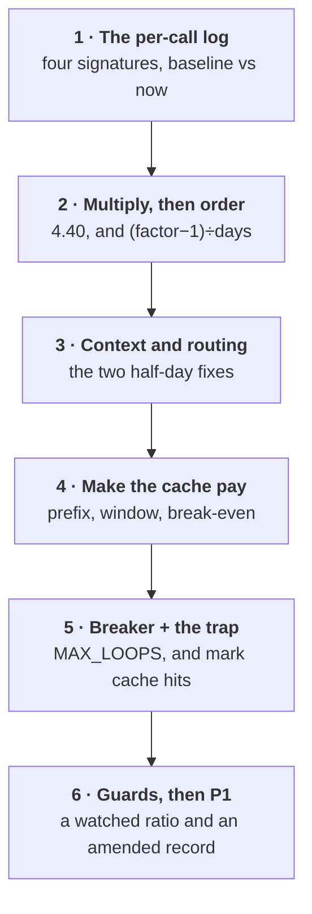

# How to control the token bill

The bill is 4.4 times the estimate, traffic is flat, and finance wants an answer by Friday.

Traffic is flat, so **behaviour** changed — and behaviour is only visible per call. This page is how
you find which behaviour, in what order to fix it, and how to stop it recurring.

This closes the [cost loop](The-Eight-Loops#cost), which closes into **P1**. A bill blowout is a
design question, not a finance one.

**Run it interactively:**
[the bill simulation](https://akash-coded.github.io/aws-bedrock-agentcore-strands/simulator/#/simulations/bill)
· **[the cache break-even calculator](https://akash-coded.github.io/aws-bedrock-agentcore-strands/simulator/#/toolkit/cache)**

---

## The six moves



| # | Move | Produces | Done when |
| --- | --- | --- | --- |
| 1 | [Read the per-call log](#1--read-the-per-call-log-not-the-price-list) | Four ratios, baseline against now | You can state each ratio with a date beside it |
| 2 | [Multiply, then order](#2--multiply-the-factors-then-order-the-fixes) | The factor, and a fix order | The product of the four factors matches the invoice ratio |
| 3 | [Context and routing](#3--trim-the-context-restore-the-routing) | Context budget and a routing rule | The two largest factors are gone in a day |
| 4 | [Make the cache pay](#4--make-the-cache-pay) | Cache configuration, reviewed like code | The hit ratio is back above its threshold and watched |
| 5 | [Breaker and the trap](#5--fit-the-breaker-and-stop-the-dashboard-trap) | A loop cap, and cache hits marked in the trace | A runaway is impossible and no alert fires on a cache hit |
| 6 | [Guards, then P1](#6--wire-the-guards-and-close-the-loop-in-p1) | Guards register and an amended decision record | Cost per case is a monitored number with an owner |

Four weeks passed before anybody noticed. Every move below is cheap; the expensive part was that
nothing was watching.

---

## 1 · Read the per-call log, not the price list

**Hour one, the moment the invoice lands.**

The prices did not change. An hour spent checking them leaves you with an invoice showing one number
and nothing beneath it.

Four ratios are worth reading, and together they explain almost every blowout:

| Signature | Baseline | Now | Factor | How the factor is computed |
| --- | --- | --- | --- | --- |
| Tokens per call | 2,100 | 3,360 | **1.6** | now ÷ baseline |
| Frontier tier share | 50% | 100% | **1.5** | blended price now ÷ baseline |
| Cache hit ratio | 71% | 9% | **1.3** | (1 − 0.9·h·f) ÷ (1 − 0.9·h₀·f), with **f = 0.40** |
| Retries per conversation | 0.2 | 0.7 | **1.41** | **attempts**: (1 + r) ÷ (1 + r₀) = 1.7 ÷ 1.2 |

Two of those four are easy to state wrongly, and both errors point you at the wrong leak.

**The cache factor needs `f`** — the share of spend sitting in the cacheable prefix. Leave it out, as
though the whole prompt were cacheable, and this row reads **2.55** instead of 1.30. The product then
overshoots the invoice by roughly double and you spend a week on the cache when the context was the
larger problem. Measure `f` from the per-call log; for SkyWays it was 0.40.

**The retry factor works on attempts, not retries**, because a conversation with no retries still
costs one pass. Retries went 0.2 → 0.7, so attempts went 1.2 → 1.7 and the factor is 1.7 ÷ 1.2. Read
the 1.2 and 1.7 as retries and you have quietly claimed the baseline conversation was retried more
than once.

> **If you cannot compute the four ratios, that is the finding.** The per-call log is the artefact
> you are missing, and it is the one thing that turns a bill into a diagnosis.

A per-call row needs six fields and no more: timestamp, model, input tokens, output tokens, cache
read tokens, and a conversation id. Teams without the log usually have five of the six, missing
`cache_read_input_tokens` — exactly the field that makes the cache visible.

### What you actually do

1. **Fix the baseline window before you look at the current one.** Pick the week the estimate was
   written against and freeze it. A baseline chosen after you have seen the new numbers will be
   chosen, however honestly, to be flattering or alarming.
2. **Divide out volume first.** Every signature is per call or per conversation. A bill that rose
   because of traffic is a capacity conversation and it does not belong on this page.
3. **Read tokens per call as input and output separately.** They move for different reasons — input
   grows from context, output grows from verbosity — and the fixes are unrelated.
4. **Compute the cache hit ratio from tokens, not from calls.** A call that reads 200 cached tokens
   out of 4,000 is not a hit in any sense that affects the bill.
5. **Count retries per conversation, not per call.** A retry is a repeated attempt at the same
   intent, and counting them per call hides exactly the loop you are hunting.

### Where a model helps

| Tool | Use it for |
| --- | --- |
| **Claude Code** | Point it at the raw logs and have it emit the four signatures for two windows side by side, with the queries saved. It is an afternoon, and it is the artefact you will re-run every month |
| **Chat LLM** | Paste a sample log row and ask which fields are missing for each of the four ratios. It reliably names the cache-read field, which is the one most teams do not log |
| **Do not delegate** | Choosing the baseline window. It sets every number on the page, and a window chosen to suit the story is the quiet failure this whole exercise exists to avoid |

### The artefact

<details><summary><b>Template · Per-call log and the four signatures</b></summary>

```markdown
# Cost signatures · <product> · <date>
Baseline window: <dates> (the week the estimate was written against, frozen <date>)
Current window: <dates>
Calls in each: <n> / <n>.  Conversations: <n> / <n>.

## Volume first — is this a behaviour question at all?
| | Baseline | Now | Factor |
|---|---------|-----|--------|
| Conversations per day | <n> | <n> | <n> |
| Calls per conversation | <n> | <n> | <n> |

If conversations per day moved materially, stop: this is capacity, not behaviour.

## The four signatures
| Signature | Baseline | Now | Factor | Where it is measured |
|-----------|----------|-----|--------|----------------------|
| Input tokens per call | <n> | <n> | <n> | <log field> |
| Output tokens per call | <n> | <n> | <n> | |
| Frontier tier share of calls | <n>% | <n>% | <n> | <model field> |
| Cache hit ratio, by TOKENS | <n>% | <n>% | <n> | cache_read_input_tokens / input |
| Retries per CONVERSATION | <n> | <n> | <n> | <how a retry is identified> |

## Fields the log does not carry
| Missing field | Which signature it blocks | Owner | Date it lands |
|---------------|--------------------------|-------|---------------|
| <cache_read_input_tokens> | Cache hit ratio | | |

## The queries
<paste them, or link the file. A signature nobody can re-run is an anecdote.>
```
</details>

<details><summary><b>Prompt · Extract the four signatures</b></summary>

```text
Here are two windows of per-call model logs: a BASELINE window and a CURRENT window.

Produce one table:
| Signature | Baseline | Now | Factor (now / baseline) |

The signatures, in this order:
1. Input tokens per call
2. Output tokens per call
3. Share of calls on the frontier tier
4. Cache hit ratio, computed from TOKENS (cache read tokens / total input tokens), not
   from the count of calls that had any hit at all
5. Retries per CONVERSATION, not per call

Rules:
- First report conversations per day for both windows. If that moved by more than 10%,
  say so at the top: this is a volume change and the ratios below must be read per call.
- If a field needed for a signature is absent from the log, write FIELD MISSING and name
  the field. Do not estimate it and do not substitute a proxy.
- Do not multiply anything yet. Do not recommend anything yet.

LOG SAMPLE AND SCHEMA:
<paste>
```
</details>

**Done when** — you can state all four ratios with the window each was measured over, and any field
the log does not carry is named with an owner.

---

## 2 · Multiply the factors, then order the fixes

**Hour two. The arithmetic that turns four ratios into one answer.**

> **They multiply.** 1.6 × 1.5 × 1.3 × 1.41 = **4.40**

Four separate habits, each a sensible decision made by a careful person, and the product of them is
the invoice.

The trap is to chase the biggest *ratio* change. Retries rose by more than five times in relative
terms and contribute the **smallest** factor. The largest change in a ratio is not the largest factor
on the bill.

Multiplying also tells you when it became visible. The habits landed in sequence, and the cumulative
factor crossed the alert threshold — had one existed — between the second and the third:

| After this habit | Cumulative factor | Cost per case, against the ratified $0.60 |
| --- | --- | --- |
| Context grew | 1.6 | $0.96 |
| Tier share doubled | 2.4 | $1.44 |
| Cache collapsed | **3.12** | **$1.87** — a 3× alert fires here |
| Retries rose | 4.40 | $2.64 |

At 240 cases a day that is about **$4,320 a month** at the ratified rate and about **$19,000** at
the rate actually being paid — roughly **$13,700** over four weeks, none of it visible because
nobody was dividing the bill by the case count.

### Fix in the order that removes the most multiplier per day

> **priority = (factor − 1) ÷ days to fix**

| Fix | Factor | Days | Priority | Order |
| --- | --- | --- | --- | --- |
| Trim the context: send the slice, not the document | 1.6 | 0.5 | **1.2** | 1st |
| Restore routing by complexity | 1.5 | 0.5 | **1.0** | 2nd |
| Pin the model within a session | 1.3 | 1 | **0.3** | 3rd |
| Add the retry breaker | 1.41 | 2 | **0.2** | 4th |

The breaker is the right fix in the wrong position. Start with it and two days pass with the bill
still at 4.4, having removed the least multiplier available.

Worked the correct way round, the bill falls **4.40 → 2.75 → 1.83 → 1.41 → 1.00**, and it is below
the 3× alert by the end of the first afternoon. Started with the breaker, it goes **4.40 → 3.12**
after two days and is still alerting.

### What you actually do

1. **Multiply before you rank.** The product is the claim you will make to finance, and it either
   matches the invoice ratio or something structural changed that is not a habit.
2. **Check the product against the invoice.** Close means you have explained the bill and can stop
   looking. Well below means traffic, a new feature or an actual price change, and you should now go
   and check the price list you were right to ignore in hour one.
3. **Estimate days to fix honestly, including review and rollout.** Priority is a ratio, so an
   inflated denominator quietly reorders the work.
4. **Order by priority, not by blame.** The habit that feels most careless is usually the retry
   loop, and it is last.
5. **Publish the order before you start.** Halfway through the second fix somebody will propose
   jumping to the interesting one, and the published order costs nothing to point at.

### Where a model helps

| Tool | Use it for |
| --- | --- |
| **Chat LLM** | Multiply the factors, compute `(factor − 1) ÷ days` for each, and produce the ordered list with the running bill after each step. Mechanical, checkable, and it will not quietly reorder by interest |
| **Chat LLM, adversarially** | "The product of my factors is 4.40 and the invoice ratio is 6.1. What could account for the gap?" It is good at generating the structural candidates you have not considered |
| **Do not delegate** | The days-to-fix estimate. It is a commitment from your team about your codebase, and it is the denominator of every priority on the list |

### The artefact

<details><summary><b>Template · Bill diagnosis, one page</b></summary>

```markdown
# Bill diagnosis · <product> · <date> · for <finance contact>

**The bill is <n>x the estimate. Traffic is flat. Four behaviours explain it.**

## The arithmetic
| Signature | Baseline | Now | Factor |
|-----------|----------|-----|--------|
| Tokens per call | <n> | <n> | <n> |
| Frontier tier share | <n>% | <n>% | <n> |
| Cache hit ratio | <n>% | <n>% | <n> |
| Retries per conversation | <n> | <n> | <n> |

Product: <n> x <n> x <n> x <n> = **<n>**.  Invoice ratio: **<n>**.  Gap: <n>.
<If the gap is material, say what structural change is being investigated and by whom.>

## In money
| | Per case | Per month at <n> cases/day |
|---|---------|---------------------------|
| Ratified (<ADR ref>) | $<n> | $<n> |
| Now | $<n> | $<n> |
| Gap over the <n> weeks it ran unnoticed | | **$<n>** |

## The fix order, and the bill after each step
| # | Fix | Factor removed | Days | priority = (f-1)/days | Bill after |
|---|-----|---------------|------|----------------------|-----------|
| 1 | <trim the context> | <n> | <n> | <n> | <n>x |
| 2 | <restore routing> | <n> | <n> | <n> | <n>x |
| 3 | <pin the model> | <n> | <n> | <n> | <n>x |
| 4 | <retry breaker> | <n> | <n> | <n> | 1.0x |

Below the <n>x alert threshold after step <n>, on <date>.

## What we are NOT doing, and why
| Proposed | Why not |
|----------|---------|
| <switch provider> | <it changes the price, not the behaviour; the behaviour is 4.4x> |
| <remind the team> | <each habit was a careful decision; care was never what failed> |

What makes it visible next time: <one line, pointing at the guards register>.
```
</details>

<details><summary><b>Prompt · Multiply and order the fixes</b></summary>

```text
Here are four cost signatures with a baseline value, a current value, and my team's
estimate of days to fix each.

1. Compute the factor for each (now / baseline) and the PRODUCT of all four. Show the
   multiplication in full.
2. Compare the product with this invoice ratio: <n>. State whether the four habits
   explain the bill, and if the gap is more than 15% say what structural causes could
   account for it — volume, a new feature, a price change, a new workload.
3. Compute priority = (factor - 1) / days to fix for each, and order the fixes by it.
4. Produce a column showing the remaining multiplier after each fix is applied IN THAT
   ORDER, starting from the product.
5. Then repeat step 4 for the order my team actually proposed: <paste it>. Show what the
   bill is after two days under each order.

Rules:
- Do not rank by the size of the ratio change. A signature that moved 5x in relative
  terms can contribute the smallest factor, and saying so is the point of the exercise.
- Do not propose fixes I did not list.
- Give every number to two decimal places before rounding.

SIGNATURES, WITH DAYS TO FIX:
<paste>
```
</details>

**Done when** — the product of the four factors is written down beside the invoice ratio, and the fix
order is published before the first fix starts.

---

## 3 · Trim the context, restore the routing

**Day one, afternoon. Two fixes, half a day each, and 2.4 of the 4.4 disappears.**

These are the two largest factors and the two cheapest fixes, which is why they are first. Both are
habits rather than bugs, and both were adopted for a good reason.

| Habit | What happens | The fix |
| --- | --- | --- |
| **Model switched mid-task** | The cache is model-scoped, so it is discarded and the full prefix is re-read | One model per task, written into the team's rules |
| **Whole document or codebase pasted** | 40k tokens per call, and *worse* answers | Send the slice. For legacy code, send a rule sheet |
| **Biggest model for everything** | Up to 160× on simple lookups | Route by complexity |
| **No circuit breaker** | A loop burns until somebody notices | `MAX_LOOPS = 5` |
| **Vague asks** | Wrong output, re-run | A sharper spec; track the re-run column |

Forty thousand tokens a call is about **nineteen times** the 2,100-token baseline, and the answers
get worse, not better: a model given a whole policy manual has to locate the clause itself, in
competition with everything else in the window. Give it the clause and it answers the question.

> **Routing is a design decision that decays.** It is normally introduced deliberately and then
> eroded one incident at a time: a hard case is escalated to the frontier tier as a temporary
> measure, the temporary measure is never reverted, and six of those make the share 100%.

### What you actually do

1. **Measure what is actually in the context before you cut it.** Count the tokens by section —
   system, tools, retrieved documents, history. The answer is usually that one retrieval step is
   returning ten documents where two would do.
2. **Retrieve narrowly and cite.** Two or three passages with their source, not a document. If the
   retrieval cannot be made narrow, that is a retrieval problem and it will not be solved by a
   bigger context window.
3. **For code, send a rule sheet instead of the code.** A page of conventions and constraints beats
   forty thousand tokens of legacy source, and it is a durable artefact rather than a per-call cost.
4. **Write the routing rule as a table with a default.** Which class of request goes to which tier,
   and what happens to anything unclassified. A router with no stated default becomes a router to
   the frontier tier.
5. **Make every escalation to a larger model expire.** A temporary escalation with no expiry is a
   permanent one, and this is the single mechanism by which routing dies.

### Where a model helps

| Tool | Use it for |
| --- | --- |
| **Claude Code** | Instrument the prompt builder to log tokens by section, then produce the breakdown. You cannot trim what you have not counted, and the count is usually surprising |
| **Chat LLM** | Take a long prompt and ask which parts the answer actually depended on, then re-run with only those. It is a reliable way to find the retrieval step that is over-fetching |
| **Chat LLM** | Draft the routing table from a sample of a hundred real requests, classified by complexity, with a stated default. Then you correct the boundaries |
| **Do not delegate** | The routing boundaries themselves. Where a cheap model stops being adequate is a quality judgement about your slices, and it belongs beside the acceptance bars |

### The artefact

<details><summary><b>Template · Context budget and routing rule</b></summary>

```markdown
# Context budget and routing · <product> · v<n> · <date>
Reviewed like code. Changes to this file need the same approval as a tool change.

## Context budget, per call
| Section | Budget (tokens) | Measured now | Over? |
|---------|----------------|--------------|-------|
| Tools / System / Shared context (all cached) | <n> | <n> | |
| Retrieved passages (max <n> passages) | <n> | <n> | |
| Conversation history (last <n> turns) | <n> | <n> | |
| The request | <n> | <n> | |
| **Total** | **<n>** | **<n>** | |

Retrieval returns AT MOST <n> passages, each with its source — never a whole document.
For code: send <the rule sheet>, never the file tree.

## Routing by complexity
| Request class | How it is identified | Tier | Why |
|---------------|---------------------|------|-----|
| <simple lookup> | <intent classifier says X> | <small> | <no reasoning chain needed> |
| <multi-leg rebooking> | | <mid> | |
| <policy exception> | | <frontier> | |
| **Anything unclassified** | — | **<the default tier, stated>** | A router with no default routes to the most expensive thing available |

## Escalations in force — every one has an expiry
| Escalated | From -> to | Reason | Raised by | **Expires** | Reverted? |
|-----------|-----------|--------|-----------|-------------|-----------|
| <case class> | <small> -> <frontier> | <incident <id>> | | <date> | |

An escalation past its expiry is reverted automatically and re-raised if still needed.

## Model pinning
One model per task, for its life. The cache is model-scoped: a switch mid-task discards
it and re-reads the full prefix at the write rate. Enforced by: <config, not convention>.
```
</details>

<details><summary><b>Prompt · Cut a prompt to its slice</b></summary>

```text
Here is a prompt we send on every call, with its token count by section: <paste>.
Here are <n> real requests and the answers we needed: <paste>.

1. For each section of the prompt, say whether the correct answers actually DEPENDED on
   it. Mark each: LOAD-BEARING, SOMETIMES, or NOT USED. Give the evidence — which
   request needed it.
2. Propose a cut version. State the token count before and after, and the percentage
   saved.
3. List every answer that would get WORSE under the cut version, and say which section
   you would restore to fix it. If none would get worse, say so plainly.
4. Separate the content into STABLE (identical on every call) and VOLATILE (changes per
   request), and tell me where the cache marker should sit.

Rules:
- Do not rewrite for style. I am cutting tokens, not improving prose.
- Do not move volatile content earlier "for clarity". Passenger details placed first
  means no two calls share a prefix and the cache never hits.
- If a section is retrieved rather than written, say how many passages it returns and
  whether a smaller number would have answered these requests.
```
</details>

**Done when** — the context budget is a file that is reviewed like code, and every escalation to a
larger model carries an expiry date.

---

## 4 · Make the cache pay

**Day two. The third factor, and the one most often configured backwards.**

The cache matches an **exact prefix**, in the order **tools → system → messages**, up to the block you
mark.

```
┌─ tools ─────────────────┐
│ ─ system ───────────────│  stable
│ ─ shared context ───────│  stable
│ ─ domain context ───────│  stable  ⟵ cache marker here
└─ the passenger request ─┘  volatile
```

Documented multipliers, read September 2026:

| | Relative to the input price |
| --- | --- |
| Five-minute cache **write** | 1.25× |
| One-hour cache **write** | 2× |
| Cache **read** | 0.1× — *Fable and Mythos 5.1 read at 0.025×* |

> **cost with cache = ( w + 0.1 × (N − 1) ) × T × p**, against **N × T × p** without.
> Break-even is the **second** use.

Used once, caching costs more. Used a hundred times it saves roughly 89%. Twenty calls seconds apart
against a five-minute write cost 1.25 + 19 × 0.1 = **3.15 units** against 20 uncached — about
**84% saved**. On a model reading cache at 0.025×, a hundred uses cost 3.73 units, or **96% saved**.

### Which window

| Traffic pattern | Window | Why |
| --- | --- | --- |
| Daytime chat, calls seconds apart | **Five minutes** | Refreshes free on each hit; the cheaper write |
| Overnight, one call every twelve minutes | **One hour** | The five-minute cache has always expired, so every call pays a 1.25× write. One 2× write beats twelve of them |

"Five minutes everywhere, it is the cheaper write" is the trap. **The cheaper write paid on every call
is more expensive than the dearer write paid once.**

Worked over a single hour at one call every twelve minutes — five calls:

| Window | What is paid | Units |
| --- | --- | --- |
| Five minutes | Five writes, every one a miss: 5 × 1.25 | **6.25** |
| One hour | One write plus four reads: 2 + 4 × 0.1 | **2.40** |

The one-hour window is **2.6 times cheaper** on exactly the traffic where the five-minute window
looks like the thrifty choice.

### What breaks a cache

- Passenger details placed first "so the model sees the person first" — no two calls share a prefix
- A timestamp, request id or session id inside the cached block
- A model switch mid-task
- Fewer than about 1,024 cacheable tokens, which is below the minimum

### Batch what nobody is waiting for

Batch processing trades latency for price — documented at about **half** the on-demand rate, with
results returned within a day.

| Workload | Batch it? |
| --- | --- |
| Nightly re-scoring of the 500-case golden set | **Yes.** Nobody is waiting |
| Live passenger chat | **No.** A passenger who waits hours has already phoned the desk |

"Batch both to save the most" is the wrong answer to the right question.

Tool: [Cache break-even calculator](https://akash-coded.github.io/aws-bedrock-agentcore-strands/simulator/#/toolkit/cache)

### What you actually do

1. **Sort the prompt into stable and volatile, then put the marker on the boundary.** Everything
   above the marker must be byte-identical across calls, which is a stronger condition than "roughly
   the same".
2. **Hunt the timestamp.** A request id, a session id or a formatted date inside the cached block
   makes every prefix unique, and it is the most common single cause of a hit ratio near zero.
3. **Choose the window from the gap between calls, not from the price of the write.** Under five
   minutes, take the cheap write. Over it, take the expensive write once.
4. **Check the block clears about 1,024 tokens.** Below the minimum nothing is cached and nothing
   warns you; the ratio simply stays at zero and the configuration looks correct.
5. **Batch by who is waiting, never by what is expensive.** Nightly re-scoring, back-population,
   bulk classification — yes. Anything a person is sitting in front of — no.

### Where a model helps

| Tool | Use it for |
| --- | --- |
| **Claude Code** | Write a check that hashes the prefix above the cache marker across a hundred consecutive calls and fails if they are not all identical. It finds the timestamp in minutes |
| **Chat LLM** | Compute break-even for your call spacing: uses per window, write multiplier, read multiplier, cost with and without. Give it your real numbers rather than the defaults |
| **Do not delegate** | The decision about what may be batched. It is a latency commitment to whoever is waiting, and only you know who that is |

### The artefact

<details><summary><b>Template · Cache configuration record</b></summary>

```markdown
# Cache configuration · <product> · v<n> · <date>
One file, reviewed like code. Multipliers below read from the provider docs on <date>.

## Block order and the marker
| Order | Block | Stable? | Tokens | Above the marker? |
|-------|-------|---------|--------|-------------------|
| 1-3 | Tools, system, shared context | yes | <n> | yes |
| 4 | Domain context | yes | <n> | yes  <- MARKER HERE |
| 5 | The request | **no** | <n> | no |

Cacheable tokens above the marker: <n>. Provider minimum: ~1,024. Clears it: yes / **NO**

## Window choice
| Path | Typical gap between calls | Window | Units per <n> calls | Alternative | Units |
|------|--------------------------|--------|--------------------|-------------|-------|
| <daytime chat> | <seconds> | 5 min | <n> | 1 hour | <n> |
| <overnight batch scoring> | <12 min> | 1 hour | 2.40 | 5 min | 6.25 |

cost with cache = (w + 0.1 x (N-1)) x T x p, against N x T x p without.
w = 1.25 (5 min) or 2 (1 hour). Read = 0.1x, or 0.025x on <models>.

## Prefix stability check
| Check | Enforced where | Last failure |
|-------|---------------|--------------|
| Prefix above the marker is byte-identical across <n> consecutive calls | <test name> | <date> |
| No timestamp, request id or session id above the marker | <test name> | |
| One model per task (the cache is model-scoped) | <config> | |

## What is batched
| Workload | Batched? | Who is waiting | Rate |
|----------|----------|----------------|------|
| <nightly golden-set re-scoring> | yes | nobody | ~0.5x on-demand |
| <live passenger chat> | **no** | the passenger | on-demand |

Monitored: cache hit ratio by tokens. Threshold <n>%. Alert to <name>. Current <n>%.
```
</details>

<details><summary><b>Prompt · Choose the window, and find what breaks the prefix</b></summary>

```text
PART ONE — the window.

For each traffic pattern below, tell me whether to use a 5-minute cache write (1.25x the
input rate) or a 1-hour write (2x), given a cache read at 0.1x.

For each, show:
| Pattern | Gap between calls | Window | Writes paid | Reads paid | Total units | Other window's units |

Use cost with cache = (w + 0.1 x (N-1)) x T x p over the period I give you, and count a
write every time the window has expired since the previous call.

Rules:
- Do NOT default to the cheaper write. A 1.25x write paid on every call is more expensive
  than a 2x write paid once, and the crossover is the answer I am asking for.
- State the crossover gap explicitly, in minutes.
- If the cacheable block is under about 1,024 tokens, say that nothing will be cached at
  all and that the window question does not arise.

PART TWO — the prefix.

Here is our prompt template: <paste>.
List everything above the cache marker that could differ between two calls: timestamps,
ids, formatted dates, sorted collections with unstable order, locale-dependent
formatting, anything interpolated. For each, say how to move it below the marker.

PATTERNS: <paste: calls per period and the gap between them>
```
</details>

**Done when** — the prefix above the marker is byte-identical across a hundred consecutive calls, by
a test, and the window matches the gap between calls rather than the price of the write.

---

## 5 · Fit the breaker, and stop the dashboard trap

**Day three. The smallest factor, and the observability mistake that undoes everything above it.**

The retry factor of 1.41 is last on the list and still worth two days, because a breaker does
something the other three fixes do not: it bounds the worst case. The others lower a rate. A breaker
makes a runaway impossible, however it is triggered.

`MAX_LOOPS = 5`, and a per-transaction token cap beside it.

### The dashboard trap

Cache hits return fast. A latency dashboard that flags very fast responses as suspected failures will
report hundreds of them, and somebody will propose switching the cache off — which raises the bill by
about a third within a day, because the anomaly *was the cache working*.

> **Mark cache hits in the trace, and exclude them from the alert.**

The response metadata already reports how many tokens were read from cache. Put
`cache_read_input_tokens` in the trace row and the false alarm disappears.

This is worth stating plainly because it is the observability trap that gets a working solution
switched off: **a cache hit counted as a wrong answer.**

### What you actually do

1. **Cap loops in the harness, not in the prompt.** A prompt asking the model to stop after five
   attempts is a request. A counter that raises after five is a control, and the difference shows up
   on exactly the day it matters.
2. **Put a token cap on the transaction as well as a loop cap.** Five loops of a very long context
   is still a large bill, and the two caps fail in different ways.
3. **Make the breaker loud.** A breaker that trips silently converts a cost incident into a quality
   incident, which is worse and harder to find.
4. **Add `cache_read_input_tokens` to every trace row.** It costs nothing, it makes the hit ratio
   computable from the trace, and it is what lets the latency alert exclude cache hits.
5. **Re-baseline the latency alert after any caching change.** Distributions shift; a threshold set
   against the old distribution will fire on the new one for weeks.

### Where a model helps

| Tool | Use it for |
| --- | --- |
| **Claude Code** | Implement the breaker and the token cap with tests that assert they fire, then add the trace field. A day's work, and the tests are what stop it being removed in a refactor |
| **Chat LLM** | Given your trace schema and your alert rules, list every alert that would misfire once cache hits become common. It catches the latency rule and usually one other |
| **Do not delegate** | The cap values. `MAX_LOOPS = 5` is a judgement about how many attempts a legitimate hard case needs, and setting it too low turns a cost control into a quality regression |

### The artefact

<details><summary><b>Template · Breaker and trace-field specification</b></summary>

```markdown
# Runaway controls and trace fields · <product> · <date>

## Caps — enforced in the harness, never in a prompt
| Cap | Value | Enforced where | Test that proves it fires | Behaviour when it trips |
|-----|-------|----------------|---------------------------|-------------------------|
| MAX_LOOPS | 5 | <module> | <test name> | <raise, log, escalate to a person> |
| Max tokens per transaction | <n> | <module> | <test name> | |
| Max tool calls per turn | <n> | | | |

A cap in a prompt is a request. Every row above must be a counter in code.

When a cap trips: visible in <where>, paged to <name>, counted in <the weekly review>.
A cap that trips silently turns a cost incident into a quality incident.

## Trace fields required on every row
| Field | Why it is here |
|-------|----------------|
| model | Tier share, and cache scoping |
| input_tokens / output_tokens | Tokens per call |
| **cache_read_input_tokens** | The hit ratio, AND the exclusion that stops the false alarm |
| cache_creation_input_tokens | Write cost, and window choice |
| conversation_id | Retries per conversation |
| loop_index | Runaway detection before the cap trips |

## Alerts that must exclude cache hits
| Alert | Rule today | Rule after | Re-baselined on |
|-------|-----------|-----------|-----------------|
| <response faster than <n> ms is a suspected failure> | <as written> | <... AND cache_read_input_tokens == 0> | <date> |

**A cache hit counted as a wrong answer is how a working system gets switched off.**
Other alerts calibrated on the pre-cache distribution: <list, with owners>.
```
</details>

**Done when** — a runaway is impossible because a counter says so, and no alert can fire on a
response that was fast because it hit the cache.

---

## 6 · Wire the guards, and close the loop in P1

**Week two, once the bill is back. The only move that changes what happens next time.**

It took four weeks for anybody to notice the bill had left its estimate.

| Guard | Setting |
| --- | --- |
| Alert on cost per case | **3× the estimate** — turns a monthly surprise into a daily signal |
| Loop cap | `MAX_LOOPS = 5` — makes a runaway impossible, however it is triggered |
| Per-transaction token cap | Next to the breaker |
| Cache hit ratio | A monitored number with a threshold |
| The caching and routing config | **One file, reviewed like code** |

"A reminder to the team to be careful with tokens" does nothing. Each of the four habits was a
sensible decision made by a careful person; being careful was never what went wrong.

The Day 75 bill began with an engineer reordering a prompt for clarity. A reviewed configuration file
and a watched ratio are what make that visible on the day rather than on the invoice.

### Close the loop in P1

The cost loop does **not** close in finance. It closes in a decision record.

The cost-per-case NFR of $0.60 was ratified on Day 9 and then never measured — which is how four
habits went unwatched for four weeks. The fix:

```
ADR-001 (amended) · cost per case
  Added:  cost per case is a MONITORED number.
  Owner:  the solution architect.
  Alert:  3× the ratified $0.60, on the daily per-call log.
```

Without that amendment the design stays silent about cost per case, and the next feature inherits the
same silence.

> **A ratified number that nobody measures is indistinguishable from a number nobody ratified.**

### What you actually do

1. **Set the alert on cost per case, not on the monthly total.** The total moves with traffic and is
   therefore always arguable; cost per case moves only with behaviour.
2. **Choose the threshold high enough to be ignored and low enough to be early.** Three times the
   ratified figure fires within a day of a real behaviour change and does not fire on ordinary
   variance.
3. **Make the caching and routing configuration a reviewed file with a path rule.** It has the blast
   radius of a tool change, so it should attract the review of one. See
   [How to Review by Risk Band](How-to-Review-by-Risk-Band).
4. **Amend the decision record rather than writing a new one.** The next team reads the record for
   the ratified number and needs to find the monitoring beside it, not in a second document.
5. **Put the four signatures in the cycle report, every cycle.** A number reported monthly cannot
   drift for four weeks unnoticed, which is the whole failure this page describes.

### Where a model helps

| Tool | Use it for |
| --- | --- |
| **Claude Code** | Generate the four signatures into the cycle report automatically from the per-call log, so they are present by construction rather than by somebody remembering |
| **Chat LLM** | Draft the amendment to the decision record from the incident, forcing the question of which control was missing rather than which person was careless |
| **Chat LLM, adversarially** | "Here are my guards. What behaviour change would this set fail to catch?" It usually names output-token growth or a new workload on the same key |
| **Do not delegate** | The threshold. It is a commitment that somebody will respond when it fires, and a threshold nobody will act on is worse than none |

### The artefact

<details><summary><b>Template · Cost guards register and the record amendment</b></summary>

```markdown
# Cost guards · <product> · <date>   Owner: <name, architect>

## Guards in force
| Guard | Threshold | Where it is enforced | Alerts to | Last fired |
|-------|-----------|---------------------|-----------|------------|
| Cost per case | 3x $<ratified> = $<n> | <daily job on the per-call log> | <name> | <date> |
| MAX_LOOPS | 5 | <harness module> | <name> | |
| Tokens per transaction | <n> | <harness module> | | |
| Cache hit ratio | below <n>% for <n> days | <daily job> | | |
| Frontier tier share | above <n>% | <daily job> | | |

## Configuration under review control
| File | What it sets | Review band |
|------|--------------|-------------|
| <config/cache.yaml> | Marker position, window, minimum | <R2/R3, via the path rule> |
| <config/routing.yaml> | Tier per request class, default | <R3> |

## Reported every cycle, by construction
| Signature | This cycle | Last cycle | Ratified / expected |
|-----------|-----------|------------|--------------------|
| Cost per case | $<n> | $<n> | $<n> |
| <the other four signatures, one row each> | | | |

---
# ADR-<n> (amended) · cost per case
**Ratified:** $<n> per case, on <date>, by <name>.
**Amendment, <date>:** cost per case is a MONITORED number.
  Owner: <name>.  Measured: daily, from the per-call log.
  Alert: <n>x the ratified figure, to <name>.
  Re-opens: the release gate, automatically.
**Why this amendment exists:** the figure was ratified on day <n> and never measured;
four behaviour changes ran for four weeks and cost $<n> before the invoice showed them.
**What is now impossible:** a cost-per-case drift lasting more than a day unobserved.
```
</details>

<details><summary><b>Prompt · Amend the record, and stress the guards</b></summary>

```text
PART ONE. Turn this cost incident into an amendment to an existing decision record.
Use exactly this structure:

**Ratified** — the number, the date, the name
**Amendment** — the monitoring: owner, measurement source, frequency, threshold, who is
  alerted, and what it re-opens
**Why this amendment exists** — the incident, as a measurement (factor, duration, money)
**What is now impossible** — the class of drift this makes impossible, not less likely

Rules:
- Amend the existing record. Do not write a new one — the next reader looks for the
  ratified number and must find the monitoring beside it.
- Do not name a person as a cause. Name the missing control.
- "Remind the team" is not a control. If your control is a reminder, you have not found
  the control yet.

PART TWO. Here are the guards we are putting in place: <paste>.
List every behaviour change that this set would NOT catch, ranked by how much it could
cost before anything fired. For each, say the cheapest guard that would catch it and
what it would cost to run.

INCIDENT: <paste>
RECORD AS IT STANDS: <paste>
```
</details>

**Done when** — cost per case is a monitored number with an owner, a threshold and an alert, and the
decision record that ratified it says so.

---

## Common mistakes

| Mistake | What it costs | Instead |
| --- | --- | --- |
| Checking the price list first | An hour, and you still have one number and nothing beneath it | The per-call log. Prices rarely change; behaviour always does |
| Ranking by the biggest ratio change | Two days on the retry breaker with the bill still at 4.4× | `priority = (factor − 1) ÷ days`, published before the first fix |
| Pasting the whole document | Nineteen times the baseline tokens, and worse answers | The slice, with its source. For code, a rule sheet |
| A temporary escalation to a larger model | Six of them make the frontier share 100% | Every escalation carries an expiry and reverts automatically |
| Five minutes everywhere | The cheap write paid on every call — 6.25 units against 2.40 | Choose the window from the gap between calls |
| A timestamp above the cache marker | The hit ratio sits near zero and the configuration looks correct | A test that hashes the prefix across a hundred calls |
| Batching the passenger chat | A passenger who waits hours has already phoned the desk | Batch by who is waiting, never by what is expensive |
| `MAX_LOOPS` in the prompt | A request the model can be talked past | A counter in the harness, with a test that proves it fires |
| A latency alert that fires on cache hits | Somebody switches the cache off and the bill rises a third in a day | Mark cache hits in the trace and exclude them |
| A reminder to be careful with tokens | Nothing. Each habit was already a careful decision | A watched ratio, a reviewed config file and an amended record |

---

## Try it

**Exercise 1.** Pull your own four ratios for last month against the month before: tokens per call,
tier mix, cache hit ratio, retries per conversation.

<details>
<summary>How to read them</summary>

Multiply the four factors. If the product is close to the ratio between the two invoices, you have
explained the bill and you can stop looking.

If the product is well below the invoice ratio, something structural changed that is not a habit —
usually traffic, a new feature, or a price change you should now go and check.

And if you cannot compute the four ratios at all, that is the finding: **the per-call log is the
artefact you are missing**, and it is the one thing that turns a bill into a diagnosis. A model
gateway gives you routing, budgets, fallbacks and that log in one place.
</details>

**Exercise 2.** Your calls arrive about twelve minutes apart, overnight, and you have configured the
five-minute cache because the write is cheaper. Over one hour, what are you paying?

<details>
<summary>Answer</summary>

Five calls in the hour. The five-minute window has always expired, so every one of them is a write:
5 × 1.25 = **6.25 units**.

With the one-hour window it is one write and four reads: 2 + 4 × 0.1 = **2.40 units**. The window you
chose because the write was cheaper is costing **2.6 times** as much.

The rule to carry away: choose the window from the gap between calls, never from the price of the
write. The cheaper write paid on every call is more expensive than the dearer write paid once.
</details>

**Exercise 3.** Your latency dashboard is reporting three hundred suspected failures a day, all of
them responses under 200 ms, and it started the morning caching went live. Somebody has proposed
switching the cache off. What do you say?

<details>
<summary>Answer</summary>

The anomaly is the cache working. Cache hits skip the prefix read and return fast, and an alert
calibrated on the pre-cache latency distribution reads that as a fault.

Switching the cache off would raise the bill by roughly a third within a day — the hit ratio factor
on this page is 1.3 — and it would fix nothing, because there is nothing wrong.

The fix is one field. `cache_read_input_tokens` is already in the response metadata; put it in the
trace row and change the alert to fire only when it is zero. Then re-baseline the threshold against
the new distribution, because everything else about it is now calibrated on a world that no longer
exists.

Carry the general form: any optimisation that changes the *shape* of a metric will look like a fault
to a monitor calibrated on the old shape, and the monitor usually wins because it has a number.
</details>

---

**Next:** [Role: Solution architect](Role-Solution-Architect) · [Role: Engineering lead](Role-Engineering-Lead)
· [How to Prove the Bar](How-to-Prove-the-Bar) · [How to Review by Risk Band](How-to-Review-by-Risk-Band)
· [Formulas and Calculators](Formulas-and-Calculators) · [Anti-Patterns](Anti-Patterns)
