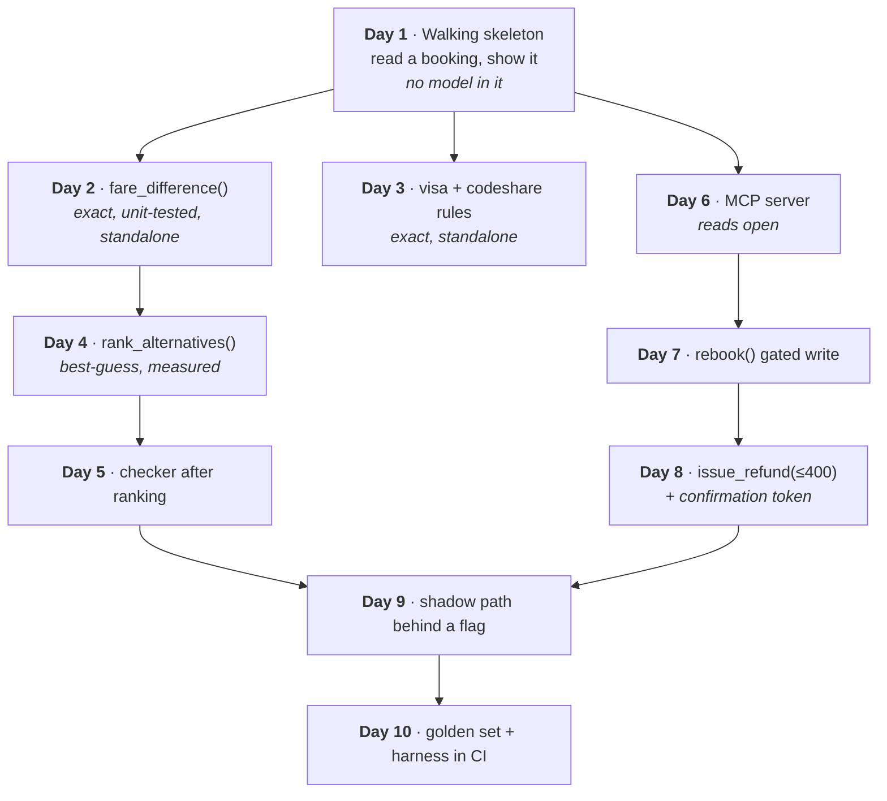

# How to cut sprints into bolts

When building is fast, the unit of planning shrinks to match. A **bolt** is a thin, shippable slice
reviewed and integrated the same day.

The product manager decides the **cadence**. The architect decides the **cut**. Getting the second one
wrong is what makes the first one fail.

---

## Why the sprint stops fitting

The agent builds a story in hours, then sits idle while the team waits for the sprint review.
Meanwhile leadership wants to see something every day.

| | Five stories in a two-week sprint | Ten daily bolts |
| --- | --- | --- |
| Working days | 10 | 10 |
| Evidence for leadership | A demo on day 14 | Every day |
| Cost of a wrong turn | Two weeks | One day |
| Integration | Day 13, all at once | Same day, every day |
| Definition of done | "Meets the story" | Meets the story **and** passes the harness for its slice |

Same ten days. The difference is where the risk sits.

---

## The cut: dependency order, not priority order

A bolt must be **buildable and testable alone**. That constraint sets the order, and it is not the
order the backlog is in.



The ordering rules, in priority order:

1. **The walking skeleton first.** The thinnest end-to-end path, with no model in it. It proves the
   pieces connect, which is the assumption everything else rests on.
2. **Pure exact code early.** It is unit-testable in isolation, so it never blocks and never waits.
3. **Checkers after the steps they check.** Obvious, and still mis-ordered often.
4. **The plug before any gated write that needs it.** This is the classic failure: the rebook bolt is
   scheduled for day four and the MCP server it needs for day six.
5. **The proof last.** The harness needs something to run against.

> **One unknown per bolt.** Then a day can fail for exactly one reason, and you know which.

Tool: [Sprint-to-bolt planner](https://akash-coded.github.io/aws-bedrock-agentcore-strands/#/toolkit/bolts)

---

## What changes in your ceremonies

| Ceremony | Before | With bolts |
| --- | --- | --- |
| Planning | Two weeks of stories | Tomorrow's bolt, from its story file |
| Standup | Status round | "Did yesterday's bolt integrate? What is today's one unknown?" |
| Definition of done | Meets the story | Meets the story, passes its slice in the harness, **and is integrated** |
| Demo | Day 14 | Every day, from what actually merged |
| Review | End of sprint | By risk band, same day |

---

## The story file: what a bolt is built from

A bolt that needs a chat thread was cut wrong, or its file is incomplete. Six parts, one file,
versioned next to the code:

```markdown
# Bolt 7 · rebook() gated write

## Context      (by reference, never pasted)
  /context/shared/standards.md · /context/domain/booking-model.md
  /context/product/architecture.md · ADR-004, ADR-007

## Spec         (EARS)
  WHEN the passenger accepts a proposed alternative
   AND the fare difference has been computed
  THE SYSTEM SHALL rebook the segment within 10 seconds.
  BOUNDARY  Never rebook without a computed fare difference.

## Tools        rebook(pnr, segment, fare_delta, confirmation) → R3

## Tests        golden slice: "rebook" (40 cases, bar 85%)
                unit: rebook_requires_fare_delta, rebook_is_idempotent

## Done when    harness green on the rebook slice, integrated to main, trace row written

## Cost         ~1,900 tokens/call, mid tier
```

It is BMAD's *shard* and spec-driven development's unit at once. Because it is a file, it is
reviewable as a diff and versioned alongside the code it produces.

---

## Exposure, in unknown-days

A useful measure of how risky a plan is: **the sum, over every day, of the unknowns still open.**

Two plans, same ten bolts:

| Plan | Day 1 unknowns | Day 10 unknowns | Exposure |
| --- | --- | --- | --- |
| Skeleton first, exact early, risk retired daily | 10 | 0 | **Low** — the curve falls from day one |
| Integration on day 9 | 10 | 10 until day 9 | **High** — every unknown is open until the end |

The point of the skeleton is not that it is impressive. It is that it retires the largest unknown —
"do these pieces connect at all" — on day one, for almost no cost.

---

## When a bolt cannot be built alone

Say so **before** starting it, not halfway through. A bolt that cannot be built alone was cut wrong,
and the fix belongs with the architect, not with the engineer who discovered it at 2pm.

The usual causes:

| Symptom | Cause | Fix |
| --- | --- | --- |
| "I need the MCP server that is scheduled for Thursday" | Plug ordered after its consumer | Move the plug earlier |
| "I need the other half of this feature" | The slice is not thin, it is **cut in half** | Re-cut vertically, not horizontally |
| "I cannot test it without the model being right" | Exact and best-guess bundled in one bolt | Split them; the exact half stands alone |

---

## Try it

**Exercise.** Take your current sprint. Write each story on a line with a "depends on" column, then
order them so that every item's dependencies come before it.

<details>
<summary>What the exercise reveals</summary>

Three things, reliably.

**A cycle.** Two items each waiting on the other. This is always a mis-cut, and it means one of them
is really two items.

**A plug scheduled after its consumer.** The most common single error, and the one that costs a whole
day mid-sprint.

**An item with no dependencies that was scheduled last.** Usually the exact code — the fare math, the
eligibility rules. It stands alone, it is cheap, it unblocks review capacity, and it is sitting at the
end of the plan because it looked boring.

If your ordered list has no walking skeleton at the top, add one. It is half a day and it is the only
bolt that tells you whether the architecture is real.
</details>

---

**Next:** [How to Review by Risk Band](How-to-Review-by-Risk-Band) · [How to Prove the Bar](How-to-Prove-the-Bar)
· [Role: Engineering lead](Role-Engineering-Lead) · [The Eight Loops](The-Eight-Loops)
