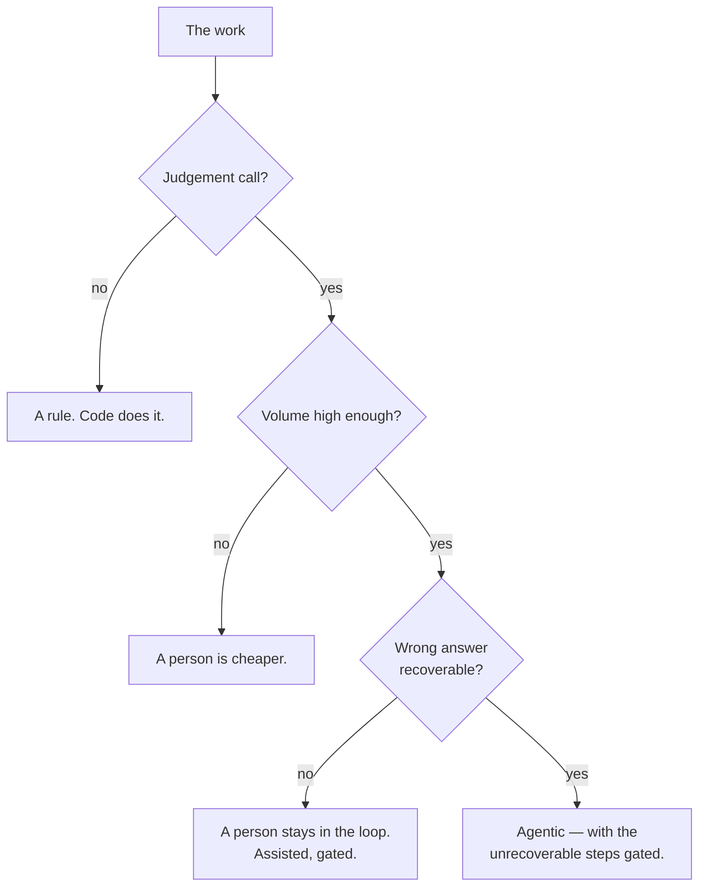
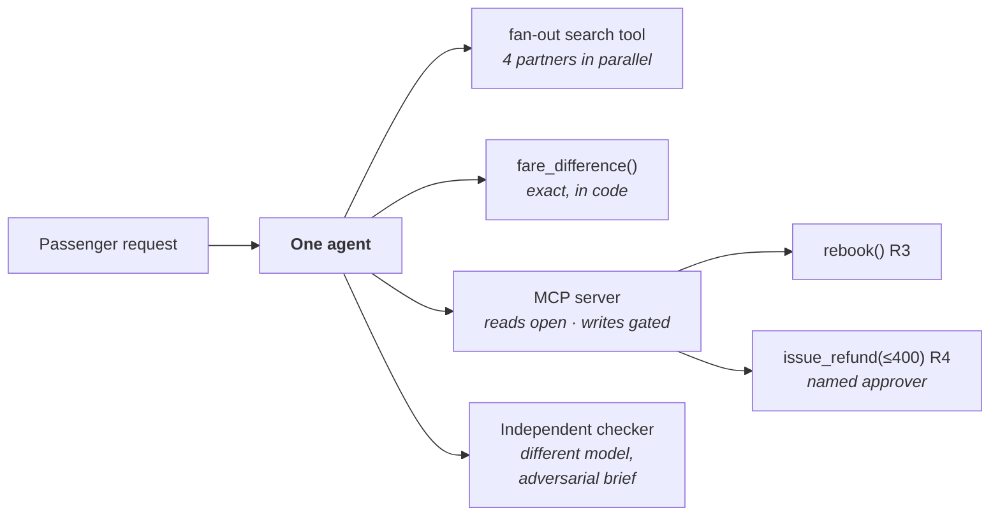

# How to design an agent on paper

Seven decisions, end to end, before any code exists. If you cannot make these seven on paper, writing
code will not help you make them; it will only make them implicitly, in whatever order the compiler
demands.

Run it live:
[The paper agent](https://akash-coded.github.io/aws-bedrock-agentcore-strands/#/simulations/paper).

---

## 1 · Is it an agent at all?

Three questions, and they come in this order for a reason.



**SkyWays:** there is judgement (which alternative suits this passenger), 240 cases a day, and the work
is *partly* recoverable — a proposed rebooking can be withdrawn, a refund cannot. So: an agent, with
one gated step.

The sharpest version of the test is to try to talk yourself out of it. If the scope really were
same-route, same-day moves only, it is code and the exercise stops here. It is the codeshare and visa
cases that make it judgement.

---

## 2 · Control plane and execution plane

Two planes, and knowing which one a rule belongs to is most of the security of the system.

| | Control plane | Execution plane |
| --- | --- | --- |
| **What it is** | What *may* happen | What *does* happen |
| **Holds** | Authority, caps, gates, bands | Tools, prompts, the model, the loop |
| **Enforced by** | Tool contracts and signatures | The runtime |
| **Test** | Holds when the model has been convinced otherwise | — |

> Where does the $400 refund cap live? **The control plane, enforced by the tool contract.**

Put it in the system prompt and you have written a request. A model can be talked past a request. The
control plane is whatever still holds after the model has been convinced.

---

## 3 · The agent PRD

The title and the value statement are necessary, and together they still describe a wish. What makes
it a spec a machine can build from is **the acceptance criteria in EARS, with the bar per slice**.

```
WHEN a valid booking is disrupted
 AND a partner seat exists
THE SYSTEM SHALL propose it within 30 seconds,
     correct on 80 percent of codeshare cases.

BOUNDARY  The system shall never issue a refund without a named approver.
```

Eight fields, one screen:

| Classical | Agentic |
| --- | --- |
| Title | The model's role |
| Value | Autonomy level |
| Acceptance criteria (EARS) | The bar, per slice |
| | The fallback |
| | The records it must write |

---

## 4 · The high-level design

The instinct is a manager agent with one specialist per partner airline. Resist it.

| Design | Hand-offs | Verdict |
| --- | --- | --- |
| A manager plus four partner specialists | **10** — n(n−1)/2 for n = 5 | Ten places to get coordination wrong, for work a single tool can fan out |
| **One agent, a fan-out search tool, one MCP server with gated writes, an independent checker** | **0** | The partner searches run in parallel *inside* one tool. Reads open, writes gated |



Parallelism is a **tool** property, not an agent-count property. That one sentence prevents most
multi-agent designs.

---

## 5 · The low-level design, and who writes it

The architect specifies **behaviours**. Engineering picks the settings.

| The architect writes | The architect does **not** write |
| --- | --- |
| Exact or best-guess, per step | Temperature, top-p |
| Where the gates sit | The framework version |
| The bar per slice | The SDK call shape |

Specify a temperature in a design document and the design is wrong at the next framework release,
because the knob will have been renamed or removed. Behaviour survives a framework change; knobs do
not.

> **Specify behaviour, never knobs.**

---

## 6 · Prompts as policy

Not "everything in the prompt so it is easy to change" — that is equally easy to *defeat*. And not
"nothing in the prompt", either, which throws away the thing prompts are good at.

| Layer | Carries | Why |
| --- | --- | --- |
| **The prompt** | The policy, explained | Makes the agent behave well **by default**, and reason about the rule |
| **The tool** | The enforcement | Makes bad behaviour **impossible** when the prompt has been talked past |

An injected instruction can override a prompt. It cannot override a typed parameter that raises.

---

## 7 · The design review

Walk **four artefacts**. Sign only if each is satisfied, and name the risks that remain.

| Artefact | Satisfied when |
| --- | --- |
| **The exact / best-guess map** | Every number the feature computes is in code, not in a prompt |
| **The spec** | Acceptance in EARS, with a bar per slice |
| **The ADRs** | One per sensitivity point, each naming what was rejected |
| **The authority budget** | Every tool banded R1–R5, caps in signatures, money actions with a named approver |

A review that approves on the strength of the architecture diagram is a **look**, not a review. A
diagram shows the shape and says nothing about behaviour.

---

## The paper agent, filled in for SkyWays

```
AGENT        rebooking assistant
SHAPE        one agent · fan-out search tool · one MCP server · one checker
AUTONOMY     propose: alone | same-day rebook: monitored | refund: named approver
BAR          same-day 50% · codeshare 80% · refund (held) 71%
EXACT        fare_difference() · visa_eligible() · codeshare_allowed()
BEST-GUESS   rank_alternatives() · draft_message()          ← checker after each
CONSEQUENTIAL rebook() R3 · issue_refund(≤$400) R4
FALLBACK     hand to the desk with the trace attached
RECORDS      one redacted trace row per consequential action
```

That is the whole design, on one screen, before a line of code. Everything downstream — the story
files, the golden set, the harness, the gate map — is derived from it.

---

## Try it

**Exercise 1.** Take a feature on your roadmap and write its exact / best-guess / consequential map.
Be strict: every number that is computed and then acted on is exact.

<details>
<summary>The two things you will find</summary>

First, **at least one number currently computed by a prompt.** Grep for *calculate*, *compute*,
*total*. Every hit is a function waiting to exist, and it is the failure mode that produces $80 when
the ledger says $62 — fluently, with no error.

Second, **a step you cannot classify.** That is usually a step doing two things at once: a judgement
and a calculation bundled into one call. Split it, and both halves classify immediately.
</details>

**Exercise 2.** Someone proposes five agents: a planner, a searcher, a pricer, a writer and a
reviewer. What do you ask?

<details>
<summary>Answer</summary>

**"What named limit justifies each hand-off?"** Five agents have ten possible hand-offs, and every one
has to be got right.

Then work through them. The *pricer* is exact work — a function, not an agent. The *searcher* is
parallelism, which a fan-out tool provides without a second context. The *reviewer* is the one that
genuinely earns separation, because independence is the whole point of a checker: a different model
or a fresh adversarial context.

That collapses five agents to one agent, one tool, one function and one checker. Add agents back only
when a named limit is met — a context that genuinely overloads, or parallel sub-tasks one tool cannot
express — and write the limit into the record so the swarm cannot return by default.
</details>

---

**Next:** [How to Choose Build, Buy or Borrow](How-to-Choose-Build-Buy-or-Borrow) ·
[Role: Solution architect](Role-Solution-Architect) ·
[How to Hold the Security Boundary](How-to-Hold-the-Security-Boundary) · [Decision Trees](Decision-Trees)
