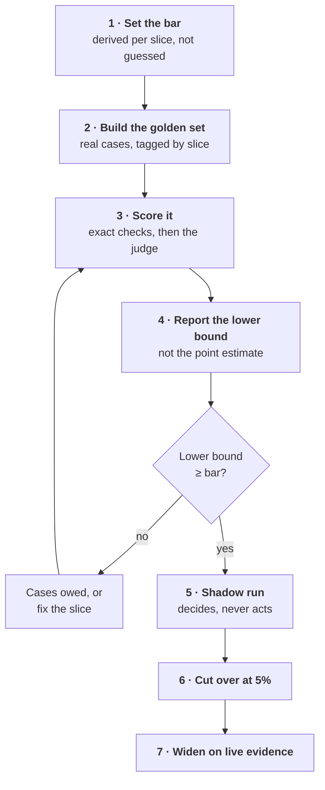

# How to prove the bar

A score is not proof. This page is the ladder from "the model seems good" to "we have earned wider
use", and every rung has a number on it.

This closes the [trust loop](The-Eight-Loops#trust). The QA lead owns it.

---

## The ladder



Skipping a rung is always possible and always shows up later, usually at rung 7 with real passengers.

---

## 1 · Set the bar, per slice

> **N = damage ÷ saving**, and **bar = N ÷ (N + 1)**

One wrong case undoes the saving from N right ones, so the assistant breaks even at N right for every
wrong.

| Slice | Saving | Damage | N | Bar |
| --- | --- | --- | --- | --- |
| Same-day lookup | $4 | $4 | 1 | **50%** |
| Codeshare rebook | $9 | $36 | 4 | **80%** |
| Refund, no hold | $12 | $600 | 50 | **98%** |
| Refund, with a human hold | $12 | $30 | 2.5 | **71%** |

The last two rows are the lever. **A hold lowers the damage, so it lowers the bar.** Ship at 71% with
a person confirming the charge, rather than waiting for a 98% you will never reach.

---

## 2 · Build the golden set

Real historical cases with the expected outcome, one per line, **tagged by slice**.

```jsonl
{"id":"c-0412","slice":"codeshare","input":{"pnr":"QX7T2A","disruption":"cancelled"},"expect":{"action":"propose","partner":"allowed"}}
{"id":"c-0414","slice":"refund","input":{"pnr":"RT1K8D","fare":"non-refundable"},"expect":{"action":"escalate","reason":"no_entitlement"}}
```

**Fifty cases to start, five hundred to trust.** And **oversample the rare hard slice deliberately** —
a stratified sample beats a large random one that happens to contain nine codeshare cases.

---

## 3 · Score in the right order

Exact checks first, because they are cheap and definitive. The judge second, on what survives.

| Order | Check | Catches |
| --- | --- | --- |
| 1 | Schema | Malformed output |
| 2 | Exact: fare math, eligibility, no waived tax | The money bugs |
| 3 | Independent judge against a rubric | Tone, policy, false claims |
| 4 | Score against the bar, **per slice** | Regressions the average hides |

Running the judge first spends money grading outputs the schema check would have rejected for free.

---

## 4 · Report the lower bound, never the point estimate

This is the rung most teams skip.

> **lower bound = p − z × √( p × (1 − p) ÷ n )**
>
> **cases needed = z² × p × (1 − p) ÷ (p − bar)²**

| Score | Cases | 95% lower bound | Bar | Proven? |
| --- | --- | --- | --- | --- |
| 82% | 40 | 70.1% | 80% | No |
| 82% | 150 | 75.9% | 80% | No |
| 82% | 500 | 78.6% | 80% | No |
| 86% | 500 | 83.0% | 80% | **Yes** |

Two things to take from that table. **82% never proves an 80% bar**, at any sample size you will
realistically collect — the estimate is simply too close to the bar. And the cases-needed formula has
`(p − bar)²` in the denominator, so the cost of proving grows *quadratically* as your score
approaches the bar.

Under about a hundred cases, use the **Wilson** bound; the normal approximation misbehaves at small n
and near 0 or 1.

Tool: [Golden-set confidence calculator](https://akash-coded.github.io/aws-bedrock-agentcore-strands/#/toolkit/confidence)

---

## 5 · The shadow run

The agent runs beside the live desk, **deciding and logged, never acting**. Compare decision by
decision, nightly, for a window fixed in advance.

| Parameter | Working default | Yours to tune |
| --- | --- | --- |
| Agreement threshold | 95% | Yes |
| Window | 14 days | Yes |
| Money actions | Excluded from automatic agreement; always gated | **No** |

Make **"shadow never writes"** a test, not an intention. And compare **per slice** — overall
agreement of 96% can hide 64% on refunds.

If it does not match, you learned for free. That is the point of the rung.

---

## 6 and 7 · Cut over at five percent, widen on evidence

> **days of evidence = cases needed ÷ (traffic share × cases per day)**

At 240 cases a day and 5% of traffic you see 12 cases a day, so 500 cases takes **42 days**. A small
share is the safe place to start and a slow place to learn — which is exactly why a cut-over
*widens* rather than sitting at five percent forever.

Cutting over at fifty percent means half your passengers meet the first-day failure.

Rehearse the rollback **before** the cut-over, not during it. With a flag-driven shadow path, the
rollback is the flag.

Tool: [Cut-over evidence calculator](https://akash-coded.github.io/aws-bedrock-agentcore-strands/#/toolkit/cutover)

---

## Under a deadline

The sponsor wants six weeks and the full plan needs ten. The instinct is to drop the gates and the
golden set as overhead. That build does go faster, and it reaches production with no bar, no cap and
no evidence — and the incident arrives inside the six weeks rather than after them.

**Bend scope, never the hard gates.**

| What bends | What does not |
| --- | --- |
| Number of slices shipped | The bar, the cap, the shadow run |
| Shadow window: 7 days instead of 14, on the simple slice only | Money actions staying gated |
| Soft gates → placeholder, named owner, date | The three hard gates |

Pick the slice a deadline rewards: **the one that can be proven quickly.** Same-day lookups are 60% of
the volume and already score 97%; seven days at 144 cases a day is about 1,000 decisions, which bounds
a 97% slice tightly. Codeshare sits at 76% against a bar of 80, and no deadline moves that number.

Then tell the sponsor it as a **trade, not a delay**: "60% of the load in six weeks, proven, with
codeshare next on the plan." Same facts, and the sponsor keeps listening.

---

## Try it

**Exercise 1.** A slice scores 88% on 120 cases against an 85% bar. Proven?

<details>
<summary>Answer</summary>

Margin = 1.96 × √(0.88 × 0.12 ÷ 120) ≈ 1.96 × 0.0297 ≈ **5.8 points**. Lower bound ≈ **82.2%**, which
is below the 85% bar. **Not proven.**

Cases needed = 1.96² × 0.88 × 0.12 ÷ (0.03)² ≈ **451**. You are 331 cases short, and the reason it is
so many is that 88% sits only three points above the bar.

The useful conversation is not "pass or fail" but "331 cases owed, or raise the score, or lower the
damage with a hold".
</details>

**Exercise 2.** The team wants to skip the shadow run because the golden set already clears every bar.
What do you say?

<details>
<summary>Answer</summary>

The golden set proves the agent is right about **cases you already curated**. The shadow run proves
something different: that it agrees with the **live desk on today's traffic**, including the cases
nobody thought to curate — the storm day, the partner outage, the fare class that only appears in
August.

They test different things, and only one of them uses cases you did not choose.

If the deadline is genuinely hard, shorten the window rather than deleting it: seven days on the
simplest slice, with every disagreement read by a person. Three days as a formality is worse than
nothing, because it does not include a weekend or a disruption day, and it buys false confidence.
</details>

---

**Next:** [Role: QA lead](Role-QA-Lead) · [How to Run a Missing-Control Postmortem](How-to-Run-a-Missing-Control-Postmortem)
· [Formulas and Calculators](Formulas-and-Calculators) · [The Eight Loops](The-Eight-Loops)
