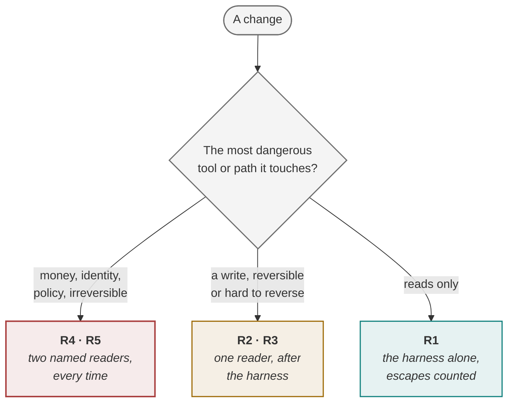

<!-- generated by site/learn_export.py from site/content/learn — edit the source, not this page -->
# How to Review AI-Generated Code: By Risk, Not by Diff Size

*The policy is the bottleneck, not the people. Two readers on a money tool, one on a reversible write, none on a read-only change — and a count of what escapes.*

**6 min read** · Intermediate · Lesson 5 of 13 in [Running delivery](Tutorial-Running-Delivery) · Updated 23 Sep 2026 · [Read it on the site, with live diagrams ↗](https://akash-coded.github.io/aws-bedrock-agentcore-strands/learn/review-ai-generated-code/)

> [!TIP]
> **The rule in one sentence.** Review AI-generated code by the **risk band of the most dangerous
> thing a change touches** — two named readers on money, identity or policy, one reader on a
> reversible or hard-to-reverse write, and the harness alone on read-only changes — enforce the band
> with a path rule nobody sets for their own work, and report three numbers monthly so the policy
> survives: slots needed, days in the queue, and escapes from the no-reader lane.



**In this lesson** you'll learn:

- how to measure a review queue, and why capacity is not the lever;
- how to band every change by what it touches, and enforce the band with a path rule;
- how to open a no-reader lane safely, and the three numbers that keep the policy alive.

## Sound familiar?

- Nine pull requests, a four-day queue, and two senior reviewers who cannot read any faster.
- A one-line change to a payment limit got one quick approval because it was small.
- The review that happens is a scroll to the bottom and an approve.

The policy treats every change as equally dangerous. Agents produce changes faster than people can
read them, so a policy that ignores risk will always produce a queue.

## Why review by risk?

When agents write most of the code, **reading becomes the scarce resource**. Hiring a reviewer takes
months; the agents will produce more changes long before then. So the only lever you control is how
much reading each change needs — and the size of a diff is the wrong way to decide it. A one-line
change to a refund cap is the most dangerous change of the week; a large refactor of a read-only
report may be the safest.

## Change the policy, step by step

### Step 1 · Measure the queue

**Queue time = review slots needed ÷ review slots available per day.** Count slots, not pull requests:
a change needing two readers takes two. Measure slots available from reviews actually completed over
the last four weeks, not from a job description. At SkyWays, nine changes on a two-senior-reviewer
policy needed 18 slots against 4.5 a day: **a four-day queue**.

### Step 2 · Band every change by what it touches

Give every tool and path a band from the authority budget — R1 read-only, R2 reversible write, R3
hard-to-reverse write, R4 money, R5 irreversible — and let a change inherit the band of the most
dangerous thing it touches. No band is ever decided by the size of a diff.

### Step 3 · Put the band in a path rule nobody sets for their own work

Generate a rule file in the repository — a `CODEOWNERS` file, for example — from the authority budget,
so the band of a change is decided by the paths it touches, not by the author. Self-assessed risk is
not a control.

### Step 4 · Route the readers by band

| Band | Readers | What the reader is for |
| --- | --- | --- |
| **R4 · R5** | Two, named | The authority: does this change what the tool may do, or the limit it may do it to? |
| **R2 · R3** | One | Correctness and blast radius, after the harness has already run |
| **R1** | None | The harness alone |

At SkyWays routing cut the slots needed from 18 to **7** and the queue from four days to **1.6**, with
the same people reading at the same speed.

### Step 5 · Open the no-reader lane, and count the escapes

A lane with no reader is exactly as safe as its harness, so **count the escapes** — defects that reach
production through it — every week. Zero escapes over *n* merges bounds the escape rate at about
**3 ÷ n** (the rule of three): 3% after 100 merges, 1.5% after 200. Write the lane's charter before
opening it, including the condition that closes it — and close it on the first escape.

### Step 6 · Report three numbers, monthly, together

Report **review slots needed**, **days in the queue** and **escapes from the no-reader lane** — and
report the escape count even when it is zero. Any one alone can be argued with; together they answer
whether you went faster without going blind.

## Where you'll use it

- **As an engineering lead**, the week the queue passes two days.
- **As a programme manager**, reading the review queue off the board every week.
- **In a security or audit review**, where the path rule shows that money changes can never skip two readers.

## Why it matters

Adding reviewers is slow and does not scale with agents. Changing the policy takes an afternoon and
cuts most of the queue — while *raising* the scrutiny on the changes that can actually do harm.

## Try it

This week's changes: three touch only report queries; four change reversible write tools; two change
the refund tool. The current policy is two reviewers on everything, and the team clears 4 slots a day.
**What is the queue now, and after routing by band?**

<details><summary>Show the answer</summary>

**Now: 18 slots ÷ 4 = 4.5 days.** Nine changes × two readers. **After routing: 8 slots ÷ 4 = 2 days**
— the three read-only changes need none, the four reversible writes need one each, and the two refund
changes keep two each: 0 + 4 + 4 = 8. The refund changes lose nothing; the queue halves.

</details>

## Key takeaways

1. **Reading is the scarce resource**: measure the queue in slots, and change the policy, not the headcount.
2. **Band by what a change touches**, enforced by a path rule — two readers on money, one on writes, none on reads.
3. **Count the escapes**, and report slots, queue days and escapes together every month.

## FAQ

### How do you review AI-generated code?

By risk. Band each change by the most dangerous tool or path it touches, and route readers by band:
two named readers for money, identity or policy; one reader for other writes, after the automated
harness has passed; the harness alone for read-only changes, with defects that escape counted weekly.

### Should AI-generated code be reviewed differently from human code?

The same risk rules apply to both. What changes is volume: agents produce more changes than people
can read line by line, so a policy that reviews everything equally creates a queue, and a policy that
reviews by risk keeps scrutiny where the harm is.

### Is it safe to merge code without a human reviewer?

For read-only, low-risk changes, only as safe as the automated checks that gate the merge — which is
why the no-reader lane needs a written charter, a weekly count of escaped defects, and a rule that
closes it on the first escape.

### What is the rule of three?

A statistical rule of thumb: if you have seen zero failures in *n* independent trials, the failure rate
is below about 3 ÷ *n* with 95% confidence. It is how you state what zero escapes through a no-reader
lane actually proves.

## Apply it in your role

| If you are… | Do this | The AI-augmented shortcut |
| --- | --- | --- |
| **A forward-deployed engineer** | Agree the review bands with the customer's security team early. Their sign-off on the path rule is worth more than any number of reviews. | Ask a model to generate the path rules (CODEOWNERS) from the authority budget. |
| **A product manager or FDPM** | Watch the queue in days. When it grows, the policy is the bottleneck, not the people. | Have a model compute slots needed and queue days from the open pull requests. |
| **A GenAI or agentic AI engineer** | Keep each change in one band. A pull request that touches a money path and a label is reviewed at the money band. | Ask the coding agent to split mixed-band changes before it opens them. |

**Across the enterprise.** The lane with no human reader needs a written charter and a weekly count of
escaped defects across teams. That data is what lets you widen it safely.

**The ten-minute workflow.** Review routing, generated from what the tools may do:

```text
Here is our authority budget: <tools with risk bands R1–R5> and our repository layout: <tree>. Write a
CODEOWNERS file that sends R4–R5 paths to two named owners, R2–R3 to one, and leaves R1 to the harness.
List any path you could not place, and any file that serves more than one band.
```

## Sources and credits

| Idea | Origin | Source |
| --- | --- | --- |
| Risk bands, routing by band, the no-reader lane and the three numbers | **Original** — this playbook | [How to review by risk band](How-to-Review-by-Risk-Band) |
| Queue time = slots needed ÷ slots per day | **Borrowed** | Little, J. D. C. (1961). *Operations Research* 9(3) |
| The rule of three for zero observed failures | **Borrowed** | Hanley, J. A. & Lippman-Hand, A. (1983). If nothing goes wrong, is everything all right? *JAMA* 249(13) |
| Code owners as a path rule | **Borrowed** | GitHub Docs. [About code owners](https://docs.github.com/en/repositories/managing-your-repositorys-settings-and-features/customizing-your-repository/about-code-owners) |
| The SkyWays queue | **Illustrative** — a fictional airline | [Try the queue calculator](https://akash-coded.github.io/aws-bedrock-agentcore-strands/simulator/#/toolkit/queue) |

---

| | |
| :--- | ---: |
| [← Cut delivery from months to weeks](How-to-Cut-Delivery-from-Months-to-Weeks) | [How accurate must an agent be? →](How-Accurate-Does-an-AI-Agent-Need-to-Be) |

**[All lessons](Start-Here)** · **[Running delivery](Tutorial-Running-Delivery)** · [This lesson on the site](https://akash-coded.github.io/aws-bedrock-agentcore-strands/learn/review-ai-generated-code/)

<sub>✏️ This page is generated from [`site/content/learn/lessons/review-ai-generated-code.md`](https://github.com/akash-coded/aws-bedrock-agentcore-strands/blob/main/site/content/learn/lessons/review-ai-generated-code.md). To change it, [edit the lesson](https://github.com/akash-coded/aws-bedrock-agentcore-strands/edit/main/site/content/learn/lessons/review-ai-generated-code.md) — an edit made here is replaced at the next sync.</sub>
