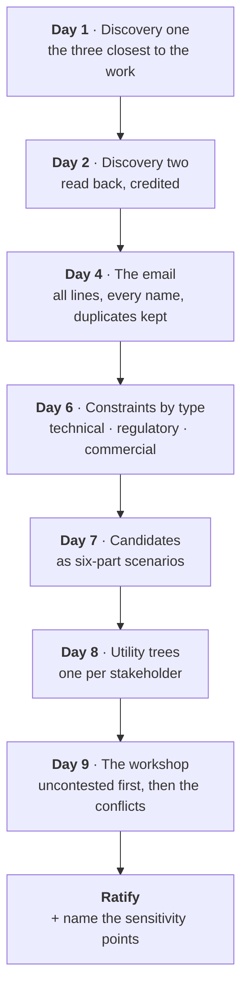

# How to run an NFR workshop

From two discovery meetings to ratified non-functional requirements and the sensitivity points that
earn a decision record. Nine days, eight moves, one artefact at the end.

This closes the [requirements loop](The-Eight-Loops#requirements) and it is owned by the solution
architect. Run it live:
[simulation](https://akash-coded.github.io/aws-bedrock-agentcore-strands/#/simulations/nfr).

---

## The eight moves



---

## Move 1 · who is in discovery one

Six people have a say. Do not put all six in one room first.

| Who you invite | What you get |
| --- | --- |
| The three **most senior** (operations, compliance, finance) | 14 requirements, 9 about cost and control. The frontline view is missing |
| The three **closest to the work** (frontline agent, contact centre, operations) | 17 requirements, 11 about speed and the systems it must touch. Compliance is missing |
| **All six at once** | 31 requirements, and forty minutes of two people talking past each other. Nobody feels heard |

Either of the first two works, because the second meeting is *for* the people who were not in the
first. The third is the mistake: a long meeting where the compliance officer and the frontline agent
argue produces the same thirty-one lines with less goodwill.

---

## Move 2 · read back, credited

By the end of the second meeting there are 31 requirements from six people, and four of them are the
same requirement said four different ways.

| What you do | What happens |
| --- | --- |
| **Read back every requirement, credited by name** | Eleven minutes. Every person hears their own words. The four duplicates are read out four times and nobody objects, because each belongs to somebody |
| Consolidate live on the whiteboard, down to twelve | Twelve clean lines and two people who believe theirs was dropped |

> **Credit before you consolidate.** A voice that was dropped comes back in week five as a constraint.

---

## Move 3 · the requirements email

This is the document that makes stakeholders feel heard *before* it asks them to agree.

Send **all 31 lines, each credited, with the duplicates kept.** Then the consolidation, with the
rationale, below it. Sending only the twelve saves a page and costs an afternoon of replies asking
where a requirement went.

```
Requirements identified by the team and key stakeholders

FR-01  Show alternative flights within one screen            — R. Mehta, frontline
FR-02  Show the passenger their options quickly              — R. Mehta, frontline
FR-03  Options must appear fast enough to hold a call        — S. Okafor, contact centre
...
FR-31  Every refund must be attributable to a person         — A. Lindqvist, compliance

Consolidated to 12 functional requirements — rationale below.
FR-A   (from FR-01, FR-02, FR-03) Present ranked alternatives within 30 seconds at P95.
```

---

## Move 4 · constraints, sorted by type, before anything is ratified

A constraint can make a quality target impossible, so it comes first. Sort by type — it changes what
each one does to the design.

| Type | Example | What it does |
| --- | --- | --- |
| **Regulatory** | Every refund over **$400** needs a named approver | Turns three candidate NFRs from adjectives into numbers, and becomes a cap **inside a tool** |
| **Technical** | The reservation system exposes SOAP only | Shapes the integration: an adapter or an MCP server in front of it |
| **Organisation** | No headcount this year | The reason the assistant exists. Belongs in the pain register, not in the constraint list |

The third is the common confusion. A motivation is not a constraint; it does not bound the design.

Get this wrong in the other direction — ratify the NFRs first and add constraints after — and the room
signs a latency target the SOAP system cannot meet, and the workshop has to be held twice.

---

## Move 5 · candidates as six-part scenarios

An NFR written as an adjective cannot be tested, ranked or traded off. The workshop then spends two
hours arguing about words.

> **Source · stimulus · artefact · environment · response · measure**

| Not this | This |
| --- | --- |
| "The assistant must respond in under 30 seconds" | "**When** a disrupted passenger *(source)* asks for rebooking options *(stimulus)* during a peak hour *(environment)*, the assistant *(artefact)* proposes ranked alternatives *(response)* within 30 seconds at P95 *(measure)*" |

Under 30 seconds for whom, doing what, under what load, always or usually? All six parts, or the
workshop argues.

Two NFRs people forget to write and then need: **autonomy level** and **cost per case**. Both are
quality attributes, both are measurable, and cost per case ratified here is what makes a Day 75 bill
a monitored number rather than a surprise.

---

## Move 6 · utility trees, one per stakeholder

Each stakeholder rates every candidate NFR on **business value** and **complexity**, 1 to 3.

> **priority = value × (4 − complexity)**

Merge the trees. Two stakeholders whose priority for the same NFR differs by 5 or more have a
**conflict**, and every conflict is a decision-record trigger.

Worked example, latency:

| Stakeholder | Value | Complexity | Priority |
| --- | --- | --- | --- |
| Frontline agent | 3 | 2 | 6 |
| Finance controller | 1 | 2 | 2 |

Difference of 4 — close. Score latency at 9 against cost at 1 for the frontline agent and the reverse
for finance, and you have the real conflict: **faster options need the larger model, which costs more
per case.**

What is *not* a real conflict, though it feels like one: auditability against latency. Logging costs
milliseconds; the model choice costs seconds. The trees show this, which is why you build them rather
than debate.

Tool: [NFR utility tree builder](https://akash-coded.github.io/aws-bedrock-agentcore-strands/#/toolkit/utree)

---

## Move 7 · the workshop itself

Two hours, six people, nine candidate NFRs.

**Ratify the uncontested ones first.** Six NFRs go through in twenty minutes because the trees already
agree on them. The remaining hundred minutes go to the three conflicts, which are the only reason six
people were needed in one room.

The alternative — nine items, thirteen minutes each, in order — runs out of time exactly on the
conflicts.

---

## Move 8 · ratify, and name the sensitivity points

A **sensitivity point** is an NFR rated high on both importance and difficulty: one design decision
changes the outcome. Name them, and give each a **date for its decision record**.

```
RATIFIED · 9 NFRs
  NFR-1  latency        30s at P95, peak hour        ratified
  NFR-2  cost per case  $0.60                        ratified   ← sensitivity point, ADR-001, Day 12
  NFR-3  accuracy       80% on codeshare             ratified   ← sensitivity point, ADR-002, week 3
  NFR-4  authority      refunds > $400 → approver    ratified   ← sensitivity point, ADR-003, Day 12
  ...
```

Stop at the ratified list and the reasons for the hard choices are lost. In week three somebody
re-opens the model-tier question with no record of why it was settled.

**What the ratified NFRs become downstream:** the acceptance bars, and the golden-set slices.

---

## Common mistakes

| Mistake | What it costs | Instead |
| --- | --- | --- |
| Consolidating in the room | Two stakeholders leave believing they were dropped | Read back with credit; consolidate in the email |
| NFRs left as adjectives | Two hours arguing about words | Six-part scenarios with a number, before the room meets |
| Constraints after ratification | The workshop is held twice | Constraints by type, first |
| A vote with dots on a wall | The loudest group wins; cost per case gets two dots and returns as a crisis | Utility trees, merged, with value and complexity |
| A record for every decision | Forty records in a week, and the three that mattered are buried | One per sensitivity point, and nowhere else |

---

## Try it

Take a feature your team is specifying now.

1. Write one of its quality requirements as a six-part scenario. All six parts.
2. Score it for value and complexity from **two** different stakeholders' points of view.
3. Compute `value × (4 − complexity)` for each. If they differ by 5 or more, you have found a
   sensitivity point, and it owes a decision record.

<details>
<summary>What usually turns up</summary>

The part nearly everyone omits is **environment** — "under what load, at what time, in what state".
Its absence is what makes a latency target arguable, because everyone silently imagines a different
day.

And the conflict that turns up most often is the same one SkyWays finds: **latency against cost per
case**, because the faster answer needs the larger model. If your trees do not surface it, it is
usually because cost per case was never written as an NFR at all.
</details>

---

**Next:** [How to Design an Agent on Paper](How-to-Design-an-Agent-on-Paper) ·
[Role: Solution architect](Role-Solution-Architect) · [The Eight Loops](The-Eight-Loops) ·
[Formulas and Calculators](Formulas-and-Calculators)
