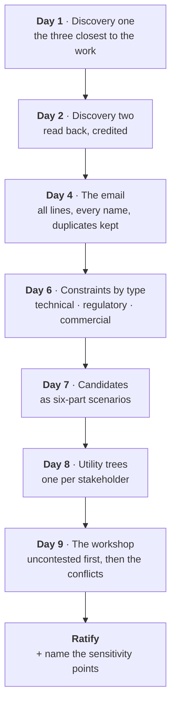

# How to run an NFR workshop

From two discovery meetings to ratified non-functional requirements and the sensitivity points that
earn a decision record. Nine days, eight moves, one artefact at the end of each.

This closes the [requirements loop](The-Eight-Loops#requirements) and it is owned by the solution
architect. It is the same ground as [Elicit and Constrain](Journey-Solution-Architect) in the
architect's journey, told as a procedure rather than as a role.

**Run it interactively:**
[the NFR workshop simulation](https://akash-coded.github.io/aws-bedrock-agentcore-strands/simulator/#/simulations/nfr)
· **[the utility tree builder](https://akash-coded.github.io/aws-bedrock-agentcore-strands/simulator/#/toolkit/utree)**

### At a glance

| | |
| --- | --- |
| **Reach for it when** | The NFRs are adjectives, and the trade-offs are being settled by seniority. |
| **Owner** | Solution architect |
| **Phase** | P0 → P1 |
| **Closes** | [Requirements](The-Eight-Loops#requirements) — P0 → P1 |
| **Moves** | 8 |
| **You leave with** | A credited requirement list, a constraint register, candidate NFRs as six-part scenarios, merged utility trees with the conflicts marked, and a ratified set |

---

## The eight moves



| # | Move | Produces | Done when |
| --- | --- | --- | --- |
| 1 | [Discovery one](#1--discovery-one) | Raw requirement list, credited | Every line has a name beside it |
| 2 | [Discovery two, read back](#2--discovery-two-read-back-credited) | The same list, heard aloud | Nobody in the room believes their line was dropped |
| 3 | [The requirements email](#3--the-requirements-email) | Credited FRs + the consolidation | Replies argue about content, not about omission |
| 4 | [Constraints by type](#4--constraints-by-type) | Constraint register | Each constraint names what it forbids |
| 5 | [Candidates as scenarios](#5--candidates-as-six-part-scenarios) | Candidate NFR sheet | Every candidate has all six parts and a number |
| 6 | [Utility trees](#6--utility-trees-one-per-stakeholder) | Merged tree with conflicts marked | Every conflict of 5 or more is listed |
| 7 | [The workshop](#7--the-workshop-itself) | Ratified set | The uncontested went in 20 minutes |
| 8 | [Ratify and name](#8--ratify-and-name-the-sensitivity-points) | NFR register + ADR triggers | Each sensitivity point has an owner and a date |

---

## 1 · Discovery one

**Day 1. Two hours. Three people, not six.**

Six people have a say: the operations lead, the contact-centre head, the compliance officer, the
finance controller, the platform architect and a frontline agent. Do not put all six in one room
first.

| Who you invite | What you get |
| --- | --- |
| The three **most senior** | 14 requirements, 9 about cost and control. The frontline view is missing |
| The three **closest to the work** | 17 requirements, 11 about speed and the systems it must touch. Compliance is missing |
| **All six at once** | 31 requirements, and forty minutes of two people talking past each other. Nobody feels heard |

Either of the first two works, because the second meeting is *for* the people who were not in the
first. The third is the mistake: the same thirty-one lines with less goodwill.

### What you actually do

1. **Pick the three by proximity to the work, not seniority.** Seniority arrives in meeting two,
   having read what the frontline said, which is a better conversation than the reverse.
2. **Ask for the last time it happened, not the general case.** "Tell me about the last codeshare
   disruption you handled" produces a requirement. "What do you need?" produces a wish list.
3. **Write verbatim, attribute every line.** You are not consolidating yet. A line you paraphrase is
   a line its author will not recognise in the email.
4. **Ask what they do when the system is down.** The manual workaround is where the real rules live,
   and it is usually undocumented.
5. **Close by naming who is in meeting two.** It tells the room this is a sequence, not a one-off,
   and it stops people front-loading everything into the first hour.

### Where a model helps

| Tool | Use it for |
| --- | --- |
| **Transcription + chat LLM** | Turn the recording into attributed lines. Ask for *speaker, verbatim line, one-sentence paraphrase* — three columns, so you can check the paraphrase against the words |
| **Chat LLM** | Draft the interview guide from the pain register: six questions, each traceable to a line in it. Cheap, and it stops you improvising |
| **Do not delegate** | Deciding who is in the room. That is a political judgement about whose absence would come back as a constraint in week five |

### The artefact

<details><summary><b>Template · Raw requirement list</b></summary>

```markdown
# Discovery · meeting <1|2> · <date>
Present: <name, role> · <name, role> · <name, role>
Facilitator: <name>   Recording: <link>   Duration: <n> min

## Requirements, verbatim, in the order they were said
| # | Verbatim | Said by | My paraphrase | Type (guess) |
|---|----------|---------|---------------|--------------|
| 1 | "<exact words>" | <name> | <one sentence> | FR / NFR / constraint |
| 2 | | | | |

## The workaround, when the system is down
<what they actually do, step by step — this is where undocumented rules live>

## Numbers anyone volunteered
| Number | Value | Said by | Verified? |
|--------|-------|---------|-----------|
| <cases per day> | | | no |

## Who is in meeting two, and why
- <name, role> — <the view we are missing>
```
</details>

<details><summary><b>Prompt · Attributed lines from a transcript</b></summary>

```text
Below is a transcript of a discovery interview.

Produce a table with one row per distinct requirement or constraint that was stated:
| # | Verbatim quote (shortest that carries the meaning) | Speaker | Paraphrase in one sentence | FR / NFR / constraint |

Rules:
- Keep the speaker on EVERY row. Never merge two speakers into one row.
- Quote exactly. If you cannot quote it, it was not stated — leave it out.
- Do not infer requirements from complaints. A complaint is evidence; list those
  separately under "Pain stated, not yet a requirement".
- Mark anything that sounds like a solution rather than a need as SOLUTION, and put it
  in its own list at the end.

TRANSCRIPT:
<paste>
```
</details>

**Done when** — every line has a name beside it, and you can say which view is missing from the room.

---

## 2 · Discovery two, read back, credited

**Day 2. By the end there are 31 requirements from six people, and four of them are the same
requirement said four different ways.**

| What you do | What happens |
| --- | --- |
| **Read back every requirement, credited by name** | Eleven minutes. Every person hears their own words. The four duplicates are read out four times and nobody objects, because each belongs to somebody |
| Consolidate live on the whiteboard, down to twelve | Twelve clean lines and two people who believe theirs was dropped |

> **Credit before you consolidate.** A voice that was dropped comes back in week five as a constraint,
> and it arrives with the authority of someone who was ignored.

### What you actually do

1. **Read the list aloud, in full, with names.** It takes about eleven minutes for thirty-one lines.
   That eleven minutes buys the right to consolidate later without anyone objecting.
2. **Read the duplicates separately, all four times.** Do not merge them in the room. Hearing the
   same need in four voices is what makes the later merge uncontroversial.
3. **Ask only one question: "did I get your words right?"** Not "do you agree" — agreement is the
   workshop's job, seven days from now.
4. **Capture disagreements as pairs, not as a winner.** "Operations wants X, compliance wants not-X"
   is a finding. Resolving it here wastes the workshop.
5. **Say what happens next, with the date.** People accept a slow process they can see the shape of.

### Where a model helps

| Tool | Use it for |
| --- | --- |
| **Chat LLM** | Cluster thirty-one lines into distinct needs *while keeping every name on every cluster*. It is genuinely good at this and it takes you an hour by hand |
| **Chat LLM, adversarially** | "Which two of these clusters would their authors say are different things?" A cheap check on over-merging, which is the failure mode that costs you a stakeholder |
| **Do not delegate** | The reading-aloud. The point is not the list; it is that six people watched you take their words seriously |

### The artefact

<details><summary><b>Prompt · Cluster without losing anybody</b></summary>

```text
Here are <n> requirement lines from <n> stakeholders, each with a speaker.

Group them into DISTINCT needs. Output:
| Cluster | The need in one sentence | Every line in it (verbatim) | Every name |

Rules:
- A name may appear in several clusters. Never drop one.
- Do NOT merge two lines whose CAUSE differs, even if the symptom is identical.
  Say explicitly when you were tempted and why you did not.
- After the table, list "pairs that look merged but should not be", with the reason.
- Then list any line you could not place, rather than forcing it.

LINES:
<paste>
```
</details>

**Done when** — nobody in the room believes their line was dropped, and the duplicates are still on
the list.

---

## 3 · The requirements email

**Day 4. This is the document that makes stakeholders feel heard *before* it asks them to agree.**

Send **all 31 lines, each credited, with the duplicates kept.** Then the consolidation, with the
rationale, below it. Sending only the twelve saves a page and costs an afternoon of replies asking
where a requirement went.

### What you actually do

1. **Open with the full credited list.** It is the first thing in the email, not an appendix.
2. **Put the consolidation second, with a rationale per merge.** "FR-A combines FR-01, FR-02 and
   FR-03, all of which ask for options fast enough to hold a call."
3. **Name the date by which silence means agreement**, and make it at least three working days.
4. **Ask one explicit question**: "is any line missing, or wrongly attributed?" Not "any comments".
5. **Copy everyone who spoke, and nobody who did not.** A wider circulation invites requirements from
   people who were not in discovery, and those arrive without evidence.

### Where a model helps

| Tool | Use it for |
| --- | --- |
| **Chat LLM** | Draft the whole email from the clustered table. Mechanical, checkable, and it will produce the rationale lines you would otherwise skip |
| **Chat LLM** | Check tone: "does any rationale line read as dismissive of the person whose line was merged?" A real risk and an easy fix |
| **Do not delegate** | The decision to merge. The model proposes; the merge is a commitment you will defend in the workshop |

### The artefact

<details><summary><b>Template · The credited requirements email</b></summary>

```markdown
Subject: <Product> requirements — everything you told us, and what we propose to consolidate

All,

Below is everything raised in the two discovery sessions: <n> requirements, each with the
name of the person who raised it. Nothing has been removed. Duplicates are kept
deliberately, because several of you raised the same need independently and that is worth
seeing.

Beneath that is a proposed consolidation to <n> functional requirements, with the reason
for each merge.

**Please reply by <date, at least 3 working days> if a line is missing or wrongly
attributed.** Silence after that date will be taken as "the record is accurate" — not as
agreement on priority, which is what the workshop on <date> is for.

## Everything raised (<n> lines)
| # | Requirement | Raised by |
|---|-------------|-----------|
| FR-01 | <verbatim or close> | <name> |
| ... | | |

## Proposed consolidation (<n> requirements)
| ID | Consolidated requirement | Combines | Why |
|----|--------------------------|----------|-----|
| FR-A | <one sentence> | FR-01, FR-02, FR-03 | All three ask for <the shared need> |

## Not included, and why
| Raised | Why it is not a requirement here |
|--------|----------------------------------|
| <line> | <it is a solution / it is out of scope / it is a pain, now in the pain register> |

## What happens next
| Date | What |
|------|------|
| <date> | Constraints workshop — 45 min, <who> |
| <date> | Candidate NFRs circulated as scenarios |
| <date> | Ratification workshop — 2 h, all six |

<name>
```
</details>

**Done when** — the replies argue about content, not about omission.

---

## 4 · Constraints by type

**Day 6. Before any quality target is ratified.**

A constraint can make a quality target impossible, so it comes first. Sort by type, because the type
changes what the constraint does to the design.

| Type | Example | What it does |
| --- | --- | --- |
| **Regulatory** | Every refund over **$400** needs a named approver | Turns three candidate NFRs from adjectives into numbers, and becomes a cap **inside a tool** |
| **Technical** | The reservation system exposes SOAP only | Shapes the integration: an adapter or an MCP server in front of it |
| **Commercial** | The partner contract caps lookups at 5,000/day | Bounds the design and usually has a price attached to changing it |

And the category people get wrong:

> **A motivation is not a constraint.** "No headcount this year" is the reason the assistant exists.
> It belongs in the pain register. It bounds nothing about the design, and treating it as a
> constraint produces a design argument nobody can win.

Get the order wrong — ratify the NFRs first, add constraints after — and the room signs a latency
target the SOAP system cannot meet, and the workshop is held twice.

### What you actually do

1. **Ask each function for its hard limits, in writing.** Compliance, security, finance, the platform
   team, and the commercial owner of any partner contract.
2. **Sort by type before you do anything else.** The sort is the work; it takes twenty minutes and it
   determines which candidates survive.
3. **For each, write what it forbids, not what it prefers.** A constraint that does not forbid
   something is a preference, and preferences belong in the utility tree.
4. **Find the number.** "Refunds need approval" is a policy; "refunds **over $400** need a **named**
   approver" is a constraint you can put in a tool signature.
5. **Trace each constraint to the candidates it reshapes.** This column is what makes move 5 fast.
6. **Strike the motivations, visibly.** Keep them in the document under a "not constraints" heading
   so nobody re-raises them.

### Where a model helps

| Tool | Use it for |
| --- | --- |
| **Chat LLM** | Sort a raw list into technical, regulatory and commercial, and flag anything that reads as a motivation. Reliable, and it catches the motivation you were about to accept |
| **Claude Code** | Point it at the policy documents and ask for every sentence containing a threshold, an approval or a prohibition, with the source line. Faster than reading, and it gives you the citation |
| **Do not delegate** | Confirming a regulatory constraint. Get it in writing from the person accountable for it; a model's summary of a regulation is not a source |

### The artefact

<details><summary><b>Template · Constraint register</b></summary>

```markdown
# Constraints · <product> · <date>

## Regulatory
| ID | Constraint | What it FORBIDS | Number | Source (person + document) | Reshapes |
|----|-----------|-----------------|--------|---------------------------|----------|
| C-R1 | <e.g. refunds above a threshold need a named approver> | <an unapproved refund above $400> | $400 | <name>, <doc §> | NFR-3, NFR-4, NFR-7 |

## Technical
| ID | Constraint | What it FORBIDS | Number | Source | Reshapes |
|----|-----------|-----------------|--------|--------|----------|
| C-T1 | <legacy system exposes SOAP only> | <a direct REST integration> | — | <name> | NFR-1 |

## Commercial
| ID | Constraint | What it FORBIDS | Number | Source | Reshapes |
|----|-----------|-----------------|--------|--------|----------|
| C-C1 | <partner lookups capped per day> | <unbounded fan-out search> | 5,000/day | <contract §> | NFR-1, NFR-6 |

## NOT constraints — struck, with the reason
| Raised as a constraint | Actually | Where it went |
|------------------------|----------|---------------|
| <no headcount this year> | A motivation — it bounds nothing about the design | Pain register |
| <we prefer open source> | A preference | Utility tree, as a criterion |

## Consequence for the workshop
Candidates reshaped before the room meets: <list>. Candidates now impossible: <list>.
```
</details>

<details><summary><b>Prompt · Sort constraints and catch the motivations</b></summary>

```text
Sort each of these into exactly one of: TECHNICAL, REGULATORY, COMMERCIAL, or
NOT-A-CONSTRAINT.

For each, output:
| Raised | Type | What it FORBIDS | Number, if stated | Why this type |

Rules:
- A constraint must FORBID something specific. If it does not, it is NOT-A-CONSTRAINT —
  say whether it is a motivation, a preference or a solution.
- "We have no budget for headcount" is a MOTIVATION, not a constraint. Apply that test
  generally: does it bound the design, or does it explain why we are here?
- If a threshold was implied but no number given, write NUMBER MISSING and say who would
  know it.
- Do not soften anything. A constraint stated absolutely stays absolute.

RAISED:
<paste>
```
</details>

**Done when** — every constraint names what it forbids, carries a number where one exists, and the
motivations are visibly struck rather than quietly dropped.

---
## 5 · Candidates as six-part scenarios

**Day 7. An NFR written as an adjective cannot be tested, ranked or traded off, and the workshop
then spends two hours arguing about words.**

> **Source · stimulus · artefact · environment · response · measure**

| Not this | This |
| --- | --- |
| "The assistant must respond in under 30 seconds" | "**When** a disrupted passenger *(source)* asks for rebooking options *(stimulus)* during a peak hour *(environment)*, the assistant *(artefact)* proposes ranked alternatives *(response)* within 30 seconds at P95 *(measure)*" |

Under 30 seconds for whom, doing what, under what load, always or usually? All six parts, or the
workshop argues.

### The two everybody forgets

Two quality attributes belong on this list and are almost never written down until they hurt:

- **Cost per case.** It is a quality attribute, it is measurable, and ratifying it here is what makes
  a surprise bill a *monitored number* rather than a crisis. Every programme that discovers its token
  bill in month three skipped this line.
- **Autonomy level.** What the agent may do alone, per action. Written as a scenario it becomes
  testable: *when a refund exceeds $400, the system shall require a named approver, in 100% of cases.*

### What you actually do

1. **Write one scenario per candidate, all six parts.** If a part is unknown, write `UNKNOWN` rather
   than omitting it — the gap is the finding.
2. **Put the number in the measure, always.** A measure without a number is an adjective wearing a
   costume.
3. **Say which percentile.** P95 and mean are different requirements and the difference is usually
   the whole architecture.
4. **Add cost per case and autonomy** as scenarios, even if nobody asked.
5. **Mark which constraint reshaped each one**, from move 4. It shows the room that the constraints
   did work before they arrived.
6. **Circulate before the workshop.** People arrive having disagreed in private, which is faster than
   disagreeing in the room.

### Where a model helps

| Tool | Use it for |
| --- | --- |
| **Chat LLM** | Convert adjectives into six-part scenarios and report which parts it had to mark UNKNOWN. The UNKNOWN list is the agenda for your follow-up calls |
| **Chat LLM** | Generate the three most likely *environment* clauses for each candidate — peak hour, degraded partner, storm day. Teams under-specify environment more than any other part |
| **Chat LLM, adversarially** | "Give me two readings of this measure that a reasonable engineer and a reasonable tester would disagree about." Finds the ambiguity before the workshop does |
| **Do not delegate** | The numbers. A model will produce a plausible 30 seconds, and plausible is exactly the failure this move exists to prevent |

### The artefact

<details><summary><b>Template · Candidate NFR sheet</b></summary>

```markdown
# Candidate NFRs · <product> · circulated <date>, workshop <date>

Please read before the workshop. Disagree by email; we will spend the room's time on
the conflicts only.

## NFR-<n> · <short name>
| Part | Value |
|------|-------|
| Source | <who or what initiates> |
| Stimulus | <what they do> |
| Artefact | <which part of the system responds> |
| Environment | <load, time of day, degraded state — be specific> |
| Response | <the observable behaviour> |
| Measure | <number + unit + percentile, e.g. "30 s at P95"> |

Reshaped by: <constraint IDs from the constraint register>
Open question: <anything marked UNKNOWN, and who can answer it>

---

## NFR-<n> · Cost per case
| Part | Value |
|------|-------|
| Source | <any handled case> |
| Stimulus | <one completed interaction> |
| Artefact | <the assistant, end to end, including retries and the judge> |
| Environment | <steady state, after caching and routing are in place> |
| Response | <total model spend for that case> |
| Measure | <$0.60 per case at P95, measured weekly from the per-call log> |

## NFR-<n> · Autonomy on <action>
| Part | Value |
|------|-------|
| Source | <the agent> |
| Stimulus | <attempts action X above threshold Y> |
| Artefact | <the tool contract> |
| Environment | <all environments, including degraded> |
| Response | <requires a named approver; the call fails without one> |
| Measure | <100% of attempts — this is a boundary, not a target> |
```
</details>

<details><summary><b>Prompt · Adjectives to six-part scenarios</b></summary>

```text
Rewrite each of these quality requirements as a six-part scenario:
SOURCE · STIMULUS · ARTEFACT · ENVIRONMENT · RESPONSE · MEASURE.

Output one table per requirement.

Rules:
- MEASURE must contain a number, a unit and a percentile. If the original has no number,
  write "NUMBER MISSING" and list it at the end with a suggested question and who to ask.
- ENVIRONMENT must be specific: load, time of day, or degraded state. "Normal use" is not
  an environment — if that is all you can infer, write UNKNOWN.
- Do NOT invent numbers. Not even reasonable ones.
- After the tables, list every part you marked UNKNOWN or MISSING, grouped by who is
  most likely to be able to answer it.

REQUIREMENTS:
<paste>
```
</details>

**Done when** — every candidate has all six parts, every measure has a number and a percentile, and
cost per case and autonomy are on the list.

---

## 6 · Utility trees, one per stakeholder

**Day 8. Each stakeholder rates every candidate on business value and complexity, 1 to 3.**

> **priority = value × (4 − complexity)**

Merge the trees. Two stakeholders whose priority for the same NFR differs by **5 or more** have a
**conflict**, and every conflict is a decision-record trigger.

Worked, for latency:

| Stakeholder | Value | Complexity | Priority |
| --- | --- | --- | --- |
| Frontline agent | 3 | 2 | **6** |
| Finance controller | 1 | 2 | **2** |

A gap of 4 — close, but not yet a conflict. Score latency at 9 against cost at 1 for the frontline
agent and the reverse for finance, and you have the real one: **faster options need the larger
model, which costs more per case.**

What is *not* a real conflict, though it feels like one: auditability against latency. Logging costs
milliseconds; the model choice costs seconds. The trees show this, which is why you build them rather
than debate.

### What you actually do

1. **Score separately, then merge.** Scoring in a room produces one tree with the loudest person's
   numbers in it.
2. **Give each stakeholder only the scenario sheet**, not each other's scores. Anchoring is real and
   it destroys the signal you are collecting.
3. **Compute priority, do not eyeball it.** `value × (4 − complexity)` deliberately punishes hard
   work of moderate value, which is where programmes lose their time.
4. **Mark every gap of 5 or more as a conflict.** Not "a discussion point". A conflict has an owner
   and a date.
5. **Sanity-check the conflicts against physics.** Some apparent conflicts are two people with
   different information rather than different interests, and those are resolved by a fact, not a
   trade-off.
6. **Publish the merged tree before the workshop.** People arrive knowing where they disagree.

### Where a model helps

| Tool | Use it for |
| --- | --- |
| **Claude Code** | Build the merge as a small script: read each stakeholder's scores, compute priority, flag gaps of 5 or more, emit the merged table. Ten minutes, reusable every time |
| **Chat LLM** | For each flagged conflict, ask whether it is a genuine trade-off or two people with different information. It is right often enough to be worth the minute |
| **Do not delegate** | The scores themselves. They are the stakeholders' judgement, and a model filling them in produces a tree that averages nobody |

### The artefact

<details><summary><b>Template · Utility tree, merged</b></summary>

```markdown
# Utility tree · <product> · merged <date>

Scoring: value 1-3 (business value), complexity 1-3 (difficulty).
priority = value x (4 - complexity).  Conflict = any two stakeholders 5 or more apart.

| NFR | <Stakeholder A> | <Stakeholder B> | <Stakeholder C> | Spread | Conflict? |
|-----|-----------------|-----------------|-----------------|--------|-----------|
| | v / c / **p** | v / c / **p** | v / c / **p** | | |
| NFR-1 latency | 3 / 2 / **6** | 1 / 2 / **2** | 2 / 2 / **4** | 4 | no |
| NFR-2 cost/case | 1 / 2 / **2** | 3 / 1 / **9** | 2 / 2 / **4** | 7 | **YES** |
| NFR-3 accuracy | | | | | |

## Conflicts — each one owes a decision record
| NFR pair | The trade-off, in one sentence | Owner | ADR due |
|----------|-------------------------------|-------|---------|
| latency vs cost/case | <faster options need the larger model, which costs more per case> | <architect> | <date> |

## Apparent conflicts that are not
| NFR pair | Why it is not a trade-off |
|----------|---------------------------|
| auditability vs latency | <logging costs milliseconds; the model choice costs seconds — different orders of magnitude> |

## Uncontested, ready to ratify in minutes
<list — these should be most of them>
```
</details>

<details><summary><b>Prompt · Merge trees and separate real conflicts from misinformation</b></summary>

```text
Here are utility-tree scores from <n> stakeholders. Each row is an NFR with a value (1-3)
and a complexity (1-3) per stakeholder.

1. Compute priority = value x (4 - complexity) for each stakeholder and NFR. Show the
   arithmetic for one row so I can check it.
2. Produce the merged table with a SPREAD column (max priority - min priority) and a
   CONFLICT flag where spread >= 5.
3. For each conflict, classify it as either:
   - A GENUINE TRADE-OFF: the two attributes really do pull against each other. Say how,
     physically or economically, in one sentence.
   - A DIFFERENCE OF INFORMATION: they would agree if they knew the same things. Say what
     fact would settle it and who has it.
4. List the uncontested NFRs separately — those are the ones the workshop ratifies in
   twenty minutes.

SCORES:
<paste>
```
</details>

**Done when** — every conflict of 5 or more is listed with an owner and a date, and the ones that are
really misinformation have been separated out.

---

## 7 · The workshop itself

**Day 9. Two hours, six people, nine candidates.**

**Ratify the uncontested ones first.** Six NFRs go through in twenty minutes because the trees
already agree. The remaining hundred minutes go to the three conflicts, which are the only reason six
people were needed in one room.

The alternative — nine items, thirteen minutes each, in order — runs out of time exactly on the
conflicts.

### Run sheet

| Time | What | Who leads |
| --- | --- | --- |
| 0:00 | The constraints, read out. Not discussed — they are facts | Architect |
| 0:05 | Uncontested NFRs, batch-ratified | Architect |
| 0:25 | Conflict 1: the trade-off, both trees, then the decision | The two stakeholders |
| 0:55 | Conflict 2 | |
| 1:25 | Conflict 3 | |
| 1:50 | Sensitivity points named, owners and dates assigned | Architect |
| 2:00 | Close. Nothing is "taken offline" without a name and a date | |

### What you actually do

1. **Read the constraints first, as facts.** This kills the whole class of proposals that a
   constraint has already forbidden, before anyone invests in one.
2. **Batch the uncontested.** "The trees agree on these six. Any objection?" Silence ratifies.
3. **For each conflict, show both trees before anyone speaks.** The numbers depersonalise it.
4. **Force the trade-off into one sentence** before discussing it. If it cannot be stated as "more X
   costs us Y", it is not yet a trade-off.
5. **Take the decision in the room, or name the experiment that will.** "We will measure it" is a
   valid outcome with an owner and a date; "we'll come back to it" is not.
6. **Write the ratified number on the screen as you agree it.** Ambiguity re-enters in the gap
   between agreement and minutes.

### Where a model helps

| Tool | Use it for |
| --- | --- |
| **Chat LLM, before the room** | For each conflict, generate the three options and their consequences, so the room reacts to a structured choice rather than to open space |
| **Transcription + chat LLM, after** | Draft the ratified register from the recording, with every agreed number extracted. Then check every number against the recording yourself |
| **Do not delegate** | The facilitation, and any decision. A workshop is where accountability attaches to numbers; that needs a person whose name goes on them |

**Done when** — the uncontested were ratified in the first twenty minutes and the room spent its time
on the conflicts.

---

## 8 · Ratify, and name the sensitivity points

A **sensitivity point** is an NFR rated high on both importance and difficulty: one design decision
changes the outcome. Name them, and give each a **date for its decision record**.

```
RATIFIED · 9 NFRs
  NFR-1  latency        30s at P95, peak hour        ratified
  NFR-2  cost per case  $0.60                        ratified   ← sensitivity point, ADR-001, Day 12
  NFR-3  accuracy       80% on codeshare             ratified   ← sensitivity point, ADR-002, week 3
  NFR-4  authority      refunds > $400 → approver    ratified   ← sensitivity point, ADR-003, Day 12
  ...
```

Stop at the ratified list and the reasons for the hard choices are lost. In week three somebody
re-opens the model-tier question with no record of why it was settled.

**What the ratified NFRs become downstream:** the [acceptance bars](How-to-Prove-the-Bar) and the
golden-set slices. That is the whole reason the measures needed numbers.

### The artefact

<details><summary><b>Template · Ratified NFR register</b></summary>

```markdown
# Ratified NFRs · <product>
Ratified <date> by: <every name present>. Supersedes: <previous version, if any>.

| ID | Quality attribute | The measure | Sensitivity? | ADR | Becomes |
|----|-------------------|-------------|--------------|-----|---------|
| NFR-1 | latency | <30 s at P95, peak hour> | no | — | <bar / slice / design input> |
| NFR-2 | cost per case | <$0.60, weekly from the per-call log> | **YES** | ADR-001, due <date>, <owner> | monitored number |
| NFR-3 | accuracy, codeshare | <80% of cases> | **YES** | ADR-002, due <date>, <owner> | acceptance bar, codeshare slice |
| NFR-4 | authority | <refunds above $400 require a named approver, 100%> | **YES** | ADR-003, due <date>, <owner> | tool signature + gate |

## Sensitivity points — why each is one
| NFR | Importance | Difficulty | The single decision that moves it |
|-----|-----------|------------|-----------------------------------|
| NFR-2 | high | high | <model tier per slice> |

## What each NFR becomes downstream
| NFR | Acceptance bar | Golden-set slice | Design artefact |
|-----|----------------|------------------|-----------------|
| NFR-3 | 80% | codeshare | exact/best-guess map |

## Open, with an owner and a date
| Item | Owner | Date |
|------|-------|------|
| <the experiment the room agreed to run> | | |
```
</details>

**Done when** — each sensitivity point has an owner and a date for its record, and every ratified
measure has a named downstream use.

---

## Common mistakes

| Mistake | What it costs | Instead |
| --- | --- | --- |
| Consolidating in the room | Two stakeholders leave believing they were dropped | Read back with credit; consolidate in the email |
| NFRs left as adjectives | Two hours arguing about words | Six-part scenarios with a number, before the room meets |
| Constraints after ratification | The workshop is held twice | Constraints by type, first |
| A motivation treated as a constraint | A design argument nobody can win | Strike it visibly; it belongs in the pain register |
| A vote with dots on a wall | The loudest group wins; cost per case gets two dots and returns as a crisis | Utility trees, merged, value and complexity scored separately |
| A record for every decision | Forty records in a week; the three that mattered are buried | One per sensitivity point, and nowhere else |
| Ratifying without naming sensitivity points | The model-tier question is re-opened in week three with no record | Name them, with an owner and a date each |

---

## Try it

Take a feature your team is specifying now.

1. Write one of its quality requirements as a six-part scenario. All six parts.
2. Score it for value and complexity from **two** different stakeholders' points of view.
3. Compute `value × (4 − complexity)` for each. A gap of 5 or more is a sensitivity point, and it
   owes a decision record.

<details>
<summary>What usually turns up</summary>

The part nearly everyone omits is **environment** — "under what load, at what time, in what state".
Its absence is what makes a latency target arguable, because everyone silently imagines a different
day.

The conflict that turns up most often is the same one SkyWays finds: **latency against cost per
case**, because the faster answer needs the larger model. If your trees do not surface it, it is
usually because cost per case was never written as an NFR at all — which is the finding, and it is a
more valuable one than the tree.
</details>

---

**Next:** [How to Design an Agent on Paper](How-to-Design-an-Agent-on-Paper) ·
[Journey: Solution architect](Journey-Solution-Architect) · [The Eight Loops](The-Eight-Loops) ·
[Formulas and Calculators](Formulas-and-Calculators)
