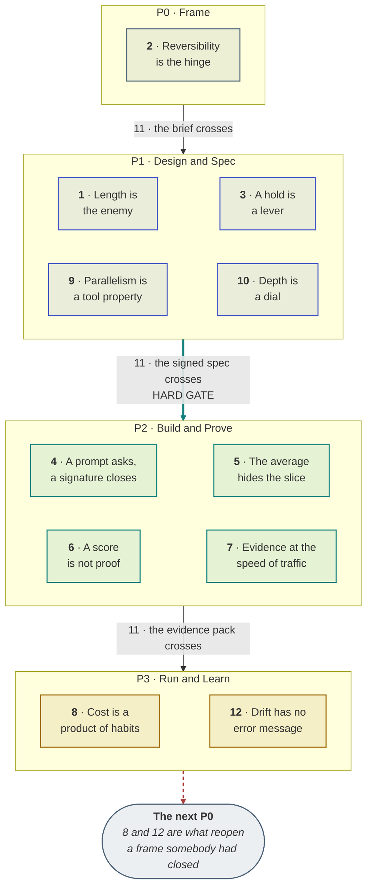

# Mental models

**Twelve shapes that make the rest of this playbook predictable.**

A procedure tells you what to do on Tuesday. A model tells you what to expect before you start, which is what lets somebody make a good call on a case this playbook never covered.

Each one below is the model, what it predicts, the mistake it prevents, the part that is easy to miss, and a test for whether it has landed. The [illustrated version](https://akash-coded.github.io/aws-bedrock-agentcore-strands/models/) draws each one; this copy is the reading text.

---

## The twelve

| # | Model | In one line |
| --- | --- | --- |
| 1 | [**Length is the enemy**](#length-is-the-enemy) | Chained probabilistic steps multiply. They do not average. |
| 2 | [**Reversibility is the hinge**](#reversibility-is-the-hinge) | What a mistake costs matters less than whether you can undo it. |
| 3 | [**A hold is a lever, not a brake**](#a-hold-is-a-lever-not-a-brake) | Putting a person in the loop lowers the damage, and therefore lowers the accuracy you need. |
| 4 | [**A prompt is a request; a signature is a boundary**](#a-prompt-is-a-request-a-signature-is-a-boundary) | A rule the model reads lowers a probability. A rule the code enforces closes a path. |
| 5 | [**The average hides the slice that matters**](#the-average-hides-the-slice-that-matters) | Aggregate quality is dominated by the easy, high-volume cases. |
| 6 | [**A score is not proof**](#a-score-is-not-proof) | A measurement from a sample is an estimate with a width, and the width is the argument. |
| 7 | [**Evidence arrives at the speed of traffic**](#evidence-arrives-at-the-speed-of-traffic) | You cannot learn faster than your sample accumulates. |
| 8 | [**Cost is a product of habits**](#cost-is-a-product-of-habits) | A bill is four ordinary behaviours multiplying, not one runaway. |
| 9 | [**Parallelism is a property of a tool, not a headcount**](#parallelism-is-a-property-of-a-tool-not-a-headcount) | Things happening at once does not mean several agents. |
| 10 | [**Depth is a dial, not a constant**](#depth-is-a-dial-not-a-constant) | Run only the lifecycle stages this particular change actually needs. |
| 11 | [**A phase ends on an artefact, not a date**](#a-phase-ends-on-an-artefact-not-a-date) | A hand-off happens when the next person has what they cannot start without. |
| 12 | [**Drift is the defect with no error message**](#drift-is-the-defect-with-no-error-message) | A probabilistic system changes behaviour when the world moves, with no deploy. |

---

## Where each one bites

The table above says what the models are. This says *when you will need them* — and the shape is the
point. Eight of the twelve land in P1 and P2, the two phases where a number still changes a decision
instead of explaining one that has already been taken.

**Model 11 is the rule of the arrows, which is why it is not in a band.** Every hand-off happens
because something crossed it, and each label above names the artefact rather than the date. Models 8
and 12 are why there is an arrow after P3 at all: a bill and a drift report are what re-open a
frame somebody thought was closed, and the frame they re-open is the next one, not the old one.

Only one model governs P0, and that is not an omission. P0 asks a single question the rest of the
lifecycle cannot revisit cheaply — how much may the machine do — and reversibility is the only thing
that answers it.

### The three that get resisted

Each of these contradicts something a competent person currently believes is good practice, which is
why they take a fortnight rather than an hour. Expect the argument; it is the model landing.

| The model | What a good engineer already believes | Why it takes a fortnight |
| --- | --- | --- |
| **3 · A hold is a lever** | A human check is friction, and removing it is progress | It asks you to *add* a step in order to ship sooner, which sounds like a contradiction right up until somebody does the arithmetic out loud |
| **5 · The average hides the slice** | A single quality number is how you report progress | It makes the number you already publish the wrong number, in public, in front of the people you published it to |
| **10 · Depth is a dial** | A process applied unevenly is a process nobody follows | It asks a senior person to judge per change rather than write a policy, and that judgement cannot be delegated to a template |

---

## Length is the enemy

> Chained probabilistic steps multiply. They do not average.

**What it predicts.** Four steps each right 90% of the time are right 66% of the time end to end, and they fail fluently — no exception, no red test, a confident wrong answer. Every step you add is a tax on every step before it.

**The mistake it prevents.** Judging a pipeline by its weakest step, or by the mean of its steps. Both readings are optimistic, and the second is the one that gets written in a status report.

**The part that is easy to miss.** It is the *optimistic* bound, because real steps correlate: a bad retrieval makes the next three worse. If your measured end-to-end rate is below p to the n, correlation is why, and the fix is upstream of the step you were blaming.

**Landed when** — You reach for a multiplication before you reach for an average, and your first instinct on a long chain is to remove a step rather than improve one.

Where you meet it: [The arithmetic](https://github.com/akash-coded/aws-bedrock-agentcore-strands/wiki/Formulas-and-Calculators) · [Where the checkers go](https://akash-coded.github.io/aws-bedrock-agentcore-strands/solution-architect/#detail)

---

## Reversibility is the hinge

> What a mistake costs matters less than whether you can undo it.

**What it predicts.** Two actions with the same expected loss need different controls if one can be withdrawn and the other cannot. A proposal can be retracted; a cash refund cannot. The second needs a person regardless of how accurate the model becomes.

**The mistake it prevents.** Setting autonomy from model capability, and setting it per product. Both produce a level that is simultaneously too loose for the money action and too strict for the harmless one.

**The part that is easy to miss.** Reversibility is a property of your business, not of the software. The same refund is a two-way door at a company that can claw back and a one-way door at one that cannot, and no amount of engineering changes which you are.

**Landed when** — Your first question about a new action is “can we undo it, and how fast”, before anyone has mentioned accuracy.

Where you meet it: [Autonomy, per action](https://akash-coded.github.io/aws-bedrock-agentcore-strands/product-manager/#frame) · [The risk ladder](https://akash-coded.github.io/aws-bedrock-agentcore-strands/frameworks/)

---

## A hold is a lever, not a brake

> Putting a person in the loop lowers the damage, and therefore lowers the accuracy you need.

**What it predicts.** A refund with $600 of damage needs 98% accuracy to break even. Put a person on the charge, drop the damage to $30, and the same step needs 71%. Nothing about the model changed; the arithmetic did.

**The mistake it prevents.** Treating a human check as friction to be removed, and treating an unreachable bar as a reason not to build. Both follow from reading the hold as a brake.

**The part that is easy to miss.** This is why a gate is a commercial instrument. It is the cheapest way to make a feature shippable, and the case for removing one is an argument about damage, never about speed.

**Landed when** — When somebody says the accuracy is not good enough, you ask what a mistake costs before you ask how to improve the model.

Where you meet it: [Derive the bar](https://github.com/akash-coded/aws-bedrock-agentcore-strands/wiki/How-to-Prove-the-Bar) · [Try the arithmetic](https://akash-coded.github.io/aws-bedrock-agentcore-strands/protocol/#)

---

## A prompt is a request; a signature is a boundary

> A rule the model reads lowers a probability. A rule the code enforces closes a path.

**What it predicts.** Every limit written in prose will eventually be crossed, because a model can be talked past a request and text arriving from anywhere can do the talking. A typed parameter that raises cannot be argued with.

**The mistake it prevents.** The most expensive sentence in agentic software: “we have a cap”, said about a cap that lives in a prompt. Nothing in a code review flags it, because it reads exactly like a rule.

**The part that is easy to miss.** Both belong. The prompt explains the rule so the agent behaves well by default; the signature makes bad behaviour impossible when the prompt has been talked past. “Put it in the tool, not the prompt” is half right and throws away the half that makes the agent cooperative.

**Landed when** — When told a control exists, you ask to be shown it, and you notice whether somebody opens prose or code.

Where you meet it: [The six controls](https://github.com/akash-coded/aws-bedrock-agentcore-strands/wiki/How-to-Hold-the-Security-Boundary) · [In code](https://akash-coded.github.io/aws-bedrock-agentcore-strands/engineering/#gate)

---

## The average hides the slice that matters

> Aggregate quality is dominated by the easy, high-volume cases.

**What it predicts.** An overall score can rise while the slice carrying all the risk falls below its bar. It happened at SkyWays: 79% to 84% overall, and codeshare down from 81% to 77% against a bar of 80.

**The mistake it prevents.** Shipping a regression that the headline number endorses, and setting one bar for a whole feature so the hard slice ships broken while the easy one waits.

**The part that is easy to miss.** The same trap runs through sampling. A sample representative of *traffic* is not representative of *risk*, so the rare costly slice needs deliberate oversampling rather than a bigger random draw.

**Landed when** — You ask “per slice?” before you read any quality number, and a single percentage in a deck makes you suspicious rather than reassured.

Where you meet it: [Per-slice readouts](https://akash-coded.github.io/aws-bedrock-agentcore-strands/qa/#measure) · [Rare slices](https://github.com/akash-coded/aws-bedrock-agentcore-strands/wiki/Scenario-Library)

---

## A score is not proof

> A measurement from a sample is an estimate with a width, and the width is the argument.

**What it predicts.** 82% on forty cases and 82% on five hundred are different claims. The first has a lower bound near 70%, the second near 79%. Against an 80% bar, neither is proven — and no realistic sample will prove it, because the estimate sits too close.

**The mistake it prevents.** Shipping on a point estimate, and rejecting a slice that is merely unproven. The second matters: “not proven” with a cases-owed number is a plan, where “it failed” is an argument.

**The part that is easy to miss.** The cost of proving grows *quadratically* as your score approaches the bar. Halve the gap and you quadruple the cases. A score a whisker above the bar is the most expensive result you can get.

**Landed when** — You never quote a score without its sample size, and you hear “94% accurate” as an incomplete sentence.

Where you meet it: [Lower bounds](https://github.com/akash-coded/aws-bedrock-agentcore-strands/wiki/How-to-Prove-the-Bar) · [The calculator](https://akash-coded.github.io/aws-bedrock-agentcore-strands/simulator/#/toolkit/confidence)

---

## Evidence arrives at the speed of traffic

> You cannot learn faster than your sample accumulates.

**What it predicts.** At 240 cases a day and five percent of traffic you see twelve cases a day, so five hundred cases takes forty-two days. That number is fixed by arithmetic, not by effort, and no amount of urgency moves it.

**The mistake it prevents.** Promising a cut-over date before anyone has divided cases-needed by cases-per-day, and sitting at five percent indefinitely because it feels safe.

**The part that is easy to miss.** The safe share is the slow one, which is the whole reason a cut-over *widens* rather than holding. And the sample is biased by time: at five percent for six weeks you meet a normal Tuesday many times and a storm day perhaps once, so widen across conditions rather than only across volume.

**Landed when** — When asked for a launch date you reach for a division, and you can say what the window buys as well as what it costs.

Where you meet it: [Cut over and widen](https://akash-coded.github.io/aws-bedrock-agentcore-strands/qa/#shadow) · [The arithmetic](https://github.com/akash-coded/aws-bedrock-agentcore-strands/wiki/Formulas-and-Calculators)

---

## Cost is a product of habits

> A bill is four ordinary behaviours multiplying, not one runaway.

**What it predicts.** Context bloat 1.6, no routing 1.5, a discarded cache 1.3, extra attempts 1.4 — and the invoice is 4.4 times its estimate on flat traffic. Each decision was sensible and made by a careful person.

**The mistake it prevents.** Hunting for the one thing that broke, and fixing the biggest *ratio change* first. Attempts rose more than five-fold in relative terms and contribute the smallest factor of the four.

**The part that is easy to miss.** Because they multiply, the right fix order is what removes the most multiplier per day of work — `(factor − 1) ÷ days` — which is usually not the fix that feels most urgent. The retry breaker is the right fix in the wrong position.

**Landed when** — A surprise invoice makes you open the per-call log rather than the price list, and you expect to find four things rather than one.

Where you meet it: [Decompose a bill](https://github.com/akash-coded/aws-bedrock-agentcore-strands/wiki/How-to-Control-the-Token-Bill) · [In the platform](https://akash-coded.github.io/aws-bedrock-agentcore-strands/devops/#observe)

---

## Parallelism is a property of a tool, not a headcount

> Things happening at once does not mean several agents.

**What it predicts.** Five agents have ten possible hand-offs, and coordination cost grows faster than the work. One agent with a fan-out tool searches four partners in parallel with zero hand-offs and nothing to get wrong between them.

**The mistake it prevents.** The reflex that turns “these run concurrently” into “these need separate agents”, which is how a swarm arrives without anyone choosing one.

**The part that is easy to miss.** The rule is start single and escalate on a *named limit* written into the record — a context that genuinely overloads, or parallel sub-tasks a tool cannot express. Without the written limit the swarm returns by default at the next design review, because nobody can point at what was decided.

**Landed when** — You ask what limit justifies each hand-off, and you notice that a calculator behind an agent is a provable step made probabilistic.

Where you meet it: [How many agents](https://akash-coded.github.io/aws-bedrock-agentcore-strands/solution-architect/#shape) · [On paper](https://github.com/akash-coded/aws-bedrock-agentcore-strands/wiki/How-to-Design-an-Agent-on-Paper)

---

## Depth is a dial, not a constant

> Run only the lifecycle stages this particular change actually needs.

**What it predicts.** One process for everything over-serves the one-line fix and under-serves the new subsystem. Both failures are expensive, and the first is the one that gives the method a reputation for slowing teams down.

**The mistake it prevents.** Eleven gates on a printer-helpdesk question — and the reputation that earns, which is then used to skip the gates on the refund tool, where they mattered.

**The part that is easy to miss.** The spec stays everywhere; it is the backbone. What flexes is everything around it: the persona trail, the depth of discovery, the number of records. And the judgement is per change, made by the architect, not per programme set by a policy.

**Landed when** — You classify a change before you choose a process for it, and you are comfortable saying that a piece of work deserves almost none of this.

Where you meet it: [Depth per change](https://akash-coded.github.io/aws-bedrock-agentcore-strands/solution-architect/#shape) · [The helpdesk case](https://github.com/akash-coded/aws-bedrock-agentcore-strands/wiki/Scenario-Library)

---

## A phase ends on an artefact, not a date

> A hand-off happens when the next person has what they cannot start without.

**What it predicts.** Phases that end on dates hand over nothing, and the receiving team rediscovers the missing decision three weeks later — usually the one nobody wanted to make.

**The mistake it prevents.** A spec signed off in a meeting with five of its eight fields undecided, which the engineer then decides by default because the code has to do something.

**The part that is easy to miss.** Only one of the four hand-offs is a hard gate. The other three can cross with a placeholder, a named owner and a date, which is what keeps velocity while the decision is still being measured. Treating all four as hard is its own failure.

**Landed when** — You ask what crossed rather than whether the phase finished, and an empty evidence line reads to you as a blocked merge.

Where you meet it: [What crosses each hand-off](https://github.com/akash-coded/aws-bedrock-agentcore-strands/wiki/The-Evidence-Pack) · [Hard and soft gates](https://github.com/akash-coded/aws-bedrock-agentcore-strands/wiki/Gates-and-Governance)

---

## Drift is the defect with no error message

> A probabilistic system changes behaviour when the world moves, with no deploy.

**What it predicts.** No code changed, nothing threw, no alert fired, and three months later a customer notices the assistant offers credits where it used to offer refunds. Your existing monitoring was never looking for this.

**The mistake it prevents.** Believing that “nothing changed” means nothing changed, and treating post-launch quality as a testing problem rather than an operational one.

**The part that is easy to miss.** Watch the *output mix*, not the accuracy — accuracy needs labels and arrives late. And watch two thresholds: the week-on-week step, and the level against a frozen baseline, because a slide of two points a week never trips a five percent rule and still moves you thirty points in a quarter.

**Landed when** — You treat an output distribution as a business metric, and you know what automatically re-opens your release gate.

Where you meet it: [Watch for drift](https://akash-coded.github.io/aws-bedrock-agentcore-strands/qa/#watch) · [As a KPI](https://akash-coded.github.io/aws-bedrock-agentcore-strands/product-manager/#learn)

---

## How to use these

1. **Teach one a week, not twelve at once.** A model lands when somebody uses it unprompted in an argument, which takes a fortnight of availability rather than an hour of exposure.
2. **Use the landed-when line as the test.** Not whether the team can define it — whether the question it implies has started appearing in reviews.
3. **Expect three to be resisted.** Usually the hold as a lever, the average hiding the slice, and depth as a dial, because each contradicts something a competent person currently believes is good practice.
4. **Pair each with its arithmetic once.** The intuition is what you carry; the formula is what settles the argument. See [Formulas and Calculators](Formulas-and-Calculators).
5. **Keep the subtlety visible.** A model applied past its boundary does more damage than no model, because it arrives with confidence.

---

**Next:** [Decision Trees](Decision-Trees) · [Formulas and Calculators](Formulas-and-Calculators) · [Anti-Patterns](Anti-Patterns) · [The Agentic PDLC](The-Agentic-PDLC)
