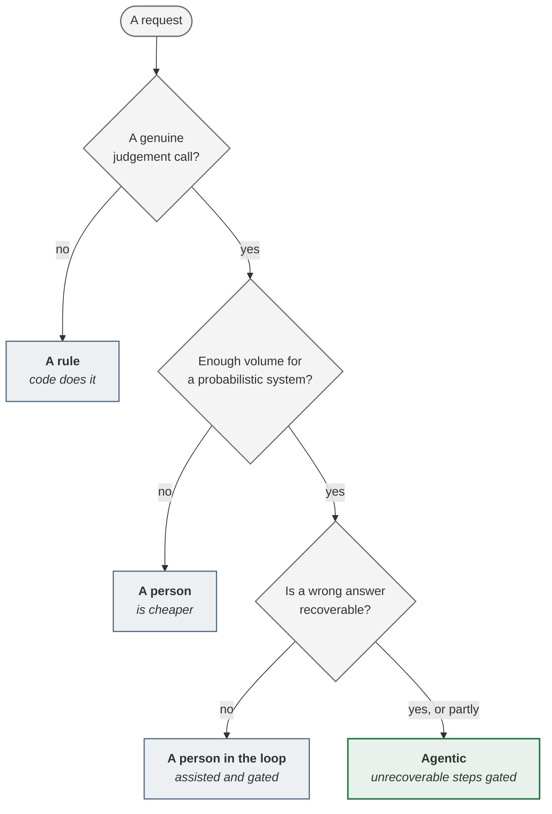

<!-- generated by site/learn_export.py from site/content/learn — edit the source, not this page -->
# P0 Frame: How to Decide If an AI Agent Is Worth Building

*Four decisions made on paper, before anything is built — each cheaper now than it will ever be again.*

**8 min read** · Beginner · Lesson 3 of 9 in [Agentic PDLC fundamentals](Tutorial-Fundamentals) · Updated 23 Sep 2026 · [Read it on the site, with live diagrams ↗](https://akash-coded.github.io/aws-bedrock-agentcore-strands/learn/p0-frame/)

> [!TIP]
> **P0 Frame in one sentence.** It is the phase that decides, before anything is designed, whether a
> job is worth doing, whether it needs a model at all, what it is worth net of running and checking
> it, and how much the machine may do on its own — and it ends when the pain is a measurement and
> that verdict, including what was rejected, is written down.



**In this lesson** you'll learn:

- how to turn a vague request into a pain register line a sceptic can check;
- the three-question test for whether a job needs a model at all;
- how to size the value honestly and set autonomy one action at a time.

## Sound familiar?

- The requirement arrived as "make it smarter" or "we need an AI assistant".
- The business case says "significantly faster", and nobody has a number.
- Three executives have spent two weeks arguing about how much "the assistant" should be allowed to do.

Each of those is a P0 decision that has not been made yet. They get made anyway — later, in code, by
whoever wires the first tool.

## What is P0 Frame?

P0 is the first phase of the [agentic PDLC](What-Is-the-Agentic-PDLC), and it happens before
anyone designs anything. It is numbered zero because it is the phase most teams skip, and the number
makes skipping it visible.

The **product manager** is accountable for it. The solution architect brings the evidence —
requirements from the people who will live with the system, and the constraints that rule designs
out — and DevOps sets up the account, the cost tags and the budget alarm, because some of what an
agentic system needs bills for existing, not for use.

P0 ends when **the pain is a measurement and the AI-fit verdict is recorded**.

## P0, step by step

### Step 1 · Turn the vibe into a measurement

Requests arrive as vibes. A vibe cannot be sized, prioritised or handed to a machine, so the first
job is to turn it into one line with four facts: who has the pain, how often, what it costs today,
and the evidence. At SkyWays — the fictional airline this playbook follows — "make rebooking smarter"
became, after two days:

> Disrupted passengers wait an average of **38 minutes** for a rebooking decision; **240 cases a
> day**; **11%** are codeshare, which no simple rule can handle; measured cost **$9.40 a case**.

That line survived to the steering committee on day 90, because every later artefact pointed back at
it. If nobody will name a number, write *unknown*, with an owner and a date — never a guess dressed
up as a finding.

### Step 2 · Decide whether it is AI at all

Three questions settle it, asked in order of cost, as in the diagram above. **Is it a genuine
judgement call** — would two competent people differ? If not, it is a rule, and a rule done by a
model is slower, dearer and less correct than code. **Is there enough volume** to be worth a
probabilistic system? If not, a person is cheaper. **Is a wrong answer recoverable?** If not, a
person stays in the loop.

Expect two or three of your top five requests to come back as rules. That is the healthy result. At
SkyWays the answers were *yes, 240 a day, and partly* — a proposed rebooking can be withdrawn, a cash
refund cannot — so the verdict was **agentic, with a gate on refunds**.

### Step 3 · Size the value, net of running and checking it

Value is arithmetic, not adjectives. The honest version subtracts what it costs to **run** — the
tokens — and what it costs to **check**, which is the term most business cases leave out:

| Term | SkyWays, cycle one | Arithmetic |
| --- | --- | --- |
| Gross saving | **$1,440 a day** | 240 cases × 8 minutes × $0.75 a minute |
| Run cost | −$144 a day | 240 × $0.60 |
| Review load | −$162 a day | 240 × 30% reviewed × 3 minutes × $0.75 |
| **Net** | **$1,134 a day** | |

A value line is finished when finance can change one assumption and watch the answer move. Re-run it
at your target volume before you promise it: the saving scales with volume, but the review load does
not fall on its own.

### Step 4 · Set autonomy one action at a time

"How much should the assistant do?" cannot be answered, because the assistant does several things
with very different consequences. Ask it **per action**, and let the answer follow what a mistake
costs and whether it can be undone — never what the model is capable of.

<p align="center"><a href="https://akash-coded.github.io/aws-bedrock-agentcore-strands/learn/p0-frame/"><picture><source media="(prefers-color-scheme: dark)" srcset="https://akash-coded.github.io/aws-bedrock-agentcore-strands/assets/learn/figure-authority-ladder.dark.webp"></picture></a></p>

<sub>▸ <a href="https://akash-coded.github.io/aws-bedrock-agentcore-strands/learn/p0-frame/">Open the live, interactive version</a></sub>

At SkyWays the two-week argument ended in twenty minutes once it was recast as four actions: showing
options acts alone, same-day rebooking acts and is monitored, cross-partner rebooking gets a veto
window, and every refund gets a named approver. Nobody had to lose, because nobody had been arguing
about the same thing.

### Step 5 · Write down what crosses into P1

P0 hands P1 a short brief: the pain register, the AI-fit record with the rejected alternatives, the
value line, the autonomy decision per action, and the architect's typed constraints. This hand-off is
**soft** — a missing number can cross as a placeholder with an owner and a date — but a missing
*decision* cannot, because P1 will make it by accident. [What crosses each hand-off](The-Evidence-Pack-Before-Each-Hand-off).

## Where you'll use it

- **Before any budget conversation**, so the number in the room is derived rather than hoped for.
- **Whenever leadership says "agent-first"**: the AI-fit record is how you serve that strategy
  honestly, with evidence for every no.
- **On small changes too.** A new action added to an existing agent needs its own autonomy decision,
  even when nothing else about P0 changes.

## Why it matters

When Gartner forecast that over 40% of agentic AI projects will be cancelled by 2027, *unclear
business value* was one of its three causes. P0 is where that cause is removed. It is also the
cheapest phase to get right: every decision here costs a document to change, and the same decision
made later costs a rewrite.

## Try it

A finance team asks for "an AI agent that checks whether each invoice total matches the sum of its
line items". About 3,000 invoices arrive a day. **What does the three-question test say?**

<details><summary>Show the answer</summary>

**It stops at the first question: it is a rule.** Summing line items and comparing the total is
arithmetic that two competent people would never disagree about, so it is not a judgement call.
Code does it perfectly, instantly and for almost nothing; a model would do it slower, at a cost, and
occasionally wrongly — fluently, with no error. The volume is irrelevant once question one says no.
A genuinely agentic task nearby might be *explaining* a mismatch to the supplier, which is judgement.

</details>

## Key takeaways

1. P0 turns a request into **a measured pain** — who, how often, what it costs, and the evidence.
2. **Three questions** decide whether a job needs a model at all: judgement, volume, recoverability.
3. Value is **net of running and checking**, and autonomy is set **per action** from what a mistake costs.

## FAQ

### How do you know whether a problem needs AI?

Ask three questions in order. Is it a genuine judgement call, where competent people would differ? Is
there enough volume to justify a probabilistic system? Is a wrong answer recoverable? A "no" to the
first means a rule in code; a "no" to the second means a person is cheaper; a "no" to the third means
a person stays in the loop.

### How do you calculate the ROI of an AI agent?

Start from the measured pain: cases times minutes saved times the cost of a minute, minus the running
cost per case, minus the review load — the share of cases a person checks, times the minutes each
check takes. Most business cases omit the last term, which is why the second cycle then looks like a
regression.

### What are AI autonomy levels?

A way of deciding how much an agent may do on its own, set per action rather than for the whole
system. This playbook uses five bands, from read-only (R1) through reversible and hard-to-reverse
actions to money (R4, a named approver) and irreversible changes (R5, never delegated). The band
belongs to the tool, not to the model.

### Who owns P0 Frame?

The product manager is accountable. The solution architect supplies requirements and constraints,
DevOps sets up the account and the cost baseline, and the sponsor needs to see the value line before
any budget is agreed.

## Apply it in your role

| If you are… | Do this | The AI-augmented shortcut |
| --- | --- | --- |
| **A forward-deployed engineer** | Measure the customer's pain in their own data — cases, minutes, money — before the first design session. An FDE who arrives with a measured pain line runs the room. | Give a model a redacted ticket export and ask for volume, handling time and the top five case types with counts, citing the rows. |
| **A product manager or FDPM** | Own the AI-fit verdict and publish what came back as rules. As an FDPM it is also your first call on what becomes product and what stays configuration. | Ask a model to argue that each candidate is a rule, and keep only the ones it cannot. |
| **A GenAI or agentic AI engineer** | Price the value line from a spike, not a guess: run twenty real cases through a prototype and log tokens and review minutes. | Have a coding agent wrap the prototype with a per-call token log and write the cost-per-case summary. |

**Across the enterprise.** Run P0 as the portfolio funnel. Every candidate gets an AI-fit record, most
come back as rules, and the rejected list is published so that teams stop re-proposing the same agents.

**The ten-minute workflow.** The fastest AI-fit test is to make a model argue against the agent:

```text
For each candidate below, argue as hard as you can that it does NOT need a model — that a rule, a
lookup or a person does it better. Apply three tests: is there a genuine judgement call, is the volume
high enough, is a wrong answer recoverable? Mark each "rule", "person", "assisted" or "agentic", and
say which test decided it. Candidates: <list>
```

## Sources and credits

| Idea | Origin | Source |
| --- | --- | --- |
| The pain register, the three-question AI-fit test and the value line | **Original** — this playbook | [Product manager, steps 1–3](https://akash-coded.github.io/aws-bedrock-agentcore-strands/product-manager/) · [Decision Trees](Decision-Trees) |
| Autonomy set per action, in five bands | **Original** — this playbook; compare the levels of automation in Parasuraman, Sheridan and Wickens (2000), *IEEE Transactions on Systems, Man, and Cybernetics* 30(3) | [Formulas](Formulas-and-Calculators#the-value-line--working-method) |
| Make hard-to-reverse decisions the gated ones | **Adapted** | Bezos, J. 2015 letter to Amazon shareholders — Type 1 and Type 2 decisions |
| Over 40% of agentic projects cancelled, one cause being unclear value | **Borrowed** | Gartner (2025). [Press release, 25 June](https://www.gartner.com/en/newsroom/press-releases/2025-06-25-gartner-predicts-over-40-percent-of-agentic-ai-projects-will-be-canceled-by-end-of-2027) |
| The SkyWays figures | **Illustrative** — a fictional airline | [Try the value calculator](https://akash-coded.github.io/aws-bedrock-agentcore-strands/simulator/#/toolkit/value) |

---

| | |
| :--- | ---: |
| [← Why agentic AI projects fail](Why-Agentic-AI-Projects-Fail) | [P1 · Design & Spec →](P1-Design-and-Spec-Write-a-Spec-an-Agent-Can-Build) |

**[All lessons](Start-Here)** · **[Agentic PDLC fundamentals](Tutorial-Fundamentals)** · [This lesson on the site](https://akash-coded.github.io/aws-bedrock-agentcore-strands/learn/p0-frame/)

<sub>✏️ This page is generated from [`site/content/learn/lessons/p0-frame.md`](https://github.com/akash-coded/aws-bedrock-agentcore-strands/blob/main/site/content/learn/lessons/p0-frame.md). To change it, [edit the lesson](https://github.com/akash-coded/aws-bedrock-agentcore-strands/edit/main/site/content/learn/lessons/p0-frame.md) — an edit made here is replaced at the next sync.</sub>
