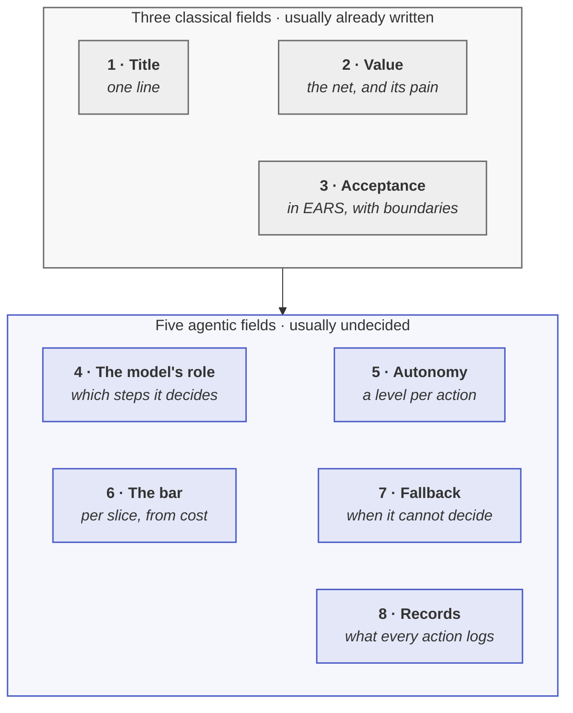

<!-- generated by site/learn_export.py from site/content/learn — edit the source, not this page -->
# P1 Design & Spec: Write a Spec an AI Agent Can Build From

*One screen, eight fields, and the five decisions nobody had made yet. Plus the limits that have to live in code, not in the prompt.*

**8 min read** · Intermediate · Lesson 4 of 9 in [Agentic PDLC fundamentals](Tutorial-Fundamentals) · Updated 23 Sep 2026 · [Read it on the site, with live diagrams ↗](https://akash-coded.github.io/aws-bedrock-agentcore-strands/learn/p1-design-and-spec/)

> [!TIP]
> **P1 in one sentence.** P1 Design & Spec writes down what will be built so precisely that a coding
> agent — or an engineer who was not in the room — can build it without asking a question: an
> eight-field spec with acceptance criteria in EARS, an acceptance bar for each slice derived from
> what a mistake costs, and an authority budget that puts every limit in code. It ends when all three
> are signed.



**In this lesson** you'll learn:

- how to map every step as exact, best-guess or consequential before designing anything;
- the eight fields of an agentic spec, and how to write acceptance criteria a tool can check;
- how to derive a bar for each slice and put every limit where a model cannot argue with it.

## Sound familiar?

- The PRD is thirty pages long, everyone has read a different part, and the coding agent built the wrong thing confidently.
- Every acceptance bar in the document is 80%, and nobody can say where the number came from.
- "The refund limit is $400" appears in the design document, the prompt and the slide deck — and nowhere in the code.

P1 fixes all three before a line of production code exists, which is the last moment they are cheap.

## What is P1 Design & Spec?

P1 is the second phase of the [agentic PDLC](What-Is-the-Agentic-PDLC). It takes the framed
problem from [P0](P0-Frame-Is-an-AI-Agent-Worth-Building) and turns it into something that can be built and checked. The
**solution architect** is accountable; the product manager owns the spec's content, QA derives the
bars and starts the golden set, and DevOps requests model access, which is granted per model and per
region and sits in somebody else's queue.

P1 ends at the only hard gate in the lifecycle: **the spec, the bar and the guardrails are signed**.

## P1, step by step

### Step 1 · Map every step: exact, best-guess or consequential

Before any design, list the steps the feature performs and tag each one. **Exact** steps — lookups,
arithmetic, published rules — are code, proven by unit tests. **Best-guess** steps — ranking,
drafting, classifying — are the model's, proven by a measured share. **Consequential** steps change
something real and need a gate whatever the model's quality becomes.

At SkyWays, seven steps came out as three kinds: reading the booking, checking eligibility and
computing the fare difference were exact; ranking alternatives and drafting the message were
best-guess; rebooking and refunding were consequential. The map takes an hour, and it is the reason
the fare difference never went back into a prompt.

### Step 2 · Write the eight-field spec

The spec is the one place a machine can look, so it must be exact and small — one screen. Three
fields transfer from any good PRD: **title, value and acceptance criteria**. Five are new: **the
model's role, autonomy per action, the bar per slice, the fallback, and the records** every
consequential action writes. At SkyWays all five were undecided when the spec was started, and
settling them with their owners took under an hour each.

Write acceptance in **EARS** — the Easy Approach to Requirements Syntax — so a spec-driven tool and a
tester read it the same way:

```text
WHEN a disrupted passenger requests rebooking AND a same-day seat exists
THE SYSTEM SHALL present ranked alternatives
WITHIN 30 seconds at P95.

BOUNDARY  The system shall NEVER issue a refund above $400 without a named approver.
```

The fallback field matters most: without it, the engineer chooses one by default, because the code
has to do something.

### Step 3 · Bound what the agent may do

Set the **authority budget before the token budget**. The first question is not what the agent may
spend but what it may change, touch or commit — a cheap task with too much authority is far more
dangerous than an expensive one with none. Band every tool, from read-only to irreversible, and put
every cap in the tool's signature as a typed parameter that raises, with two tests beside it: one
over the cap, one without confirmation.

The test that the budget is real is a search: grep every prompt for a cap, a currency amount or "ask
before". Each hit is a rule a model can be talked past. At SkyWays the $400 refund cap was decided on
day 12 and lived only in a prompt until day 82, when a $2,000 refund went out that was not owed.
[Why a prompt is not a control](Mental-Models#a-prompt-is-a-request-a-signature-is-a-boundary).

### Step 4 · Derive the bar for each slice

"How accurate does it need to be?" has an answer, and it comes from money. For each slice, divide the
damage a wrong answer does by the saving a right one brings, and call it *N*. The break-even bar is
**N ÷ (N + 1)**.

<p align="center"><a href="https://akash-coded.github.io/aws-bedrock-agentcore-strands/learn/p1-design-and-spec/"><picture><source media="(prefers-color-scheme: dark)" srcset="https://akash-coded.github.io/aws-bedrock-agentcore-strands/assets/learn/figure-bar-sheet.dark.webp"></picture></a></p>

<sub>▸ <a href="https://akash-coded.github.io/aws-bedrock-agentcore-strands/learn/p1-design-and-spec/">Open the live, interactive version</a></sub>

The same arithmetic shows why a person in the loop is a lever, not a brake: a hold that cuts a
refund's damage from $600 to $30 drops its bar from 98% to 71%. Nothing about the model changed.
QA starts the golden set now — fifty real cases to start, five hundred to trust, each tagged by slice.

### Step 5 · Decide how many agents, and record only the decisions that earn it

**Start with one agent and add another only on a named limit** — a context that genuinely overflows,
or parallel work a tool cannot express. Every agent adds hand-offs: *n* agents have n(n − 1) ÷ 2
possible pairings, so fifteen agents have 105. At SkyWays fifteen collapsed in an afternoon to one
agent, one fan-out tool, one function and one checker — zero hand-offs against 105. The pricer was
exact and became a function; the searcher was parallelism and became a fan-out tool; only the
reviewer stayed separate, because independence is the whole mechanism of a checker.

Then write an architecture decision record only where a decision is genuinely sensitive — where
changing it would change a quality target — and have each record name what it rejected.

## Where you'll use it

- **Every time a coding agent will build from a document.** If the agent needs a chat thread to
  finish, the spec was incomplete — that is a finding, not an inconvenience.
- **With a spec-driven tool.** Kiro's requirements, design and tasks files, or Spec Kit's specify,
  plan and tasks steps, are where these fields go; the tool does not decide them for you.
- **On small changes**, at small depth: one changed field and one changed test can be a whole P1.

## Why it matters

P1 is where the expensive failures are prevented cheaply. The fare arithmetic that returns $80 instead
of $62, the refund cap that lives in a prompt, the bar that is 80% because 80% sounds right — each is
a sentence to change in P1 and an incident to explain in P3.

## Try it

A support team's spec says: *"The agent should be accurate and must not offer compensation over $50."*
**Name two things wrong with it, in P1's terms.**

<details><summary>Show the answer</summary>

**"Accurate" is not a bar, and "must not" is not a boundary.** The bar should be a number per slice,
derived from what a wrong answer costs against what a right one saves — refunds and simple questions
will not share one. And a limit written as a sentence is a request to the model; the $50 cap belongs
in the compensation tool's signature as a typed parameter that raises, with a test that proves it.
A third fix worth making: write the acceptance criteria in EARS, with the limit as a BOUNDARY line.

</details>

## Key takeaways

1. **Map every step first** — exact work goes in code, best-guess work is measured, consequential work is gated.
2. The spec is **eight fields on one screen**; the five agentic ones are the decisions nobody had made.
3. **Bars come from money** — N ÷ (N + 1) per slice — and **limits live in signatures**, never in prompts.

## FAQ

### How do you write requirements for an AI agent?

Write a short spec with eight fields: title, value, acceptance criteria, the model's role, autonomy
per action, the acceptance bar per slice, the fallback, and what every consequential action records.
Express acceptance in EARS — *when, the system shall, within* — and state each limit as a boundary
line that also exists as a test.

### What is EARS in requirements engineering?

EARS, the Easy Approach to Requirements Syntax, is a set of sentence templates for requirements
developed at Rolls-Royce and published in 2009. Its *WHEN… THE SYSTEM SHALL…* shape removes the
ambiguity of free prose, which is exactly what a coding agent and a tester both need.

### How accurate should an AI agent be?

As accurate as the money says, per slice. Divide the damage of a wrong answer by the saving of a
right one to get N; the break-even bar is N ÷ (N + 1). A slice where a mistake costs four times the
saving needs 80%; one where it costs fifty times needs 98% — unless a person holds the action and
cuts the damage.

### Should I use one agent or several?

Start with one and add another only when you can name the limit that forces it: a context that
overflows or parallel work a tool cannot express. Each added agent multiplies the hand-offs that can
go wrong, and a fan-out tool usually gives you the parallelism without them.

## Apply it in your role

| If you are… | Do this | The AI-augmented shortcut |
| --- | --- | --- |
| **A forward-deployed engineer** | Write the eight-field spec with the customer's engineers in the room, so the five agentic fields are decided by the people who will own them. | Before the session, have a model turn the brief into the eight fields as questions and mark which are undecided. |
| **A product manager or FDPM** | Derive the bar per slice and sign autonomy per action. A spec without them is still a PRD. | Paste the PRD and ask a model to convert it to the eight fields and EARS lines, listing every gap as a question. |
| **A GenAI or agentic AI engineer** | Build the authority budget into tool signatures before the first prompt: typed, bounded parameters and a confirmation token for money. | Ask a coding agent to generate tool stubs from the authority budget, each with a test that it refuses over its cap. |

**Across the enterprise.** Standardise the eight-field template and the bar sheet. It is the only way a
governance board can compare specs across teams, and the only way a coding agent can read any team's work.

**The ten-minute workflow.** Convert prose requirements into acceptance criteria a machine can build from:

```text
Convert these requirements into EARS acceptance criteria — ubiquitous ("The system shall…"),
event-driven ("When…"), state-driven ("While…"), unwanted behaviour ("If… then…") and optional
feature ("Where…"). Every line must carry a measure. List each requirement you could not convert
without inventing a number, as a question for me. Requirements: <paste>
```

## Sources and credits

| Idea | Origin | Source |
| --- | --- | --- |
| The eight-field spec, the step map and the authority budget | **Original** — this playbook | [Solution architect](https://akash-coded.github.io/aws-bedrock-agentcore-strands/solution-architect/) · [Product manager, step 4](https://akash-coded.github.io/aws-bedrock-agentcore-strands/product-manager/) |
| The break-even bar N ÷ (N + 1) | **Original** — this playbook | [Formulas](Formulas-and-Calculators#the-acceptance-bar--working-method) |
| EARS acceptance syntax | **Borrowed** | Mavin, A., Wilkinson, P., Harwood, A. & Novak, M. (2009). Easy Approach to Requirements Syntax. *IEEE International Requirements Engineering Conference* |
| Least privilege | **Borrowed** | Saltzer, J. H. & Schroeder, M. D. (1975). The protection of information in computer systems. *Proceedings of the IEEE* 63(9) |
| Architecture decision records | **Borrowed** | Nygard, M. (2011). Documenting architecture decisions |
| Sensitivity points | **Borrowed** | Kazman, R., Klein, M. & Clements, P. (2000). *ATAM: Method for Architecture Evaluation*. SEI |
| Start simple, add agents only when needed | **Borrowed** | Schluntz, E. & Zhang, B. (2024). [Building effective agents](https://www.anthropic.com/engineering/building-effective-agents). Anthropic |
| The SkyWays figures | **Illustrative** — a fictional airline | [The simulator](https://akash-coded.github.io/aws-bedrock-agentcore-strands/simulator/#/) |

---

| | |
| :--- | ---: |
| [← P0 · Frame](P0-Frame-Is-an-AI-Agent-Worth-Building) | [The one hard gate →](The-Hard-Gate-in-Agentic-Delivery) |

**[All lessons](Start-Here)** · **[Agentic PDLC fundamentals](Tutorial-Fundamentals)** · [This lesson on the site](https://akash-coded.github.io/aws-bedrock-agentcore-strands/learn/p1-design-and-spec/)

<sub>✏️ This page is generated from [`site/content/learn/lessons/p1-design-and-spec.md`](https://github.com/akash-coded/aws-bedrock-agentcore-strands/blob/main/site/content/learn/lessons/p1-design-and-spec.md). To change it, [edit the lesson](https://github.com/akash-coded/aws-bedrock-agentcore-strands/edit/main/site/content/learn/lessons/p1-design-and-spec.md) — an edit made here is replaced at the next sync.</sub>
