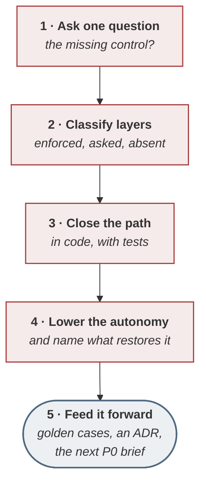

<!-- generated by site/learn_export.py from site/content/learn — edit the source, not this page -->
# Postmortems for AI Incidents: Find the Missing Control

*Five layers of defence were claimed. None was enforced. The hour that followed produced a typed cap, a confirmation token, a lower autonomy level and six new test cases.*

**5 min read** · Intermediate · Lesson 13 of 13 in [Running delivery](Tutorial-Running-Delivery) · Updated 23 Sep 2026 · [Read it on the site, with live diagrams ↗](https://akash-coded.github.io/aws-bedrock-agentcore-strands/learn/ai-incident-postmortem/)

> [!TIP]
> **The method in one sentence.** A postmortem for an AI incident starts from one question — **which
> enforced control, if it had been present, would have made this impossible?** — classifies every
> claimed layer of defence as enforced, a request or absent, fixes the one that closes the path in
> code with a test, lowers the action's autonomy until evidence restores it, and leaves as a brief for
> the next P0.

**In this lesson** you'll learn:

- the one question that turns a postmortem from a search for a person into a search for a control;
- how to classify every layer of defence honestly, with evidence;
- the four artefacts that must leave the room for the incident loop to close.

## Sound familiar?

- The action list says "remind staff of the refund policy" and "update the prompt".
- The postmortem ended with a name, and the same incident recurred a month later with a different one.
- Every layer of defence in the design document was "in place", and the incident happened anyway.

A postmortem that ends in a name, a reminder or a prompt edit has changed nothing that a model — or a
person under pressure — cannot get past again.

## Why ask for the missing control?

Because people and models both fail, and a system that depends on neither failing will fail. The
question *who was careless?* produces a name; the question *which enforced control would have made this
impossible?* produces a system change. That is the principle of blameless postmortems, and for agentic
systems it has a sharper edge: most controls that "failed" were never enforced at all — they were
sentences in a prompt.

## Run the postmortem, step by step

### Step 1 · Ask the one question, first

Write it on the wall before anything else: *which enforced control, if it had been present, would have
made this impossible?* Keep bringing the room back to it. The hour has worked if it produces a system,
not a name.

### Step 2 · Classify every layer

List every layer of defence the design claimed and mark each one — with evidence:

| Layer | Claimed | Reality | Would it have stopped the money? |
| --- | --- | --- | --- |
| Input marked as data | yes | **absent** | No |
| The prompt's policy | yes | **a request** | No |
| A $400 cap | yes | **absent from the code** | **Yes** |
| A named approver | yes | **absent from the code** | **Yes** |
| An alert on the trace | yes | **absent** | No — it reports afterwards |

That was SkyWays on day 82, when a **$2,000** refund went out that was not owed: five layers claimed,
none enforced, the cap and the approver written only in the prompt. The last column is the one that
matters — with either of the two enforced in the tool's signature, the refund is impossible; injection
defence and traces change the odds and the visibility, not the outcome. Every "enforced" must have a
file, a line that raises, and a test beside it.

### Step 3 · Choose the fix that closes the path

Pick the control that makes the incident impossible rather than less likely — a cap as a typed
parameter that raises, a confirmation token only a person's approval can create — and write the test
that reproduces the incident. The test of the fix: the incident is now a test that was red an hour ago.

### Step 4 · Lower the autonomy level, and say what restores it

Drop the action one autonomy level — refunds from acting alone to needing an approver — and write the
evidence that would restore it. At SkyWays refunds stayed one level down until a fourteen-day shadow
run re-earned the level.

### Step 5 · Feed it forward

Four artefacts must leave the room: **new golden cases** built from the incident — SkyWays added six —
an **amended decision record**, the **postmortem record** itself, and a **brief for the next P0** with
a pain, the evidence, the missing control, the fix and its value. Without the brief, the incident loop
has not closed. [The eight loops](The-8-Feedback-Loops-of-Agentic-Delivery#step-4--close-the-incident-loop-into-framing)

## Where you'll use it

- **After every incident**, including near-misses caught by a person.
- **After every drift alert** that reveals a behaviour the design did not intend.
- **In a quarterly review**, re-reading the layer tables to check that each "enforced" is still enforced.

## Why it matters

A postmortem that ends in a name leaves every other path open, and the incident recurs with a different
name. One that ends in an enforced control closes the path for everyone, permanently — and the brief
means the next framing starts from what the incident taught.

## Try it

A draft postmortem action list reads: (1) retrain the operations team; (2) add "double-check refunds"
to the system prompt; (3) add a test that `issue_refund` raises above $400; (4) review refund logs
weekly. **Which action closes the path?**

Show the answer

**Only (3)** — and only once the cap is actually in the refund tool's signature, so the test passes
because the tool refuses. (1) and (2) are requests: training and a prompt line both lower a
probability. (4) finds the next breach after the money has left. Add a confirmation token for refunds
above the cap, lower the refund autonomy level until a shadow run re-earns it, and turn the incident
into golden cases and a P0 brief.

## Key takeaways

1. **One question**: which enforced control would have made this impossible — never who was careless.
2. **Classify every layer** as enforced, a request or absent, with a file and a line for every "enforced".
3. **Four artefacts leave the room**: golden cases, a decision record, the record, and a brief for the next P0.

## FAQ

### How do you run a postmortem for an AI incident?

Ask which enforced control would have prevented it, classify every claimed layer of defence as
enforced, a request or absent, fix the gap with a control in code and a test that reproduces the
incident, lower the affected action's autonomy until evidence restores it, and turn the incident into
new test cases and a brief for the next cycle.

### What is a blameless postmortem?

A review of an incident that looks for the conditions and missing controls that allowed it rather than
for a person to blame, on the principle that people and systems both fail and only system changes
prevent recurrence. The practice is described in Google's *Site Reliability Engineering*.

### Why isn't updating the prompt a fix?

Because a prompt is a request: it lowers the probability of the behaviour but cannot prevent it, and
anything the model reads can argue against it. A fix closes the path — a limit in the tool's signature,
or an approval the model cannot produce for itself.

### Should an AI agent lose autonomy after an incident?

For the affected action, yes — one level down, with the evidence that would restore it written in the
record, such as a clean shadow run over a fixed window. That keeps the system useful while the fix earns
trust, and makes restoring the level a decision with evidence rather than a date.

## Sources and credits

| Idea | Origin | Source |
| --- | --- | --- |
| Blameless postmortems | **Borrowed** | Beyer, B., Jones, C., Petoff, J. & Murphy, N. R. (2016). *Site Reliability Engineering*. O'Reilly |
| Layered defences that fail when the holes line up | **Borrowed** | Reason, J. (2000). Human error: models and management. *BMJ* 320 |
| The missing-control question, the layer table and the four artefacts | **Original** — this playbook | [How to run a missing-control postmortem](How-to-Run-a-Missing-Control-Postmortem) |
| The SkyWays incident | **Illustrative** — a fictional airline | [The simulator](https://akash-coded.github.io/aws-bedrock-agentcore-strands/simulator/#/) |

---

| | |
| :--- | ---: |
| [← Catch AI drift](AI-Drift-How-to-Catch-the-Defect-With-No-Error-Message) | [For product managers →](Agentic-PDLC-for-Product-Managers) |

**[All lessons](Start-Here)** · **[Running delivery](Tutorial-Running-Delivery)** · [This lesson on the site](https://akash-coded.github.io/aws-bedrock-agentcore-strands/learn/ai-incident-postmortem/)
