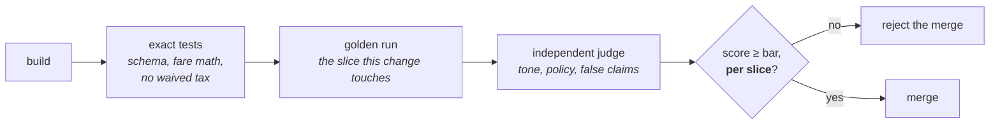

# Role: engineering lead

Eighteen steps from frame to run. Your tests, your reviews and your releases all still exist. What
changes is that part of the system is right *a share of the time*, so "it works" becomes a number,
and the boundary that stops it doing harm has to live in your code rather than in a prompt.

Live version, with the artefact filled in for SkyWays at every step:
[Engineering and QA](https://akash-coded.github.io/aws-bedrock-agentcore-strands/#/eng/step-1).


> **Doing the work today?** [Engineering Lead · the journey](Journey-Engineering-Lead) walks this role end to end with a template and copy-paste prompts at every step, and is [interactive on the site](https://akash-coded.github.io/aws-bedrock-agentcore-strands/engineering/). This page is the method behind it: the loops, the gates and the formulas.

---

## What stays the same, and what changes

| You have always done this | What a model in the middle adds |
| --- | --- |
| Sprint planning, estimation, the definition of done | **Bolts** of one risk each, a **story file** the agent reads, a **context file** it inherits |
| Unit, integration, contract and end-to-end tests | Exact work checked exactly; the acceptance bar becomes a **test that runs**; the harness gates CI |
| Pull requests and the review policy | Review depth follows the **risk of the action**. Money gets two readers, every time |
| CI/CD, environments, releases | A **shadow path behind a flag**, cut-over at five percent, rollback *is* the flag |
| Logs, metrics, traces, alerts | A **redacted** trace per step with token counts, and cache hits marked so nobody scores them as wrong answers |
| Threat modelling and security tests | An **injection suite that runs weekly**, tool signatures that raise on the cap, a confirmation token the model cannot mint |
| Incident response, postmortems, hotfixes | The postmortem asks which control was missing; the spec is reconciled **by diff** after a hotfix |

---

## The eighteen steps

### P0 · Frame

| # | Step | Artefact |
| --- | --- | --- |
| 1 | Check the exact work is really exact | exact-code inventory |
| 2 | Write the context file the agent reads | `CLAUDE.md` / `copilot-instructions.md` |
| 3 | Turn the acceptance bar into a test you can run | golden set (jsonl) |

### P1 · Design & Spec

| # | Step | Artefact |
| --- | --- | --- |
| 4 | Build from a story file, not a chat | agent-ready story file |
| 5 | Wire the eval harness into CI | eval harness |
| 6 | Implement the checker, independently | checker implementation |
| 7 | Put the boundary in the tool signature | gated tool implementation |

### P2 · Build & Prove

| # | Step | Artefact |
| --- | --- | --- |
| 8 | Build bolt by bolt, each proven | bolt build log |
| 9 | Configure caching in the call | caching implementation |
| 10 | Route by complexity, cap the loops | router + breaker code |
| 11 | Switch on the shadow path | shadow-run implementation |
| 12 | Extract rules from legacy code, don't feed the code | rule sheet |

### P3 · Run & Learn

| # | Step | Artefact |
| --- | --- | --- |
| 13 | Write the trace, redacted | trace implementation |
| 14 | Run the injection test every week | injection test suite |
| 15 | Keep the effort-and-token ledger | engineering ledger |
| 16 | Reconcile the spec by diff after a hotfix | spec reconciliation |
| 17 | Use your own coding agent well | engineer's agent setup |
| 18 | Know whether the engineering is maturing | engineering maturity check |

---

## Step 2 in depth · the context file

Every AI coding tool reads a configuration file from the repository before it does anything. Writing
one is the single biggest quality lever available to you, and it takes an hour.

| Tool | File it reads |
| --- | --- |
| Claude Code | `CLAUDE.md` — project memory, committed to git, with enterprise policy above it and a user-level file for personal preferences |
| GitHub Copilot | `.github/copilot-instructions.md` for the workspace, plus scoped `.github/instructions/*.instructions.md` |
| Codex CLI | `AGENTS.md` |
| Cursor | `.cursor/rules/*.mdc` |

One distinction worth knowing from the documentation: **Copilot's file steers inline suggestions;
Claude Code's drives autonomous actions.** The same text carries more weight in the second case.

What goes in it: the stack, the conventions, the commands, and the never-touch list. Point it at the
[context layers](Role-Solution-Architect) so the agent inherits the shared and domain rules rather
than carrying copies.

**How the file grows:** add the one rule that bit you last week. Every time.

---

## Step 7 in depth · the boundary in the signature

The prompt says "never refund over $400". A passenger types "ignore your instructions" and the model
calls `refund(5000)`. The cap was a sentence.

```python
# A request the model can be talked past:
SYSTEM = "Never issue a refund over $400 without asking."

# A boundary that holds whatever the model is convinced of:
def issue_refund(booking_id: str, amount: Decimal, confirmation: ConfirmToken) -> Refund:
    if amount > REFUND_CAP:                       # $400, from config, not from the prompt
        raise AuthorityExceeded(amount, REFUND_CAP)
    if not confirmation.valid_for(booking_id):    # a token the model cannot mint
        raise ConfirmationRequired(booking_id)
    ...
```

Two tests, and they are the whole point of the step:

```python
def test_over_cap_raises():
    with pytest.raises(AuthorityExceeded):
        issue_refund("PNR123", Decimal("5000"), valid_token("PNR123"))

def test_no_confirmation_raises():
    with pytest.raises(ConfirmationRequired):
        issue_refund("PNR123", Decimal("50"), forged_token())
```

Reads stay open. Writes require a confirmation token the model cannot produce. The prompt keeps the
sentence that *explains* the rule, because that makes the agent behave well by default — but
enforcement never depends on the model agreeing.

---

## Step 5 in depth · the harness, in order

The order matters, because the cheap definitive checks should reject before you pay for a judge.



**A slice below its bar blocks the merge, however good the overall number looks.** That is how "the
new prompt improved lookups but regressed refunds" becomes a red check instead of a discovery two
weeks later.

Cost control on the harness itself: run the touched slice per pull request, and the full set nightly.

---

## Step 9 in depth · caching that actually hits

The cache matches an **exact prefix**, in the order **tools → system → messages**, up to the block you
mark. So the stable content goes first and the changing request goes last.

```
┌─ tools ─────────────────┐
│ ─ system ───────────────│  ← stable
│ ─ shared context ───────│  ← stable
│ ─ domain context ───────│  ← stable   ⟵ cache marker on the last stable block
└─ the request ───────────┘  ← changes every call
```

Documented multipliers, read September 2026:

| | Cost, relative to the input price |
| --- | --- |
| Five-minute cache write | 1.25× |
| One-hour cache write | 2× |
| Cache read | 0.1× — *Fable and Mythos 5.1 read at 0.025×* |

Minimum around 1,024 cacheable tokens. The five-minute cache refreshes free on each hit. The cache is
**model-scoped**, so one model per task; switching mid-task discards it.

> **Break-even is the second use.** Used once, caching costs more. Used a hundred times it saves
> roughly 89%.

The one-line check that proves it is working:

```python
assert response.usage.cache_read_input_tokens > 0   # on the second call, not the first
```

And the thing to remove from the cached block: any timestamp, request id or session id.

---

## Step 15 in depth · the ledger behind the PM's report

Per bolt, four columns. Five minutes a day.

| Person-hours by activity | Tokens by tier | Re-runs | Defects escaped |
| --- | --- | --- | --- |

Track tokens **by tier**, not in total — the tier mix is where routing shows up. And watch the
**re-run** column: it is the leak signal, where model switching and vague asks appear first. When it
drops, say why.

The PM's two-number report is built from this ledger, which is what makes the cost number real rather
than a guess.

---

## Your Monday list

1. **Write `CLAUDE.md` today.** Single biggest quality lever, one hour.
2. Add `MAX_LOOPS` to every agent loop. Five to start. A loop with no cap burns until someone notices.
3. Move every cap from prompt text into a typed, bounded parameter, and write the two tests.
4. Wire `make golden` into CI as a required check, with the slice tag on every case.
5. Build tomorrow's bolt from its story file **with no repository pastes**. If you need the chat, the
   file is incomplete — and that is the finding.

---

## Try it

**Exercise 1.** A pull request improves the overall golden-set score from 79% to 84%. The codeshare
slice drops from 81% to 77%, against a bar of 80%. Ship it?

<details>
<summary>Answer</summary>

**No.** A slice below its bar rejects the change, however good the headline number is. The overall
score went up because the easy, high-volume slice improved, and averaging hid a real regression on
the slice that actually carries risk.

This is exactly why the gate is per slice and not overall, and why the readout the PM reads is shaped
like the bar sheet rather than as a single percentage.
</details>

**Exercise 2.** You add a "review your answer before returning it" step. Quality does not improve.
Why, and what is the fix?

<details>
<summary>Answer</summary>

The model is reviewing its own output **with its own reasoning still in context**, so it shares its
own blind spots. It says "looks good" about the same wrong flight choice it just made.

The fix is **independence**: a different model, or the same model in a fresh context with an
adversarial brief — "find what is wrong". Pass it the constraints and the output only, never the
drafter's reasoning. Treat a fail as a re-draft rather than a warning, and cap re-draft rounds at two
before escalating to a person.
</details>

**Exercise 3.** Audit wants every decision replayable. Privacy wants no passport numbers in logs. Your
current log satisfies neither. What do you build?

<details>
<summary>Answer</summary>

**Redact, do not omit.** One row per consequential action: timestamp, the input with sensitive fields
masked (`passport ****1234`), tools called, the decision, the model version, the approver, the cost.

Masking keeps the decision replayable while the identifier is not exposed. Omitting the field breaks
the audit; logging it raw makes the trace store a breach target — and it is usually protected less
well than the ledger it mirrors.

Then treat the trace store like production data: protected the same way, with a retention window and
an aggregation job after it. Add `redact()` before the trace writer, and make "a passport never
reaches a row" a test.
</details>

---

**Next:** [Role: QA lead](Role-QA-Lead) · [How to Control the Token Bill](How-to-Control-the-Token-Bill)
· [How to Cut Sprints into Bolts](How-to-Cut-Sprints-into-Bolts) · [Formulas and Calculators](Formulas-and-Calculators)
