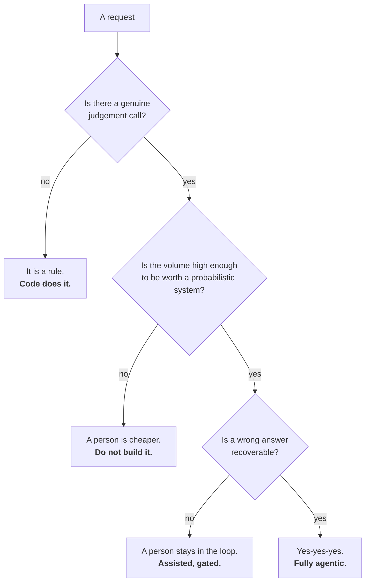

# Role: product manager

Eighteen steps from frame to run. Your job does not change — **what and why** is still yours. What
changes is that the thing you write is now read by a machine that cannot ask you what you meant.

Live version, with the artefact filled in for SkyWays at every step:
[Product manager](https://akash-coded.github.io/aws-bedrock-agentcore-strands/#/pm/step-1).

---

## What stays the same, and what changes

| You have always done this | What a model in the middle adds |
| --- | --- |
| Discovery, stakeholder interviews, the numbers behind the ask | The pain is written as a **measurement**, and an AI-fit verdict is added. Most of a backlog is deterministic and earns no agentic ceremony |
| Prioritisation, the business case, RICE or a weighted score | The value line carries a **running cost**: tokens per case, the judge, the retries. At scale, value per case can turn negative |
| The PRD: problem, users, scope, success metrics | It becomes **eight fields** a coding agent can read, acceptance in EARS, a bar per slice. Five of the eight are decisions nobody had made |
| Roadmap, sprints, milestones, dependencies | Sprints become **bolts**. The shadow run is a milestone, and cut-over starts at five percent |
| Steering committees, status reports, trade-off calls | Autonomy is a product decision with a **door** on it. You own three gates. The committee gets **two numbers** |
| Adoption, usage, satisfaction | **Drift** joins the KPI list. An incident becomes the next P0 brief |

---

## The eighteen steps

### P0 · Frame — *what is worth doing, and is it AI at all*

| # | Step | Artefact |
| --- | --- | --- |
| 1 | Capture the pain as a measurement | pain register |
| 2 | Decide: is this AI at all? | AI-fit decision record |
| 3 | Split exact work from best-guess work | exact / best-guess sort |
| 4 | Size the value, honestly | value line |
| 5 | Set autonomy by the cost of a mistake | autonomy decision record |

### P1 · Design & Spec — *the thing the machine actually reads*

| # | Step | Artefact |
| --- | --- | --- |
| 6 | From the PRD to the eight-field spec | agentic feature spec |
| 7 | Write acceptance in EARS, not prose | acceptance criteria (EARS) |
| 8 | Derive the acceptance bar, don't guess it | acceptance bar sheet |
| 9 | Bound the authority before the budget | authority budget |
| 10 | Plan the work as bolts, not sprints | bolt plan |

### P2 · Build & Prove — *you do not build, you gate*

| # | Step | Artefact |
| --- | --- | --- |
| 11 | Own your three gates: intent, plan, release | gate decision record |
| 12 | Read the golden-set results like a PM | eval readout |
| 13 | Make the shadow-run decision | cutover decision |
| 14 | The BMAD lens: what is yours in a persona pipeline | BMAD ownership map |

### P3 · Run & Learn — *report honestly, watch it drift*

| # | Step | Artefact |
| --- | --- | --- |
| 15 | Report two numbers, never one | two-number report |
| 16 | Read drift like a KPI | drift readout |
| 17 | Turn the incident into the next P0 | next-P0 brief |
| 18 | Know whether you are actually maturing | maturity self-check |

---

## Step 2 in depth · is this AI at all?

Leadership says agent-first. Half of what you are asked to do is a rule. Three questions, in order.



Run the three questions on your top five requests. **Expect two or three to come back as rules.** That
is the normal, healthy answer, and the record of it is your argument when the agent-first directive
arrives.

Tool: [AI-fit assessor](https://akash-coded.github.io/aws-bedrock-agentcore-strands/#/toolkit/aifit)

---

## Step 5 in depth · autonomy by the cost of a mistake

Autonomy is set **per action, never per product**, and it follows the cost of a mistake, never what the
model is capable of. Reversibility is the hinge.

| Action | Cost of one mistake | Reversible? | Level |
| --- | --- | --- | --- |
| Show rebooking options | ~0 | yes | Acts alone |
| Same-day, same-airline rebook | Low, bounded | mostly | Acts, monitored |
| Codeshare rebook across partners | Medium | with effort | Acts with a veto window |
| Cash refund | Real money | no | **Named approver, every time** |

The column that settles most arguments is **reversible?** Three executives arguing about "the
assistant" stop arguing once the question is per action and the answer is derived.

Levels rise only as evidence accumulates, and an incident usually drops one.

Tool: [Autonomy decision record](https://akash-coded.github.io/aws-bedrock-agentcore-strands/#/toolkit/autonomy)

---

## Step 8 in depth · derive the bar, do not guess it

QA asks "how accurate does it need to be?" and the honest answer is arithmetic, not "very".

> One wrong case undoes the saving from **N** right ones, where **N = damage ÷ saving**.
> The assistant breaks even at N right for every wrong, so **bar = N ÷ (N + 1)**.

| Slice | Saving per right case | Damage per wrong case | N | Bar |
| --- | --- | --- | --- | --- |
| Same-day lookup | $4 | $4 | 1 | 50% |
| Codeshare rebook | $9 | $36 | 4 | 80% |
| Refund, no hold | $12 | $600 | 50 | 98% |
| Refund, **with a human hold** | $12 | $30 | 2.5 | **71%** |

Look at the last two rows. That is the lever: **a human hold on the risky step lowers the damage, so
the bar you must clear falls with it.** It is how you ship a best-guess feature safely at 71% instead
of waiting for an impossible 98%.

Set it per slice. A single number for the whole feature is how the hard slice ships broken and the
easy one waits.

Tool: [Acceptance bar calculator](https://akash-coded.github.io/aws-bedrock-agentcore-strands/#/toolkit/bar)
· [Formulas and Calculators](Formulas-and-Calculators)

---

## Step 15 in depth · two numbers, never one

Leadership loves the 40%. Nobody has asked about the token bill yet, and that conversation is coming.

```
CYCLE 1                      baseline      now       change
person-days per story            8.0        4.6      −43%
token spend per story              –      $310
review hours added per story     1.2        2.0       +0.8
re-runs per story                  –        1.4
──────────────────────────────────────────────────────────
net              saved 3.4 person-days, spent $310 + 0.8 review hours
```

A first cycle can genuinely save time **and** cost more. Say so, with the trend: cost turns positive
from cycle two as the review load falls and the artefacts sharpen.

> The programme is cancelled on the number you hid, never on the one you showed.

---

## The gates you own

| Gate | Yours? | What you need in front of you |
| --- | --- | --- |
| Intent | **Yours** | Pain register, AI-fit verdict, value line |
| Plan | **Shared** with the architect | Bolt cut, authority budget, gate map |
| Behaviour | QA's | — |
| Release | **Yours** | Shadow comparison, rollback rehearsed |
| Expansion | QA's | — |

List the approvals you gave last month and strike the ones you could not evaluate. Ask to be removed
from behaviour and expansion sign-offs. They are QA's, and your name on them helps nobody.

---

## Your Monday list

Five things, in order, that move a team furthest for the least effort:

1. Take one live request phrased as a vibe and rewrite it as **who · volume · cost · evidence**.
2. Run the three AI-fit questions on your top five requests.
3. Fill the acceptance bar sheet for one feature's slices. Find the slice with the highest bar; that
   is where the human hold goes.
4. Write the two authority lists — allowed alone, needs a person — **before** anyone sizes tokens.
5. Take the baseline for the two-number report **before** the pilot. It is an afternoon's work and it
   is worthless afterwards.

---

## Try it

**Exercise 1.** Your PRD is thirty pages. Write the eight fields for one feature in it. Title, value,
acceptance, the model's role, autonomy, the bar, the fallback, the records.

<details>
<summary>What you should notice</summary>

The three classical fields fill themselves in from the PRD. The five agentic ones will not, because
nobody decided them. That is the finding, not a failure of the exercise: **the five agentic fields are
the decisions your team has been leaving to whoever writes the code.** Settle each with its owner —
autonomy with you, the bar with QA, the fallback with the architect.
</details>

**Exercise 2.** An executive asks you to raise the assistant's autonomy on refunds because "it has been
right every time for two months". What do you need before you say yes?

<details>
<summary>A defensible answer</summary>

Three things. **The number of refund cases in those two months** — "right every time" over eleven cases
proves nothing, and the lower bound of the score is what matters, not the score. **The damage per wrong
case**, which sets the bar; refunds are real money and hard to reverse, so the bar is high. And **what
the door is** — is raising the level reversible if it goes wrong, and how fast?

If the evidence supports it, the level moves one step, not to the top, and it stays gated above the
cap. Levels rise on evidence, one step at a time. See
[How to Prove the Bar](How-to-Prove-the-Bar).
</details>

**Exercise 3.** Three months after launch the assistant starts offering credits instead of refunds. No
code changed. What is the artefact that should have caught it, and who owns it?

<details>
<summary>Answer</summary>

A **drift readout** — the output mix charted weekly with an alert threshold, 5% week over week as a
starting default. It is a **product** KPI, not an engineering log, and it sits on your dashboard next
to conversion, because the question it answers is "is it still doing what we launched?"

The rule that turns it into a control: **a drift alert re-opens the release gate automatically.**
</details>

---

**Next:** [Role: Solution architect](Role-Solution-Architect) · [How to Cut Sprints into Bolts](How-to-Cut-Sprints-into-Bolts)
· [Gates and Governance](Gates-and-Governance) · [Decision Trees](Decision-Trees)
