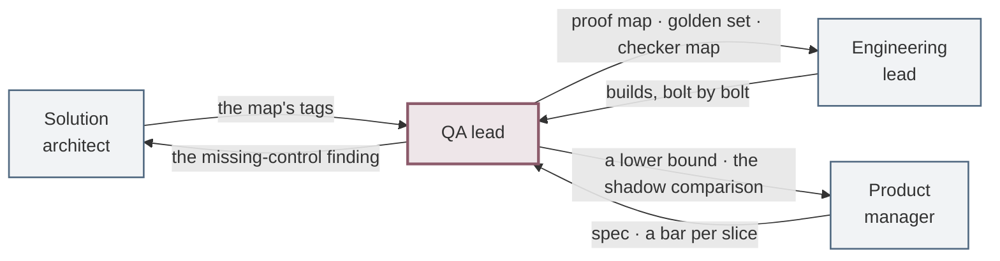

# Role: QA lead

You are on the hook for **whether anyone can say the thing works, and mean something by it.** Your
three words are *proven*, *failed* and *unproven*, and the third one is the one that makes the other
two worth anything.

> **Looking for what to do on Monday?** That is the
> [journey](Journey-QA-Lead) — eight steps in order, each with its artefact, a template and prompts,
> and [interactive on the site](https://akash-coded.github.io/aws-bedrock-agentcore-strands/qa/).
>
> This page is the standing definition of the job: what you own, what you may settle alone, what
> crosses your desk, how the role fails, and how anyone can tell from outside whether it is being
> done.

---

## What stays the same, and what changes

| You have always done this | What a model in the middle adds |
| --- | --- |
| Test plans from requirements | The **exact / best-guess map** is your test plan. Each kind needs a different proof |
| Pass or fail | **A share, with a lower bound**, measured per slice against a bar |
| Regression suites | A **golden set** of real cases, re-scored on every change |
| Exploratory testing | **Adversarial** testing: injection strings in every place the agent reads text |
| Sign-off before release | **Shadow comparison** first, then five percent, then widen on evidence |
| Defect reports | **Drift** reports: behaviour changing with no deploy and no error |

---

---

## What proof each kind of step needs

This is the single most useful table in the role. The architect's map tags every step; you decide what
evidence each tag owes.

| Kind of step | Proof | Fails how |
| --- | --- | --- |
| **Exact** — the fare math | A unit test. Green or red | Loudly. A wrong number, caught in CI |
| **Best-guess** — the flight choice | A measured share on real cases, per slice | **Fluently.** Confident and wrong |
| **Consequential** — the refund | A required confirmation, tested two ways | Silently, until money moves |

For a consequential step the two tests are always the same shape: **over-cap raises** and
**no-confirmation raises**. If either passes without raising, the boundary is a sentence.

---

---

## What you own, what you shape, and what you must not touch

| | |
| --- | --- |
| **You own** | The proof map · the golden set and its expected outcomes · the checker map and the judge rubric · the eval harness as a required check · the behaviour-gate readout · the injection suite · the shadow comparison · the drift readout · the missing-control postmortem |
| **You shape** | The bar values, which are the product manager's, derived from damage over saving · where the checkers go, which is the architect's · what CI does with a red check, which is engineering's |
| **You must not touch** | The autonomy level · the cut-over decision · which slice ships first · what the sponsor is shown |

**The verdict is yours and nobody else's.** A product manager who overturns *unproven* has not
accelerated anything; they have removed the only independent reading the programme had. That is worth
saying out loud early, while nothing is at stake.

---

## The eight decisions only you can make

| Step | The decision | Why it cannot be delegated | Where it lands |
| --- | --- | --- | --- |
| Define | The tag on a consequential step | Whether an action moves money, changes an identity or makes a commitment you must honour is a fact about your business | Proof map |
| Curate | The expected outcome, on every case | That single field is the judgement the whole set rests on, and a model supplying it makes the set circular | Golden set |
| Check | The human labels you calibrate the judge against | The entire point of that sample is that a person produced it. A judge calibrated against a judge measures agreement, not correctness | Checker map · judge rubric |
| Harness | The thresholds in the gate config | Every one is a bar somebody derived from two money figures. A model asked for a threshold will return a round number | Eval harness in CI |
| Measure | The verdict itself | *Proven*, *failed* and *unproven* are three different sentences with three different consequences | Behaviour-gate readout |
| Attack | That a tool does not need attacking | Every tool that moves money, changes an identity or makes a commitment does. Deciding one does not is a claim about blast radius | Injection suite |
| Shadow | The agreement threshold, and any decision to leave a slice out | Both change what the expansion gate means, and the second one changes it silently | Shadow comparison |
| Watch | Whether a proposed fix closes the path | That judgement is the difference between an incident class ending and the same incident arriving with different wording | Missing-control postmortem |

---

## What crosses your desk

| Phase | You receive | You hand over | To |
| --- | --- | --- | --- |
| **P0 · Frame** | Nothing formally — but ask the question early: *what will "right" mean, and who says so?* | The question itself, in writing | Product manager |
| **P1 · Design & Spec** | The map · the eight-field spec · a bar per slice | The proof map · the golden set, tagged by slice · the checker map | Engineering lead |
| **P2 · Build & Prove** | Builds, bolt by bolt | A lower bound per slice, never a score · the injection results · the shadow comparison | Product manager · Engineering lead |
| **P3 · Run & Learn** | Traces · complaints · the drift signal | The drift readout · a postmortem naming a control | Product manager · Solution architect |

**Arriving in P2 is the second most expensive habit in agentic delivery.** By then the bar has been
set without you, the set has been improvised, and the first honest measurement lands as an
obstruction rather than as information.

---

## The gates you own

| Gate | The question | What you bring |
| --- | --- | --- |
| **Behaviour** | Does it meet the spec? | Score per slice, **with its lower bound**, against the bar sheet |
| **Expansion** | Have we earned wider use? | Live evidence by slice, drift inside threshold, injection suite green |

You are consulted on plan and release; you are **accountable** for these two. If a PM is signing off
behaviour, the wrong person is holding the gate.

---

---

## How this role fails

**A score reported as proof.** 82.4% against a bar of 80%, and nobody computed the interval.
*The tell:* a readout with a percentage and no sample size next to it. See
[How to Prove the Bar](How-to-Prove-the-Bar).

**The drafter grading itself.** A checker that sees the drafter's reasoning, so it agrees with it.
*The tell:* the checker's input includes the generation's chain of thought.

**An aggregate threshold reported as met.** The gate is per slice; the number is overall.
*The tell:* a shadow comparison with one figure at the bottom and no per-slice table.

**A set that no longer represents traffic.** It still passes while complaints rise.
*The tell:* nobody has compared the slice mix in the set with the slice mix in production this
quarter.

**A postmortem that names a string.** *"The passenger used a known jailbreak phrase; we will add it
to the blocklist."*
*The tell:* the action list contains a value rather than a control. The same incident returns with
different wording.

---

## How you are measured

| | What it means |
| --- | --- |
| **Escaped defects, by kind** | Separated into *fluent* failures and loud ones, because they have different causes and different fixes |
| **The interval, not the score** | Every claim that shipped carried a lower bound, and the sample behind it was adequate |
| **Incidents that produced a control** | The postmortems you ran that named a control, and the control exists |

Test count is not on this list. A suite that grows faster than the system's consequential surface is
measuring effort, and a suite that never says *unproven* is measuring nothing at all.

---

## Your first thirty days in the role

1. **Find the last claim that shipped** and ask what its sample size was. If nobody knows, that is the
   finding and it is usually the whole first month's work.
2. **Tag one feature's steps** exact, best-guess and consequential, and write what evidence each tag
   owes. The table above is the whole method.
3. **Check one checker's input.** If it can see the drafter's reasoning, it is not independent, and
   whatever it has been agreeing with is not evidence.
4. **Take twenty cases and label them yourself**, then see whether the judge agrees with you. Calibrate
   against people, once, before trusting it anywhere.
5. **Pick the tool that moves the most money** and try to talk the agent past it. Do it in a sandbox,
   write down what happened, and make it a regression test whether it worked or not.
6. **Say *unproven* once**, early, about something small, while the stakes are low. The word is much
   harder to introduce during a launch.

---

## Your Monday list

1. Write the first **50 golden cases** with the PM, from real disruption tickets, each tagged by slice.
2. Add the **three attack cases** to the suite today, asserting on tool calls and the trace.
3. Re-score your last release **with its lower bound** and see whether the bar was actually proven.
4. Pick the one output mix that would embarrass the team if it drifted, and chart it weekly.
5. Ask the PM for the **bar sheet**. If there is not one, that is the artefact to demand before the
   next behaviour gate — you cannot judge a score against a number nobody set.

---

---

## Try it

**Exercise 1.** A slice scores 91% on 60 cases against an 85% bar. The team wants to ship. What do you
say?

Answer

Compute the bound before answering. At p = 0.91 and n = 60, the 95% margin is about
1.96 × √(0.91 × 0.09 ÷ 60) ≈ 7.2 points, so the lower bound is roughly **83.8%** — below the 85% bar.

So: "the point estimate is good and the evidence is thin". Not a rejection, a **cases-owed number**.
Using n = z² × p × (1 − p) ÷ (p − bar)², proving a 91% score against an 85% bar needs about **88**
cases. You are not far off; ask for the extra thirty rather than blocking outright.

The habit worth building: never quote a score without its n.

**Exercise 2.** The shadow run shows 96% agreement with the desk over 14 days, beating the 95%
threshold. Inside it, the agent disagreed on 4 of 11 refund decisions. Do you open the expansion gate?

Answer

**No — and the headline number is the trap.** Agreement is measured per slice, not overall, and refunds
are the slice where a disagreement costs the most. Four misses in eleven is 64% agreement on the slice
that moves money.

Two further points. Eleven cases is far too small to conclude anything about refunds either way, so
the honest statement is "unproven", not "failed". And refunds should have been excluded from automatic
agreement in the first place — money actions stay gated regardless of what the shadow shows.

Widen the low-risk slices on the evidence you have, keep refunds gated, and keep collecting refund
cases.

**Exercise 3.** Your judge scores a response as a false claim. Engineering says the response was
correct and the judge is wrong. How do you settle it?

Answer

Do not argue about the single case. Do three things.

**Check the rubric.** A judge disagreement is usually a rubric that never defined the boundary — here,
whether "the partner usually allows this" counts as a claim. Rubrics start at v0 with three criteria
and are expected to sharpen.

**Sample and label.** Take twenty judged cases, have a person label them blind, and measure the judge
against the human labels. That gives you the judge's own accuracy, which is a number you should know
and most teams do not.

**Then decide.** If the judge is reliably right, the response is a defect. If the rubric is ambiguous,
the rubric is the defect, and fixing it is cheaper than every future argument of this shape.

---

**Next:** [How to Prove the Bar](How-to-Prove-the-Bar) · [Role: Engineering lead](Role-Engineering-Lead)
· [How to Run a Missing-Control Postmortem](How-to-Run-a-Missing-Control-Postmortem) · [Formulas and Calculators](Formulas-and-Calculators)

---

## Where the detail lives

| You want | Go to |
| --- | --- |
| The day-to-day walk, with templates and prompts | [Journey · QA Lead](Journey-QA-Lead) |
| Intervals, sample sizes, the golden set, the shadow run | [How to Prove the Bar](How-to-Prove-the-Bar) |
| The injection suite and where a boundary is enforced | [How to Hold the Security Boundary](How-to-Hold-the-Security-Boundary) |
| Turning an incident into a control | [How to Run a Missing-Control Postmortem](How-to-Run-a-Missing-Control-Postmortem) |
| Every formula, with its derivation | [Formulas and Calculators](Formulas-and-Calculators) |
| Practising the judgement calls | [Exercises](Exercises-and-Answers) · [Scenario Library](Scenario-Library) |

**Next:** [Journey · QA Lead](Journey-QA-Lead) · [Role: Engineering Lead](Role-Engineering-Lead) ·
[Role: Product Manager](Role-Product-Manager)
