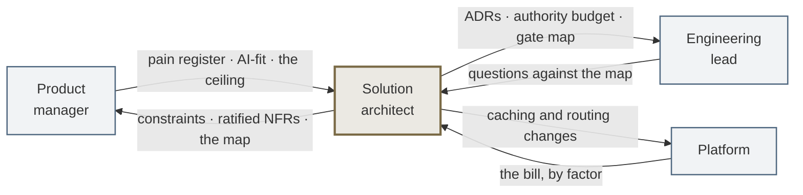

# Role: solution architect

You are on the hook for **what exactly is being built, and under whose authority.** P1 is yours: it
ends when the spec, the bar per slice and the guardrails are signed, and the crossing into P2 is the
one hand-off nothing downstream survives without.

> **Looking for what to do on Monday?** That is the
> [journey](Journey-Solution-Architect) — eight steps in order, each with its artefact, a template and
> prompts, and [interactive on the site](https://akash-coded.github.io/aws-bedrock-agentcore-strands/solution-architect/).
>
> This page is the standing definition of the job: what you own, what you may settle alone, what
> crosses your desk, how the role fails, and how anyone can tell from outside whether it is being
> done.

---

## What stays the same, and what changes

| You have always done this | What a model in the middle adds |
| --- | --- |
| Discovery, the credited requirements email, consolidated FRs | Three of the requirements now describe a **model's behaviour** |
| Constraints by type, NFRs as scenarios, utility trees, ratification | **Autonomy level** and **cost per case** join the NFR list. A compliance constraint becomes a cap **inside a tool** |
| ADRs at the trade-off points, the trade-off matrix, ATAM | ADRs move from *whether* to *how*: one per agent, behaviours never knobs, cost per case as a column |
| Vendor evaluation on weighted criteria | The same matrix, with **portability** and **the door** weighted higher, because frameworks change under the design |
| High-level design: components, integration, data | Topology, the authority budget with its gate map, checker placement |
| Run-time architecture: capacity, cost, observability | A model gateway, caching with its break-even, routing with a breaker, a trace that marks cache hits |
| Architecture review and sign-off | The review walks **four artefacts**: the map, the spec, the ADRs, the authority budget |

---

---

## What you own, what you shape, and what you must not touch

| | |
| --- | --- |
| **You own** | The constraint register · the ratified NFR sheet · the exact / best-guess / consequential map · the agent-fit and process-depth decision · the ADRs at the sensitivity points · the authority budget · the gate map · the layered context spec · the caching and routing design |
| **You shape** | The bar, which is the product manager's · the golden set, which is QA's · the bolt cut, which is engineering's · the alarm set, which is the platform's. You are consulted on all four and you settle none of them |
| **You must not touch** | The autonomy level · the verdict on a slice · the decision to merge past a red check · what the sponsor is shown |

Your authority is in the artefacts, not in a signature. That is deliberate: a design that needs you in
the room to be followed is a design that has not been written down.

---

## The eight decisions only you can make

| Step | The decision | Why it cannot be delegated | Where it lands |
| --- | --- | --- | --- |
| Elicit | The read-back itself | The mechanism is a person hearing their own words said back with their name on them. A summary nobody heard read aloud is not a read-back | Credited requirements email |
| Constrain | Whether a constraint is real | The only way to learn that a $400 threshold is a policy your compliance team owns, rather than a number somebody once typed, is to ask a person | Constraint register |
| Map | What counts as money | Whether a fee waiver, a goodwill credit or a seat upgrade is a consequential action is a judgement about your business | Exact / best-guess / consequential map |
| Shape | The escalation condition | It depends on your context sizes, your latency budget and the shape of your traffic — none of which a model can read from the outside | Agent-fit and process-depth decision |
| Decide | Which decisions earn a record | That judgement is what keeps the folder readable, and a readable folder is the only kind anyone opens | The ADR set |
| Bound | Whether a wrong action can be undone, and how fast | A fact about your ledger, your regulator and your operations | Authority budget · gate map |
| Detail | Where the checkers go | Each one costs a call. Putting them everywhere is the same error as putting them nowhere, made more expensively | Layered context spec · checker plan |
| Evolve | The missing-control finding | Naming the control that would have made an incident impossible is the one judgement a postmortem exists to produce | Missing-control postmortem |

---

## What crosses your desk

| Phase | You receive | You hand over | To |
| --- | --- | --- | --- |
| **P0 · Frame** | Pain register · AI-fit record · the autonomy ceiling | Constraint register · candidate NFR scenarios | Product manager |
| **P1 · Design & Spec** | The eight-field spec, in draft | Ratified NFRs · the map · the ADRs · the authority budget · the gate map | Engineering lead · QA lead |
| **P2 · Build & Prove** | Questions against the map | Answers, and nothing else | Engineering lead |
| **P3 · Run & Learn** | The bill by factor · the incident timeline | Caching and routing changes · the missing-control finding | Product manager · Sponsor |

**P2 is the row people get wrong.** Decisions made in P1 are read in P2, not re-opened. If a decision
genuinely has to change, that is a new ADR with a date on it, not a conversation — otherwise the map
stops describing the system and nobody notices for a month.

---

## The gates you hold

| Gate | Yours? | What you bring to it |
| --- | --- | --- |
| Intent | Product manager's | The constraint register, so the verdict is made against real limits |
| Plan | **Shared** with the product manager | The authority budget and the gate map |
| Behaviour | QA's | — |
| Release | Product manager's | Confirmation the rollback path is the one the design assumed |
| Expansion | QA's | — |

You hold no gate alone, and that is the design. An architect whose authority comes from a signature
is an architect who is consulted late; an architect whose authority comes from the artefacts is one
whose decisions survive them being on holiday.

---

## How this role fails

**The ADR folder nobody opens.** Every decision recorded, which is the same as none of them recorded,
because nobody can find the three that mattered.
*The tell:* more than about a dozen ADRs for one feature, or an ADR whose title is a noun rather than
a choice.

**The map that stopped describing the system.** Steps re-tagged in code and never in the map.
*The tell:* ask an engineer to point at the consequential steps, then compare with the map. Any
difference at all means the map is now documentation rather than a control.

**Token budget before authority budget.** The cap gets set to whatever was affordable, and the
question of what the agent may do becomes a consequence of what it could afford.
*The tell:* the authority budget's dates are later than the token estimate's.

**Checkers everywhere.** A checker after every step, which doubles the bill and still misses the one
that mattered, because attention went to coverage rather than to consequence.
*The tell:* the checker count equals the step count.

**Consulted, not accountable.** The design is advice, so it is followed when convenient.
*The tell:* a decision was changed in P2 without an ADR, and you found out afterwards.

---

## How you are measured

Not by diagrams produced. Three things, all observable by someone else:

| | What it means |
| --- | --- |
| **Decisions that held** | ADRs from P1 still describing the system at P3, without a silent amendment |
| **The bill's shape** | The four factors — context, tier, cache, attempts — each traceable to a design choice somebody made on purpose |
| **Incidents that produced a control** | A postmortem you were in that named a control, and the control exists |

The fourth thing, which is harder to count and matters most: whether the team can answer *"why is it
built this way?"* when you are not there.

---

## Your first thirty days in the role

1. **Ask what the $400 is.** Every organisation has one — a threshold everyone repeats and nobody can
   source. Find out whether it is policy, contract or folklore. The answer reshapes more NFRs than any
   workshop will.
2. **Tag one live feature's steps** exact, best-guess or consequential. Then ask an engineer to do the
   same from memory and compare. The gap is your starting position.
3. **Write the authority budget for one feature** before looking at any token estimate. Two lists:
   allowed alone, needs a person.
4. **Count the ADRs** for the most recent feature. If there are none, ask where the trade-offs went.
   If there are thirty, ask which three someone would actually read.
5. **Find the escalation condition** in whatever is running. If there isn't one, that is the finding:
   a system with no escalation condition has one autonomy level, which is its highest.
6. **Read one postmortem** and check whether it names a control or a string. If a string, it will
   happen again with different wording.

---

## Your Monday list

1. Take the PM's sort and add the **proof column**. That is the whole exact / best-guess map, and it
   takes twenty minutes for one feature.
2. Write the **escalation condition** for your topology. Collapse anything multi-agent that cannot
   name its limit.
3. Move every cap from prompt text into a **tool signature**.
4. Compute the chain accuracy for your feature. **Multiply, do not average.**
5. Write the ADR for the last decision you made in a meeting and nobody wrote down. Then add the ADR
   folder to the agent's context pack.

---

---

## Try it

**Exercise 1.** Your feature has six chained best-guess steps, each measured at 92%. What is the
end-to-end success rate, and what are your two options?

Answer

0.92⁶ = **0.606**. Right about three times in five.

Option one: **shorten the chain.** Two of the six are usually merges of exact work that crept into a
prompt, or steps that can be done by one call instead of two. Removing two steps takes you to 0.92⁴ =
0.72.

Option two: **checkers after the steps that are costly and easy to miss.** A checker does not make a
step more accurate; it catches the misses so they become re-drafts instead of passenger-visible
errors. Cap re-draft rounds at two, then escalate.

Do both, in that order. And note what does not help: raising the model tier on all six. That is the
expensive answer to a structural problem.

**Exercise 2.** A team lead wants to feed the entire fifteen-year-old reservation codebase to the
agent so it can "understand and update" it. What do you say, and what do you do instead?

Answer

Say no, for two reasons: the whole codebase makes answers **worse**, not better, and a big-bang
migration has no safe rollback.

Instead: **score each module** on risk, documentation, coupling, reversibility and how much it
teaches. Migrate low-risk, well-documented, loosely-coupled pieces first; payments last. Wrap each
piece behind a clean interface, route a slice, grow the new, retire the old — the Strangler Fig
pattern (Fowler, 2004).

Where the docs are missing, **extract the business rules into a rule sheet** — condition, action,
source line, confidence — and have a person check everything below 0.9 confidence. The agent then
reads a few hundred tokens of rules that carry the intent the code buries, instead of four thousand
lines that do not.

**Exercise 3.** Finance says caching is on, but the bill has not moved. Where do you look first?

Answer

At the **order of the prompt**, before anything else. The cache matches an exact prefix in the order
tools → system → messages, up to the block marked for caching. If the passenger's request is placed
first "for emphasis", the prefix changes on every call and the cache never hits.

Then three more, in order: is anything **volatile inside the cached block** (a timestamp, a request
id)? Is the team **switching models mid-task**, which discards the cache? And is the prefix reused at
all — **below two uses caching costs money**, since a write is 1.25× input for a five-minute cache
against a read at 0.1×.

See [How to Control the Token Bill](How-to-Control-the-Token-Bill).

---

**Next:** [Role: Engineering lead](Role-Engineering-Lead) · [How to Design an Agent on Paper](How-to-Design-an-Agent-on-Paper)
· [How to Hold the Security Boundary](How-to-Hold-the-Security-Boundary) · [Decision Trees](Decision-Trees)

---

## Where the detail lives

| You want | Go to |
| --- | --- |
| The day-to-day walk, with templates and prompts | [Journey · Solution Architect](Journey-Solution-Architect) |
| Designing the agent on paper first | [How to Design an Agent on Paper](How-to-Design-an-Agent-on-Paper) |
| Running the NFR workshop | [How to Run an NFR Workshop](How-to-Run-an-NFR-Workshop) |
| Build, buy or borrow | [How to Choose Build, Buy or Borrow](How-to-Choose-Build-Buy-or-Borrow) |
| Where a boundary is actually enforced | [How to Hold the Security Boundary](How-to-Hold-the-Security-Boundary) |
| Chained probability and every other formula | [Formulas and Calculators](Formulas-and-Calculators) |
| Practising the judgement calls | [Exercises](Exercises-and-Answers) · [Scenario Library](Scenario-Library) |

**Next:** [Journey · Solution Architect](Journey-Solution-Architect) ·
[Role: Engineering Lead](Role-Engineering-Lead) · [Role: Product Manager](Role-Product-Manager)
