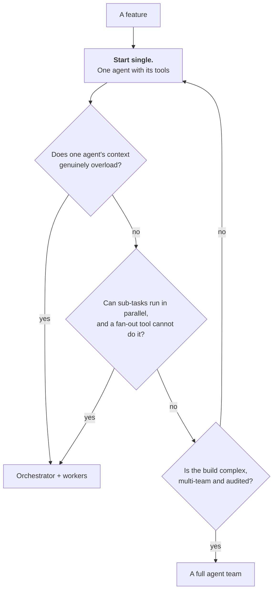

# Role: solution architect

Eighteen steps from frame to run. The method is unchanged; the content is new. You still run
discovery, write decision records and review designs. What changes is that some of the steps you are
designing are **probabilistic**, and a probabilistic step needs a different kind of proof.

Live version, with the artefact filled in for SkyWays at every step:
[Solution architect](https://akash-coded.github.io/aws-bedrock-agentcore-strands/#/sa/step-1).

---

## What stays the same, and what changes

| You have always done this | What a model in the middle adds |
| --- | --- |
| Discovery, the credited requirements email, consolidated FRs | Three of the requirements now describe a **model's behaviour** |
| Constraints by type, NFRs as scenarios, utility trees, ratification | **Autonomy level** and **cost per case** join the NFR list. A compliance constraint becomes a cap **inside a tool** |
| ADRs at the trade-off points, the trade-off matrix, ATAM | ADRs move from *whether* to *how*: one per agent, behaviours never knobs, cost per case as a column |
| Vendor evaluation on weighted criteria | The same matrix, with **portability** and **the door** weighted higher, because frameworks change under the design |
| High-level design: components, integration, data | Topology, the authority budget with its gate map, checker placement |
| Run-time architecture: capacity, cost, observability | A model gateway, caching with its break-even, routing with a breaker, a trace that marks cache hits |
| Architecture review and sign-off | The review walks **four artefacts**: the map, the spec, the ADRs, the authority budget |

---

## The eighteen steps

### P0 · Frame

| # | Step | Artefact |
| --- | --- | --- |
| 1 | Draw the exact / best-guess map | exact / best-guess map |
| 2 | Decide the shape: is this agents at all, and how many? | agent-fit decision |
| 3 | Set the process depth per change | depth decision (AI-DLC) |

### P1 · Design & Spec

| # | Step | Artefact |
| --- | --- | --- |
| 4 | Record the decision as an ADR | architecture decision record |
| 5 | Set the authority budget, then the gate map | authority budget + gate map |
| 6 | Design the context layers | layered context spec |
| 7 | Choose the topology and design the MCP server | agent topology + MCP schema |
| 8 | Place the checker: defend against drift | checker placement |

### P2 · Build & Prove

| # | Step | Artefact |
| --- | --- | --- |
| 9 | Cut the work into bolts that build alone | bolt cut (dependency-ordered) |
| 10 | Structure the prompt for caching | caching config |
| 11 | Route by complexity, break the runaway | routing + circuit-breaker config |
| 12 | Migrate legacy code piece by piece | migration plan (Strangler Fig) |
| 13 | Keep the shape honest at the plan gate | plan-gate record |

### P3 · Run & Learn

| # | Step | Artefact |
| --- | --- | --- |
| 14 | Hold the security boundary in production | security boundary |
| 15 | Design the trace, redacted | trace + drift dashboard |
| 16 | Turn the incident into a design change | incident → design change |
| 17 | Use your own assistant well | architect's assistant setup |
| 18 | Know whether the architecture is maturing | architecture maturity check |

---

## Step 1 in depth · the exact / best-guess map

The PM sorts at the level of the feature. You sort at the level of **every step**, and you add the
column that matters: **what proof each kind needs.**

| Kind | What it is | Built as | Proven by |
| --- | --- | --- | --- |
| **Exact** | Must be right every single time | A function | A unit test, green or red |
| **Best-guess** | Right a share of the time | A model call | A measured share on real cases |
| **Consequential** | Changes something real | A tool **plus** a gate | A required confirmation |

Worked for the SkyWays rebooking assistant:

| Step | Kind | Why |
| --- | --- | --- |
| Read the booking | Exact | A lookup, not a judgement |
| Find candidate flights | Best-guess | Ranking under constraints |
| Compute the fare difference | **Exact** | It is money. A function, never a prompt |
| Check visa and codeshare eligibility | Exact | Rules, in code |
| Draft the passenger message | Best-guess | Tone and content |
| Rebook the seat | Consequential | Changes a real booking |
| Issue a refund | Consequential | Real money, R4, named approver |

**The rule that never breaks: the best-guess machine never does the exact math.** The model may call
the function and read the result; it never computes the value. A fluent wrong number is the failure
mode no prompt-level test catches. $80 when the ledger says $62.

Practical move on Monday: grep the prompts for *calculate*, *compute*, *total*. Each hit is a function
waiting to exist.

---

## Step 2 in depth · how many agents?

An engineer builds fifteen agents to show what is possible. You have to say whether this needs one.

Each added agent is another context to manage and another hand-off to get wrong. Five agents have ten
possible hand-offs between them — **n(n−1)/2** — and every one has to be right.

Anthropic's own published measurement on its multi-agent research system found delegation paid off on
routine work, not on the hardest problems.

**Write the escalation condition down.** "We move to an orchestrator when a single context exceeds X"
is a decision. "We might need more agents later" is how a swarm comes back by default.

---

## Step 8 in depth · chained probability, and where the checker goes

Four steps, each 90% right on its own. An engineer says "90% is solid".

> 0.9 × 0.9 × 0.9 × 0.9 = **0.66**

End to end it is wrong one time in three, and it fails **fluently**, so nobody notices until a
passenger does. **Length is the enemy.**

Two defences, in this order:

1. **Keep chains short.** Every step you remove multiplies back.
2. **Put an independent checker after each generating step.**

Independent means a different model, **or** the same model in a fresh context with an adversarial
brief ("find what is wrong"). A model reading its own output shares its own blind spots — that is why
"review your answer" does not work.

| Step | Checker? | Why |
| --- | --- | --- |
| Compute the fare | No | It is exact. It needs a **unit test**, not a checker |
| Choose the flights | **Yes** | Costly to get wrong, easy to miss |
| Draft the message | **Yes** | False claims and tone, invisible to the drafter |
| Write the trace row | No | Exact |

Place checkers where a wrong answer is **costly and easy to miss** — not everywhere. Each one costs
a call.

---

## Step 5 in depth · authority before tokens

The first question is not how much the agent may spend. It is **what it may change, touch or commit.**
A cheap task with too much authority is far more dangerous than an expensive one with none.

| Band | Example tool | Where the control lives |
| --- | --- | --- |
| R1 | `search_flights` | Nothing needed; read-only |
| R2 | `draft_message` | Review before merge into the reply |
| R3 | `cancel_hold` | Approve first |
| R4 | `issue_refund(amount ≤ 400)` | **Typed, bounded parameter** + named approver |
| R5 | `change_passenger_identity` | Not delegated |

> **A cap in a prompt is a request. A cap in a tool signature is a boundary.**

An injected instruction can override a prompt. It cannot override a typed parameter that raises. The
PM decides where the allowed-alone line is; you make it enforceable.

Monday: put every cap in a tool signature and **delete it from the prompt**. Keep the prompt sentence
that *explains* the rule — that is policy, and it makes the agent behave well by default. The
signature is what makes bad behaviour impossible when the prompt has been talked past.

See [How to Hold the Security Boundary](How-to-Hold-the-Security-Boundary).

---

## Step 13 in depth · the three drifts to catch at the plan gate

Mid-build, each of these looks reasonable on its own.

| Drift | What it looks like | The one-line test |
| --- | --- | --- |
| **Shape drift** | A second agent added "for speed" | Is there a **named limit** in the record that justifies it? |
| **Authority drift** | A gate moved from the tool into the prompt | Grep the prompt for caps. Any hit is a failure |
| **Context drift** | The whole booking history pasted in "for context" | Is it a **slice** or a document? |

Plus the fourth, which is the gate itself: **is the evidence line empty?** If it is, the bolt does not
merge.

Run the four tests on the last bolt that merged. Expect one to fail.

---

## Your Monday list

1. Take the PM's sort and add the **proof column**. That is the whole exact / best-guess map, and it
   takes twenty minutes for one feature.
2. Write the **escalation condition** for your topology. Collapse anything multi-agent that cannot
   name its limit.
3. Move every cap from prompt text into a **tool signature**.
4. Compute the chain accuracy for your feature. **Multiply, do not average.**
5. Write the ADR for the last decision you made in a meeting and nobody wrote down. Then add the ADR
   folder to the agent's context pack.

---

## Try it

**Exercise 1.** Your feature has six chained best-guess steps, each measured at 92%. What is the
end-to-end success rate, and what are your two options?

Answer

0.92⁶ = **0.606**. Right about three times in five.

Option one: **shorten the chain.** Two of the six are usually merges of exact work that crept into a
prompt, or steps that can be done by one call instead of two. Removing two steps takes you to 0.92⁴ =
0.72.

Option two: **checkers after the steps that are costly and easy to miss.** A checker does not make a
step more accurate; it catches the misses so they become re-drafts instead of passenger-visible
errors. Cap re-draft rounds at two, then escalate.

Do both, in that order. And note what does not help: raising the model tier on all six. That is the
expensive answer to a structural problem.

**Exercise 2.** A team lead wants to feed the entire fifteen-year-old reservation codebase to the
agent so it can "understand and update" it. What do you say, and what do you do instead?

Answer

Say no, for two reasons: the whole codebase makes answers **worse**, not better, and a big-bang
migration has no safe rollback.

Instead: **score each module** on risk, documentation, coupling, reversibility and how much it
teaches. Migrate low-risk, well-documented, loosely-coupled pieces first; payments last. Wrap each
piece behind a clean interface, route a slice, grow the new, retire the old — the Strangler Fig
pattern (Fowler, 2004).

Where the docs are missing, **extract the business rules into a rule sheet** — condition, action,
source line, confidence — and have a person check everything below 0.9 confidence. The agent then
reads a few hundred tokens of rules that carry the intent the code buries, instead of four thousand
lines that do not.

**Exercise 3.** Finance says caching is on, but the bill has not moved. Where do you look first?

Answer

At the **order of the prompt**, before anything else. The cache matches an exact prefix in the order
tools → system → messages, up to the block marked for caching. If the passenger's request is placed
first "for emphasis", the prefix changes on every call and the cache never hits.

Then three more, in order: is anything **volatile inside the cached block** (a timestamp, a request
id)? Is the team **switching models mid-task**, which discards the cache? And is the prefix reused at
all — **below two uses caching costs money**, since a write is 1.25× input for a five-minute cache
against a read at 0.1×.

See [How to Control the Token Bill](How-to-Control-the-Token-Bill).

---

**Next:** [Role: Engineering lead](Role-Engineering-Lead) · [How to Design an Agent on Paper](How-to-Design-an-Agent-on-Paper)
· [How to Hold the Security Boundary](How-to-Hold-the-Security-Boundary) · [Decision Trees](Decision-Trees)
