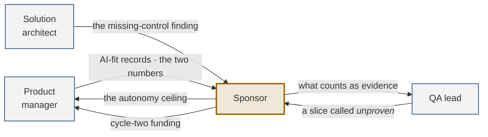

# Role: sponsor

You are on the hook for **P3 — whether it is still doing what you launched, and what it cost.** You
are also the only person on the programme with no delivery deadline, which is why the governance loop
is yours: it is the one loop with nobody downstream waiting on it.

> **There is no journey page for this role**, because the job is not a sequence of steps. The nearest
> thing is [the operating protocol](https://akash-coded.github.io/aws-bedrock-agentcore-strands/protocol/) — the whole model on one screen, with the four
> decisions, the arithmetic behind them, and ninety days.
>
> This page is the standing definition of the job: what you own, what you may settle alone, what
> crosses your desk, how the role fails, and what to do on the two days that actually test it.

---

## What stays the same, and what changes

| You have always done this | What a model in the middle adds |
| --- | --- |
| Backing a programme, and stopping one | The stop decision now rests on **evidence you specified in advance**. A demo is not evidence and everyone in the room knows it |
| Setting risk appetite | Risk appetite becomes an **autonomy level, per action**, with the recoverability answer beside it — not one setting for "the AI" |
| Reading a business case | The case carries a **running cost** that moves with behaviour rather than with volume. A bill can multiply on flat traffic |
| Steering committees and status | **Two numbers** against a dated baseline, with the review row visible. Anything else is a story |
| Asking whether it works | Asking for a **lower bound per slice**, because a score without an interval has not said anything yet |
| Post-incident reviews | A postmortem that has not produced a **brief for the next P0** has not finished |
| Portfolio decisions | Most of the portfolio comes back as **rules**, and that is the healthy answer rather than a lack of ambition |

---

## What you own, what you shape, and what you must not touch

| | |
| --- | --- |
| **You own** | Whether the programme is funded past cycle one · the organisation's autonomy ceiling · what you will accept as evidence · the governance loop, and the name on it |
| **You shape** | The roadmap, which is the product manager's · the architecture, which is the architect's · the bar, which is derived and not chosen. You can ask for any of them to be justified; you cannot set them |
| **You must not touch** | The verdict on a slice · which slice ships first · the gate decisions · the design |

The temptation in this role is to reach into delivery when a number is disappointing. It never works,
and it costs the thing the role is actually for: an independent reading of whether the programme is
worth continuing.

---

## The four decisions nobody can make for you

Delivery decisions belong to delivery. These four do not, because each trades a business risk against
a business return, and that trade is yours. They are the same four on
[the operating protocol](https://akash-coded.github.io/aws-bedrock-agentcore-strands/protocol/), where each has its arithmetic.

| | The decision | What to ask for | A healthy answer |
| --- | --- | --- | --- |
| **1** | Which work is genuinely AI work | An AI-fit record per candidate, naming the rejected alternative and why | Two or three of your top five come back as rules |
| **2** | What the agent may do without a person | The autonomy level per *action*, never per product, with the recoverability answer beside it | Different levels for different actions, and a hold on the expensive one |
| **3** | What you will accept as evidence | A lower bound per slice, and a shadow run — not a score, and not a demo | Someone tells you a slice is *unproven* without being asked twice |
| **4** | What you will fund past cycle one | Two numbers against a dated baseline, with the review row visible | The review row is high in cycle one and falling |

**The fourth is the one that decides the programme**, and it is decided by what you did about the
third. A sponsor who accepted a demo as evidence in cycle one has no basis for the cycle-two
decision except how the demo felt.

---

## The four questions

Ask these every cycle, in this order, and most of the failure modes in this playbook cannot survive
in your programme.

### 1. "Which of these are rules?"

Ask it of the roadmap, not of one feature. Most of a backlog is deterministic and earns no agentic
ceremony. A team under an *agent-first* directive will build agents for things a `CASE` statement does
better, and will not tell you, because you asked for agents.

**What good looks like:** an [AI-fit verdict](Role-Product-Manager) on record for each item, with
two or three of the top five coming back as rules. That is the healthy answer.

### 2. "What may it do without a person, and who decided?"

Not *what can it do*. What is it **allowed** to do, per action, and where is that written.

**What good looks like:** an autonomy record per action with a reversibility column, and the caps
living in tool signatures rather than in prompt text. The difference is not pedantry — a prompt is a
request the model can be talked past; a signature is a boundary.

Ask one follow-up: **"show me the cap."** If someone opens a prompt file, you have found a gap.

### 3. "What are the two numbers?"

Never accept one.

```
                             baseline      now       change
person-days per story            8.0        4.6      −43%
token spend per story              –      $310
review hours added per story     1.2        2.0       +0.8
re-runs per story                  –        1.4
──────────────────────────────────────────────────────────
net              saved 3.4 person-days, spent $310 + 0.8 review hours
```

A first cycle can genuinely save time **and** cost more. That is normal and it is survivable — if it
arrives from the team rather than from finance. Cost turns positive from cycle two as the review load
falls.

**Three things to insist on:** the baseline is taken *before* the pilot; the review-hours row stays
visible; the re-run row stays visible because it is the leak signal.

> The programme is cancelled on the number that was hidden, never on the one that was shown.

### 4. "What level are we, and what is the next control?"

Not how many AI tools the teams have adopted. Tool count is the metric that rewards the least mature
behaviour available.

| # | Control | The test you can apply yourself |
| --- | --- | --- |
| 1 | A context file the agent reads | Ask to see it. Is it current? |
| 2 | Every item has a spec with a bar and an owner | Pick a story at random |
| 3 | The harness gates the merge, per slice | "What happens if one slice regresses?" |
| 4 | Caps live in tool signatures | "Show me the cap" |
| 5 | The trace redacts | "Is there a passport number in the log?" |
| 6 | Production evidence by segment, drift watched | "What re-opens the release gate?" |

A team with nine tools and none of these is at level one. A team with one tool and four of these is
further along, ships more safely, and costs less.

---

---

## What crosses your desk



| Phase | You receive | You are being asked for |
| --- | --- | --- |
| **P0 · Frame** | The AI-fit records, with rejected alternatives | Permission to spend design time — and an autonomy ceiling |
| **P1 · Design & Spec** | The spec, the bar per slice, the authority budget | Nothing, if the phase is healthy. Being asked to arbitrate here usually means a decision has no owner |
| **P2 · Build & Prove** | The gate readouts | Patience, and occasionally a waiver — which is a decision with a blast radius and a closure date, not a nod |
| **P3 · Run & Learn** | The two-number report · the drift readout · the bill by factor | The cycle-two funding decision, and the name on the governance loop |

If you are being asked to decide something in P1 or P2 that is not a waiver, the honest question is
*whose decision is this?* — because the answer is nearly always somebody who did not want to make
it.

---

## The three reports you should receive

| Report | Cadence | From | If it is missing |
| --- | --- | --- | --- |
| **Two numbers** | Every cycle | PM, from the engineering ledger | You will hear the cost number from finance instead |
| **Drift readout** | Weekly | PM | Behaviour will change with no deploy and no alert |
| **Incident brief** | On each incident | PM and architect | Postmortems will end in a name rather than a control |

---

---

## What to do when the bill arrives

It will. A bill several times its estimate with flat traffic is a normal event in the first cycles,
and it is a **design** question, not a finance one. The cost loop closes into P1.

Four signatures explain almost every blowout. Ask which one it is:

| Signature in the per-call log | The habit behind it | The fix |
| --- | --- | --- |
| Tokens per call rose | Whole documents pasted instead of slices | Send the slice |
| Tier mix moved to frontier | No routing | Route by complexity |
| Cache hit ratio fell | Model switched mid-task, or something volatile inside the cached block | One model per task |
| Retries per conversation rose | Vague asks, or a model too weak for the slice | Sharper spec; right-size the tier |

The wrong response is a spending freeze, which stops the work and teaches nothing. The right response
is "which signature, and which decision record allowed it".

See [How to Control the Token Bill](How-to-Control-the-Token-Bill).

---

---

## What to do when the incident arrives

One question runs the whole room:

> **Which enforced control, if it had been present, would have made this impossible?**

Not who typed it. Not what the passenger sent. If the postmortem produces a name, it has not
finished; if it produces a control, a decision record and a lowered autonomy level, it has.

Expect the autonomy level to drop after an incident, and expect it to rise again only on evidence.
That is the system working, not a setback.

See [How to Run a Missing-Control Postmortem](How-to-Run-a-Missing-Control-Postmortem).

---

---

## What not to ask for

| Do not ask for | Because | Ask instead |
| --- | --- | --- |
| A single accuracy number | It hides the slice that carries the risk | "What is the score **per slice**, against its bar?" |
| A demo on day fourteen | It is the one day the team optimises for | "What shipped yesterday?" |
| AI tool adoption counts | It rewards the least mature behaviour | "What level are we, and what is the next control?" |
| A launch date before the shadow run | The date will win the argument against the evidence | "What is the shadow threshold, and when does the window close?" |
| Your sign-off on a pull request | You cannot evaluate it, and your name on it helps nobody | "Bring me intent and release" |

---

---

## How this role fails

**Asking for a demo.** A demo shows what the system can do once, which is not what it does across
traffic, and everyone in the room knows this.
*The tell:* the last three reviews had a screen share and no interval.

**Setting autonomy per product.** One level for "the agent", which forces the whole product to the
strictness of its riskiest action or, worse, to the looseness of its safest.
*The tell:* the autonomy record has one row.

**Reading the bill as a finance problem.** A spend review, a budget increase, a conversation about
tooling — none of which reaches the design that caused it.
*The tell:* the cost loop's actions all have a finance owner and none has an ADR.

**Cancelling on the number that was hidden.** The programme ends on a figure you saw for the first
time at the moment it was worst.
*The tell:* you are surprised. Surprise is not a failure of the number, it is a failure of the
reporting cadence you accepted.

**Measuring adoption.** Seats bought, teams onboarded, tools rolled out.
*The tell:* the metric cannot fall when the work gets worse.

---

## How you are measured — and how to measure yourself

Nobody grades a sponsor, so here are three questions that do it honestly.

1. **Can you name the person who closes the cost loop and the person who closes the incident loop?**
   Not the team. If not, those loops are absent, and absent is the honest word — not *informal*.
2. **When did you last hear the word *unproven*?** If never, either nothing has been hard or nobody
   is willing to say it to you, and only one of those is likely.
3. **Is your baseline dated and from before the pilot?** If it was reconstructed afterwards, every
   number you report rests on a memory.

---

## Your first thirty days in the role

1. **Ask for the AI-fit records** on whatever is already running. If they do not exist, that is the
   finding: the decision was made and not recorded, which means it cannot be reviewed.
2. **Ask for the autonomy record** and count the rows. One row is a problem.
3. **Say what you will accept as evidence**, in writing, before the next gate. A lower bound per
   slice and a shadow comparison. Say it early so it does not read as a moved goalpost later.
4. **Find the baseline.** If there isn't one and a pilot is imminent, stop and take it — it is an
   afternoon now and impossible afterwards.
5. **Name the two loop owners.** Cost and incident, a person each, agreed with them.
6. **Set the reporting cadence for the bill** while it is uninteresting, so nobody has to decide to
   show you a bad number for the first time.

---

## Try it

**Exercise.** At your next steering meeting, ask only question three — "what are the two numbers?" —
and then say nothing for ten seconds.

<details>
<summary>What the answer tells you</summary>

**Both numbers, with a baseline taken before the pilot.** The team has an engineering ledger and a PM
who built the report from it. Ask question four next cycle.

**The saving only.** Nobody is tracking spend per story, which means the first person to compute it
will be finance, in a meeting you did not schedule. Ask for the token row by the next cycle; it is a
day's work to start.

**Both numbers, but the baseline was taken after the pilot.** An honest team with an unusable number.
The fix is cheap on the *next* feature: an afternoon of measurement before it starts.

**A percentage with no denominator.** "40% faster" on what, measured how, over how many stories. This
is the most common answer, and it is the one that collapses under the first serious question in a
board meeting.
</details>

---

**Next:** [Gates and Governance](Gates-and-Governance) · [The Eight Loops](The-Eight-Loops) ·
[Role: Product manager](Role-Product-Manager) · [Anti-Patterns](Anti-Patterns)

---

## Where the detail lives

| You want | Go to |
| --- | --- |
| The whole operating model on one screen | [The operating protocol](https://akash-coded.github.io/aws-bedrock-agentcore-strands/protocol/) |
| The four phases and what each ends with | [The Agentic PDLC](The-Agentic-PDLC) |
| Why three loops need a named person | [The Eight Loops](The-Eight-Loops) |
| What a gate is, and who holds it | [Gates and Governance](Gates-and-Governance) |
| What evidence is supposed to look like | [The Evidence Pack](The-Evidence-Pack) |
| The scenarios written for this chair | [Scenario Library](Scenario-Library) — 1, 10, 23, 24 |

**Next:** [The Agentic PDLC](The-Agentic-PDLC) · [Gates and Governance](Gates-and-Governance) ·
[Role: Product Manager](Role-Product-Manager)
