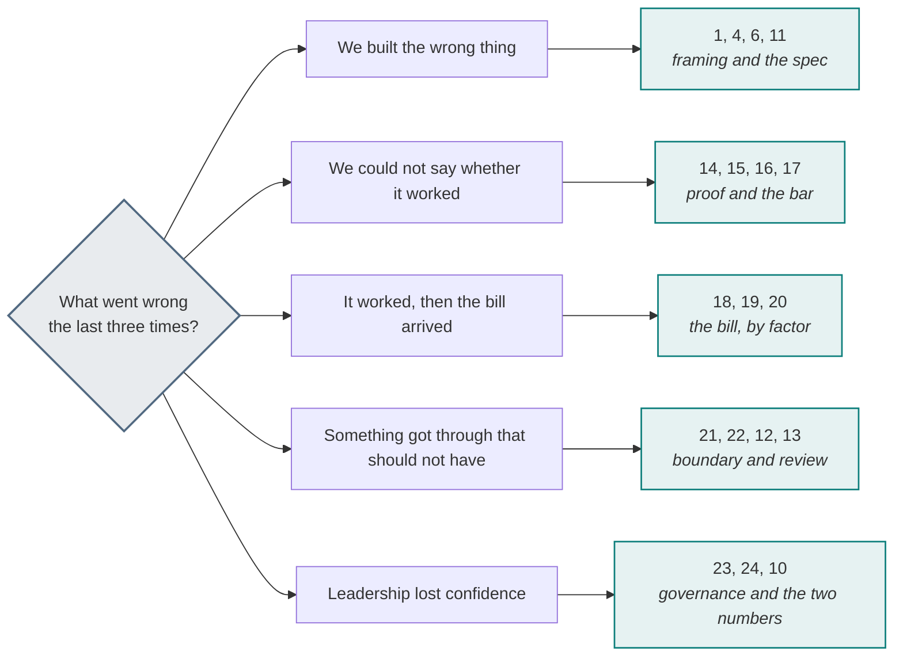

# Scenario library

**Thirty-seven scenarios:** thirteen episodes from SkyWays, and twenty-four more from other industries.

The airline case is deliberately one case, followed all the way through. This page is the other half:
the same playbook applied to healthcare, banking, insurance, retail, logistics, manufacturing,
telecoms, energy, the public sector and an internal helpdesk — because the test of a method is whether
it survives a change of domain.

The twenty-four are grouped by the **loop** each one exercises, so you can drill the thing your team
is weakest at. Use them for workshops, interview practice, or as the first hour of a new engagement.

---

## Part one · SkyWays, ninety days

One airline, one rebooking assistant for disrupted passengers, four people: **Priya** owns the
product, **Arjun** the architecture, **Sam** the engineering, **Maya** the quality.

Each episode opens on a moment with a number in it and closes one loop.

| Day | Episode | Who | Closes | The number |
| --- | --- | --- | --- | --- |
| 1 | Two discovery meetings | Arjun | requirements | **31** requirements from six people, four of them duplicates |
| 4 | The requirements email that keeps the duplicates | Arjun | requirements | All **31** lines kept, each credited |
| 6 | Constraints, and the NFRs they reshape | Arjun | requirements | One constraint — **$400** — reshapes three of nine NFRs |
| 9 | The NFR workshop | Arjun | requirements | **9** ratified NFRs, **3** pulling against each other |
| 12 | The first ADRs, at the trade-off points | Arjun | decision | **2** written, **1** scheduled. Not one more |
| 15 | From a thirty-page brief to eight fields | Priya | spec | **30 pages → 8 fields**; five were never decided |
| 20 | Build, buy or borrow the framework | Arjun | decision | **6** weighted criteria; the fastest start loses on the door |
| 30 | The first bolt ships by four in the afternoon | Sam | delivery | A walking skeleton, **day 1** |
| 45 | Eighty-two point four against a bar of eighty | Maya | trust | **82.4%** vs **80%** — and the lower bound says not yet |
| 60 | Nine pull requests and a four-day queue | Sam | delivery | **18** slots needed, **4.5** a day available |
| 75 | A bill 4.4 times the estimate, with flat traffic | Arjun | cost | **1.6 × 1.5 × 1.3 × 1.41 = 4.40** |
| 82 | A refund of $2,000 that was not owed | Maya | incident | **5** layers claimed, **0** enforced |
| 90 | Both numbers, in front of the steering committee | Priya | governance | **−43%** person-days and **$310** a story |

Read them in order:
[the story](https://akash-coded.github.io/aws-bedrock-agentcore-strands/simulator/#/story).

---

## Part two · twenty-four cases from other industries

Each is a single decision with a trap attached, written to be argued with. They are grouped by the
**loop** they exercise, so you can pick one that drills the thing your team is weakest at.

| Loop | Scenarios |
| --- | --- |
| [Requirements](#requirements-loop) | 1–3 |
| [Spec](#spec-loop) | 4–6 |
| [Decision](#decision-loop) | 7–10 |
| [Delivery](#delivery-loop) | 11–13 |
| [Trust](#trust-loop) | 14–17 |
| [Cost](#cost-loop) | 18–20 |
| [Incident](#incident-loop) | 21–22 |
| [Governance](#governance-loop) | 23–24 |

### Find one

Difficulty is about how much of the method a full answer has to touch, not about how technical it is.
The hardest ones are hard because the right answer is unpopular.

| # | Scenario | Sector | Loop | The trap, in six words | Hardest for | Difficulty |
| --- | --- | --- | --- | --- | --- | --- |
| 1 | [Public-sector benefits eligibility](#1--public-sector-benefits-eligibility) | Public sector | Requirements | An agent-first directive from above | Sponsor | ●○○ |
| 2 | [A trading desk's explainability conflict](#2--a-trading-desks-explainability-conflict) | Financial services | Requirements | Settled by seniority, not by evidence | Solution architect | ●●○ |
| 3 | [A hospital group with five record systems](#3--a-hospital-group-with-five-record-systems) | Healthcare | Requirements | The first custom integration, because it is quicker | Solution architect | ●●○ |
| 4 | [Hospital discharge summaries](#4--hospital-discharge-summaries) | Healthcare | Spec | Review treated as a note, not a control | Product manager | ●●○ |
| 5 | [Insurance claims triage](#5--insurance-claims-triage) | Insurance | Spec | One step, one prompt, the word "exactly" | Solution architect | ●●○ |
| 6 | [A customer-service agent at fifty thousand cases a day](#6--a-customer-service-agent-at-fifty-thousand-cases-a-day) | Contact centre | Spec | A pilot's net, extrapolated linearly | Product manager | ●●● |
| 7 | [Manufacturing maintenance scheduler](#7--manufacturing-maintenance-scheduler) | Manufacturing | Decision | Parallel work mistaken for separate agents | Solution architect | ●○○ |
| 8 | [A bank with six products and one security standard](#8--a-bank-with-six-products-and-one-security-standard) | Banking | Decision | The domain layer, skipped | Solution architect | ●●○ |
| 9 | [A utility's thirty-year-old billing mainframe](#9--a-utilitys-thirty-year-old-billing-mainframe) | Utilities | Decision | Big bang, justified by what the model can read | Solution architect | ●●● |
| 10 | [Vendor lock-in at renewal](#10--vendor-lock-in-at-renewal) | Procurement | Decision | The renewal framed as a price negotiation | Sponsor | ●●● |
| 11 | [Retail returns agent](#11--retail-returns-agent) | Retail | Delivery | One autonomy level for every action | Product manager | ●○○ |
| 12 | [An agency where every author sets their own risk band](#12--an-agency-where-every-author-sets-their-own-risk-band) | Professional services | Delivery | Self-assessment mistaken for a trust problem | Engineering lead | ●●○ |
| 13 | [A payments team that hotfixes on a Tuesday](#13--a-payments-team-that-hotfixes-on-a-tuesday) | Payments | Delivery | A rewrite that is reviewable in theory | Engineering lead | ●●○ |
| 14 | [Legal contract redlining](#14--legal-contract-redlining) | Legal | Trust | The drafter grading itself | QA lead | ●○○ |
| 15 | [Logistics re-routing](#15--logistics-re-routing) | Logistics | Trust | Averaging a chain instead of multiplying it | QA lead | ●○○ |
| 16 | [A rare-disease diagnostic aid](#16--a-rare-disease-diagnostic-aid) | Healthcare | Trust | Sampled for traffic rather than for risk | QA lead | ●●● |
| 17 | [A payroll agent's shadow run](#17--a-payroll-agents-shadow-run) | Payroll | Trust | An aggregate threshold reported as met | QA lead | ●●○ |
| 18 | [Marketing copy at scale](#18--marketing-copy-at-scale) | Marketing | Cost | The product details first in the prompt | Engineering lead | ●●○ |
| 19 | [Two agents negotiating in a supply-chain marketplace](#19--two-agents-negotiating-in-a-supply-chain-marketplace) | Supply chain | Cost | Believing a runaway needs a bug | DevOps | ●●● |
| 20 | [Supplier pricing agent, six months in](#20--supplier-pricing-agent-six-months-in) | Procurement | Cost | "No code changed" read as "nothing changed" | DevOps | ●●● |
| 21 | [Bank KYC document reader](#21--bank-kyc-document-reader) | Banking | Incident | Injection through a document, not a chat box | DevOps | ●●○ |
| 22 | [Telecoms churn-save offers](#22--telecoms-churn-save-offers) | Telecoms | Incident | A cap as a percentage, a tool as an absolute | Engineering lead | ●●○ |
| 23 | [Internal IT helpdesk](#23--internal-it-helpdesk) | Internal IT | Governance | The airline's apparatus on a printer question | Sponsor | ●○○ |
| 24 | [The CFO who cancels the programme](#24--the-cfo-who-cancels-the-programme) | Leadership | Governance | Withholding the cost number until it improves | Sponsor | ●●● |

### Pick by what your team keeps getting wrong

### How to run one

Twenty-five minutes, four people or forty. The scenario is the easy part; the discipline is refusing
to let the room answer a different question from the one asked.

| Minutes | What happens |
| --- | --- |
| 0–3 | One person reads **the ask** aloud. Nobody has seen the rest of the card. |
| 3–10 | Everyone writes their own answer. Alone, on paper. This is the step people cut, and cutting it is why the loudest answer wins. |
| 10–18 | Round the room, one sentence each. No debate yet — you are collecting the spread, and the spread is the finding. |
| 18–22 | Read **the decisive move**. Argue with it. It is written to be argued with, and a room that agrees instantly has usually agreed to something vaguer than what is written. |
| 22–25 | Read **the trap**. Ask the only question that matters: *have we done this?* |

**A full answer contains four things.** Name them before you start, or you will mark on eloquence.

1. The **decision** itself, in one sentence, with the word *because* in it.
2. The **artefact** it produces, by name — a record, a register, an ADR, a bar sheet.
3. The **number** it turns on, where there is one, with its arithmetic shown.
4. Who **owns** it. Not the team. The person.

**Two ways the session itself fails.** The first is the room converging in four minutes, which almost
always means everyone answered the question they wished had been asked. Re-read the ask. The second is
the room treating the decisive move as the answer key — these are one defensible reading, and a team
that can say *why ours differs* has got more from the exercise than a team that agreed.

---

## Requirements loop

### 1 · Public-sector benefits eligibility

**The ask.** Decide whether an applicant qualifies.

**AI-fit.** Judgement: **no** — eligibility is a published rule set. Volume: high. Recoverable: no, and
legally appealable.

**The decisive move.** Say the unpopular thing: **this is a rule, and code does it.** The model's
legitimate job is the surrounding work — reading unstructured evidence, drafting the explanation,
flagging missing documents — never the determination itself.

**The trap.** An agent-first directive from above. The AI-fit record is what lets you say no with
evidence rather than as an opinion, and it is why the record exists at all.

→ [Role: Sponsor](Role-Sponsor) · [Decision Trees](Decision-Trees)

---

### 2 · A trading desk's explainability conflict

**The ask.** An assistant that suggests hedges during the trading day.

**The decisive move.** Two ratified NFRs pull against each other: **latency** (the desk needs a
suggestion inside two seconds) and **explainability** (compliance needs the reasoning retained and
reviewable). The faster path is a smaller model with less reasoning to retain.

Score them on a utility tree per stakeholder. The trader scores latency 3/1 → priority 9; compliance
scores it 1/1 → priority 3. A gap of 6 is a conflict, and a conflict is an ADR trigger. This is a
**sensitivity point**: one design decision moves both numbers.

**The trap.** Settling it by seniority in the room. The tree exists so the trade-off is visible before
anyone has to win an argument.

→ [How to Run an NFR Workshop](How-to-Run-an-NFR-Workshop)

---

### 3 · A hospital group with five record systems

**The ask.** One clinical assistant across five hospitals, each with a different records system.

**The decisive move.** Five apps × five systems is twenty-five integrations that all rot separately.
**One MCP server per system turns M × N into M + N.** Each exposes tools (actions), resources
(read-only data) and prompts (templates), with reads open and every write requiring confirmation in
the tool contract.

**The trap.** Writing the first custom integration because it is quicker this week. It is, and the
second one is not, and by the fourth nobody can say which hospital has which version of the
medication rules.

→ [Role: Solution architect](Role-Solution-Architect)

---

## Spec loop

### 4 · Hospital discharge summaries

**The ask.** Draft the discharge summary from the notes, so clinicians stop writing them at 9pm.

**AI-fit.** Judgement: yes. Volume: high. **Recoverable: no** — a wrong medication line can reach a
patient. So: *assisted and gated*, never autonomous. The clinician signs every one.

**The decisive move.** Derive the bar **with the hold in place**. Unheld, the damage per wrong summary
is unbounded and the bar is unreachable. With a clinician confirming before it leaves the system, the
damage is "a few minutes of correction", and a bar in the seventies is both honest and shippable.

**The trap.** Treating "a clinician reviews it" as a process note rather than as a **control that
changes the arithmetic**. Written down, it is the reason the project is viable. Left implicit, someone
proposes removing it to save time.

→ [How to Prove the Bar](How-to-Prove-the-Bar)

---

### 5 · Insurance claims triage

**The ask.** Read the claim, classify it, and compute the indicative payout.

**The decisive move.** Split the step. Classification is best-guess and measured. **The payout is exact
and belongs in code** — a function the model calls and reads, never a number the model produces.

**The trap.** The step looks like one step, so it is built as one prompt, and the prompt contains the
word "exactly". Then it returns $80 where the policy says $62, fluently, with no error, and the first
person to notice is the claimant.

Grep for *calculate*, *compute*, *total*, *sum*. Every hit is a function waiting to exist.

→ [Role: Solution architect](Role-Solution-Architect)

---

### 6 · A customer-service agent at fifty thousand cases a day

**The ask.** Deflect routine contacts. The pilot at 500 cases a day saved four minutes each and looked
excellent.

**The decisive move.** Re-run the value line **at scale**, because two of its terms scale differently.
Saving scales linearly with volume. So does the token cost. But the **review load** does not fall
automatically — if 20% of cases are reviewed at two minutes each, review consumes 40% of the minutes
saved, forever, unless the artefacts sharpen.

At 50,000 cases a day the arithmetic is no longer obvious, and the honest answer may be "this pays
only if we get the review share under 8%". That is a **design target**, and it is worth knowing before
the rollout rather than after.

**The trap.** Extrapolating a pilot's *net* linearly. The pilot's review load was absorbed by
enthusiastic volunteers who will not be there at fifty thousand.

→ [Formulas and Calculators](Formulas-and-Calculators)

---

## Decision loop

### 7 · Manufacturing maintenance scheduler

**The ask.** Predict which machines need service, order parts, and book engineers.

**The decisive move.** Someone will propose one agent per plant. Ask: **what named limit justifies each
hand-off?** Four plants is six possible hand-offs; ten plants is forty-five. Per-plant work is
*parallelism*, a property of a fan-out tool, not of an agent count.

One agent, a fan-out tool across plants, exact code for the reorder thresholds, and a gate on ordering
parts because that is money.

**The trap.** Mistaking "these things happen in parallel" for "these need separate agents".

→ [How to Design an Agent on Paper](How-to-Design-an-Agent-on-Paper)

---

### 8 · A bank with six products and one security standard

**The ask.** Six product teams each paste forty pages of standards into every prompt. A security rule
changed last month and nobody can say which products have the new one.

**The decisive move.** **Context layers, inherited.** Shared (org standards, security, tone) → domain
(the account model, regulatory rules) → product (this app) → task (this feature). Each a versioned
artefact. A shared change is then one commit that every product inherits.

**The trap.** Skipping the **domain** layer, which is the one teams forget and the one holding most of
the real reuse. Without it every product re-describes the account model slightly differently, and the
differences surface as bugs nobody can attribute.

→ [Role: Solution architect](Role-Solution-Architect)

---

### 9 · A utility's thirty-year-old billing mainframe

**The ask.** Modernise billing. A team lead suggests feeding the whole codebase to the agent.

**The decisive move.** Score each module on risk, documentation, coupling, reversibility and how much
it teaches. Migrate low-risk, well-documented, loosely-coupled pieces first; **billing calculation
last**. Wrap each behind a clean interface, route a slice, grow the new, retire the old — the
Strangler Fig pattern.

Where the documentation is missing, **extract the rules into a rule sheet** — condition, action, source
line, confidence — and have a person check everything below 0.9 confidence.

**The trap.** Big-bang, justified by "the agent can read it all now". It can ingest it all; it cannot
be *right* about it all, and there is no safe rollback from a rewrite.

→ [Role: Solution architect](Role-Solution-Architect)

---

### 10 · Vendor lock-in at renewal

**The ask.** The managed platform is excellent and the renewal is a 40% increase.

**The decisive move.** The decision was made two years ago without pricing **the door**. Do it now, and
write it down for next time: the three-year cost with the people counted, and the exit cost, which
grows every month you stay.

**The trap.** Framing the renewal as a price negotiation. The price is a symptom; the absent interface
layer is the cause. Whatever you decide, the output should include an ADR that names the door — so the
next renewal is a choice rather than an invoice.

→ [How to Choose Build, Buy or Borrow](How-to-Choose-Build-Buy-or-Borrow)

---

## Delivery loop

### 11 · Retail returns agent

**The ask.** Approve returns, arrange collection, and waive the restocking fee where policy allows.

**The decisive move.** Three actions, three autonomy levels. Approving a return within policy is
reversible: the agent acts. Arranging collection costs money but is small and bounded: monitored.
**Waiving the fee is money** — R4, with a cap in the tool signature.

**The trap.** Setting autonomy "for the returns agent" as one level, which forces the product to the
strictness of its riskiest action, or — worse — to the looseness of its safest.

→ [Decision Trees](Decision-Trees) · [Role: Product manager](Role-Product-Manager)

---

### 12 · An agency where every author sets their own risk band

**The ask.** Reviews are slow. The team agrees authors will label their own changes by risk.

**The decisive move.** Watch what happens: within a month nine changes in ten are labelled R1. Not
dishonesty — **every author genuinely believes their own change is low risk**, and they are usually
right, which is exactly why the exceptions get through.

The band belongs to the **tool**, assigned once in the authority budget, and applied by a path rule in
the repository. Nobody classifies their own work.

**The trap.** Treating this as a trust problem. It is a self-assessment problem, and the fix is
structural.

→ [How to Review by Risk Band](How-to-Review-by-Risk-Band)

---

### 13 · A payments team that hotfixes on a Tuesday

**The ask.** A retry bug is hotfixed directly in code. The spec still describes the old behaviour.
Someone asks the agent to "update the spec to match" and it rewrites thirty lines.

**The decisive move.** **Ask for a diff, never a rewrite.** The model reports the delta between code
and spec; a person approves the fix; the model drafts the spec change as a diff; a person approves
the diff. Then add a golden case for the hotfix path, in the same commit.

**The trap.** A rewrite is reviewable in theory and not in practice. Thirty changed lines hide the
three that mattered, and specification drift accumulates silently until the spec is decorative.

→ [Role: Engineering lead](Role-Engineering-Lead)

---

## Trust loop

### 14 · Legal contract redlining

**The ask.** Mark risky clauses and propose alternative wording.

**The decisive move.** The checker must be **independent**. A model reviewing its own redline shares
its own blind spots: it proposed the clause, and it will tell you the clause is fine.

Different model, or a fresh context with an adversarial brief — "find what is wrong with this redline"
— given the constraints and the output only, never the drafter's reasoning.

**The trap.** "We added a review step and quality did not improve." The step was the drafter grading
itself.

→ [Role: QA lead](Role-QA-Lead)

---

### 15 · Logistics re-routing

**The ask.** When a shipment is disrupted, find an alternative route, re-book the legs, notify the
customer and update the ledger.

**The decisive move.** Count the chain before promising anything. Six best-guess steps, each measured
at 92%, is **0.92⁶ = 0.61** end to end. Right about three times in five, and failing fluently.

Shorten the chain first — two of the six are usually exact work that crept into a prompt — then place
checkers after the steps that are costly and easy to miss.

**The trap.** Averaging. "Each step is 92%, so the flow is about 92%." Multiply, never average.

→ [Formulas and Calculators](Formulas-and-Calculators)

---

### 16 · A rare-disease diagnostic aid

**The ask.** Flag patients whose notes suggest a rare condition. The overall golden-set score is 94%.

**The decisive move.** **The overall score is meaningless here.** The rare slice — the entire reason
the product exists — has eleven cases in a random sample of five hundred. A 94% headline is the common
slice speaking.

Sample **stratified**: deliberately oversample the rare slice until it has enough cases to prove its
own bar, and report its lower bound separately. The rare slice will need more cases than the common
one, and collecting them is the actual project.

**The trap.** A random sample that is representative of *traffic* rather than of *risk*. Representative
sampling is the right default and the wrong one when the value is concentrated in the tail.

→ [How to Prove the Bar](How-to-Prove-the-Bar) · [Role: QA lead](Role-QA-Lead)

---

### 17 · A payroll agent's shadow run

**The ask.** The agent computes adjustments. Fourteen days of shadow show 97% agreement with the
payroll team, beating the 95% threshold.

**The decisive move.** Look inside the number **per slice**, and check the money exception. Overall
agreement of 97% can sit on top of 70% agreement on the retroactive-adjustment slice, which is where
the money and the legal exposure are.

Money actions are excluded from automatic agreement regardless of the headline, and they stay gated.

**The trap.** A threshold met in aggregate, reported as a threshold met. The threshold was always
per slice; the shadow run just made it easy to forget.

→ [How to Prove the Bar](How-to-Prove-the-Bar)

---
## Cost loop

### 18 · Marketing copy at scale

**The ask.** Generate 40,000 product descriptions, refreshed monthly.

**The decisive move.** Two cost levers, both documented. **Batch** the run — nobody is waiting for it,
and batch is about half the on-demand rate. **Cache** the brand guidelines, tone rules and schema as a
stable prefix: 40,000 reads at 0.1× against one write at 1.25×.

**The trap.** Putting the product's details first in the prompt "because that is the important part".
The cache matches an exact prefix, so no two calls share one, and the hit ratio is zero. The bill
arrives anyway, and the caching line item shows it was enabled.

→ [How to Control the Token Bill](How-to-Control-the-Token-Bill)

---

### 19 · Two agents negotiating in a supply-chain marketplace

**The ask.** A buying agent and a selling agent settle terms automatically.

**The decisive move.** **`MAX_LOOPS`, on both, before anything else.** Two agents that can each ask the
other to confirm have no natural stopping condition, and neither is malfunctioning while they do it.
Five rounds, then a hard stop and a hand-off, logged.

Add a per-transaction token cap beside the breaker, and an alert at 3× the estimated cost per case so
a runaway is a same-day signal rather than a month-end surprise.

**The trap.** Believing a runaway needs a bug. It needs two polite agents and no cap.

→ [How to Control the Token Bill](How-to-Control-the-Token-Bill)

---

### 20 · Supplier pricing agent, six months in

**The ask.** Nothing. It has been running fine since March.

**What happened.** A supplier changed their catalogue format. The agent quietly shifted from quoting
contract prices to quoting list prices on about a fifth of lines. No deploy, no error, no alert.
Finance found it in a quarterly reconciliation.

**The decisive move.** A **drift KPI**: the output mix charted weekly, an alert at 5% week over week,
and a rule that a drift alert **re-opens the release gate**.

**The trap.** Believing "no code changed" means "nothing changed". This is the failure mode with no
error message, and watching the mix is the only defence.

→ [The Eight Loops](The-Eight-Loops#trust) · [Role: Product manager](Role-Product-Manager)

---

## Incident loop

### 21 · Bank KYC document reader

**The ask.** Extract identity details from uploaded documents and flag mismatches.

**The decisive move.** Every uploaded document is **untrusted text**, tagged at the ingest layer. The
identity-change tool is **R5 and not delegated at all**; the agent may flag, never amend.

**The trap.** Injection through a document rather than a chat box. Instructions in white text inside a
PDF, or in a field a previous system wrote. The defence is not a better prompt — it is that the
identity tool cannot be called by the agent, whatever the agent has been convinced of.

→ [How to Hold the Security Boundary](How-to-Hold-the-Security-Boundary)

---

### 22 · Telecoms churn-save offers

**The ask.** When a customer calls to cancel, offer a retention discount.

**The decisive move.** The discount is money leaving the business, so the cap lives **in the tool
signature**, not in the prompt, and anything above it needs a named approver.

**The trap.** Subtle and common: the cap is expressed as a *percentage* in the prompt and as an
*absolute* in the tool, and they disagree on high-value accounts. Two rules that both look enforced,
disagreeing exactly where the money is.

One source of truth, in config, reviewed like code, and a test for the boundary case.

→ [How to Hold the Security Boundary](How-to-Hold-the-Security-Boundary)

---

## Governance loop

### 23 · Internal IT helpdesk

**The ask.** Answer password, VPN and printer questions.

**AI-fit.** Judgement: mild. Volume: very high. Recoverable: yes, trivially.

**The decisive move.** This is the case where the honest bar is genuinely around **50%**, no hold is
needed, and most of the ceremony in this playbook is **wrong**. Damage per wrong answer is one minute
and a human hand-off; saving per right answer is about the same, so `N = 1`.

**The trap.** Applying the airline's apparatus to it. Eleven gates and a shadow run for a printer
question is how a method earns a reputation for slowing teams down — and that reputation is then used
to skip the gates on the refund tool, where they mattered.

**Depth is decided per change.** This one is shallow.

→ [The Agentic PDLC](The-Agentic-PDLC)

---

### 24 · The CFO who cancels the programme

**The ask.** Nothing was asked. Twelve months in, the programme is cancelled in a budget review.

**What happened.** Every cycle report showed time saved. None showed spend. The CFO's team computed
the token bill independently, arrived at the meeting with a number nobody in the programme had seen,
and the credibility of the first number died with the second.

**The decisive move.** **Two numbers, from cycle one, with the baseline taken before the pilot.** Plus
the review-hours row, which is high early and falls, and the re-run row, which is the leak signal. A
first cycle that saves time and costs more is survivable; a first cycle whose cost arrives from
finance is not.

**The trap.** Withholding the cost number while it is still bad, intending to show it once it improves.
That is the exact sequence that produces this outcome, and it is usually done by people trying to
protect the programme.

→ [Role: Sponsor](Role-Sponsor) · [Gates and Governance](Gates-and-Governance)

---

## Using these in a workshop

| Time you have | Run this |
| --- | --- |
| 20 minutes | One scenario. Ask the room for the AI-fit verdict and the autonomy level, then reveal |
| 60 minutes | Three from three different industries, same questions each. The pattern is the lesson |
| 90 minutes | One scenario per loop your team scored **open** or **absent** on [The Eight Loops](The-Eight-Loops) |
| Half a day | The SkyWays episodes in order, with the [simulations](https://akash-coded.github.io/aws-bedrock-agentcore-strands/#/simulations/master) at days 9, 20, 75 and 82 |
| A full day | The above, plus each participant writing the paper agent for their **own** product |

The single most useful question in all of them, asked before anything else: **"which of these is
actually a rule?"**

For interview practice, pair a scenario with Set F of [Exercises and Answers](Exercises-and-Answers).

---

## Write your own

A scenario earns its place if it has all four:

1. **A number in the opening line.** "31 requirements", "4.4 times the estimate". Without one, the
   discussion stays abstract.
2. **A decision with a defensible wrong answer.** If one option is obviously right, there is nothing
   to learn.
3. **A trap that a competent person would fall into.** Not carelessness — a sensible decision that
   turns out badly.
4. **A named artefact at the end.** What does the room leave with?

Two more things that make a scenario good rather than merely correct. **Name the loop it closes**, so
it can be filed. And **let the playbook lose sometimes** — scenario 23 exists because a method that
only ever says "apply more of me" is not being tested.

Post new ones in
[Discussions](https://github.com/akash-coded/aws-bedrock-agentcore-strands/discussions/101) and good
ones will be added here with credit.

---

**Next:** [Exercises and Answers](Exercises-and-Answers) · [Decision Trees](Decision-Trees) ·
[Anti-Patterns](Anti-Patterns) · [The Agentic PDLC](The-Agentic-PDLC)
